# Legacy Modernization Agents — COBOL → Java / C# Migration + Modernization Intelligence Portal

This open-source framework converts legacy COBOL to Java (Quarkus) or C# (.NET) and exposes a full **Modernization Intelligence Portal** (4 persona-driven workspaces) on top of the same data. Each agent has a persona prompt you can edit. The migration uses **Microsoft.Extensions.AI** with a multi-provider architecture supporting **Azure OpenAI** (Responses API + Chat Completions), **GitHub Copilot** (PAT or CLI-based SDK), and **direct OpenAI**.

---

## ⚡ Fast Quick-Start (3 commands · 5 minutes)

```bash
./doctor.sh setup                                       # 1. configure provider (Azure / Copilot — interactive)
./doctor.sh rekt-full                                   # 2. static analysis: REKT → Neo4j → portal at :5028
./doctor.sh convert-only --program SAMPLE001 --target java  # 3. convert one program with REKT context injection
```

Converted code lands in **`output/runs/{runId}-java-…/com/example/…/`** — every run gets its own immutable folder so you never overwrite history. Telemetry → `output/.metrics/<runId>.jsonl`. Portal stays running on **<http://localhost:5028>**.

For a deeper walkthrough of every portal surface, see **[`docs/quick-guide.md`](docs/quick-guide.md)**.

### The four portal surfaces

| Surface | Audience | Answers | New in |
|---|---|---|---|
| 🎨 **Visual Cockpit** | Anyone | "Where is the program at right now?" — single-screen SVG dashboards (gauges, heatmaps, Kanban, scorecards) with **live auto-refresh** | Phase-3 |
| 🧭 **Modernization Intelligence** | Engineers / analysts | "Show me the data" — 10 read-only subviews incl. Dependency Health, Service Chain, Wave Planner, **Capabilities & Locator** | Phase-1 |
| 🎯 **Insights Hub** | Decision makers | Composed-narrative views per persona (Business Owner · Architect · Lead · Developer) | Phase-2 |
| 🌌 **AST Galaxy** | Engineers | Force-graph (2D/3D), 6 canonical view modes (Technical · Business Domains · Service Catalog · Modernization Radar · BIAN · C4) | consolidated |

```mermaid
flowchart LR
    SRC[source/**/*.cbl<br/>recursive incl. subfolders]
    SRC -->|rekt-full| REKT[REKT parser smojol]
    REKT --> FACTS[output/rekt/<br/>*.facts.json]
    REKT --> NEO[Neo4j :7475<br/>AST + CFG + data]
    FACTS -->|projection<br/>60-90% smaller| CONV[Converter agent<br/>Java / C#]
    CONV --> RUN[output/runs/{runId}-…/<br/>isolated per-run]
    CONV --> METRICS[output/.metrics/<br/>runId.jsonl]
    METRICS -->|ingest-metrics.py| BENCH[(Data/benchmark.db)]
    RUN --> PORTAL
    NEO --> PORTAL
    FACTS --> PORTAL
    BENCH --> PORTAL
    PORTAL[Portal :5028] --> COCKPIT[🎨 Visual Cockpit<br/>5 personas · live SVG]
    PORTAL --> MI[🧭 Modernization Intelligence<br/>10 subviews]
    PORTAL --> INSIGHTS[🎯 Insights Hub<br/>persona narratives]
    PORTAL --> GALAXY[🌌 AST Galaxy<br/>6 view modes]
```

---

> ### 🚦 Recommended order of operations
>
> The pipeline is deliberately split so you can **analyse first, then choose what to convert**. Run the steps in this order:
>
> | # | Step | Command | What it does |
> |---|------|---------|--------------|
> | 1 | **Drop source code** | copy `*.cbl`, `*.cpy`, `*.bms`, `*.psb`, `*.dbd` into `source/` | The folder all later steps read from. |
> | 2 | **Static analysis (REKT)** | `./doctor.sh rekt-full` | Parses every program with smojol, writes AST/CFG/data-flow JSON to `output/rekt/`, ingests into Neo4j, and starts the portal. **Do this once per source change.** |
> | 3 | **Save the target plan** | Open the portal → **Target Architecture** tab → click **💾 Save for AI agent** | Writes `output/rekt/target-architecture.json`. Required for wave / target-component selection in step 4. |
> | 4 | **Pick what to convert** | Portal → **🛠️ Convert…** button (or CLI flags below) | Opens the Convert modal. Dropdowns are pre-populated from the REKT catalog — pick a program, a CICS transaction, a wave, or a target component. |
> | 5 | **Run the focused conversion** | Click **🚀 Start conversion** (or `./doctor.sh run` with selector flags) | Stages just the selected files into a temp folder and runs the full migration pipeline (RE + REKT context injection + Java/C# converter + parity validator + tests + reports). |
> | 6 | **Inspect results** | Portal → **Migration Monitor** / **Reverse Engineering Results** / `output/java` / `output/csharp` | View converted code, parity scores, generated tests, and architecture docs. |
>
> **Equivalent CLI for step 4 + 5** — same selector, no portal needed. Works with both `run` (full pipeline incl. RE) and `convert-only` (skips RE, much faster when you already have RE results):
> ```bash
> # Convert one program — fastest path when RE already done
> ./doctor.sh convert-only --program SAMPLE006
>
> # By CICS transaction (scans source for EXEC CICS RETURN TRANSID / LINK PROGRAM)
> ./doctor.sh run --transaction CT01 --include-callees
>
> # By migration wave from target-architecture.json
> ./doctor.sh run --wave 1 --target svc-data
>
> # By keyword in source
> ./doctor.sh run --keyword CUSTOMER --min-program-score 0.75
>
> # Pure-LLM mode (skip REKT injection — A/B testing or no scan yet)
> ./doctor.sh run --program SAMPLE006 --no-rekt-context
> ```
> Each flag is repeatable; **same flag = OR, different flags = AND**. Add `--include-callees` / `--include-callers` to walk the CALL graph.
>
> Selector mode **auto-skips standalone copybook analysis** (the converter still reads `.cpy` content as COPY context) so a one-program run finishes in minutes instead of hours. Pair `convert-only` + a selector + `--reuse-re` (when prompted) for the fastest possible feedback loop.
>
> **Skip step 2** if you only want to convert without REKT context (legacy behaviour): pass `--no-rekt-context` or run `./doctor.sh run` without any selector. The conversion will still work — it just won't have the REKT structural facts and shared-types registry injected, and the wave / target / transaction selectors won't have anything to resolve against.
>
> | Flag | Default | What it does |
> |---|---|---|
> | `--rekt-context` | **on** | Force-enable REKT injection (FACT-LOCKING rules + structural facts + shared-types registry). Recommended whenever you've run `rekt-full`. |
> | `--no-rekt-context` | off | Disable REKT injection. Pure-LLM mode. Faster per call; lower fidelity; risk of duplicate-type errors on multi-file batches. Use when comparing prompts or when REKT data isn't available. |
>
> Full reference: [docs/rekt-grounded-conversion.md](docs/rekt-grounded-conversion.md).

## 🎬 Portal Demo


*The web portal provides real-time visualization of migration progress, dependency graphs, and AI-powered Q&A.*

---

> [!TIP]
> **Two ways to use this framework:**
>
> | Command | What it does |
> |---|---|
> | `./doctor.sh run` | **Run a full migration** — analyze COBOL, convert to Java/C#, generate reports, and launch the portal |
> | `./doctor.sh reverse-eng` | **Extract business logic only** — runs RE analysis, persists results to DB, launches the portal |
> | `./doctor.sh convert-only` | **Convert only** — skips RE; prompts whether to inject persisted RE results from a previous run |
> | `./doctor.sh rekt-full` | **Static analysis pipeline** — parse COBOL into AST/CFG/Data, ingest into Neo4j, launch portal |
> | `./doctor.sh portal` | **Open the portal only** — browse previous migration results, dependency graphs, and chat with your codebase at http://localhost:5028 |
>
> Both commands handle all configuration, dependency checks, and service startup automatically.

---

## 📋 Table of Contents
- [⚡ Fast Quick-Start](#-fast-quick-start-3-commands--5-minutes)
- [Quick Start](#-quick-start)
- [Usage: doctor.sh](#-usage-doctorsh)
- [Reverse Engineering Reports](#-reverse-engineering-reports)
- [Portal Features](#-portal-features)
  - [Portal Overview](#portal-overview)
  - [🎨 Modernization Intelligence Surfaces (Phase-1 → Phase-3)](#-modernization-intelligence-surfaces-phase-1--phase-3)
  - [AI Provider Setup, Prompt Studio & Chat](#-ai-provider-setup-prompt-studio--chat)
  - [Cobol-REKT Static Analysis & Graph Pipeline](#-cobol-rekt-static-analysis--graph-pipeline)
  - [AST Galaxy & AST Explorer](#-ast-galaxy--ast-explorer)
  - [Migration Planner — Domain-Based Time Chart](#-migration-planner--domain-based-time-chart)
- [Folder Structure](#-folder-structure)
- [Customizing Agent Behavior](#-customizing-agent-behavior)
- [File Splitting & Naming](#-file-splitting--naming)
- [Architecture](#-architecture)
  - [REKT-Grounded Conversion Pipeline](#rekt-grounded-conversion-pipeline)
- [Smart Chunking & Token Strategy](#-smart-chunking--token-strategy)
- [Build & Run](#-build--run)

---

## 🚀 Quick Start

### Prerequisites

| Requirement | Version | Notes |
|-------------|---------|-------|
| **.NET SDK** | 10.0+ | [Download](https://dotnet.microsoft.com/download) |
| **Docker Desktop** | Latest | Must be running for Neo4j |
| **AI Endpoint** | — | Azure endpoint + `az login`, or GitHub `gh auth login`, or API Key |

### Supported AI Providers

This project supports **four AI providers** with automatic model capability detection:

| Provider | ServiceType | Models | Auth | Interface |
|----------|------------|--------|------|-----------|
| **Azure OpenAI** | `AzureOpenAI` | `gpt-5.1-codex-mini`, `gpt-5.2-chat` | API Key or `az login` (Entra ID) | `ResponsesApiClient` (Codex) + `IChatClient` |
| **GitHub Copilot** | `GitHubCopilot` | Claude Opus/Sonnet, Codex, GPT, Grok | GitHub PAT (`GITHUB_TOKEN`) | `IChatClient` via `models.github.ai` |
| **GitHub Copilot SDK** | `GitHubCopilotSDK` | All Copilot models | `gh auth login` (CLI) | `CopilotChatClient` via stdio |
| **OpenAI** | `OpenAI` | GPT-4o, o3, etc. | OpenAI API key | `IChatClient` |

**Model-Aware Reasoning** — The framework auto-detects model capabilities from the model ID and adapts its reasoning strategy:

| Model Family | Detection | Reasoning Strategy | Applied Via |
|-------------|-----------|-------------------|-------------|
| **Codex/o-series** | `codex`, `o1`, `o3` in model ID | `reasoning.effort` (low/medium/high) | Responses API or `AdditionalProperties` |
| **Claude** | `claude` in model ID | Extended thinking with `budget_tokens` | `AdditionalProperties["thinking"]` |
| **GPT** | `gpt-4`, `gpt-5` in model ID | Standard (temperature=0.1) | `ChatOptions.Temperature` |
| **Grok** | `grok` in model ID | Standard (temperature=0.1) | `ChatOptions.Temperature` |

> **All models get the same three-tier content-aware complexity scoring** — COBOL source is analyzed for SQL, CICS, REDEFINES, etc. to determine LOW/MEDIUM/HIGH complexity. The complexity tier drives both `MaxOutputTokens` sizing and the model-specific reasoning parameter.

> ⚠️ **Want to use different models?** Just change `AZURE_OPENAI_MODEL_ID` and `AZURE_OPENAI_SERVICE_TYPE`. The framework auto-detects capabilities — no code changes needed.

> [!IMPORTANT]
> **Azure OpenAI Quota Recommendation: 1M+ TPM**
> 
> For optimal performance, we recommend setting your Azure OpenAI model quota to **1,000,000 tokens per minute (TPM)** or higher.
> 
> | Quota | Experience |
> |-------|------------|
> | 300K TPM | Works, but slower with throttling pauses |
> | **1M TPM** | **Recommended** - smooth parallel processing |
> 
> **Higher quota = faster migration.** The tool processes multiple files and chunks in parallel, so more TPM means less waiting.
> 
> To increase quota: Azure Portal → Your OpenAI Resource → Model deployments → Edit → Tokens per Minute

#### Parallel Jobs Formula

To avoid throttling (429 errors), use this formula to calculate safe parallel job limits:

```
                        TPM × SafetyFactor
MaxParallelJobs = ─────────────────────────────────
                  TokensPerRequest × RequestsPerMinute
```

**Where:**
- **TPM** = Your Azure quota (tokens per minute)
- **SafetyFactor** = 0.7 (recommended, see below)
- **TokensPerRequest** = Input + Output tokens (~30,000 for code conversion)
- **RequestsPerMinute** = 60 / SecondsPerRequest

**Understanding SafetyFactor (0.7 = 70%):**

The SafetyFactor reserves headroom below your quota limit to handle:

| Why You Need Headroom | What Happens Without It |
|----------------------|------------------------|
| **Token estimation variance** | AI responses vary in length - a 25K estimate might actually be 35K |
| **Burst protection** | Multiple requests completing simultaneously can spike token usage |
| **Retry overhead** | Failed requests that retry consume additional tokens |
| **Shared quota** | Other applications using the same Azure deployment |

| SafetyFactor | Use Case |
|--------------|----------|
| 0.5 (50%) | Shared deployment, conservative, many retries expected |
| **0.7 (70%)** | **Recommended** - good balance of speed and safety |
| 0.85 (85%) | Dedicated deployment, stable workloads |
| 0.95+ | ⚠️ Risky - expect frequent 429 throttling errors |

**Example Calculation:**

| Your Quota | Tokens/Request | Request Time | Safe Parallel Jobs |
|------------|----------------|--------------|-------------------|
| 300K TPM | 30K | 30 sec | `(300,000 × 0.7) / (30,000 × 2)` = **3-4 jobs** |
| 1M TPM | 30K | 30 sec | `(1,000,000 × 0.7) / (30,000 × 2)` = **11-12 jobs** |
| 2M TPM | 30K | 30 sec | `(2,000,000 × 0.7) / (30,000 × 2)` = **23 jobs** |

**Configure in `appsettings.json`:**
```json
{
  "ChunkingSettings": {
    "MaxParallelChunks": 6,        // Parallel code conversion jobs
    "MaxParallelAnalysis": 6,      // Parallel analysis jobs
    "RateLimitSafetyFactor": 0.7,  // 70% of quota
    "TokenBudgetPerMinute": 300000 // Match your Azure TPM quota
  }
}
```

> 💡 **Rule of thumb:** With 1M TPM, use `MaxParallelChunks: 6` for safe operation. Scale proportionally with your quota.

### Framework: Microsoft.Extensions.AI

This project uses **Microsoft.Extensions.AI** — the standard .NET AI abstraction layer.

```xml
<!-- From CobolToQuarkusMigration.csproj -->
<PackageReference Include="Microsoft.Extensions.AI" Version="10.0.1" />
<PackageReference Include="Microsoft.Extensions.AI.OpenAI" Version="10.3.0" />
```

**Why Microsoft.Extensions.AI?**
- Standard `IChatClient` abstraction built into the .NET platform
- Provider-agnostic — works with Azure OpenAI, GitHub Copilot SDK, and OpenAI
- Native support for both Responses API and Chat Completions API
- Lightweight with no framework lock-in

### Setup (2 minutes)

```bash
# 1. Clone and enter
git clone https://github.com/Azure-Samples/Legacy-Modernization-Agents.git
cd Legacy-Modernization-Agents

# 2. Configure AI provider
cp Config/ai-config.local.env.example Config/ai-config.local.env
# Edit: _MAIN_ENDPOINT (required), _CODE_MODEL / _CHAT_MODEL (optional)
# Auth: use 'az login' (recommended) OR set _MAIN_API_KEY
# See azlogin-auth-guide.md for Entra ID setup details

# 3. Start services (Neo4j for dependency graphs)
docker-compose up -d neo4j

# 4. Build
dotnet build

# 5. Run migration (recommended entry point)
./doctor.sh run
```

### Service Installation

All backend services are defined in `docker-compose.yml` and managed via Docker Compose. Start them individually or all at once:

```bash
# Core services (migration + portal)
docker-compose up -d neo4j            # Dependency graph DB (bolt://localhost:7687, HTTP: localhost:7474)
docker-compose up -d portal           # Web portal at http://localhost:5028

# Cobol-REKT services (static analysis — AST, CFG, data flow)
docker-compose up -d cobol-rekt-neo4j # Separate Neo4j for REKT graphs (bolt://localhost:7688, HTTP: localhost:7475)
docker-compose up -d cobol-rekt       # Java CLI — parses COBOL into AST/CFG/Data JSON
docker-compose up -d graph-populator  # Python — ingests REKT JSON + MMA metadata into Neo4j

# Start everything
docker-compose up -d
```

| Service | Container | Ports | Purpose |
|---------|-----------|-------|---------|
| `neo4j` | `cobol-migration-neo4j` | 7474 (HTTP), 7687 (Bolt) | Dependency graph storage for migration |
| `portal` | `cobol-migration-portal` | 5028 | Web UI — chat, graphs, reports, prompt studio |
| `cobol-rekt-neo4j` | `cobol-rekt-neo4j` | 7475 (HTTP), 7688 (Bolt) | Unified graph for AST/CFG/Data flow |
| `cobol-rekt` | `cobol-rekt` (image: **`rekt-oss-mma:latest`**) | — | Java CLI sidecar for COBOL parsing — packages [smojol](https://github.com/avishek-sen-gupta/cobol-rekt) + local patches. See [`tools/cobol-rekt/README.md`](tools/cobol-rekt/README.md). |
| `graph-populator` | `cobol-graph-populator` | — | Python ingester for REKT JSON into Neo4j |

#### Local Development (Graph Populator)

To run the graph populator outside Docker:

```bash
cd tools/graph-populator
python3 -m venv .venv
source .venv/bin/activate
pip install -r requirements.txt
python orchestrate.py --help
```

---

## 🎯 Usage: doctor.sh

**Always use `./doctor.sh run` to run migrations, not `dotnet run` directly.**

### Main Commands

```bash
./doctor.sh run           # Full migration: analyze → convert → launch portal
./doctor.sh portal        # Launch web portal only (http://localhost:5028)
./doctor.sh reverse-eng   # Extract business logic, persist to DB, launch portal
./doctor.sh convert-only  # Conversion only; prompts to reuse persisted RE context
```

#### Business Logic Persistence and --reuse-re

After every `reverse-eng` or full `run`, extracted business logic is persisted to the SQLite database. This enables three distinct conversion modes:

| Mode | Command | RE context in prompts? |
|------|---------|------------------------|
| Full migration | `./doctor.sh run` | ✅ Yes — RE runs first, results injected automatically |
| Pure conversion | `./doctor.sh convert-only` → answer **N** | ❌ No context |
| Conversion + cached RE | `./doctor.sh convert-only` → answer **Y** | ✅ Yes — loads persisted results from last RE run |

The `--reuse-re` flag can also be passed directly: `dotnet run -- --source ./source --skip-reverse-engineering --reuse-re`.

Persisted RE results are visible in the portal — each run card has a **🔬 RE Results** button that shows per-file story/feature/rule counts and lets you delete results you are unsatisfied with.

### doctor.sh run - Interactive Options

When you run `./doctor.sh run`, you'll be prompted:

```
╔══════════════════════════════════════════════════════════════╗
║   COBOL Migration - Target Language Selection                ║
╚══════════════════════════════════════════════════════════════╝

Select target language:
  [1] Java Quarkus
  [2] C# .NET

Enter choice (1-2): 
```

After migration completes:
```
Migration complete! Generate report? (Y/n): Y
Launch web portal? (Y/n): Y
```

### Speed Profile

After selecting your action and target language, `doctor.sh` prompts for a **speed profile** that controls how much reasoning effort the AI model spends per file. This applies to migrations, reverse engineering, and conversion-only runs.

```
Speed Profile
======================================
  1) TURBO
  2) FAST
  3) BALANCED (default)
  4) THOROUGH

Enter choice (1-4) [default: 3]:
```

| Profile | Reasoning Effort | Max Output Tokens | Best For |
|---------|-----------------|-------------------|----------|
| **TURBO** | Low on ALL files, no exceptions | 65,536 | Testing, smoke runs. Speed from low reasoning effort, not token starvation. |
| **FAST** | Low on most, medium on complex | 32,768 | Quick iterations, proof-of-concept runs. Good balance of speed and quality. |
| **BALANCED** | Content-aware (low/medium/high based on file complexity) | 100,000 | Production migrations. Simple files get low effort, complex files get high effort. |
| **THOROUGH** | Medium-to-high on all files | 100,000 | Critical codebases where accuracy matters more than speed. Highest token cost. |

The speed profile works by setting environment variables that override the three-tier content-aware reasoning system configured in `appsettings.json`. No C# code changes are needed — the existing `Program.cs` environment variable override mechanism handles everything at startup.

### Other Commands

```bash
./doctor.sh               # Health check - verify configuration
./doctor.sh test          # Run system tests
./doctor.sh setup         # Interactive setup wizard
./doctor.sh chunking-health  # Check smart chunking configuration
```

### Cobol-REKT: Static Analysis Pipeline

Cobol-REKT provides deep structural analysis — AST, control flow graphs (CFG), and data flow extraction — independent of the AI-driven migration. It uses a Java-based COBOL parser ([smojol-cli](https://github.com/avishek-sen-gupta/cobol-rekt)) and ingests results into a dedicated Neo4j instance.

#### REKT Commands

```bash
./doctor.sh rekt          # Parse all COBOL files → AST/CFG/Data JSON in output/rekt/
./doctor.sh rekt-ingest   # Ingest parsed JSON into the REKT Neo4j graph
./doctor.sh rekt-full     # Full pipeline: parse → ingest → launch portal
./doctor.sh rekt-status   # Show container status, graph node counts, output file counts
```

#### Typical Workflow

```bash
# 1. Drop COBOL files into source/
cp *.cbl source/

# 2. Run the full REKT pipeline (parse + ingest + portal)
./doctor.sh rekt-full
```

This will:
1. Start the `cobol-rekt` and `cobol-rekt-neo4j` containers automatically
2. Preprocess source files for IMS/DLI compatibility if needed
3. Parse each `.cbl` file with up to 4 fallback strategies (standard → no-dialect → raw AST → dependency-only)
4. Ingest the resulting JSON into Neo4j at `bolt://localhost:7688`
5. Offer to launch the web portal

#### REKT Output

Parsed results land in `output/rekt/<program>.cbl.report/`:

```
output/rekt/
└── CUSTOMER.cbl.report/
    ├── ast/        # Abstract Syntax Tree (full parse tree)
    ├── cfg/        # Control Flow Graph (paragraph-level flow)
    └── data/       # Data structures (WORKING-STORAGE, LINKAGE)
```

Browse the graph at http://localhost:7475 (Neo4j Browser for the REKT instance).

---

## 📝 Reverse Engineering Reports

**Reverse Engineering (RE)** extracts business knowledge from COBOL code **before** any conversion happens. This is the "understand first" phase.

### What It Does

The `BusinessLogicExtractorAgent` analyzes COBOL source code and produces human-readable documentation that captures:

| Output | Description | Example |
|--------|-------------|---------|
| **Business Purpose** | What problem does this program solve? | "Processes monthly customer billing statements" |
| **Use Cases** | CRUD operations identified | CREATE customer, UPDATE balance, VALIDATE account |
| **Business Rules** | Validation logic as requirements | "Account number must be 10 digits" |
| **Data Dictionary** | Field meanings in business terms | `WS-CUST-BAL` → "Customer Current Balance" |
| **Dependencies** | What other programs/copybooks it needs | CALLS: PAYMENT.cbl, COPIES: COMMON.cpy |

### Why This Helps

| Benefit | How |
|---------|-----|
| **Knowledge Preservation** | Documents tribal knowledge before COBOL experts retire |
| **Migration Planning** | Understand complexity before estimating conversion effort |
| **Validation** | Business team can verify extracted rules match expectations |
| **Onboarding** | New developers understand legacy systems without reading COBOL |
| **Compliance** | Audit trail of business rules for regulatory requirements |

### Running Reverse Engineering Only

```bash
./doctor.sh reverse-eng    # Extract business logic, persist to DB, launch portal
```

This generates `output/reverse-engineering-details.md` and persists the extracted business logic to the SQLite database. Results can be reused in a later `convert-only` run (see [Business Logic Persistence and --reuse-re](#business-logic-persistence-and---reuse-re)).

### Sample Output

```markdown
# Reverse Engineering Report: CUSTOMER.cbl

## Business Purpose
Manages customer account lifecycle including creation, 
balance updates, and account closure with audit trail.

## Use Cases

### Use Case 1: Create Customer Account
**Trigger:** New customer registration request
**Key Steps:**
1. Validate customer data (name, address, tax ID)
2. Generate unique account number
3. Initialize balance to zero
4. Write audit record

### Use Case 2: Update Balance
**Trigger:** Transaction posted to account
**Business Rules:**
- Balance cannot go negative without overdraft flag
- Transactions > $10,000 require manager approval code

## Business Rules
| Rule ID | Description | Field |
|---------|-------------|-------|
| BR-001 | Account number must be exactly 10 digits | WS-ACCT-NUM |
| BR-002 | Customer name is required (non-blank) | WS-CUST-NAME |
```

### Glossary Integration

Add business terms to `Data/glossary.json` for better translations:

```json
{
  "terms": [
    { "term": "WS-CUST-BAL", "translation": "Customer Current Balance" },
    { "term": "CALC-INT-RT", "translation": "Calculate Interest Rate" },
    { "term": "PRCS-PMT", "translation": "Process Payment" }
  ]
}
```

The extractor uses these translations to produce more readable reports.

---

## 🖥️ Portal Features

Once a migration run has produced data, the portal at **http://localhost:5028** becomes a self-service control surface. The next sub-sections walk through the portal in the order a typical user encounters them — from picking a model, through chatting with the code or report, into the static-analysis pipeline that powers every dashboard, and finally the planning view that turns the analysis into a wave-by-wave migration timeline.

### Portal Overview

The portal at **http://localhost:5028** is organised into four columns / panels:

| Panel | Contents |
|---|---|
| **🚀 Mission Control** (left) | Provider/model picker, language target, file upload, run commands (Full Migration / RE / Convert / Resume), live run log |
| **📋 MCP Resources** (left, below) | Live list of `insights://runs/<id>/...` URIs published by the MCP server (summary, dependencies, analyses, etc.) — updates after every run |
| **💬 Chat History** (left, below) | ChatGPT-style sidebar — every conversation with the codebase is auto-saved (localStorage), bucketed by *Today / Yesterday / Previous 7 days / Older*, searchable, click any entry to resume |
| **🤖 AI Chat** (centre) | Multi-turn transcript with markdown rendering, per-message scope tag (`🗄️ Database` or `📊 <report-name>`), copy buttons, pending dot animation, model + run-id metadata. Toggle **📊 Chat with RE Report** above the prompt to answer strictly from a generated reverse-engineering report instead of the migration database |
| **📊 Dashboards** (right) | Tabbed: Architecture · Dependency Graph · Control Flow · AST Explorer · **AST Galaxy** (2D/3D, multiple view modes incl. Service Catalog Expanded 3D and Technical Expanded v2 swim-lane) · **Migration Planner** with weighted scoring, replatform recommender, editable Strategy Workbook, and live Gantt chart · **🏛️ Target Architecture** with per-program 7-Rs recommendation + AI-agent-ready JSON · Portfolio · Complexity |

**Key dashboards added in v3.4:**

- **AST Galaxy** — 2D (vis-network) and **3D** (3d-force-graph) views of the program-level dependency universe. View modes include *Service Catalog (Expanded)*, *Service Catalog (Expanded 3D)*, and *Technical (Expanded v2)* — a north-to-south swim-lane layout that traces communication paths cleanly across programs. Floating mode-aware legend, cancel-resume layout buttons, click-to-inspect, double-click-to-drill into the AST Explorer.
- **Migration Planner** — interactive lowest-hanging-fruit scorer. Sliders: max LOC / complexity / SQL / CALLs / criticality. Weight sliders to bias the score. Programs are bucketed into 3 waves (lowest-hanging fruit → medium → hubs). Includes an *editable Strategy Workbook* (6 sheets) that exports to multi-sheet `.xlsx`, a **collapsible Gantt chart** wired live to workbook edits (edit a Start week / Wave / Assigned to → bar moves), and a **⇄ Replatform recommender** that flags too-hard programs as candidates for hosting on a managed COBOL runtime instead of rewriting.
- **🏛️ Target Architecture** — industry-neutral cloud-native microservices recommendation. Maps every scanned program to a target component (web UI, API gateway, business logic / data / identity service, batch worker, reporting, event bus, relational DB, object storage, observability, shared libraries) plus a modernization strategy (Retire / Rehost / Replatform / Rearchitect / Replace), wave, complexity score, and concrete migration notes. Includes a tailored Mermaid diagram that adapts to the scanned codebase (hides empty components) with zoom + fullscreen, grouped + collapsible source-to-target mapping, and a *💾 Save for AI agent* button that persists the JSON plan to `output/rekt/target-architecture.json` for downstream conversion agents. See [`docs/target-architecture-recommendation.md`](docs/target-architecture-recommendation.md).
- **Latest-run-per-file dedup** — every Neo4j-backed endpoint applies a "latest scan run per file" filter so dashboards never show duplicate program rows from older scans.

**Portal URL:** http://localhost:5028

---

## 🎨 Modernization Intelligence Surfaces (Phase-1 → Phase-3)

On top of the original AST Galaxy + Migration Planner foundation, the portal now ships **four persona-driven workspaces**. All four read the same underlying data (`Data/*.db`, `output/.metrics/*.jsonl`, `output/rekt/*.facts.json`, Neo4j) — they just frame it for different decisions. Each surface is additive — none replaces another.

### 🎨 Visual Cockpit — single-screen SVG dashboards (5 personas, live)

Highly visual at-a-glance dashboards. Pure inline SVG primitives (gauges, donuts, heatmaps, sparklines, Kanban) — **zero chart library**.

| Persona | What it shows |
|---|---|
| 🌐 **Mission Control** | 4 gauges (readiness · cache · compile · LLM success) + status donut + estate-status grid (one cell per program, sized by LoC) + top-LoC bar + executive summary |
| 💼 **Business Owner** | 2 big gauges (progress · readiness) + active-blocker count + **top-5 investment unlocks** (copybooks that would unlock the most programs) + risk heatmap + green CTA |
| 🏗 **Architect** | 4 KPI tiles + **18×18 coupling heatmap matrix** + domain clusters + service hubs (downstream count) + single-points-of-failure (upstream count) |
| 🚀 **Modernization Lead** | **4-lane Kanban** (Wave 1 / Wave 2 / Wave 3 / Queued) with per-card wave-reassignment buttons. Auto-suggests defaults (verified→W1, converted→W2, blocked→Queued). Persists to `Data/migration-waves.db`. |
| 👨‍💻 **Developer** | 5 KPI tiles incl. compile/error sparklines + **12 clickable per-program scorecards** opening a side drawer with full REKT facts + last-20 run history |

**Live auto-refresh** — a pulsing 🟢 LIVE badge polls `/api/modernization/*` every 15 s while the panel is visible. Pauses when the panel is hidden. Re-renders only when dashboard JSON actually changes.

**🔎 Service Locator search box** in the cockpit header — type any name (e.g. `CALC_INTEREST`, `CalcInterestService`, or `SAMPLE001`), press Enter → drawer with COBOL + generated-code matches + click-through to the Developer scorecard.

### 🧭 Modernization Intelligence — 10 read-only data subviews

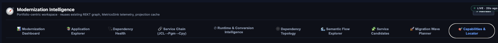

The "show me the data" workspace. A single header strip exposes every subview as a tab — Modernization Dashboard, Application Explorer, Dependency Health, Service Chain (JCL→Pgm→Cpy), Runtime & Conversion Intelligence, Dependency Topology, Semantic Flow Explorer, Service Candidates, Migration Wave Planner, Capabilities & Locator. All tabs share the same underlying data (REKT facts, MetricsSink JSONL, projection cache, Neo4j). A pulsing **🟢 LIVE** badge in the top-right confirms the panel is polling for fresh data. All read-only; one is read-write (Wave Planner).

| Subview | Purpose |
|---|---|
| 📊 Modernization Dashboard | compile success · projection reduction · cache hit rate · retries · continuation amplification · orchestration latency |
| 📚 Application Explorer | per-program inventory: LoC, facts confidence, deps, latest compile, projection-cache hits, status badge |
| 🩺 Dependency Health | full-fidelity vs deps-only, missing copybook leaderboard, readiness score, top blockers |
| 🔗 Service Chain (JCL→Pgm→Cpy) | Mermaid flowchart from `EXEC PGM=…` in JCL → programs → `COPY` references. Filterable by job or program. |
| ⏱ Runtime & Conversion Intelligence | per-run timeline of `projection_metrics` / `llm_call` / `cache_event` / `quality_summary` / `reassembly_metrics` / `continuation_event` |
| 🕸 Dependency Topology | layered architecture overlays on top of REKT/Neo4j |
| 🌊 Semantic Flow Explorer | PERFORM chains, transaction flows, swimlanes from facts.json |
| 🧩 Service Candidates | bounded-context inference (cohesion = 60% boundary + 20% cluster size + 20% facts confidence) + ready-for-extraction flag |
| 🚀 Migration Wave Planner | **first WRITE capability** — persists wave assignments to `Data/migration-waves.db` |
| 🎯 Capabilities & Service Locator | see next section |

### 🧠 Semantic Search — find anything by intent, not just name

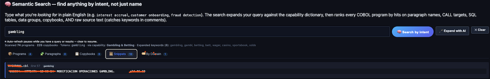

Type what you're *looking for* in plain English (e.g. `interest accrual`, `customer onboarding`, `fraud detection`, `gambling`). The query is **expanded against the capability dictionary** in `Data/capabilities.json` — a hit on the `gambling` token, for instance, fans out into `gambl`, `betting`, `bett`, `wager`, `casino`, `sportsbook`, `odds` and is tagged as capability **Gambling & Betting**. Every COBOL program and copybook from the most recent REKT scan is then ranked by hits on:

| Surface | Weight |
|---|---|
| Paragraph names (from REKT control-flow) | high |
| CALL targets | high |
| SQL table / column names | medium |
| Data group / copybook names | medium |
| Raw source text (catches keywords in comments) | low |

Results are grouped under five tabs — **Programs · Paragraphs · Copybooks · Snippets · By Domain** — with per-tab counts, so a search for `gambling` against a banking corpus can correctly return 4 programs / 0 paragraphs / 0 copybooks / 12 snippets / 1 domain. Click any result to deep-link into the AST Explorer or the Capabilities tab. The **Expand with AI** button passes the query + matched snippets to the configured LLM for natural-language reasoning about *what* the code does (intent / business meaning) — useful when the keyword expansion isn't enough. Auto-refresh pauses while typing so live demos don't lose the query mid-presentation.

### 🎯 Capabilities & Service Locator — REKT-driven business intelligence

**Capability Discovery** — deterministic, no LLM cost. Each COBOL program is multi-label-classified against the dictionary in `Data/capabilities.json`:

| Signal | Weight |
|---|---|
| Paragraph names (`controlFlow.performChains` + raw `.cbl` paragraph headers) | ×3 |
| CALL targets | ×2 |
| SQL table names | ×2 |
| Data group names | ×2 |
| Copybook names | ×1 |

Confidence = `min(1, totalScore / 8)`. Short keywords (<5 chars) require **token-boundary match** to avoid false positives. Ships with 16 starter capabilities (fraud, AML, sanctions, KYC, payment, settlement, loan, account, card, treasury, tax, reporting, error-handling, batch-orchestration, infrastructure, gambling) — fully editable, auto-reloads on each request, no rebuild needed.

**Service Locator** — normalises any of `CalcInterestService` / `CALC_INTEREST` / `calc-interest` / `SAMPLE001` across casing and hyphen/underscore styles. Searches generated **Java + C# + Kotlin + TypeScript + Scala** under `output/runs/**`, `output/java/**`, `output/csharp/**`, AND original COBOL source for paragraph headers, PROGRAM-ID, or basename matches. Same locator powers the cockpit search box.

### 🎯 Insights Hub — composed persona narratives (Phase-2)

A narrative layer over the same data — answers persona-specific questions rather than exposing raw subviews. Four personas: 💼 Business Owner · 🏗 Enterprise Architect · 🚀 Modernization Lead · 👨‍💻 Developer.

### 🌌 AST Galaxy — engineering force-graph (consolidated to 6 modes)

The original force-directed graph workspace. View modes consolidated from 13 → 6 canonical modes (legacy aliases auto-redirect, no broken bookmarks):

📦 Technical · 🏢 Business Domains · 📋 Service Catalog · 🎯 Modernization Radar · 🏦 BIAN Service Landscape · 🏗️ C4 Model

### Per-run output isolation

Every conversion run now produces an **isolated, immutable** folder:

```
output/runs/{runId}-{lang}-{slug}-{utc}/
├── com/example/…/<Program>Service.java   (or .cs)
├── migration-report.md
├── migration-conversation-log.md
├── dependency-map.json
└── dependency-diagram.md
```

`JAVA_OUTPUT_FOLDER` / `CSHARP_OUTPUT_FOLDER` env vars are set per-run; failure to create the directory **hard-fails the run** (never silently falls back to a shared folder). The Convert modal shows the resolved folder live, the active-runs panel exposes the folder path, and `RunStatusDto.OutputFolder` is in every `/api/runs/managed/{runId}` response so the UI can deep-link.

### New endpoints (added across Phase-1 → Phase-3.1)

```
GET    /api/modernization/applications
GET    /api/modernization/dashboard
GET    /api/modernization/runs
GET    /api/modernization/runs/{runId}/timeline
GET    /api/modernization/topology
GET    /api/modernization/dependency-health
GET    /api/modernization/flow/{basename}
GET    /api/modernization/service-candidates
GET    /api/modernization/service-chain[?job=X|?program=Y]
GET    /api/modernization/programs/{basename}      ← scorecard drill-down
GET    /api/modernization/capabilities             ← capability classifier
GET    /api/modernization/locate?q=<name>          ← service locator
GET    /api/modernization/waves
POST   /api/modernization/waves/{basename}         ← wave assignment (write)
DELETE /api/modernization/waves/{basename}
DELETE /api/modernization/waves
```

---

## 🤖 AI Provider Setup, Prompt Studio & Chat

These three browser-side features turn the portal into a full self-service control surface — pick a model, edit the agent prompts, and chat with the codebase or generated documents — without leaving the page.

### AI Provider Setup

A modal accessible from the **🔧 Setup** button (in the *Model & Prompts* panel). It supports two providers and discovers actual models on the fly:

| Provider | Authentication | What gets discovered |
|---|---|---|
| **☁️ Azure OpenAI** | API key, or Azure CLI (`az login`) → falls back to `DefaultAzureCredential` | Real deployed models in your resource via the ARM management API — deployment name, base model, version, SKU capacity |
| **🤖 GitHub Copilot SDK** | `gh auth login` (CLI session, default) or a Personal Access Token | Every model the Copilot SDK exposes (Claude / GPT-5 / Codex / Gemini / Grok / Llama / Mistral) |

The chosen provider + model is persisted to `Config/ai-config.local.env` (auto-loaded at portal startup — no need to `source` anything in your shell).

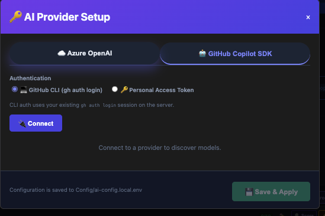

The portal also auto-resolves a usable Copilot CLI binary (`Services/CopilotCliResolver.cs`) — if the SDK's NuGet build target couldn't download the binary, the portal will use a system install (`/opt/homebrew/bin/copilot`, `/usr/local/bin/copilot`, anything on `$PATH`, or `$COPILOT_CLI_PATH`).

### Prompt Studio

Every agent in the pipeline (`CobolAnalyzer`, `BusinessLogicExtractor`, `DependencyMapper`, `JavaConverter`, `CSharpConverter`, `ChunkAwareJavaConverter`, `ChunkAwareCSharpConverter`, plus the REKT-grounded agents `StructuralExtractor`, `ConversionParity`, `CodeReviewer`, `DataMapping`, `TestSynthesizer`, `MigrationSummary`, `DocumentationAgent`) is driven by an editable Markdown prompt under `Agents/Prompts/`. Prompt Studio gives you two paths to (re)generate all of them based on what's actually in your `source/` folder, plus three platform tools to experiment safely:

| Button | Purpose |
|---|---|
| **ℹ️ How to use** | In-app guide explaining every other button and the recommended workflow. Click it first. |
| **🧪 Regression** | Runs 21 static checks asserting every hard rule still appears in every prompt, every `{{include}}` resolves, and the two golden COBOL programs are intact. Green ✓ = safe; red ✗ tells you exactly which rule went missing. Smoke alarm for prompts, not a quality grade. |
| **💰 Tokens** | Per-agent token usage parsed live from `Logs/FULL_CHAT_LOG_*.md` — Calls, Total, Mean, p50, p95, Max. Configurable window: 30 min / 1 h / 2 h / 4 h / 8 h / 1 day / 7 days. Shows which agent is the budget hog and where the expensive outliers live. |
| **🚀 Prompt Studio** | Generate / AI-enhance all prompts based on your codebase (see modes below). |
| **📜 History** (per prompt) | Lists every saved version (auto-archived to `Agents/Prompts/_history/` on each save, git-ignored) with a colour-coded diff vs the current file. Revert with one click. |
| **🔍 Score** (per prompt) | AI grades the prompt 1–10 and explains what's good / weak. Opinion, not verdict — pair with 🧪 Regression. |
| **⚡ Generate** (per prompt) | Re-analyses your source and proposes a fresh prompt for one specific agent. Heavy; use sparingly. Always 📜 History the old version first. |
| **✏️ Edit** (per prompt) | Inline editor. Save auto-archives the previous version. |

| Generation mode | Cost | Speed | What it does |
|---|---|---|---|
| **⚡ Quick Generate** | Free, no AI call | < 1 s | Scans source files with regex pattern matching to detect COBOL features (EXEC SQL, CICS screens, file I/O, copybooks, architecture pattern) and builds tailored prompts from templates. |
| **🧠 AI-Enhanced Generate** | One AI call (~4K tokens) | 10–30 s | Same regex pass first, then sends actual COBOL code samples (3 largest programs + 2 largest copybooks) to the active model. The model adds domain-specific enhancements regex can't detect (naming conventions, business-logic patterns, language-specific variables, error-handling idioms) and assigns a quality score (1–10) per agent prompt. |

#### Recommended workflow

1. **Look first** — open the studio, check the quality scores.
2. **🧪 Regression once** — confirm a baseline green (21 passed).
3. **💰 Tokens** — pick the highest-spending agent. That's where edits will save real money.
4. **✏️ Edit** — one focused change at a time.
5. **🔍 Score** — sanity-check the edit didn't make things obviously worse.
6. **🧪 Regression again** — if red, fix or revert via 📜 History.
7. **Run a small conversion** (Convert modal → one program) to confirm the change helps in practice.
8. **💰 weekly, 🧪 before every PR** — watch for drift; keep prompts strong.

#### Where is the data stored?

| Artefact | Location | Lifetime |
|---|---|---|
| Live prompt files | `Agents/Prompts/*.md` | Tracked in git |
| Knowledge fragments | `Agents/Prompts/knowledge/*.md` | Tracked in git |
| Saved versions | `Agents/Prompts/_history/<agent>.<UTC-timestamp>.md` | Local only — git-ignored |
| Quality scores | `Agents/Prompts/.prompt-scores.json` | Local only — git-ignored |
| Token usage source | `Logs/FULL_CHAT_LOG_*.md` | Local only — git-ignored |
| Regression golden programs | `tests/prompt-regression/programs/` | Tracked in git |
| Regression baselines | `tests/prompt-regression/baselines/baseline.json` | Tracked in git |

Token usage is **parsed live** on every 💰 click — there is no separate database. If you delete the chat logs the panel will simply show "no data in window".

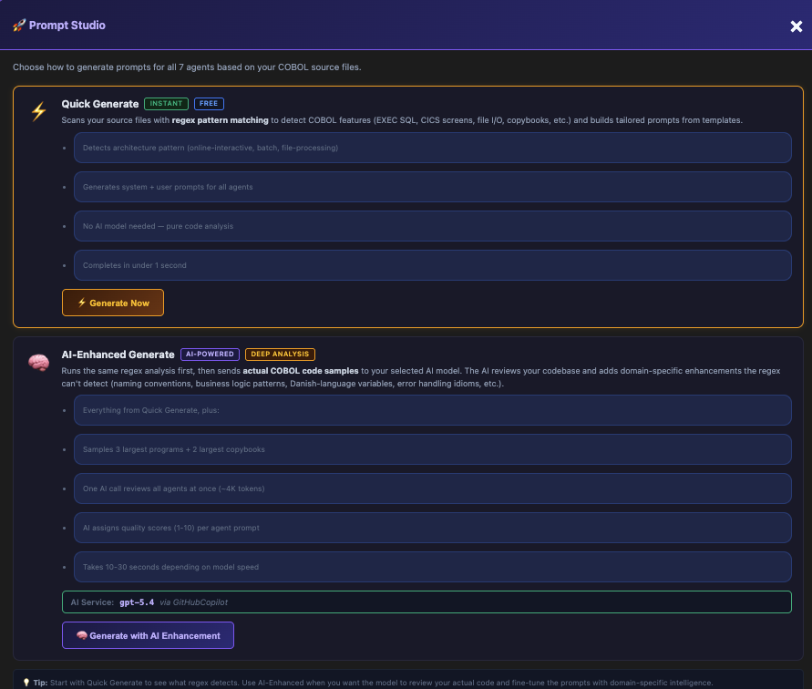

### Chat with your code, database, or RE report

The chat panel is a multi-turn ChatGPT-style transcript with a localStorage-backed history sidebar (bucketed by *Today / Yesterday / Previous 7 days / Older*, searchable, click-to-resume). Above the prompt sits the **📊 Chat with RE Report** context bar — the single switch between two answer-source scopes:

| Toggle state | Source the AI sees | Backend path |
|---|---|---|
| **OFF — Database mode** (default) | Live SQLite (migration metadata) + Neo4j (dependency graph + REKT analysis) extracts | MCP/SQLite/file-pattern code paths in `/api/chat` |
| **ON — Report mode** | Up to 100 KB of the selected reverse-engineering report (`reverse-engineering-details.md` or any other `.md` in `output/`) | Short-circuits to a strict report-only prompt — *"answer from this report; if it doesn't say, say so explicitly"* |

A purple system notice appears in the transcript whenever the scope changes, and every user/assistant bubble shows its scope tag (`🗄️ Database` or `📊 <report-name>`) so you can see at a glance which source answered each turn.

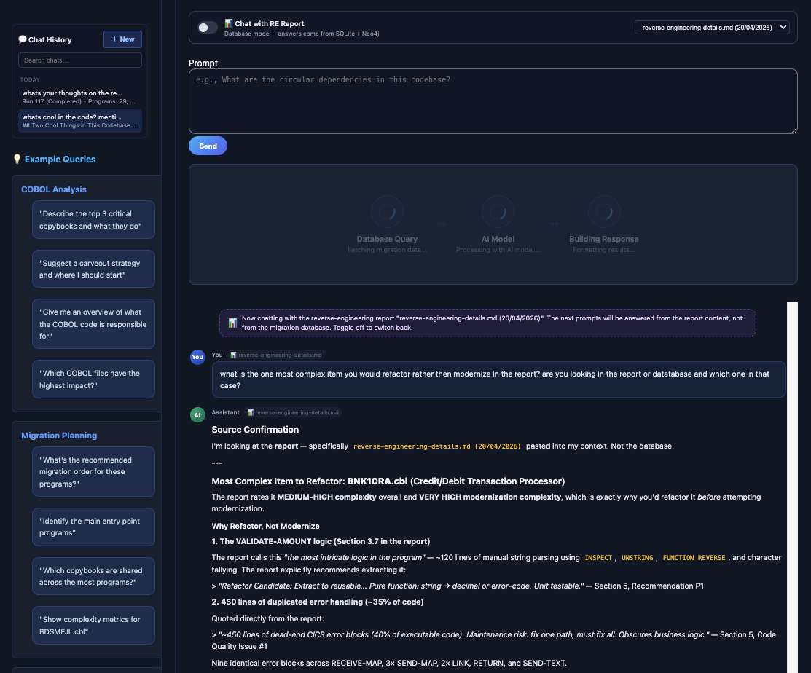

Other transcript features: lightweight markdown (code fences, headers, lists, links), per-message **⧉ Copy**, model + run-id metadata badges, pending dot animation while the request is in flight, history sidebar `+ New` to start a fresh thread, and a multi-turn `history: [{role, content}, …]` block sent to the model so follow-ups have continuity.

### Reverse Engineering Results panel

The **📄 Reverse Engineering Results** button (left sidebar) opens the rendered RE report in an in-portal viewer with `⬇ Download Report` / `⧉ Copy to Clipboard` / `⟳ Refresh`. The report contains a structured walk-through of every program — purpose, key paragraphs (with COBOL snippets), called programs, COMMAREA contracts, error paths, and business-rule annotations.

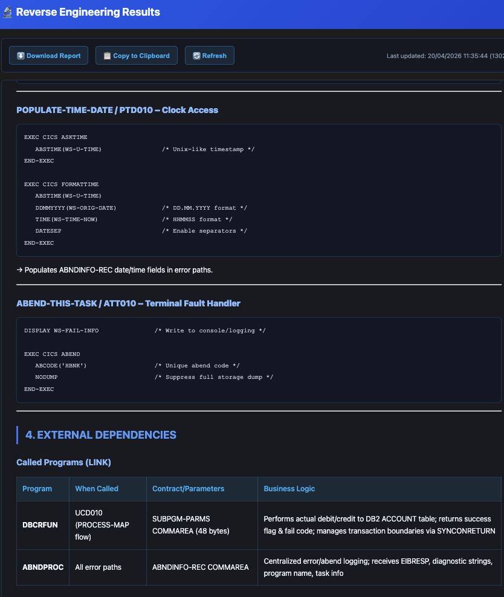

Each `## SECTION` of the report is selectable as the active context for the chat (toggle above), so you can ask follow-ups against the same document the AI used to generate the analysis. The report itself is regenerated by `./doctor.sh reverse-eng` (or as part of `./doctor.sh run`), persisted under `output/reverse-engineering-details.md`, and indexed into the Migration database so previous runs stay browsable from the *Migration Run* dropdown.

---

## 🔬 Cobol-REKT Static Analysis & Graph Pipeline

The REKT pipeline gives the portal its "structured truth" about every COBOL program — independent of the AI-generated reverse-engineering report. It runs as three Docker services (defined in `docker-compose.yml`):

| Service | Port | Role |
|---|---|---|
| `cobol-rekt` | — | Java CLI (`smojol-cli`) that parses each `.cbl/.cpy` into AST / Control-Flow / Data-flow JSON under `output/rekt/<program>.cbl.report/` |
| `cobol-rekt-neo4j` | bolt **7688**, http **7475** | Dedicated Neo4j 5.15 (separate from the migration metadata DB) holding the unified analysis graph, with APOC + Graph Data Science plugins |
| `graph-populator` | — | Python ingester that loads the REKT JSON + MMA metadata into Neo4j |

```bash
./doctor.sh rekt-full   # one-shot: parse → ingest → launch portal
```

The portal reads this graph through these endpoints (all dedup the latest scan run per file so old scans never inflate counts):

- `/api/graph/rekt/galaxy` — programs + dependency edges (drives **AST Galaxy** and **Migration Planner**)
- `/api/graph/rekt/galaxy-ast` — full structural AST nodes for every program
- `/api/graph/rekt/structure?file=…` — program-level summary (sections, paragraphs, AST/SQL/CALL counts)
- `/api/graph/rekt/ast?file=…` and `/api/graph/rekt/cfg?file=…` — per-file AST and control-flow graphs
- `/api/graph/rekt/runs` — list of historical scan runs (the `?scanRunId=N` query param pins any of them)

See [`docs/rekt-demo.md`](docs/rekt-demo.md) for an end-to-end walkthrough.

---

## 🌌 AST Galaxy & AST Explorer

The **AST Galaxy** dashboard tab visualises every program and its sub-structure as an interactive graph. It comes in 2D (vis-network) and **3D** (3d-force-graph) modes with multiple view layouts.

### View modes

The Galaxy ships with **6 canonical view modes** (legacy aliases auto-redirect):

| View | What it shows |
|---|---|
| 📦 **Technical** | Programs + their sections/paragraphs/CALL/SQL nodes with physics layout. Also available as **Technical (Expanded v2)** — manually laid out north-to-south swim-lane view, one column per program, AST nodes stacked by layer, inter-program edges arched as overlay arrows. |
| 🏢 **Business Domains** | High-level cluster view: each program collapsed into its parent domain. |
| 📋 **Service Catalog** | One node per program, grouped by detected business domain. Click a domain hub to drill into its members. Also available in **3D** (3d-force-graph) where domain clusters are visible at a glance. |
| 🎯 **Modernization Radar** | Programs plotted by readiness / risk axes — quick triage of what's safe vs. blocked. |
| 🏦 **BIAN Service Landscape** | Maps every program against the BIAN v14.0 Service Domains. See screenshot below. |
| 🏗️ **C4 Model** | L1 System Context → L2 Containers → L3 Components. See screenshot below. |

| Service Catalog (high-level domains) | Galaxy view (3D, programs as orbits) |
|---|---|
| 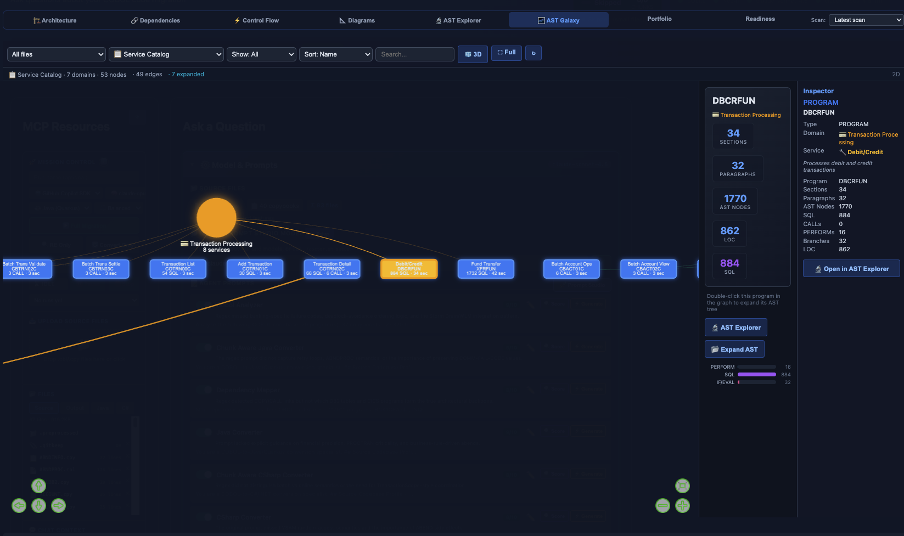 | 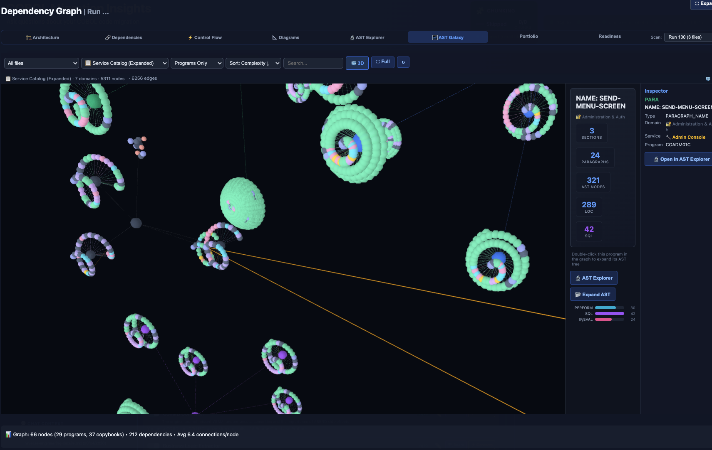 |

| Domain drill-down (programs in *Customer Management*) | Business Domains cluster view |
|---|---|
| 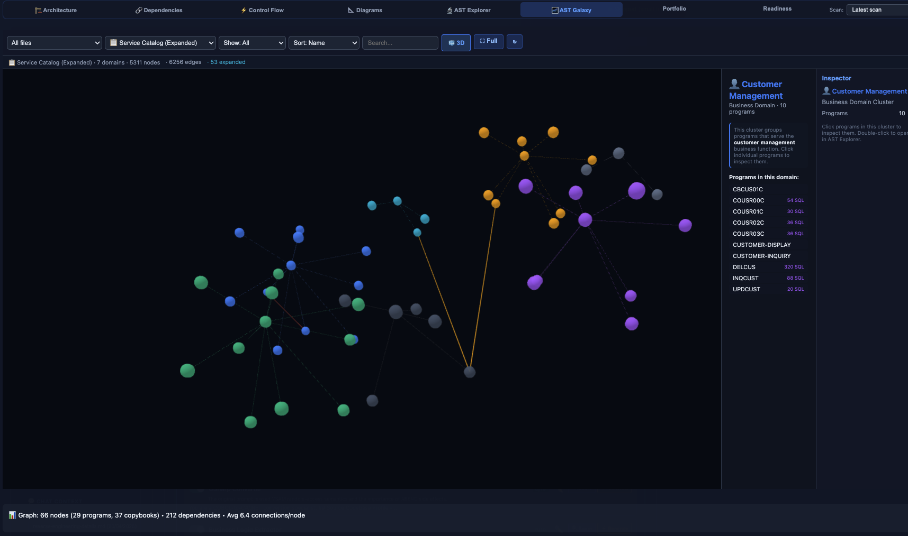 | 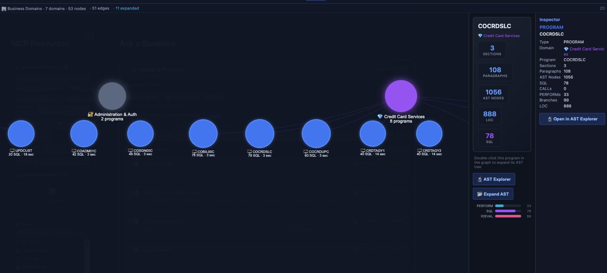 |

| Expanded view (every AST node visible) | Technical (Expanded v2) — swim-lane top-down |
|---|---|
| 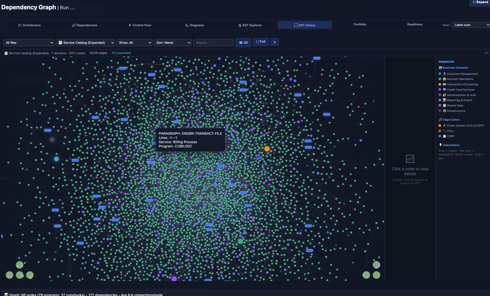 | 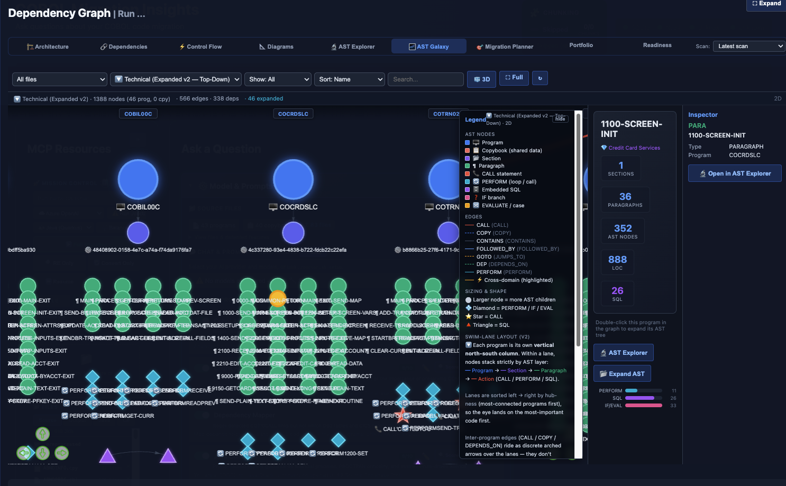 |

#### 🏦 BIAN Service Landscape

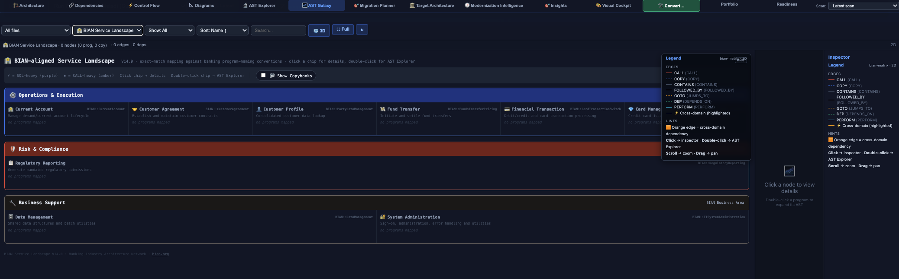

Maps every program against the **BIAN v14.0** Service Landscape (Banking Industry Architecture Network). Each chip is a BIAN Service Domain (e.g. `CurrentAccount`, `CustomerAgreement`, `FundTransfer`, `CardTransactionSwitch`, `RegulatoryReporting`, `ITSystemAdministration`) grouped under its parent Business Area (*Operations & Execution*, *Risk & Compliance*, *Business Support*). Mapping uses exact-match against banking program-naming conventions (paragraph headers + CALL targets + SQL tables + data groups). Visual cues: 🔵 = SQL-heavy, 🟠 = CALL-heavy. Click a chip → Inspector; double-click → opens that program in the AST Explorer. Domains with `no programs mapped` are shown deliberately so gaps are visible — useful for portfolio coverage analysis.

#### 🏗️ C4 Model

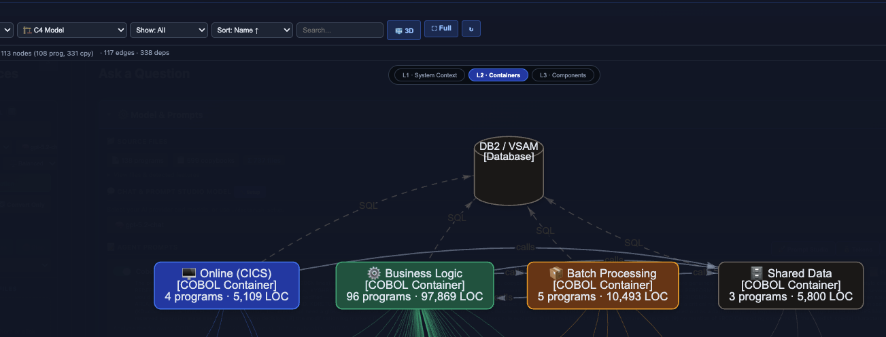

Renders the estate as a **C4 model** with three drill levels — **L1 · System Context** (the COBOL system as a single box surrounded by its actors and external systems), **L2 · Containers** (one COBOL container per workload class — Online/CICS, Business Logic, Batch Processing, Shared Data — each annotated with program count + total LoC, all wired into a central DB2 / VSAM data store via labelled `sql` / `calls` edges, see screenshot), and **L3 · Components** (programs as components, edges = `CALL` / `COPY` / `EXEC SQL`). Useful for architecture-review decks where the force-graph is too dense to read.

### What you can do

- **Click** a node → Inspector panel on the right shows its type, domain, line range, AST node count, SQL/CALL/PERFORM/branch counts.
- **🔬 Open in AST Explorer** button on the Inspector → switches to the AST Explorer tab and loads the program directly.
- **Double-click** a program node → expands its full AST tree inline.
- **Floating legend** (top-right) is mode-aware and lists every shape, colour, and edge type currently on screen.
- **Cancel / Resume layout** buttons stop the force simulation if it's busy with a large graph.
- **Search** filter highlights matches; **scan run** dropdown pins a specific historical scan.

### AST Explorer (per-file deep dive)

The AST Explorer tab opens a single program at a time and renders its AST, control-flow, or program-structure graph (top-level dropdown). Each node shows the COBOL statement type (PERFORM / IF / DIALECT / CALL / …) plus line numbers. This is the surface you land on after the *Open in AST Explorer* drill-through from the Galaxy.

---

## 📅 Migration Planner — Domain-Based Time Chart

The **Migration Planner** tab turns the same Neo4j graph into a sliceable migration strategy. It scores every program on a weighted *ease* metric and packs them into 3 waves (lowest-hanging fruit → medium effort → hubs/hard cases). Programs are grouped by detected **business domain** so squads can be assigned per domain.

### Filters & weights

Drag the sliders to exclude programs above a threshold (LOC / complexity / SQL stmts / CALLs / criticality), and bias the score by re-weighting any axis 0–10. Sliders auto-grow when a fresh scan introduces larger files.

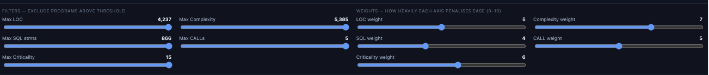

### Wave summary + program table

Each row shows wave assignment, domain, LOC, complexity, SQL, CALLs, inbound/outbound deps, ease score, and a recommendation badge (`↻ REWRITE` or `⇄ REPLATFORM`). The header shows the dataset summary (`66 nodes (29 programs, 37 copybooks) · 212 dependencies · Avg 6.4 connections/node`) live from `/api/graph/rekt/galaxy`.

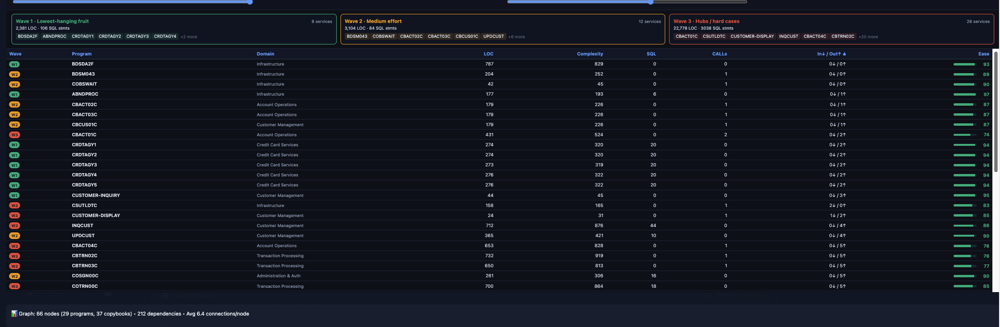

### Live Gantt — suggested time chart

Below the table, the **Migration Path — Gantt** panel renders the suggested timeline grouped by wave. Each program gets a coloured bar from its scheduled start week → end week, sorted into 3 parallel dev tracks per wave (`Dev 1 / Dev 2 / Dev 3`). Click any wave header to expand/collapse its programs. The chart is wired bidirectionally to the Strategy Workbook below — edit *Wave / Start week / End week / Assigned to* in the workbook and the bars move immediately.

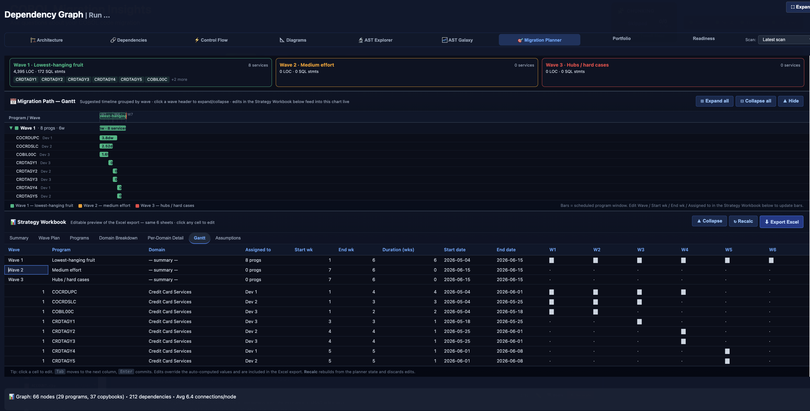

### Editable Strategy Workbook → Excel export

The same data is rendered as a 6-sheet editable workbook (`Summary`, `Wave Plan`, `Programs`, `Domain Breakdown`, `Per-Domain Detail`, `Replatform Candidates`, `Gantt`, `Assumptions`). Click any cell to edit — *Tab* moves to the next column, *Enter* commits. Edits override the auto-computed values and are included in the Excel export. **⬇ Export Excel** writes a single multi-sheet `.xlsx`.

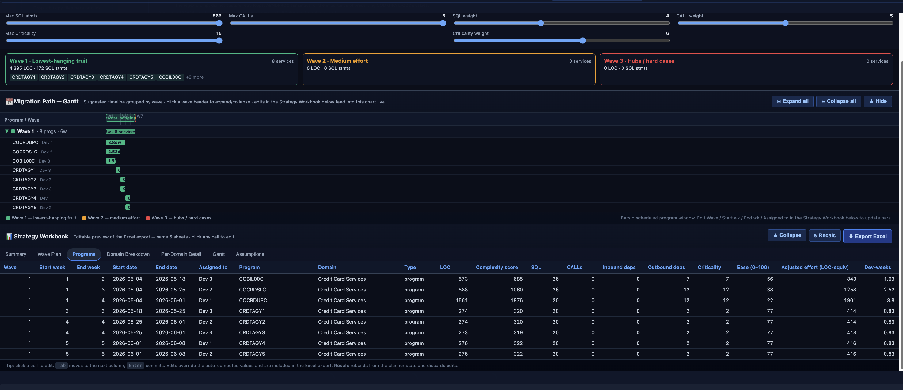

### Replatform recommender

The orange context bar above the table flags programs that are too costly to rewrite as **replatform candidates** (host the COBOL on a managed runtime — Micro Focus / OpenText, Heirloom, Raincode, GnuCOBOL, AWS Blu Insights — instead of converting). Adjustable thresholds: `ease ≤ N` OR `LOC ≥ N` OR `criticality ≥ N`. Flagged rows show a striped-orange bar in the Gantt and appear on a dedicated `Replatform Candidates` Excel sheet with trigger reasons.


### Effort model (defaults — all editable in the *Assumptions* sheet)

| Setting | Default | Meaning |
|---|---|---|
| Base velocity | 500 LOC / dev / week | COBOL → Java conversion (coding + unit tests, excludes integration) |
| Team size | 3 devs | Parallelism within a single wave |
| Wave multipliers | W1 ×1.0, W2 ×1.5, W3 ×2.5 | Hubs/highly-coupled need more design time |
| SQL extra effort | 5 LOC-equivalent / SQL stmt | JPA/JDBC mapping cost |
| CALL extra effort | 20 LOC-equivalent / CALL | Integration cost between programs |
| Integration buffer | +30% per wave | QA, integration tests, hardening |

---

---

## 📁 Folder Structure

```
Legacy-Modernization-Agents/
├── source/                    # ⬅️ DROP YOUR COBOL FILES HERE
│   ├── CUSTOMER.cbl
│   ├── PAYMENT.cbl
│   └── COMMON.cpy
│
├── output/                    # ⬅️ GENERATED CODE APPEARS HERE
│   ├── java/                  # Java Quarkus output
│   │   └── com/example/generated/
│   ├── csharp/                # C# .NET output
│   │   └── Generated/
│   └── rekt/                  # Cobol-REKT static analysis output
│       └── <program>.cbl.report/
│           ├── ast/           # Abstract Syntax Tree JSON
│           ├── cfg/           # Control Flow Graph JSON
│           └── data/          # Data flow JSON
│
├── Agents/                    # AI agent implementations
├── Config/                    # Configuration files (gitignored secrets)
├── Data/                      # SQLite database (migration.db)
├── Logs/                      # Execution logs (gitignored)
├── Mcp/                       # MCP server implementation
├── McpChatWeb/                # Web portal (Razor Pages + REST API)
└── tools/                     # External tooling
    ├── cobol-rekt/            # Java CLI for COBOL parsing (Dockerized)
    └── graph-populator/       # Python Neo4j ingester (Dockerized)
```

**Workflow:**
1. Drop COBOL files (`.cbl`, `.cpy`) into `source/`
2. Run `./doctor.sh run`
3. Choose target language (Java or C#)
4. Collect generated code from `output/java/` or `output/csharp/`

---

## 🛠️ Customizing Agent Behavior

Each agent has a **system prompt** that defines its behavior. To customize output (e.g., DDD patterns, specific frameworks), edit these files:

### Agent Prompt Locations

| Agent | File | Line | What It Does |
|-------|------|------|--------------|
| **CobolAnalyzerAgent** | `Agents/CobolAnalyzerAgent.cs` | ~116 | Extracts structure, variables, paragraphs, SQL |
| **BusinessLogicExtractorAgent** | `Agents/BusinessLogicExtractorAgent.cs` | ~44 | Extracts user stories, features, business rules |
| **JavaConverterAgent** | `Agents/JavaConverterAgent.cs` | ~66 | Converts to Java Quarkus |
| **CSharpConverterAgent** | `Agents/CSharpConverterAgent.cs` | ~64 | Converts to C# .NET |
| **DependencyMapperAgent** | `Agents/DependencyMapperAgent.cs` | ~129 | Maps CALL/COPY/PERFORM relationships |
| **ChunkAwareJavaConverter** | `Agents/ChunkAwareJavaConverter.cs` | ~268 | Large file chunked conversion (Java) |
| **ChunkAwareCSharpConverter** | `Agents/ChunkAwareCSharpConverter.cs` | ~269 | Large file chunked conversion (C#) |

### Example: Adding DDD Patterns

To make the Java converter generate Domain-Driven Design code, edit `Agents/JavaConverterAgent.cs` around line 66:

```csharp
var systemPrompt = @"
You are an expert in converting COBOL programs to Java with Quarkus framework.

DOMAIN-DRIVEN DESIGN REQUIREMENTS:
- Identify bounded contexts from COBOL program sections
- Create Aggregate Roots for main business entities
- Use Value Objects for immutable data (PIC X fields)
- Implement Repository pattern for data access
- Create Domain Events for state changes
- Separate Application Services from Domain Services

OUTPUT STRUCTURE:
- domain/        → Entities, Value Objects, Aggregates
- application/   → Application Services, DTOs
- infrastructure/→ Repositories, External Services
- ports/         → Interfaces (Ports & Adapters)

...existing prompt content...
";
```

Similarly for C#, edit `Agents/CSharpConverterAgent.cs`.

---

## 📐 File Splitting & Naming

### Configuration

File splitting is controlled in `Config/appsettings.json`:

```json
{
  "AssemblySettings": {
    "SplitStrategy": "ClassPerFile",
    "Java": {
      "PackagePrefix": "com.example.generated",
      "ServiceSuffix": "Service"
    },
    "CSharp": {
      "NamespacePrefix": "Generated",
      "ServiceSuffix": "Service"
    }
  }
}
```

### Split Strategies

| Strategy | Output |
|----------|--------|
| `SingleFile` | One large file with all classes |
| `ClassPerFile` | **Default** - One file per class (recommended) |
| `FilePerChunk` | One file per processing chunk |
| `LayeredArchitecture` | Organized into Services/, Repositories/, Models/ |

### Implementation Location

The split logic is in `Models/AssemblySettings.cs`:

```csharp
public enum FileSplitStrategy
{
    SingleFile,           // All code in one file
    ClassPerFile,         // One file per class (DEFAULT)
    FilePerChunk,         // Preserves chunk boundaries
    LayeredArchitecture   // Service/Repository/Model folders
}
```

### Naming Conversion

Naming strategies are configured in `ConversionSettings`:

```json
{
  "ConversionSettings": {
    "NamingStrategy": "Hybrid",
    "PreserveLegacyNamesAsComments": true
  }
}
```

| Strategy | Input | Output |
|----------|-------|--------|
| `Hybrid` | `CALCULATE-TOTAL` | Business-meaningful name |
| `PascalCase` | `CALCULATE-TOTAL` | `CalculateTotal` |
| `camelCase` | `CALCULATE-TOTAL` | `calculateTotal` |
| `Preserve` | `CALCULATE-TOTAL` | `CALCULATE_TOTAL` |

---

## 🏗️ Architecture

### REKT-Grounded Conversion Pipeline

The conversion pipeline is structured in five stages. Stage 0 (static analysis)
produces structural facts that all later stages consume, so generation,
validation, and reporting share a single source of truth instead of relying on
the LLM to re-derive structure each turn.

Toggle the structural injection with `ENABLE_REKT_CONTEXT=true`; without it
the converter falls back to the legacy prompt path. Quality agents (parity,
reviewer, data-mapping) and the test/fixture agents always run when their
inputs are available, regardless of the flag.

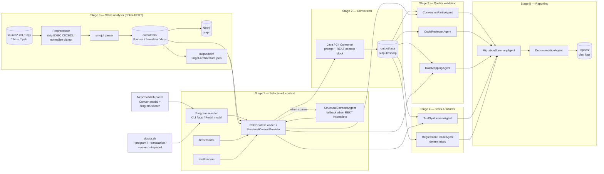
```mermaid
flowchart LR
    subgraph Stage0["Stage 0 — Static analysis (Cobol-REKT)"]
        SRC[("source/*.cbl, *.cpy<br/>*.bms, *.psb")]
        SRC --> PREP[Preprocessor<br/>strip EXEC CICS/DLI,<br/>normalise dialect]
        PREP --> SMOJOL[smojol parser]
        SMOJOL --> RAW[("output/rekt/<br/>flow-ast / flow-data / deps")]
        RAW --> NEO[(Neo4j<br/>graph)]
        RAW --> TGT[output/rekt/<br/>target-architecture.json]
    end

    subgraph Stage1["Stage 1 — Selection &amp; context"]
        SEL[Program selector<br/>CLI flags / Portal modal]
        LOADER[RektContextLoader +<br/>StructuralContextProvider]
        BMS[BmsReader]
        IMS[ImsReaders]
        STRUCT[StructuralExtractorAgent<br/>fallback when REKT incomplete]
        SEL --> LOADER
        RAW --> LOADER
        TGT --> LOADER
        BMS --> LOADER
        IMS --> LOADER
        LOADER -. when sparse .-> STRUCT
        STRUCT --> LOADER
    end

    subgraph Stage2["Stage 2 — Conversion"]
        CONV[Java / C# Converter<br/>prompt + REKT context block]
        OUT[(output/java<br/>output/csharp)]
        LOADER --> CONV
        CONV --> OUT
    end

    subgraph Stage3["Stage 3 — Quality validation"]
        PAR[ConversionParityAgent]
        REV[CodeReviewerAgent]
        DMAP[DataMappingAgent]
        OUT --> PAR
        OUT --> REV
        OUT --> DMAP
        LOADER --> PAR
        LOADER --> DMAP
    end

    subgraph Stage4["Stage 4 — Tests &amp; fixtures"]
        TST[TestSynthesizerAgent]
        FIX[RegressionFixtureAgent<br/>deterministic]
        OUT --> TST
        OUT --> FIX
        LOADER --> TST
    end

    subgraph Stage5["Stage 5 — Reporting"]
        SUM[MigrationSummaryAgent]
        DOC[DocumentationAgent]
        PAR --> SUM
        REV --> SUM
        DMAP --> SUM
        TST --> SUM
        FIX --> SUM
        SUM --> DOC
        DOC --> REPORT[(reports/<br/>chat logs)]
    end

    PORTAL[McpChatWeb portal<br/>Convert modal +<br/>program search] --> SEL
    DOCSH[doctor.sh<br/>--program / --transaction /<br/>--wave / --keyword] --> SEL
```

The component view below shows where each new helper and agent lives in the
codebase and which artefacts cross stage boundaries.

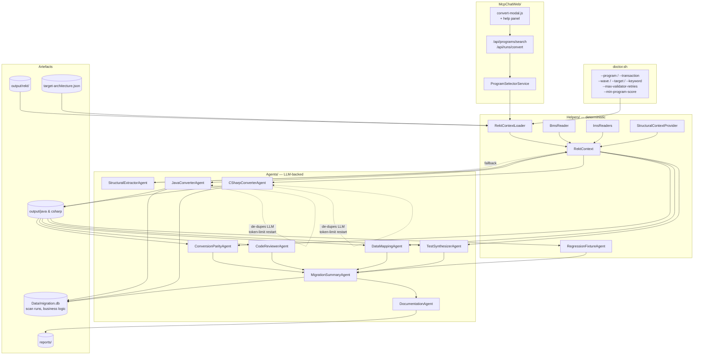
```mermaid
flowchart TB
    subgraph Helpers["Helpers/ — deterministic"]
        RC[RektContext]
        RCL[RektContextLoader]
        SCP[StructuralContextProvider]
        BMSR[BmsReader]
        IMSR[ImsReaders]
        RFA[RegressionFixtureAgent]
    end

    subgraph Agents["Agents/ — LLM-backed"]
        SEA[StructuralExtractorAgent]
        JCA[JavaConverterAgent]
        CSA[CSharpConverterAgent]
        CPA[ConversionParityAgent]
        CRA[CodeReviewerAgent]
        DMA[DataMappingAgent]
        TSA[TestSynthesizerAgent]
        MSA[MigrationSummaryAgent]
        DOA[DocumentationAgent]
    end

    subgraph Portal["McpChatWeb/"]
        PSS[ProgramSelectorService]
        API["/api/programs/search<br/>/api/runs/convert"]
        UI[convert-modal.js<br/>+ help panel]
        UI --> API --> PSS
    end

    subgraph CLI["doctor.sh"]
        FLAGS[--program / --transaction<br/>--wave / --target / --keyword<br/>--max-validator-retries<br/>--min-program-score]
    end

    subgraph Data["Artefacts"]
        REKT[(output/rekt/)]
        TARG[(target-architecture.json)]
        OUTJ[(output/java &amp; csharp)]
        REP[(reports/)]
        SQL[(Data/migration.db<br/>scan runs, business logic)]
    end

    REKT --> RCL --> RC
    TARG --> RCL
    BMSR --> RC
    IMSR --> RC
    SCP --> RC

    PSS --> RCL
    FLAGS --> RCL

    RC --> JCA
    RC --> CSA
    RC --> CPA
    RC --> DMA
    RC --> TSA
    RC -. fallback .-> SEA --> RC

    JCA --> OUTJ
    CSA --> OUTJ

    OUTJ --> CPA --> MSA
    OUTJ --> CRA --> MSA
    OUTJ --> DMA --> MSA
    OUTJ --> TSA --> MSA
    OUTJ --> RFA --> MSA
    MSA --> DOA --> REP

    JCA -. de-dupes LLM<br/>token-limit restart .-> JCA
    CSA -. de-dupes LLM<br/>token-limit restart .-> CSA

    JCA --> SQL
    CSA --> SQL
    MSA --> SQL
```

Key invariants:
- **Provenance is tagged** — every field in `RektContext` carries
  `None | RektPartial | RektFull | StructuralExtractor`, so downstream agents
  know whether to trust a fact or treat it as a hypothesis.
- **Quality agents are read-only** — they never rewrite generated code; they
  emit scores and findings that the validator loop consumes via
  `--max-validator-retries` and `--min-program-score`.
- **Converter output is post-processed** — `ExtractJavaCode` /
  `ExtractCSharpCode` detect the LLM token-limit restart pattern (two
  `package` / `namespace` declarations) and keep the complete body.
- **Selection is unified** — CLI flags and the portal modal both route through
  `ProgramSelectorService`, so a search expression behaves identically in
  either entry point.

See [docs/rekt-grounded-conversion.md](docs/rekt-grounded-conversion.md) for
the full per-agent contract, prompt locations, and provenance rules.

---

### Hybrid Database Architecture

This project uses a **dual-database approach** for optimal performance, enhanced with Regex-based deep analysis:

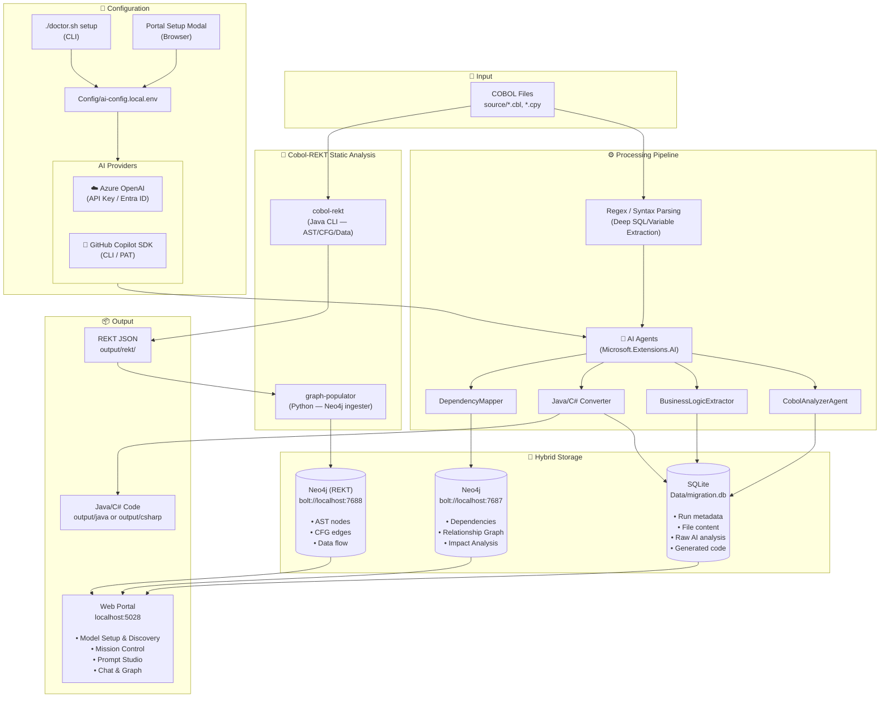
```mermaid
flowchart TB
    subgraph INPUT["📁 Input"]
        COBOL["COBOL Files<br/>source/*.cbl, *.cpy"]
    end
    
    subgraph CONFIG["🔧 Configuration"]
        SETUP_CLI["./doctor.sh setup<br/>(CLI)"]
        SETUP_PORTAL["Portal Setup Modal<br/>(Browser)"]
        SETUP_CLI --> CONFIG_FILE["Config/ai-config.local.env"]
        SETUP_PORTAL --> CONFIG_FILE
        CONFIG_FILE --> PROVIDERS
        subgraph PROVIDERS["AI Providers"]
            AZURE["☁️ Azure OpenAI<br/>(API Key / Entra ID)"]
            COPILOT["🤖 GitHub Copilot SDK<br/>(CLI / PAT)"]
        end
    end

    subgraph PROCESS["⚙️ Processing Pipeline"]
        REGEX["Regex / Syntax Parsing<br/>(Deep SQL/Variable Extraction)"]
        AGENTS["🤖 AI Agents<br/>(Microsoft.Extensions.AI)"]
        ANALYZER["CobolAnalyzerAgent"]
        EXTRACTOR["BusinessLogicExtractor"]
        CONVERTER["Java/C# Converter"]
        MAPPER["DependencyMapper"]
    end

    subgraph REKT["🔬 Cobol-REKT Static Analysis"]
        REKT_CLI["cobol-rekt<br/>(Java CLI — AST/CFG/Data)"]
        REKT_POP["graph-populator<br/>(Python — Neo4j ingester)"]
    end
    
    subgraph STORAGE["💾 Hybrid Storage"]
        SQLITE[("SQLite<br/>Data/migration.db<br/><br/>• Run metadata<br/>• File content<br/>• Raw AI analysis<br/>• Generated code")]
        NEO4J[("Neo4j<br/>bolt://localhost:7687<br/><br/>• Dependencies<br/>• Relationship Graph<br/>• Impact Analysis")]
        REKT_NEO4J[("Neo4j (REKT)<br/>bolt://localhost:7688<br/><br/>• AST nodes<br/>• CFG edges<br/>• Data flow")]
    end
    
    subgraph OUTPUT["📦 Output"]
        CODE["Java/C# Code<br/>output/java or output/csharp"]
        REKT_JSON["REKT JSON<br/>output/rekt/"]
        PORTAL["Web Portal<br/>localhost:5028<br/><br/>• Model Setup &amp; Discovery<br/>• Mission Control<br/>• Prompt Studio<br/>• Chat &amp; Graph"]
    end
    
    COBOL --> REGEX
    COBOL --> REKT_CLI
    REGEX --> AGENTS
    PROVIDERS --> AGENTS
    
    AGENTS --> ANALYZER
    AGENTS --> EXTRACTOR
    AGENTS --> CONVERTER
    AGENTS --> MAPPER
    
    ANALYZER --> SQLITE
    EXTRACTOR --> SQLITE
    CONVERTER --> SQLITE
    CONVERTER --> CODE
    MAPPER --> NEO4J

    REKT_CLI --> REKT_JSON
    REKT_JSON --> REKT_POP
    REKT_POP --> REKT_NEO4J
    
    SQLITE --> PORTAL
    NEO4J --> PORTAL
    REKT_NEO4J --> PORTAL
```

#### Why Two Databases?

| Aspect | SQLite | Neo4j (Migration) | Neo4j (REKT) |
|--------|--------|--------------------|--------------|
| **Purpose** | Document storage | Relationship mapping | Static analysis graphs |
| **Strength** | Fast queries, simple setup | Graph traversal, visualization | AST/CFG/Data flow traversal |
| **Use Case** | "What's in this file?" | "What depends on this file?" | "What does the control flow look like?" |
| **Query Style** | SQL SELECT | Cypher graph queries | Cypher graph queries |
| **Port** | — | bolt://localhost:7687 | bolt://localhost:7688 |

**Together:** Fast metadata access + Dependency insights + Deep structural analysis

#### Why Dependency Graphs Matter

The Neo4j dependency graph enables:
- **Impact Analysis** - "If I change CUSTOMER.cbl, what else breaks?"
- **Circular Dependency Detection** - Find problematic CALL/COPY cycles
- **Critical File Identification** - Most-connected files = highest risk
- **Migration Planning** - Convert files in dependency order
- **Visual Understanding** - See relationships at a glance in the portal

---

### Agent Pipeline

The migration follows a strict **Deep Code Analysis** pipeline:

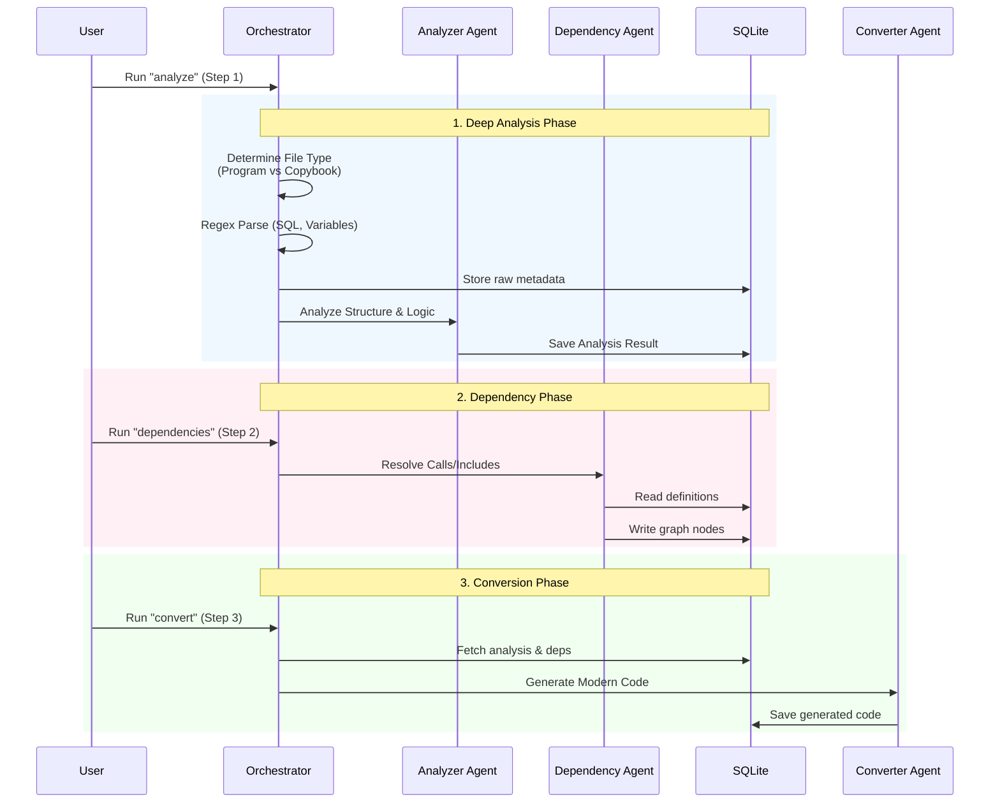
```mermaid
sequenceDiagram
    participant U as User
    participant O as Orchestrator
    participant AA as Analyzer Agent
    participant DA as Dependency Agent
    participant SQ as SQLite
    participant CA as Converter Agent

    U->>O: Run "analyze" (Step 1)
    
    rect rgb(240, 248, 255)
        Note over O, SQ: 1. Deep Analysis Phase
        O->>O: Determine File Type<br/>(Program vs Copybook)
        O->>O: Regex Parse (SQL, Variables)
        O->>SQ: Store raw metadata
        O->>AA: Analyze Structure & Logic
        AA->>SQ: Save Analysis Result
    end
    
    rect rgb(255, 240, 245)
        Note over O, SQ: 2. Dependency Phase
        U->>O: Run "dependencies" (Step 2)
        O->>DA: Resolve Calls/Includes
        DA->>SQ: Read definitions
        DA->>SQ: Write graph nodes
    end

    rect rgb(240, 255, 240)
        Note over O, SQ: 3. Conversion Phase
        U->>O: Run "convert" (Step 3)
        O->>SQ: Fetch analysis & deps
        O->>CA: Generate Modern Code
        CA->>SQ: Save generated code
    end
```

### Process Flow
**Portal Features:** 
- ✅ Dark theme with modern UI
- ✅ Three-panel layout (resources/chat/graph)
- ✅ AI-powered chat interface
- ✅ Suggestion chips for common queries
- ✅ Interactive dependency graph (zoom/pan/filter)
- ✅ Multi-run queries and comparisons
- ✅ File content analysis with line counts
- ✅ Comprehensive data retrieval guide
- ✅ Enhanced dependency tracking (CALL, COPY, PERFORM, EXEC, READ, WRITE, OPEN, CLOSE)
- ✅ Migration report generation per run
- ✅ Mermaid diagram rendering in documentation
- ✅ Collapsible filter sections for cleaner UI
- ✅ Edge type filtering with color-coded visualization
- ✅ Line number context for all dependencies
- ✅ Per-run **🔬 RE Results** button — view persisted business logic extracts and delete unsatisfactory results
- ✅ **AI Provider Setup Modal** — connect to Azure OpenAI or GitHub Copilot SDK from the browser, discover all available models/deployments, and save config
- ✅ **Mission Control** — start/stop/pause migrations, select provider and model, upload source files
- ✅ **Prompt Studio** — generate, AI-enhance, and score agent prompts (works with both Azure and Copilot SDK)

### Smart Chunking & Token Strategy

Large COBOL files (>3,000 lines or >150K characters) are automatically split at semantic boundaries (DIVISION → SECTION → paragraph) and processed with content-aware reasoning effort. A three-tier complexity scoring system analyzes each file's COBOL patterns (EXEC SQL, CICS, REDEFINES, etc.) to dynamically allocate reasoning effort and output tokens — simple files get fast processing while complex files get thorough analysis.


```mermaid
flowchart TD
    subgraph INPUT["📥 FILE INTAKE"]
        A[COBOL Source File] --> B{File Size Check}
        B -->|"≤ 3,000 lines<br>≤ 150,000 chars"| C[Single-File Processing]
        B -->|"> 3,000 lines<br>> 150,000 chars"| D[Smart Chunking Required]
    end

    subgraph TOKEN_EST["🔢 TOKEN ESTIMATION"]
        C --> E[TokenHelper.EstimateCobolTokens]
        D --> E
        E -->|"COBOL: chars ÷ 3.0"| F[Estimated Input Tokens]
        E -->|"General: chars ÷ 3.5"| F
    end

    subgraph COMPLEXITY["🎯 THREE-TIER COMPLEXITY SCORING"]
        F --> G[Complexity Score Calculation]
        G -->|"Σ regex×weight + density bonuses"| H{Score Threshold}
        H -->|"< 5"| I["🟢 LOW<br>effort: low<br>multiplier: 1.5×"]
        H -->|"5 – 14"| J["🟡 MEDIUM<br>effort: medium<br>multiplier: 2.5×"]
        H -->|"≥ 15"| K["🔴 HIGH<br>effort: high<br>multiplier: 3.5×"]
    end

    subgraph OUTPUT_CALC["📐 OUTPUT TOKEN CALCULATION"]
        I --> L[estimatedOutput = input × multiplier]
        J --> L
        K --> L
        L --> M["clamp(estimated, minTokens, maxTokens)"]
        M -->|"Codex: 32,768 – 100,000"| N[Final maxOutputTokens]
        M -->|"Chat: 16,384 – 65,536"| N
    end

    subgraph CHUNKING["✂️ SMART CHUNKING"]
        D --> O[CobolAdapter.IdentifySemanticUnits]
        O --> P[Divisions / Sections / Paragraphs]
        P --> Q[SemanticUnitChunker.ChunkFileAsync]
        Q --> R{Chunking Decision}
        R -->|"≤ MaxLinesPerChunk"| S[Single Chunk]
        R -->|"Semantic units found"| T["Semantic Boundary Split<br>Priority: DIVISION > SECTION > Paragraph"]
        R -->|"No units / oversized units"| U["Line-Based Fallback<br>overlap: 300 lines"]
    end

    subgraph CONTEXT["📋 CONTEXT WINDOW MANAGEMENT"]
        T --> V[ChunkContextManager]
        U --> V
        S --> V
        V --> W["Full Detail Window<br>(last 3 chunks)"]
        V --> X["Compressed History<br>(older → 30% size)"]
        V --> Y["Cross-Chunk State<br>signatures + type mappings"]
        W --> Z[ChunkContext]
        X --> Z
        Y --> Z
    end

    subgraph RATE_LIMIT["⏱️ DUAL RATE LIMITING"]
        direction TB
        Z --> AA["System A: RateLimiter<br>(Token Bucket + Semaphore)"]
        Z --> AB["System B: RateLimitTracker<br>(Sliding Window TPM/RPM)"]
        
        AA --> AC{Capacity Check}
        AB --> AC
        AC -->|"Budget: 300K TPM × 0.7"| AD[Wait / Proceed]
        AC -->|"Concurrency: max 3 parallel"| AD
        AC -->|"Stagger: 2,000ms between workers"| AD
    end

    subgraph API_CALL["🤖 API CALL + ESCALATION"]
        AD --> AE{Provider Routing}
        AE -->|"Azure Codex<br>(ResponsesApiClient)"| AE1[Responses API Call]
        AE -->|"GitHub/Claude/Grok/GPT<br>(IChatClient)"| AE2["Chat Completions Call<br>+ ApplyModelSpecificOptions"]
        AE1 --> AF{Response Status}
        AE2 --> AF2{Truncation Check}
        AF2 -->|"FinishReason=Stop<br>No truncation signals"| AG[✅ Success]
        AF2 -->|"FinishReason=Length<br>or text signals<br>or unclosed code blocks"| AH2["OutputTruncationException<br>① Double maxTokens<br>② Promote effort<br>③ Thrash guard"]
        AH2 -->|"Max 2 retries"| AE2
        AH2 -->|"All retries failed"| AI["Adaptive Re-Chunking<br>Split at semantic midpoint<br>50-line overlap"]
        AF -->|"Complete"| AG
        AF -->|"Reasoning Exhaustion<br>reasoning ≥ 90% of output"| AH["Escalation Loop<br>① Double maxTokens<br>② Promote effort<br>③ Thrash guard"]
        AH -->|"Max 2 retries"| AE1
        AH -->|"All retries failed"| AI
        AI --> AE
        AF -->|"429 Rate Limited"| AJ["Exponential Backoff<br>5s → 60s max<br>up to 5 retries"]
        AJ --> AE1
    end

    subgraph RECONCILE["🔗 RECONCILIATION"]
        AG --> AK[Record Chunk Result]
        AK --> AL[Validate Chunk Output]
        AL --> AM{More Chunks?}
        AM -->|Yes| V
        AM -->|No| AN[Reconciliation Pass]
        AN --> AO["Merge Results<br>Resolve forward references<br>Deduplicate imports"]
    end

    subgraph FINAL["📤 FINAL OUTPUT"]
        AO --> AP[Converted Java/C# Code]
        AP --> AQ[Write to Output Directory]
    end

    classDef low fill:#d4edda,stroke:#28a745,color:#000
    classDef medium fill:#fff3cd,stroke:#ffc107,color:#000
    classDef high fill:#f8d7da,stroke:#dc3545,color:#000
    classDef process fill:#d1ecf1,stroke:#17a2b8,color:#000
    classDef rate fill:#e2d5f1,stroke:#6f42c1,color:#000

    class I low
    class J medium
    class K high
    class AA,AB,AC,AD rate
    class AE,AF,AG,AH,AI,AJ process
```

> For detailed ASCII diagrams, constants reference tables, and complexity scoring indicator weights, see [smart-chunking-architecture.md](docs/smart-chunking-architecture.md).

---

### 🔄 Agent Flowchart

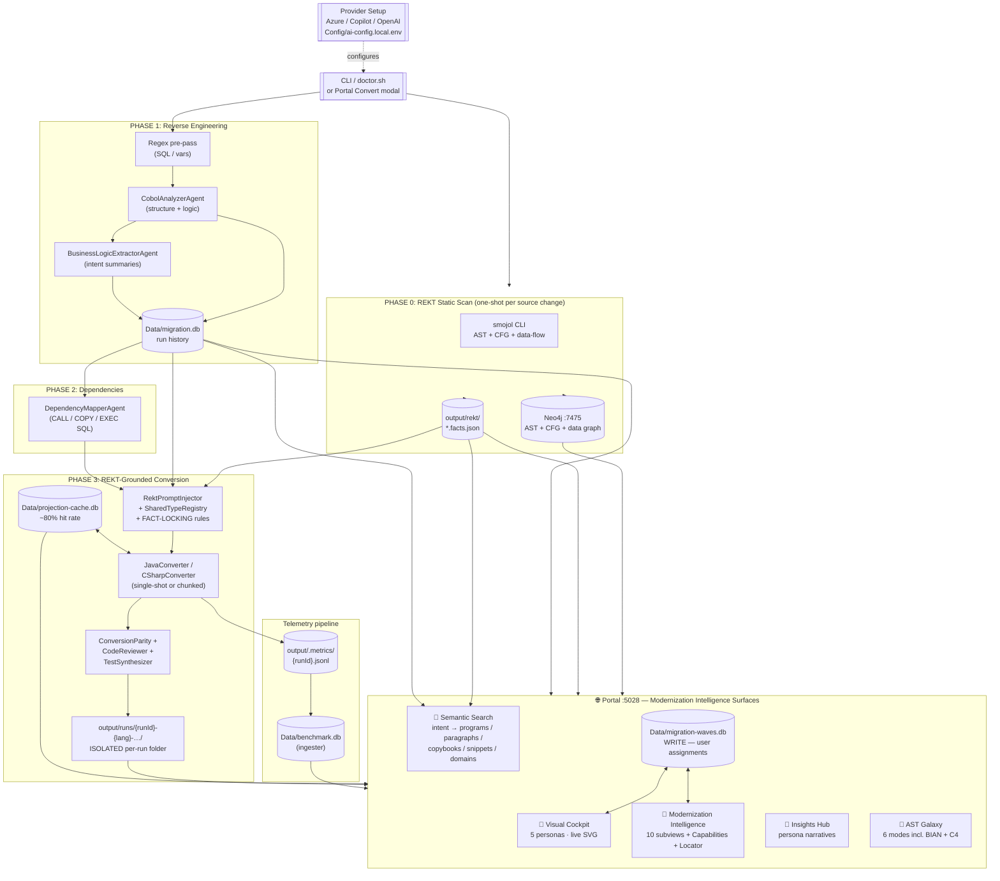
```mermaid
flowchart TD
  CLI[["CLI / doctor.sh<br/>or Portal Convert modal"]]
  SETUP[["Provider Setup<br/>Azure / Copilot / OpenAI<br/>Config/ai-config.local.env"]]

  subgraph SCAN_PHASE["PHASE 0: REKT Static Scan (one-shot per source change)"]
      SMOJOL["smojol CLI<br/>AST + CFG + data-flow"]
      FACTS[("output/rekt/<br/>*.facts.json")]
      NEO[("Neo4j :7475<br/>AST + CFG + data graph")]
  end

  subgraph ANALYZE_PHASE["PHASE 1: Reverse Engineering"]
      REGEX["Regex pre-pass<br/>(SQL / vars)"]
      ANALYZER["CobolAnalyzerAgent<br/>(structure + logic)"]
      BIZLOGIC["BusinessLogicExtractorAgent<br/>(intent summaries)"]
      SQLITE[("Data/migration.db<br/>run history")]
  end

  subgraph DEPENDENCY_PHASE["PHASE 2: Dependencies"]
      MAPPER["DependencyMapperAgent<br/>(CALL / COPY / EXEC SQL)"]
  end

  subgraph CONVERT_PHASE["PHASE 3: REKT-Grounded Conversion"]
      INJECT["RektPromptInjector<br/>+ SharedTypeRegistry<br/>+ FACT-LOCKING rules"]
      PROJ[("Data/projection-cache.db<br/>~80% hit rate")]
      CONVERTER["JavaConverter /<br/>CSharpConverter<br/>(single-shot or chunked)"]
      PARITY["ConversionParity +<br/>CodeReviewer +<br/>TestSynthesizer"]
      OUTRUN["output/runs/{runId}-{lang}-…/<br/>ISOLATED per-run folder"]
  end

  subgraph TELEMETRY["Telemetry pipeline"]
      JSONL[("output/.metrics/<br/>{runId}.jsonl")]
      BENCH[("Data/benchmark.db<br/>(ingester)")]
  end

  subgraph PORTAL["🌐 Portal :5028 — Modernization Intelligence Surfaces"]
      COCK["🎨 Visual Cockpit<br/>5 personas · live SVG"]
      MI["🧭 Modernization Intelligence<br/>10 subviews + Capabilities + Locator"]
      SEM["🧠 Semantic Search<br/>intent → programs / paragraphs /<br/>copybooks / snippets / domains"]
      HUB["🎯 Insights Hub<br/>persona narratives"]
      AST["🌌 AST Galaxy<br/>6 modes incl. BIAN + C4"]
      WAVES[("Data/migration-waves.db<br/>WRITE — user assignments")]
  end

  CLI --> SCAN_PHASE
  SETUP -.->|configures| CLI
  SCAN_PHASE --> NEO
  SCAN_PHASE --> FACTS

  CLI --> REGEX
  REGEX --> ANALYZER
  ANALYZER --> SQLITE
  ANALYZER --> BIZLOGIC
  BIZLOGIC --> SQLITE
  SQLITE --> MAPPER

  FACTS --> INJECT
  SQLITE --> INJECT
  MAPPER --> INJECT
  INJECT --> CONVERTER
  PROJ <--> CONVERTER
  CONVERTER --> PARITY
  PARITY --> OUTRUN
  CONVERTER --> JSONL
  JSONL --> BENCH

  NEO --> PORTAL
  FACTS --> PORTAL
  SQLITE --> PORTAL
  BENCH --> PORTAL
  OUTRUN --> PORTAL
  PROJ --> PORTAL
  FACTS --> SEM
  SQLITE --> SEM
  WAVES <--> COCK
  WAVES <--> MI
```

**How to read it**: PHASE 0 (REKT scan) runs once per source change and writes both raw `.facts.json` (per program) and a Neo4j graph. PHASES 1–3 happen on every conversion run. REKT facts + the shared-types registry are injected into the converter prompt (closing the duplicate-class failure mode). Output lands in an **immutable per-run folder** so history is never overwritten. Telemetry streams to JSONL, gets ingested into `benchmark.db`, and powers every dashboard in the portal. The Wave Planner (Modernization Lead persona) is the only WRITE path — it persists to `Data/migration-waves.db`.


### 🔀 Agent Responsibilities & Interactions

#### Advanced Sequence Flow (Mermaid)

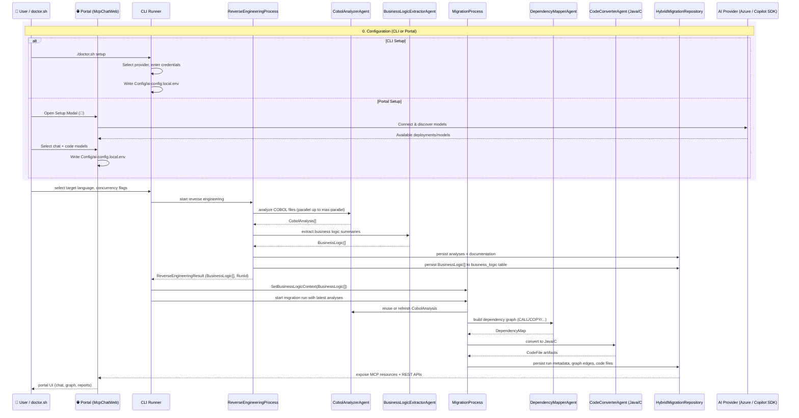
```mermaid
sequenceDiagram
  participant User as 🧑 User / doctor.sh
  participant Portal as 🌐 Portal (McpChatWeb)
  participant CLI as CLI Runner
  participant RE as ReverseEngineeringProcess
  participant Analyzer as CobolAnalyzerAgent
  participant BizLogic as BusinessLogicExtractorAgent
  participant Migration as MigrationProcess
  participant DepMap as DependencyMapperAgent
  participant Converter as CodeConverterAgent (Java/C#)
  participant Repo as HybridMigrationRepository
  participant AI as AI Provider (Azure / Copilot SDK)

  rect rgb(245, 240, 255)
      Note over User, AI: 0. Configuration (CLI or Portal)
      alt CLI Setup
          User->>CLI: ./doctor.sh setup
          CLI->>CLI: Select provider, enter credentials
          CLI->>CLI: Write Config/ai-config.local.env
      else Portal Setup
          User->>Portal: Open Setup Modal (🔧)
          Portal->>AI: Connect & discover models
          AI-->>Portal: Available deployments/models
          User->>Portal: Select chat + code models
          Portal->>Portal: Write Config/ai-config.local.env
      end
  end

  User->>CLI: select target language, concurrency flags
  CLI->>RE: start reverse engineering
  RE->>Analyzer: analyze COBOL files (parallel up to max-parallel)
  Analyzer-->>RE: CobolAnalysis[]
  RE->>BizLogic: extract business logic summaries
  BizLogic-->>RE: BusinessLogic[]
  RE->>Repo: persist analyses + documentation
  RE->>Repo: persist BusinessLogic[] to business_logic table
  RE-->>CLI: ReverseEngineeringResult (BusinessLogic[], RunId)
  CLI->>Migration: SetBusinessLogicContext(BusinessLogic[])
  CLI->>Migration: start migration run with latest analyses
  Migration->>Analyzer: reuse or refresh CobolAnalysis
  Migration->>DepMap: build dependency graph (CALL/COPY/...)
  DepMap-->>Migration: DependencyMap
  Migration->>Converter: convert to Java/C# with business logic context
  Converter-->>Migration: CodeFile artifacts
  Migration->>Repo: persist run metadata, graph edges, code files
  Repo-->>Portal: expose MCP resources + REST APIs
  Portal-->>User: portal UI (chat, graph, reports)
```

#### CobolAnalyzerAgent
- **Purpose:** Deep structural analysis of COBOL files (divisions, paragraphs, copybooks, metrics).
- **Inputs:** COBOL text from `FileHelper` or cached content.
- **Outputs:** `CobolAnalysis` objects consumed by:
  - `ReverseEngineeringProcess` (for documentation & glossary mapping)
  - `DependencyMapperAgent` (seed data for relationships)
  - `CodeConverterAgent` (guides translation prompts)
- **Interactions:**
  - Uses Azure OpenAI via `ResponsesApiClient` / `IChatClient` with concurrency guard.
  - Results persisted by `SqliteMigrationRepository`.

#### BusinessLogicExtractorAgent
- **Purpose:** Convert technical analyses into business language (use cases, user stories, glossary).
- **Inputs:** Output from `CobolAnalyzerAgent` + optional glossary.
- **Outputs:** `BusinessLogic` records and Markdown sections used in `reverse-engineering-details.md`.
- **Interactions:**
  - Runs in parallel with analyzer results.
  - Writes documentation via `FileHelper` and logs via `EnhancedLogger`.
  - Results persisted to the `business_logic` SQLite table via `IMigrationRepository.SaveBusinessLogicAsync`, enabling reuse in subsequent `--skip-reverse-engineering --reuse-re` runs.

#### DependencyMapperAgent
- **Purpose:** Identify CALL/COPY/PERFORM/IO relationships and build graph metadata.
- **Inputs:** COBOL files + analyses (line numbers, paragraphs).
- **Outputs:** `DependencyMap` with nodes/edges stored in both SQLite and Neo4j.
- **Interactions:**
  - Feeds the McpChatWeb graph panel and run-selector APIs.
  - Enables multi-run queries (e.g., "show me CALL tree for run 42").

#### CodeConverterAgent(s)
- **Variants:** `JavaConverterAgent` or `CSharpConverterAgent` (selected via `TargetLanguage`).
- **Purpose:** Generate target-language code from COBOL analyses and dependency context.
- **Inputs:**
  - `CobolAnalysis` per file
  - Target language settings (Quarkus vs. .NET)
  - Migration run metadata (for logging & metrics)
  - `BusinessLogic` records per file (user stories, features, business rules) — injected automatically from RE output in full-pipeline runs, or loaded from DB when `--reuse-re` is used
- **Outputs:** `CodeFile` records saved under `output/java/` or `output/csharp/`.
- **Interactions:**
  - Concurrency guards (pipeline slots vs. AI calls) ensure Azure OpenAI limits respected.
  - Results pushed to portal via repositories for browsing/download.

### ⚡ Concurrency Notes
- **Pipeline concurrency (`--max-parallel`)** controls how many files/chunks run simultaneously (e.g., 8).
- **AI concurrency (`--max-ai-parallel`)** caps concurrent Azure OpenAI calls (e.g., 3) to avoid throttling.
- Both values can be surfaced via CLI flags or environment variables to let `doctor.sh` tune runtime.

### 🔄 End-to-End Data Flow
1. `doctor.sh run` → load configs → choose target language
2. **Source scanning** - Reads all `.cbl`/`.cpy` files from `source/`
3. **Analysis** - `CobolAnalyzerAgent` extracts structure; `BusinessLogicExtractorAgent` generates documentation
4. **Dependencies** - `DependencyMapperAgent` maps CALL/COPY/PERFORM relationships → Neo4j
5. **Conversion** - `JavaConverterAgent` or `CSharpConverterAgent` generates target code → `output/`
6. **Storage** - `HybridMigrationRepository` writes metadata to SQLite, graph edges to Neo4j
7. **Portal** - `McpChatWeb` surfaces chat, graphs, and reports at http://localhost:5028

---

## 🔨 Build & Run

### Build Only

```bash
dotnet build
```

### Run Migration (Recommended)

```bash
./doctor.sh run      # Interactive - prompts for language choice
```

**⚠️ Do NOT use `dotnet run` directly** - it bypasses the interactive menu and configuration checks.

### Launch Portal Only

```bash
./doctor.sh portal   # Opens http://localhost:5028
```

---

## 🔧 Configuration Reference

### Configuration Loading: .env vs appsettings.json

This project uses a **layered configuration system** where `.env` files can override `appsettings.json` values.

#### Config Files Explained

| File | Purpose | Git Tracked? |
|------|---------|--------------|
| `Config/appsettings.json` | **All settings** - models, chunking, Neo4j, output paths | ✅ Yes |
| `Config/ai-config.env` | Template defaults | ✅ Yes |
| `Config/ai-config.local.env` | **Your secrets** - API keys, endpoints | ❌ No (gitignored) |

#### What Goes Where?

```
appsettings.json          → Non-secret settings (chunking, Neo4j, file paths)
ai-config.local.env       → Secrets (API keys, endpoints) - NEVER commit!
```

#### Loading Order (Priority)

When you run `./doctor.sh run`, configuration loads in this order:

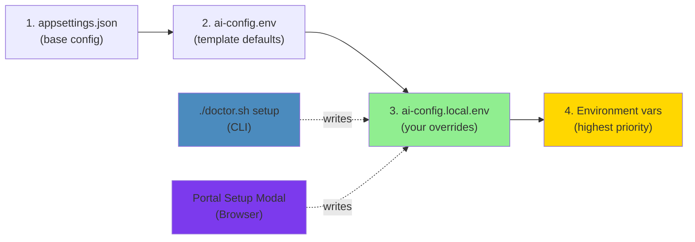
```mermaid
flowchart LR
    A["1. appsettings.json<br/>(base config)"] --> B["2. ai-config.env<br/>(template defaults)"]
    B --> C["3. ai-config.local.env<br/>(your overrides)"]
    C --> D["4. Environment vars<br/>(highest priority)"]
    
    E["./doctor.sh setup<br/>(CLI)"] -.->|writes| C
    F["Portal Setup Modal<br/>(Browser)"] -.->|writes| C
    
    style C fill:#90EE90
    style D fill:#FFD700
    style E fill:#4B8BBE
    style F fill:#7C3AED
```

**Later values override earlier ones.** This means:
- `ai-config.local.env` overrides `appsettings.json`
- Environment variables override everything

#### How doctor.sh Loads Config

```bash
# Inside doctor.sh:
source "$REPO_ROOT/Config/load-config.sh"  # Loads the loader
load_ai_config                              # Executes loading
```

The `load-config.sh` script:
1. Reads `ai-config.local.env` first (your secrets)
2. Falls back to `ai-config.env` for any unset values
3. Exports all values as environment variables
4. .NET app reads these env vars, which override `appsettings.json`

#### Quick Reference: Key Settings

| Setting | appsettings.json Location | .env Override |
|---------|---------------------------|---------------|
| Codex model | `AISettings.ModelId` | `_CODE_MODEL` |
| Chat model | `AISettings.ChatModelId` | `_CHAT_MODEL` |
| API endpoint | `AISettings.Endpoint` | `_MAIN_ENDPOINT` |
| API key | `AISettings.ApiKey` | `_MAIN_API_KEY` |
| Neo4j enabled | `ApplicationSettings.Neo4j.Enabled` | — |
| Chunking | `ChunkingSettings.*` | — |

> 💡 **Best Practice:** Keep secrets in `ai-config.local.env`, keep everything else in `appsettings.json`.

---

### Required: Azure OpenAI

In `Config/ai-config.local.env`:
```bash
# Master Configuration
_MAIN_ENDPOINT="https://YOUR-RESOURCE.openai.azure.com/"
_MAIN_API_KEY="your key"   # Leave empty to use 'az login' (Entra ID) instead

# Model Selection (override appsettings.json)
_CHAT_MODEL="gpt-5.2-chat"           # For Portal Q&A
_CODE_MODEL="gpt-5.1-codex-mini"     # For Code Conversion
```

> 💡 **Prefer keyless auth?** Run `az login` and leave `_MAIN_API_KEY` empty.
> You need the **"Cognitive Services OpenAI User"** role on your Azure OpenAI resource.
> See [Azure AD / Entra ID Authentication Guide](azlogin-auth-guide.md) for full instructions.

### Neo4j (Dependency Graphs)

In `Config/appsettings.json`:
```json
{
  "ApplicationSettings": {
    "Neo4j": {
      "Enabled": true,
      "Uri": "bolt://localhost:7687",
      "Username": "neo4j",
      "Password": "cobol-migration-2025"
    }
  }
}
```

Start with: `docker-compose up -d neo4j`

### Smart Chunking (Large Files)

See [Parallel Jobs Formula](#parallel-jobs-formula) for chunking configuration details.

---

## 📊 What Gets Generated

| Input | Output |
|-------|--------|
| `source/CUSTOMER.cbl` | `output/java/com/example/generated/CustomerService.java` |
| `source/PAYMENT.cbl` | `output/csharp/Generated/PaymentProcessor.cs` |
| Analysis | `output/reverse-engineering-details.md` |
| Report | `output/migration_report_run_X.md` |

---

## 🆘 Troubleshooting

```bash
./doctor.sh               # Check configuration
./doctor.sh test          # Run system tests
./doctor.sh chunking-health  # Check chunking setup
```

| Issue | Solution |
|-------|----------|
| Neo4j connection refused | `docker-compose up -d neo4j` |
| Azure API error | Check `Config/ai-config.local.env` credentials or run `az login` |
| `./doctor.sh setup` fails with missing `ai-config.local.env.example` | Follow `docs/troubleshoot.md` |
| No output generated | Ensure COBOL files are in `source/` |
| Portal won't start | `lsof -ti :5028 \| xargs kill -9` then retry |

---

## 📚 Further Reading

- [Custom Agent Onboarding](docs/customagent.md) — How to add a custom GitHub agent (Copilot CLI, gh-aw workflow, or runtime LLM agent) to this framework
- [Smart Chunking & Token Architecture](docs/smart-chunking-architecture.md) — Diagrams, constants reference, complexity scoring
- [Smart Chunking Guide](Smart-chuncking-how%20it-works.md) — Deep technical details
- [Architecture Documentation](REVERSE_ENGINEERING_ARCHITECTURE.md) — System design
- [Cobol-REKT Demo](docs/rekt-demo.md) — Static-analysis pipeline walkthrough
- [Target Architecture Recommendation](docs/target-architecture-recommendation.md) — Modernization plan view, mapping heuristics, and the JSON schema consumed by AI conversion agents
- [REKT-grounded Conversion](docs/rekt-grounded-conversion.md) — Selector-driven `doctor.sh run`, BMS/IMS readers, quality-validation agents, env-var reference
- [Setup Troubleshooting](docs/troubleshoot.md) — Setup failures and recovery steps for `./doctor.sh setup`
- [Changelog](CHANGELOG.md) — Version history

---

## ⚙️ Workflows

| Workflow / Agent | Trigger | Description |
|---|---|---|
| [Documentation Updater](.github/workflows/documentation-updater.lock.yml) | Push / PR to `main` | Checks documentation completeness and reports gaps via issues or PR comments |
| [Documentation Audit](.github/workflows/documentation-audit.lock.yml) | Weekly schedule | Performs a full audit of project documentation for accuracy and completeness |
| [Test Enhancer](.github/workflows/test-enhancer.lock.yml) | On demand | Agentic workflow that analyzes the codebase and proposes improvements to test coverage |
| [Branch Reviewer](.github/agents/branch-reviewer.agent.md) | On demand (Copilot CLI) | Reviews branch changes, summarizes commits, and detects breaking changes vs. `main` |

> Adding your own agent? See [Custom Agent Onboarding](docs/customagent.md) for the three supported surfaces (Copilot CLI agent · gh-aw workflow agent · runtime LLM agent).

---

## Acknowledgements

Collaboration between Microsoft's Global Black Belt team and [Bankdata](https://www.bankdata.dk/). See [blog post](https://aka.ms/cobol-blog).

Special thanks to [**avishek-sen-gupta/cobol-rekt**](https://github.com/avishek-sen-gupta/cobol-rekt) ([MIT-licensed](https://github.com/avishek-sen-gupta/cobol-rekt?tab=MIT-1-ov-file)) for inspiration on the static-analysis pipeline (AST, CFG, and data-flow extraction) that powers the AST Galaxy, AST Explorer, and Migration Planner views in this project.

## License

MIT License - Copyright (c) Microsoft Corporation.
