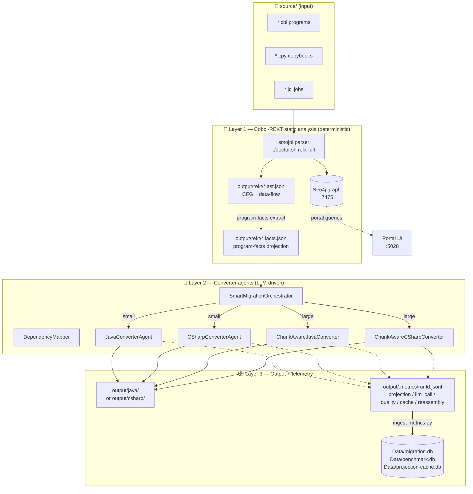
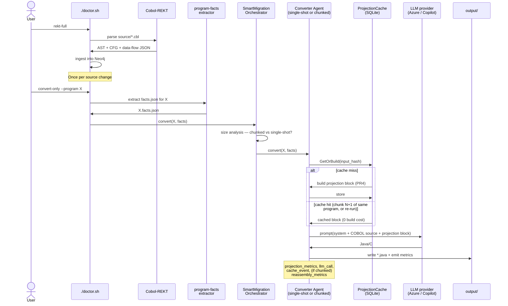
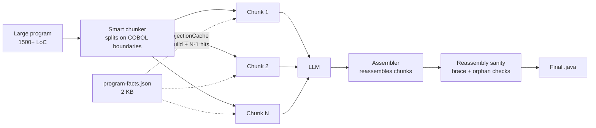

# Legacy Modernization Agents — COBOL → Java / C#

> **Production-grade AI agent framework for COBOL-to-Java-Quarkus and COBOL-to-C#-.NET conversion, grounded in deterministic static analysis (REKT) and instrumented end-to-end with semantic telemetry.**

[](docs/quick-guide.md)
[](#architecture)
[](docs/rekt-grounded-conversion.md)
[](#portal)

This framework converts COBOL codebases of any size — from a single 200-line program to enterprise estates of thousands of programs and tens of millions of lines — into modern Java (Quarkus) or C# (.NET) code. It does this by:

1. **Statically parsing every program** with Cobol-REKT (AST, control-flow, data-flow, dependency graph) — once per source change.
2. **Curating a small semantic projection per program** (`output/rekt/<stem>.facts.json`) that captures the structural truth in 60–90 % fewer tokens than raw AST.
3. **Handing that projection to a converter agent** that uses it as ground-truth context, freeing the LLM from re-discovering structure on every call and enabling reliable conversion of programs that exceed any single LLM context window.

Multi-provider: **Azure OpenAI** (Responses API + Chat Completions), **GitHub Copilot** (PAT or CLI SDK), **direct OpenAI**. Built on `Microsoft.Extensions.AI`.

---

## 🚀 Start here

| You want to… | Read |
|---|---|
| Get a converted Java file in 5 minutes | [`docs/quick-guide.md`](docs/quick-guide.md) |
| Full step-by-step setup walkthrough | [`docs/quick-start.md`](docs/quick-start.md) |
| Understand how REKT hands off to agents | [Architecture](#architecture) below |
| Set up the portal UI | [`./doctor.sh portal`](#portal) below |
| Reference all `doctor.sh` commands | [Doctor.sh reference](#doctorsh-reference) below |

---

## Architecture

The platform is split into three orthogonal layers. Each layer can be inspected, replayed, and improved independently.


```mermaid
flowchart TB
    subgraph SRC ["📂 source/ (input)"]
        CBL[*.cbl programs]
        CPY[*.cpy copybooks]
        JCL[*.jcl jobs]
    end

    subgraph REKT ["🔬 Layer 1 — Cobol-REKT static analysis (deterministic)"]
        PARSE[smojol parser<br/>./doctor.sh rekt-full]
        AST[output/rekt/*.ast.json<br/>CFG + data-flow]
        NEO[(Neo4j graph<br/>:7475)]
        FACTS[output/rekt/*.facts.json<br/>program-facts projection]
        PARSE --> AST
        PARSE --> NEO
        AST -->|program-facts extract| FACTS
    end

    subgraph AGENTS ["🤖 Layer 2 — Converter agents (LLM-driven)"]
        DEP[DependencyMapper]
        ROUTE[SmartMigrationOrchestrator]
        JAVA[JavaConverterAgent]
        CSHARP[CSharpConverterAgent]
        CHUNK_J[ChunkAwareJavaConverter]
        CHUNK_C[ChunkAwareCSharpConverter]
        ROUTE -->|small| JAVA
        ROUTE -->|small| CSHARP
        ROUTE -->|large| CHUNK_J
        ROUTE -->|large| CHUNK_C
    end

    subgraph OUT ["📦 Layer 3 — Output + telemetry"]
        CODE[output/java/<br/>or output/csharp/]
        METRICS[output/.metrics/runId.jsonl<br/>projection / llm_call / quality / cache / reassembly]
        DB[(Data/migration.db<br/>Data/benchmark.db<br/>Data/projection-cache.db)]
    end

    SRC --> PARSE
    FACTS --> ROUTE
    NEO -.->|portal queries| PORTAL[Portal UI<br/>:5028]
    JAVA --> CODE
    CSHARP --> CODE
    CHUNK_J --> CODE
    CHUNK_C --> CODE
    JAVA -.-> METRICS
    CSHARP -.-> METRICS
    CHUNK_J -.-> METRICS
    CHUNK_C -.-> METRICS
    METRICS -->|ingest-metrics.py| DB
```

### Why this design beats raw "feed the whole program to an LLM"

| Problem | This framework's answer |
|---|---|
| Large programs blow past context windows | Smart orchestrator detects size → routes to chunk-aware converter → REKT facts injected per chunk give the LLM the global picture even when it sees a slice |
| LLM hallucinates field names, CALL targets, copybook structure | Facts JSON locks structural truth — every field, every CALL, every section comes from REKT, not from the LLM's guess |
| Token costs scale linearly with corpus | Program-facts projection is 60–90 % smaller than raw AST → less context per call → projection-block cache makes per-chunk reuse free |
| No way to know if generated code is correct | Compile-success quality gate (`tools/check-compile.sh`) + structured `quality_metrics` event per run; reassembly sanity (`reassembly_metrics`) catches chunk-stitching defects |
| Cannot reproduce or debug a run | Every projection block hashed (`projectionHash`), every LLM call timed (`llm_call`), every cache decision logged (`cache_event`); replay with `python3 tools/ingest-metrics.py --report` |

---

## REKT-to-Agent handover (the heart of the design)


```mermaid
sequenceDiagram
    actor User
    participant doctor as ./doctor.sh
    participant REKT as Cobol-REKT
    participant Facts as program-facts<br/>extractor
    participant Orch as SmartMigration<br/>Orchestrator
    participant Agent as Converter Agent<br/>(single-shot or chunked)
    participant Cache as ProjectionCache<br/>(SQLite)
    participant LLM as LLM provider<br/>(Azure / Copilot)
    participant Out as output/

    User->>doctor: rekt-full
    doctor->>REKT: parse source/*.cbl
    REKT->>doctor: AST + CFG + data-flow JSON
    doctor->>doctor: ingest into Neo4j
    Note over doctor: Once per source change

    User->>doctor: convert-only --program X
    doctor->>Facts: extract facts.json for X
    Facts->>doctor: X.facts.json
    doctor->>Orch: convert(X, facts)
    Orch->>Orch: size analysis — chunked vs single-shot?
    Orch->>Agent: convert(X, facts)
    Agent->>Cache: GetOrBuild(input_hash)
    alt cache miss
        Cache->>Agent: build projection block (PR4)
        Agent->>Cache: store
    else cache hit (chunk N+1 of same program, or re-run)
        Cache->>Agent: cached block (0 build cost)
    end
    Agent->>LLM: prompt(system + COBOL source + projection block)
    LLM->>Agent: Java/C# code (streamed)
    Agent->>Out: write *.java + emit metrics
    Note over Agent: projection_metrics, llm_call,<br/>cache_event, (if chunked)<br/>reassembly_metrics
```

### Why the projection beats raw AST

A typical `*.facts.json` is ~2 KB. The equivalent raw AST blob is 8–10 KB. The projection contains:

- 01-level data groups (one per DTO/record to emit)
- CALL targets (one per service interface to `@Inject`)
- COPY copybook usage (for shared-type resolution)
- SQL statements (for `@Transactional` placement)
- BMS / IMS / CICS handlers (for transaction boundaries)
- Confidence + warnings (so the LLM knows what REKT could not extract)

Result observed across the test corpus:

| Program | LoC | Raw REKT context | Projection | **Reduction** |
|---|---:|---:|---:|---:|
| BDSM043 | 203 | 1854 tok | 604 tok | **67 %** |
| BDSDA23 | 236 | 5386 tok | 739 tok | **86 %** |
| RGNB649 | 715 | 8276 tok | 883 tok | **89 %** |
| BDSDA2F | 786 | 3086 tok | 646 tok | **79 %** |
| BDSMFJL | 1513 | 4650 tok | 708 tok | **85 %** |

Reduction scales **with** complexity — exactly the property you want for enterprise estates.

---

## How large programs are handled (chunked conversion)

When a program exceeds the orchestrator's size budget, it's routed to a chunk-aware converter. **Crucially, the same facts.json is injected into every chunk** — the LLM always sees the global structural picture, even when it only sees a slice of the source:


```mermaid
flowchart LR
    PROG[Large program<br/>1500+ LoC]
    PROG --> SPLIT[Smart chunker<br/>splits on COBOL boundaries]
    SPLIT --> C1[Chunk 1]
    SPLIT --> C2[Chunk 2]
    SPLIT --> CN[Chunk N]
    FACTS[program-facts.json<br/>2 KB]
    FACTS -.->|ProjectionCache<br/>1 build + N-1 hits| C1
    FACTS -.-> C2
    FACTS -.-> CN
    C1 --> LLM[LLM]
    C2 --> LLM
    CN --> LLM
    LLM --> ASM[Assembler<br/>reassembles chunks]
    ASM --> CHECK[Reassembly sanity<br/>brace + orphan checks]
    CHECK --> JAVA[Final .java]
```

Concrete telemetry from a 6-chunk BDSMFJL run:
- 1 × `cache_event: miss-store` (first chunk builds projection)
- 5 × `cache_event: hit` (subsequent chunks reuse projection — **83 % hit rate**)
- 6 × `projection_metrics` (one per chunk, `projectionCacheHit: true` on the last 5)
- 6 × `llm_call` (one per chunk)
- 1 × `reassembly_metrics` (brace balance + orphan check after stitching)
- 1 × `quality_metrics` (compile-success post-run)

---

## doctor.sh reference

Everything ships through one script. Run `./doctor.sh help` for the full list; the essentials:

### Setup & diagnostics

```bash
./doctor.sh setup        # interactive: configure AI provider, write Config/ai-config.local.env
./doctor.sh doctor       # verify .NET, Docker, Java, auth, model deployments
./doctor.sh test         # full system validation (build + smoke convert)
```

### REKT static analysis (run once per source change)

```bash
./doctor.sh rekt-full    # parse + ingest into Neo4j + launch portal     ← typical
./doctor.sh rekt-parse   # parse only (no Neo4j ingest)
./doctor.sh rekt-ingest  # ingest only (after a manual parse)
./doctor.sh rekt-status  # what's been scanned, what's stale
```

REKT writes `output/rekt/<program>.{ast,cfg,data}.json` and ingests the same graph into Neo4j on port 7475 (browser: `http://localhost:7475`).

### Conversion

```bash
# Single program (fastest path — skips reverse engineering)
./doctor.sh convert-only --program ACCTMGR --target java

# With full reverse-engineering analysis upfront
./doctor.sh run --program ACCTMGR --target java

# By migration wave (requires Target Architecture saved in portal first)
./doctor.sh convert-only --wave 1 --target csharp

# Transitive closure
./doctor.sh convert-only --program ACCTMGR --include-callees   # everything ACCTMGR calls
./doctor.sh convert-only --program ACCTMGR --include-callers   # everything that calls ACCTMGR

# By CICS transaction code
./doctor.sh run --transaction CT01 --include-callees
```

### Portal

```bash
./doctor.sh portal       # launch McpChatWeb at http://localhost:5028
```

The portal provides:
- **Mission Control** — real-time run monitoring, colour-coded logs, output explorer
- **AST Galaxy Explorer** — interactive graph visualisation of the REKT-parsed estate
- **C4 Dashboard** — system context / container / component / code views
- **Target Architecture** — assign programs to migration waves, save plans for agent consumption
- **Convert modal** — pick programs/transactions/waves and trigger conversion from the UI
- **Reverse Engineering Reports** — business purpose, business rules, use cases per program
- **Migration Planner** — domain-based time/effort chart

See [docs/quick-start.md §Portal](docs/quick-start.md) for the full walkthrough.

---

## Output & telemetry

Per conversion run you get:

- **Generated code** — `output/java/com/example/*/*.java` or `output/csharp/`
- **Migration report** — `output/java/migration-report.md` (Markdown summary, file mapping, dependency analysis)
- **Run record** — `Data/migration.db` row (runs table)
- **Structured metrics** — `output/.metrics/<runId>.jsonl` with 5 event types:
  - `projection_metrics` — projection vs raw-rekt decision + token counts + hash
  - `llm_call` — per-call latency, completion tokens, outcome
  - `quality_metrics` — compile success, error count, generated class count
  - `cache_event` — hit / miss-store / bypass-disabled for the projection cache
  - `reassembly_metrics` — brace balance + orphan check for chunked output
- **Analytics DB** — `Data/benchmark.db` (built by `tools/ingest-metrics.py`)
- **Projection cache** — `Data/projection-cache.db` (SQLite, hash-keyed, 80 % hit rate observed on chunked path)

Run `python3 tools/ingest-metrics.py --rebuild --report` for an aggregated view across all runs.

---

## Configuration reference

Drop a `Config/ai-config.local.env` produced by `./doctor.sh setup`. Common environment overrides:

| Variable | Default | Effect |
|---|---|---|
| `_USE_PROGRAM_FACTS` | unset | `true` enables the PR4 projection path (60–90 % token reduction) |
| `_LLM_CACHE_ENABLED` | `true` | Toggle the LLM response cache |
| `_PROJECTION_CACHE_DISABLED` | unset | `true` bypasses the PR6 projection-block cache |
| `ENABLE_REKT_CONTEXT` | `true` | Inject REKT structural context into prompts |
| `COPILOT_SDK_REQUEST_TIMEOUT_SECONDS` | `300` | Bound the Copilot SDK call (range 60-1800) |
| `LLM_CALL_TIMEOUT_SECONDS` | `480` | Per-call hang timeout |
| `COPILOT_SAFE_MODE` | auto | Force smaller chunks for the Copilot provider |
| `COBOL_SOURCE_FOLDER` | `source` | Override input directory |
| `MCP_AUTO_LAUNCH` | `1` | `0` disables portal auto-launch after a run |

---

## Project layout

```
Legacy-Modernization-Agents/
├── doctor.sh                  ← Single entry point (setup / REKT / convert / portal / doctor)
├── source/                    ← Drop COBOL here (.cbl, .cpy, .jcl, .bms)
├── output/
│   ├── rekt/                  ← REKT artifacts (AST, CFG, data, facts.json)
│   ├── java/   or csharp/     ← Generated modern code
│   └── .metrics/              ← Per-run JSONL telemetry stream
├── Data/
│   ├── migration.db           ← Run history (SQLite)
│   ├── benchmark.db           ← Aggregated analytics
│   └── projection-cache.db    ← PR6 projection-block cache
├── Agents/                    ← Converter + analyzer agents (C#)
│   ├── Infrastructure/        ← AgentBase, CopilotChatClient, ResponsesApiClient
│   └── *Agent.cs              ← Java/C# converter, ChunkAware variants, DependencyMapper, etc.
├── Helpers/
│   ├── MetricsSink.cs         ← Logger-independent JSONL writer
│   ├── RektPromptInjector.cs  ← Centralised REKT/projection prompt injection
│   └── PromptProjections/
│       ├── JavaConverterProjection.cs
│       ├── CSharpConverterProjection.cs
│       └── ProjectionCache.cs ← PR6 hash-keyed cache
├── Processes/
│   ├── MigrationProcess.cs    ← Single-shot orchestration
│   ├── ChunkedMigrationProcess.cs ← Chunked path + reassembly
│   └── SmartMigrationOrchestrator.cs ← Routes small vs large
├── McpChatWeb/                ← Portal UI (ASP.NET, hosts AST Galaxy + Mission Control)
├── tools/
│   ├── ab-projection-suite.sh ← Multi-program A/B harness
│   ├── check-compile.sh       ← Java compile quality gate
│   ├── ingest-metrics.py      ← JSONL → SQLite + reporting
│   ├── run-quality-gates.sh   ← Post-suite gate orchestrator
│   └── verify-env-propagation.sh ← Smoke test before suites
└── docs/                      ← Deep dives (see Further reading)
```

---

## Build & run from source

```bash
git clone https://github.com/Azure-Samples/COBOL-Modernization-Agents
cd COBOL-Modernization-Agents
./doctor.sh setup            # configure provider
./doctor.sh test             # build + smoke test
./doctor.sh rekt-full        # parse your COBOL
./doctor.sh portal           # launch UI
```

Manual build:

```bash
dotnet restore
dotnet build CobolToQuarkusMigration.csproj
```

---

## Troubleshooting

| Symptom | Likely cause | Fix |
|---|---|---|
| `output/.metrics/unknown.jsonl` filling up | LLM call from agent not setting `MetricsSink.CurrentRunId` | Recent agents handle this in `ConvertAsync`; check `MigrationProcess.cs` sets it at run start |
| Conversion produces `*Fallback.java` | Copilot SDK 5-min timeout fired | Bump `COPILOT_SDK_REQUEST_TIMEOUT_SECONDS=900` and verify it propagates with `tools/verify-env-propagation.sh` |
| Both A/B legs produce same output | `_USE_PROGRAM_FACTS` not reaching dotnet | Portal is intercepting; use `tools/ab-projection.sh` which sets `PORTAL_LAUNCHED=true` to force direct invocation |
| `check-compile.sh` reports orphan literals at class scope | Chunked-reassembly defect | Already fixed via class-declaration-aware extraction; if recurring, inspect `Processes/ChunkedMigrationProcess.cs::ExtractJavaClassContent` |
| Stale Neo4j data after source change | REKT scan cache hit | `./doctor.sh rekt-full --force` or wipe `Data/rekt-scan.db` |

See [`docs/troubleshoot.md`](docs/troubleshoot.md) for the full troubleshooting catalogue.

---

## Further reading

| Topic | Doc |
|---|---|
| 5-minute getting started | [`docs/quick-guide.md`](docs/quick-guide.md) |
| Full step-by-step setup | [`docs/quick-start.md`](docs/quick-start.md) |
| REKT static-analysis pipeline | [`docs/rekt-demo.md`](docs/rekt-demo.md) |
| REKT-grounded conversion (selectors, validators) | [`docs/rekt-grounded-conversion.md`](docs/rekt-grounded-conversion.md) |
| Smart chunking architecture | [`docs/smart-chunking-architecture.md`](docs/smart-chunking-architecture.md) |
| Program-facts schema (PR3) | [`docs/p3-program-facts.md`](docs/p3-program-facts.md) |
| Java prompt projection (PR4) | [`docs/p4a-java-prompt-projection.md`](docs/p4a-java-prompt-projection.md) |
| C# projection + auto-extract (PR4.b / PR3.b) | [`docs/p4b-csharp-projection-and-pr3b-auto-extract.md`](docs/p4b-csharp-projection-and-pr3b-auto-extract.md) |
| A/B validation protocol + results | [`docs/p1-ab-validation-protocol.md`](docs/p1-ab-validation-protocol.md) |
| Response cache (PR1) | [`docs/p1-response-cache.md`](docs/p1-response-cache.md) |
| REKT scan cache (PR2) | [`docs/p2-rekt-scan-cache.md`](docs/p2-rekt-scan-cache.md) |
| Reverse engineering architecture | [`REVERSE_ENGINEERING_ARCHITECTURE.md`](REVERSE_ENGINEERING_ARCHITECTURE.md) |
| Target Architecture / migration waves | [`docs/target-architecture-recommendation.md`](docs/target-architecture-recommendation.md) |
| Modernization Intelligence Portal (design) | [`docs/modernization-intelligence-portal-design.md`](docs/modernization-intelligence-portal-design.md) |
| Custom GitHub agent onboarding | [`docs/customagent.md`](docs/customagent.md) |
| Troubleshooting setup | [`docs/troubleshoot.md`](docs/troubleshoot.md) |
| Changelog | [`CHANGELOG.md`](CHANGELOG.md) |

---

## Workflows, CI & custom agents

| Workflow / Agent | Trigger | Description |
|---|---|---|
| [Documentation Updater](.github/workflows/documentation-updater.lock.yml) | Push / PR to `main` | Checks documentation completeness, reports gaps |
| [Documentation Audit](.github/workflows/documentation-audit.lock.yml) | Weekly | Full audit of project documentation |
| [Test Enhancer](.github/workflows/test-enhancer.lock.yml) | On demand | Analyzes codebase and proposes test improvements |
| [Branch Reviewer](.github/agents/branch-reviewer.agent.md) | On demand (Copilot CLI) | Reviews branch changes, summarizes commits, detects breaking changes |

---

## Acknowledgements

Collaboration between Microsoft's Global Black Belt team and [Bankdata](https://www.bankdata.dk/). See the [blog post](https://aka.ms/cobol-blog).

Special thanks to [**avishek-sen-gupta/cobol-rekt**](https://github.com/avishek-sen-gupta/cobol-rekt) ([MIT-licensed](https://github.com/avishek-sen-gupta/cobol-rekt?tab=MIT-1-ov-file)) for the static-analysis pipeline (AST, CFG, data-flow extraction) that powers AST Galaxy, AST Explorer, and the Migration Planner.

## License

MIT License — Copyright © Microsoft Corporation.
