# Legacy Modernization Agents - COBOL to Java/C# Migration

This open source migration framework was developed to demonstrate AI Agents capabilities for converting legacy code like COBOL to Java or C# .NET. Each Agent has a persona that can be edited depending on the desired outcome.
The migration uses Microsoft Agent Framework with a multi-provider architecture supporting **Azure OpenAI** (Responses API + Chat Completions), **GitHub Copilot** (PAT or CLI-based SDK), and **direct OpenAI** to analyze COBOL code and its dependencies, then convert to either Java Quarkus or C# .NET (user's choice).

## 🎬 Portal Demo


*The web portal provides real-time visualization of migration progress, dependency graphs, and AI-powered Q&A.*

---

> [!IMPORTANT]
> **Sign in before you run anything that calls a model.** The framework takes its token from your local sign-in; it does not prompt for one.
>
> | Provider | Sign in with | Then |
> |---|---|---|
> | Azure OpenAI / Azure AI Foundry (Entra ID) | `az login` (add `--tenant <id>` if the resource is in another tenant) | Your account needs the **Cognitive Services OpenAI User** role on the resource. See [az login authentication](docs/az-login-auth-guide.md) |
> | GitHub Copilot SDK | `copilot login` (the Copilot CLI, not `gh`), or a fine-grained token with the **Copilot Requests** permission in `COPILOT_GITHUB_TOKEN` | `./doctor.sh setup` asks which and records it as `COPILOT_AUTH`. Classic `ghp_` tokens do not work. The account needs a Copilot licence. See [Copilot sign-in](#copilot-sign-in) |
>
> Without a valid sign-in (or an API key in `Config/ai-config.local.env`), conversion and reverse engineering fail on the first model call. `./doctor.sh rekt-full`, `./doctor.sh estate` and `./doctor.sh jcl` call no model and need no sign-in.

> [!TIP]
> **Start here: quick run.** Run these in order from the repository root:
>
> | Step | Command | What it does |
> |---|---|---|
> | 1 | *(copy files)* | **Put your sources in `source/`**: COBOL programs (`.cbl`), copybooks (`.cpy`), BMS maps (`.bms`), CICS definitions, and JCL jobs (`.jcl`) with their procedures and INCLUDE members (`.proc`, `.prc`, `.inc`). Subfolders are fine |
> | 2 | `./doctor.sh setup` | **Configure the framework**: AI provider, credentials, models and local services |
> | 3 | `./doctor.sh rekt-full` | **Parse the estate (before any conversion)**: parses the COBOL with REKT into the REKT Neo4j graph and the JCL into `output/rekt/`. No model is called. See [Parse first: rekt-full](#parse-first-rekt-full) |
> | 4 | `./doctor.sh portal` | **Open the portal** at http://localhost:5028 |
> | 5 | *(portal)* | **Pick what to migrate in 🛰 Estate Mission Control**: switch to **✂️ Carve-out plan**, click a cluster, and press **📦 Stage slice**. The panel lists the programs, what they call, and what is missing from `source/`, and gives the exact command to run. **🔁 Send to AI loop** starts the conversion from the portal instead. See [Estate Mission Control](#estate-mission-control) |
> | 6 | *(the suggested command)* | **Convert the slice**, for example `./doctor.sh convert-only --program BNK1CCA.cbl,BNK1CCS.cbl` |
>
> Example commands:
>
> | Command | What it does |
> |---|---|
> | `./doctor.sh estate` | Prints the carve-out wave plan in the terminal (same data as Estate Mission Control) |
> | `./doctor.sh estate C01` | Prints one cluster and the `convert-only` command for its slice |
> | `./doctor.sh run --program X.cbl --language Java --dry-run` | Previews which programs a conversion would include, without calling a model |
> | `./doctor.sh convert-only --program A.cbl --program B.cbl` | Converts only these programs (repeat `--program` or separate with commas) |
> | `./doctor.sh run --program X.cbl --include-callees --clean-output` | Converts a program plus everything it calls, into a clean output folder |
> | `./doctor.sh reverse-eng` | Extracts business logic only (no conversion) |
> | `./doctor.sh run` | Full migration of everything in `source/` |
>
> Estate Mission Control builds from `source/` alone. The portal's chat and report pages need at least one run (`./doctor.sh reverse-eng`, `convert-only` or `run`).
>
> **JCL jobs:** put the `.jcl` files (and their `.proc`, `.prc`, `.inc` members) in `source/`, then:
>
> | Command | What it does |
> |---|---|
> | `./doctor.sh jcl --language CSharp` (or `Java`) | **JCL only, no model, seconds**: generates one job per JCL job into `output/<language>/<run>/`, compiles it (`dotnet build`, or `mvn compile` for Java), and lists per job which programs and procedures are still missing |
> | `./doctor.sh run --job NAME --language CSharp` | **Job plus its programs**: converts the COBOL programs the job runs (add `--dry-run` to preview them), then generates the job so it can run end to end |
>
> See [JCL](#jcl) for details.
>
> The doctor script checks dependencies and starts the services it needs.

## 🗺 How it fits together

### The quick run, step by step

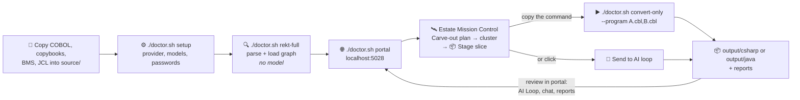
```mermaid
flowchart LR
    A["📁 Copy COBOL, copybooks,<br/>BMS, JCL into source/"] --> B["⚙️ ./doctor.sh setup<br/>provider, models, passwords"]
    B --> C["🔍 ./doctor.sh rekt-full<br/>parse + load graph<br/><i>no model</i>"]
    C --> D["🌐 ./doctor.sh portal<br/>localhost:5028"]
    D --> E["🛰 Estate Mission Control<br/>Carve-out plan → cluster<br/>→ 📦 Stage slice"]
    E -->|copy the command| F["▶️ ./doctor.sh convert-only<br/>--program A.cbl,B.cbl"]
    E -->|or click| G["🔁 Send to AI loop"]
    F --> H["📦 output/csharp or output/java<br/>+ reports"]
    G --> H
    H -->|review in portal:<br/>AI Loop, chat, reports| D
```

| Step | Calls a model? | Needs Docker? | Writes to |
|---|---|---|---|
| `setup` | No (only lists models) | Pulls the Neo4j image | `Config/ai-config.local.env` |
| `rekt-full` | No | Yes (REKT parser + REKT Neo4j) | `source/.preprocessed/`, `output/rekt/`, REKT Neo4j |
| `portal` | Only for chat | No for Estate Mission Control; Neo4j for the graph tabs | Nothing (reads) |
| `estate` / Estate Mission Control | No | No (built from `source/` alone) | `output/estate/` |
| `convert-only` / `run` | Yes | Migration Neo4j (started for you) for the dependency graph | `output/<language>/<run>/`, `Data/migration.db`, migration Neo4j |
| `reverse-eng` | Yes | Migration Neo4j | `output/reverse-engineering-details.md`, `Data/migration.db` |
| `jcl` | No | No | `output/<language>/<run>/` |

### What runs where

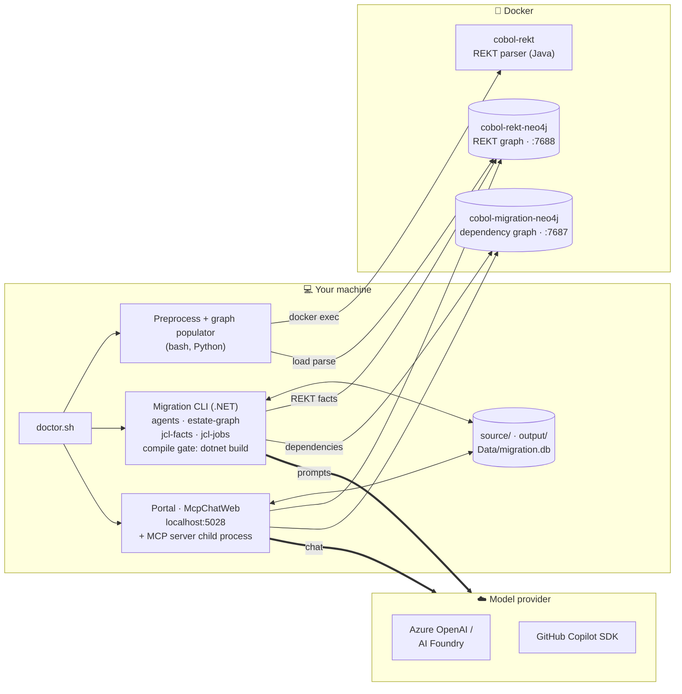
```mermaid
flowchart LR
    subgraph HOST["💻 Your machine"]
        direction TB
        DOCTOR["doctor.sh"]
        CLI["Migration CLI (.NET)<br/>agents · estate-graph<br/>jcl-facts · jcl-jobs<br/>compile gate: dotnet build"]
        WEB["Portal · McpChatWeb<br/>localhost:5028<br/>+ MCP server child process"]
        PRE["Preprocess + graph populator<br/>(bash, Python)"]
        FILES[("source/ · output/<br/>Data/migration.db")]
        DOCTOR --> PRE
        DOCTOR --> CLI
        DOCTOR --> WEB
    end

    subgraph DOCKER["🐳 Docker"]
        direction TB
        REKT["cobol-rekt<br/>REKT parser (Java)"]
        RNEO[("cobol-rekt-neo4j<br/>REKT graph · :7688")]
        MNEO[("cobol-migration-neo4j<br/>dependency graph · :7687")]
    end

    subgraph CLOUD["☁️ Model provider"]
        direction TB
        AOAI["Azure OpenAI /<br/>AI Foundry"]
        GHCP["GitHub Copilot SDK"]
    end

    PRE -->|docker exec| REKT
    PRE -->|load parse| RNEO
    CLI <--> FILES
    CLI -->|REKT facts| RNEO
    CLI -->|dependencies| MNEO
    WEB <--> FILES
    WEB --> RNEO
    WEB --> MNEO
    CLI ==>|prompts| CLOUD
    WEB ==>|chat| CLOUD
```

- **Everything but the model runs locally.** Source code leaves the machine only inside the prompts sent to the provider you configured.
- **Two Neo4j instances.** The REKT graph (parse trees and control flow, `:7688`) and the migration graph (dependencies found during a run, `:7687`). Ports and container names can be changed in `Config/ai-config.local.env`.
- **The portal runs on the host** (`dotnet run --project McpChatWeb`). `docker-compose.yml` also has a `portal` service if you want it in a container.
- **Estate Mission Control and `jcl`** need neither a model nor Docker.

### Inside a conversion

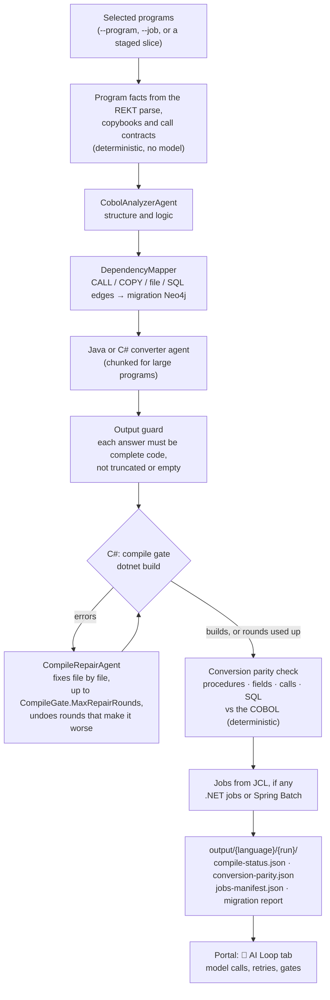
```mermaid
flowchart TB
    S["Selected programs<br/>(--program, --job, or a staged slice)"] --> FACTS["Program facts from the REKT parse,<br/>copybooks and call contracts<br/>(deterministic, no model)"]
    FACTS --> ANALYZE["CobolAnalyzerAgent<br/>structure and logic"]
    ANALYZE --> DEPS["DependencyMapper<br/>CALL / COPY / file / SQL edges → migration Neo4j"]
    DEPS --> CONV["Java or C# converter agent<br/>(chunked for large programs)"]
    CONV --> GUARD["Output guard<br/>each answer must be complete code,<br/>not truncated or empty"]
    GUARD --> GATE{"C#: compile gate<br/>dotnet build"}
    GATE -->|errors| REPAIR["CompileRepairAgent<br/>fixes file by file,<br/>up to CompileGate.MaxRepairRounds,<br/>undoes rounds that make it worse"]
    REPAIR --> GATE
    GATE -->|builds, or rounds used up| PARITY["Conversion parity check<br/>procedures · fields · calls · SQL<br/>vs the COBOL (deterministic)"]
    PARITY --> JOBS["Jobs from JCL, if any<br/>.NET jobs or Spring Batch"]
    JOBS --> OUT["output/{language}/{run}/<br/>compile-status.json · conversion-parity.json<br/>jobs-manifest.json · migration report"]
    OUT --> LOOP["Portal: 🔁 AI Loop tab<br/>model calls, retries, gates"]
```

Java output has no compile gate yet: build it with `mvn compile` in the output folder. The parity check reports and can stop the run (`ON_LOW_SCORE=stop`), but does not repair. See [Conversion parity](docs/conversion-parity-validation.md) and [Using the generated output](docs/using-generated-output.md).

### 🛰 Estate Mission Control at a glance

Shown here with the public IBM Bank-of-Z sample in `source/`.

**Estate overview:** every program, transaction, screen, table and copybook, grouped by business function.

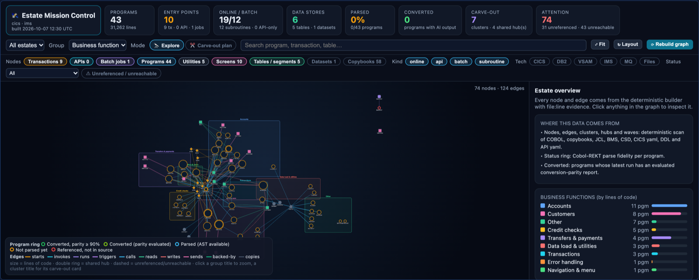

**Carve-out plan:** clusters ordered into waves, each with a risk tier, cohesion and carve score.

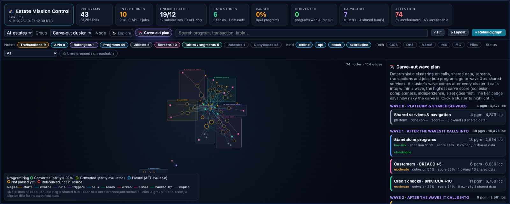

**Stage slice:** the programs to convert, what they also need, what is missing from `source/`, and the command to run.

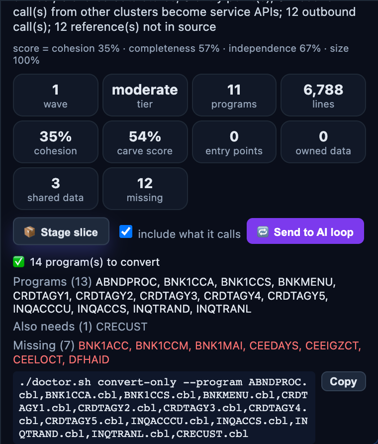

---

## 📋 Table of Contents
- [How it fits together](#-how-it-fits-together)
  - [What runs where](#what-runs-where)
  - [Inside a conversion](#inside-a-conversion)
- [Quick Start](#-quick-start)
- [Usage: doctor.sh](#-usage-doctorsh)
  - [Parse first: rekt-full](#parse-first-rekt-full)
  - [JCL](#jcl)
- [Portal](#-portal)
  - [Estate Mission Control](#estate-mission-control)
  - [AST Explorer](#ast-explorer)
  - [Convert Programs](#convert-programs)
- [Reverse Engineering Reports](#-reverse-engineering-reports)
- [Folder Structure](#-folder-structure)
- [Customizing Agent Behavior](#-customizing-agent-behavior)
- [File Splitting & Naming](#-file-splitting--naming)
- [Architecture](#-architecture)
- [Smart Chunking & Token Strategy](#-smart-chunking--token-strategy)
- [Build & Run](#-build--run)

---

## 🚀 Quick Start

### Prerequisites

| Requirement | Version | Notes |
|-------------|---------|-------|
| **.NET SDK** | 10.0+ | [Download](https://dotnet.microsoft.com/download) |
| **Docker Desktop** | Latest | Must be running for Neo4j |
| **AI Endpoint** | — | Azure endpoint + `az login`, or GitHub Copilot `copilot login`, or API Key |

#### Windows

`doctor.sh` runs in **Git Bash** (from [Git for Windows](https://git-scm.com/download/win)) or **WSL2**.

| | Git Bash | WSL2 |
|---|---|---|
| Install | Git for Windows, .NET 10 SDK for Windows, Docker Desktop, Python 3 from python.org or `winget install Python.Python.3.12` | .NET 10 SDK and Python 3 inside the distribution; Docker Desktop with WSL integration |
| Clone into | Any Windows folder | The Linux file system (`~/...`), not `/mnt/c/...`, which is slow and loses file permissions |
| Optional | `winget install jqlang.jq SQLite.SQLite` | `sudo apt install jq sqlite3` |

Notes for Git Bash:
- Scripts, patches and Dockerfiles are checked out with LF line endings whatever `core.autocrlf` says. If a clone made before this setting still fails with `$'\r': command not found`, refresh it once: `git rm --cached -r -q . && git reset --hard`.
- The `python` and `python3` commands that Windows ships are Microsoft Store shortcuts, not Python. `doctor.sh` skips them, so install a real Python, or turn the shortcuts off under *Settings → Apps → Advanced app settings → App execution aliases*.
- `doctor.sh` uses `netstat` and `taskkill` in place of `lsof`, and turns off Git Bash path conversion for commands run inside containers.
- The projects build without a native `.exe` launcher (`UseAppHost=false`), so endpoint security that blocks newly built executables does not stop `dotnet run`.

### Supported AI Providers

This project supports **three AI providers** with automatic model capability detection:

| Provider | ServiceType | Models | Auth | Interface |
|----------|------------|--------|------|-----------|
| **Azure OpenAI** | `AzureOpenAI` | `gpt-5.1-codex-mini`, `gpt-5.2-chat` | API Key or `az login` (Entra ID) | `ResponsesApiClient` (Codex) + `IChatClient` |
| **GitHub Copilot SDK** | `GitHubCopilot` or `GitHubCopilotSDK` | All Copilot models (Claude, GPT, Codex, Grok, ...) | `copilot login` or fine-grained token (`COPILOT_GITHUB_TOKEN`) | `CopilotChatClient` via stdio |
| **OpenAI** | `OpenAI` | GPT-4o, o3, etc. | OpenAI API key | `IChatClient` |

#### Copilot sign-in

The Copilot SDK runs its own bundled Copilot runtime, which signs in one of two ways. `./doctor.sh setup` (or the portal's setup dialog) asks which and writes it to `Config/ai-config.local.env`:

| `COPILOT_AUTH` | Uses | Notes |
|---|---|---|
| `login` | The account from `copilot login` | `GH_TOKEN` and `GITHUB_TOKEN` in your shell are ignored, so an unrelated token cannot take over. |
| `token` | `COPILOT_GITHUB_TOKEN` | A fine-grained token (`github_pat_`) on your personal account with the **Copilot Requests** account permission. Classic `ghp_` tokens are rejected. Create one at github.com/settings/personal-access-tokens/new. |
| unset | `COPILOT_GITHUB_TOKEN` if set, otherwise the Copilot CLI's own order (`GH_TOKEN`, `GITHUB_TOKEN`, `copilot login`) | Classic `ghp_` tokens in `GH_TOKEN`/`GITHUB_TOKEN` are skipped. |

Runs print the credential they use (`🔐 GitHub Copilot auth: ...`), and `dotnet run -- list-models` shows it before listing the models your account can use. `GITHUB_COPILOT_TOKEN`, written by older versions of setup, is still read.

**Model-Aware Reasoning** — The framework auto-detects model capabilities from the model ID and adapts its reasoning strategy:

| Model Family | Detection | Reasoning Strategy | Applied Via |
|-------------|-----------|-------------------|-------------|
| **Codex/o-series** | `codex`, `o1`, `o3` in model ID | `reasoning.effort` (low/medium/high) | Responses API or `AdditionalProperties` |
| **Claude** | `claude` in model ID | Extended thinking with `budget_tokens` | `AdditionalProperties["thinking"]` |
| **GPT** | `gpt-4`, `gpt-5` in model ID | Standard (temperature=0.1) | `ChatOptions.Temperature` |
| **Grok** | `grok` in model ID | Standard (temperature=0.1) | `ChatOptions.Temperature` |

> **All models get the same three-tier content-aware complexity scoring** — COBOL source is analyzed for SQL, CICS, REDEFINES, etc. to determine LOW/MEDIUM/HIGH complexity. The complexity tier drives both `MaxOutputTokens` sizing and the model-specific reasoning parameter.

> ⚠️ **Want to use different models?** Just change `AZURE_OPENAI_MODEL_ID` and `AZURE_OPENAI_SERVICE_TYPE`. The framework auto-detects capabilities — no code changes needed.

> [!IMPORTANT]
> **Azure OpenAI Quota Recommendation: 1M+ TPM**
> 
> For optimal performance, we recommend setting your Azure OpenAI model quota to **1,000,000 tokens per minute (TPM)** or higher.
> 
> | Quota | Experience |
> |-------|------------|
> | 300K TPM | Works, but slower with throttling pauses |
> | **1M TPM** | **Recommended** - smooth parallel processing |
> 
> **Higher quota = faster migration.** The tool processes multiple files and chunks in parallel, so more TPM means less waiting.
> 
> To increase quota: Azure Portal → Your OpenAI Resource → Model deployments → Edit → Tokens per Minute

#### Parallel Jobs Formula

To avoid throttling (429 errors), use this formula to calculate safe parallel job limits:

```
                        TPM × SafetyFactor
MaxParallelJobs = ─────────────────────────────────
                  TokensPerRequest × RequestsPerMinute
```

**Where:**
- **TPM** = Your Azure quota (tokens per minute)
- **SafetyFactor** = 0.7 (recommended, see below)
- **TokensPerRequest** = Input + Output tokens (~30,000 for code conversion)
- **RequestsPerMinute** = 60 / SecondsPerRequest

**Understanding SafetyFactor (0.7 = 70%):**

The SafetyFactor reserves headroom below your quota limit to handle:

| Why You Need Headroom | What Happens Without It |
|----------------------|------------------------|
| **Token estimation variance** | AI responses vary in length - a 25K estimate might actually be 35K |
| **Burst protection** | Multiple requests completing simultaneously can spike token usage |
| **Retry overhead** | Failed requests that retry consume additional tokens |
| **Shared quota** | Other applications using the same Azure deployment |

| SafetyFactor | Use Case |
|--------------|----------|
| 0.5 (50%) | Shared deployment, conservative, many retries expected |
| **0.7 (70%)** | **Recommended** - good balance of speed and safety |
| 0.85 (85%) | Dedicated deployment, stable workloads |
| 0.95+ | ⚠️ Risky - expect frequent 429 throttling errors |

**Example Calculation:**

| Your Quota | Tokens/Request | Request Time | Safe Parallel Jobs |
|------------|----------------|--------------|-------------------|
| 300K TPM | 30K | 30 sec | `(300,000 × 0.7) / (30,000 × 2)` = **3-4 jobs** |
| 1M TPM | 30K | 30 sec | `(1,000,000 × 0.7) / (30,000 × 2)` = **11-12 jobs** |
| 2M TPM | 30K | 30 sec | `(2,000,000 × 0.7) / (30,000 × 2)` = **23 jobs** |

**Configure in `appsettings.json`:**
```json
{
  "ChunkingSettings": {
    "MaxParallelChunks": 6,        // Parallel code conversion jobs
    "MaxParallelAnalysis": 6,      // Parallel analysis jobs
    "RateLimitSafetyFactor": 0.7,  // 70% of quota
    "TokenBudgetPerMinute": 300000 // Match your Azure TPM quota
  }
}
```

> 💡 **Rule of thumb:** With 1M TPM, use `MaxParallelChunks: 6` for safe operation. Scale proportionally with your quota.

### Framework: Microsoft Agent Framework

This project uses **Microsoft Agent Framework** (`Microsoft.Agents.AI.*`), **not** Semantic Kernel.

```xml
<!-- From CobolToQuarkusMigration.csproj -->
<PackageReference Include="Microsoft.Agents.AI.AzureAI" Version="1.0.0-preview.*" />
<PackageReference Include="Microsoft.Agents.AI.OpenAI" Version="1.0.0-preview.*" />
<PackageReference Include="Microsoft.Extensions.AI" Version="10.0.1" />
```

**Why Agent Framework over Semantic Kernel?**
- Simpler `IChatClient` abstraction
- Native support for both Responses API and Chat Completions API which is key for being future proof for LLM Api's
- Better streaming and async patterns
- Lighter dependency footprint

### Setup (2 minutes)

```bash
git clone https://github.com/Azure-Samples/Legacy-Modernization-Agents.git
cd Legacy-Modernization-Agents

./doctor.sh setup        # 1. configure the AI provider and credentials
cp -r /path/to/your/cobol/* source/   # 2. COBOL, copybooks and JCL
az login                 #    or: copilot login (GitHub Copilot SDK)
./doctor.sh rekt-full    # 3. parse COBOL + JCL (no model) - run before converting
./doctor.sh run          # 4. migrate, then open the portal
```

<details>
<summary>Manual setup without the setup wizard</summary>

```bash
# 1. Configure Azure OpenAI
cp Config/ai-config.env.example Config/ai-config.local.env
# Edit: _MAIN_ENDPOINT (required), _CODE_MODEL / _CHAT_MODEL (optional)
# Auth: use 'az login' (recommended) OR set _MAIN_API_KEY
# See docs/az-login-auth-guide.md for Entra ID setup details

# 3. Start Neo4j (the password is configured in ai-config.local.env)
export NEO4J_PASSWORD="$(sed -n 's/^NEO4J_PASSWORD=//p' Config/ai-config.local.env | tr -d '"')"
docker-compose up -d neo4j

# 4. Build
dotnet build

# 5. Run the migration
./doctor.sh run
```

</details>

---

## 🎯 Usage: doctor.sh

**Always use `./doctor.sh run` to run migrations, not `dotnet run` directly.**

### Main Commands

```bash
./doctor.sh run           # Full migration: analyze → convert → launch portal
./doctor.sh portal        # Launch web portal only (http://localhost:5028)
./doctor.sh reverse-eng   # Extract business logic, persist to DB, launch portal
./doctor.sh convert-only  # Conversion only; prompts to reuse persisted RE context
./doctor.sh jcl           # Jobs from the JCL alone, no model: what each job still needs
./doctor.sh estate        # Slices and migration waves from the source alone, no model
```

#### Business Logic Persistence and --reuse-re

After every `reverse-eng` or full `run`, extracted business logic is persisted to the SQLite database. This enables three distinct conversion modes:

| Mode | Command | RE context in prompts? |
|------|---------|------------------------|
| Full migration | `./doctor.sh run` | ✅ Yes — RE runs first, results injected automatically |
| Pure conversion | `./doctor.sh convert-only` → answer **N** | ❌ No context |
| Conversion + cached RE | `./doctor.sh convert-only` → answer **Y** | ✅ Yes — loads persisted results from last RE run |

The `--reuse-re` flag can also be passed directly: `dotnet run -- --source ./source --skip-reverse-engineering --reuse-re`.

Persisted RE results are visible in the portal — each run card has a **🔬 RE Results** button that shows per-file story/feature/rule counts and lets you delete results you are unsatisfied with.

### Parse first: rekt-full

Run `./doctor.sh rekt-full` once after you put the sources in `source/`, and again whenever they change, **before** a full or partial conversion. It calls no model and needs no sign-in.

It parses every program with REKT, records how much of each program the parser recovered (its *parse fidelity*), lists the copybooks that are referenced but not in the source (`output/rekt/missing-copybooks.txt`), parses the JCL, and loads the result into the REKT Neo4j graph. The conversion, the Estate Mission Control, the AST Explorer and Convert Programs all read from it. Without it, every program shows as *not parsed*, the AST Explorer is empty, and the conversion works from the raw source alone.

```bash
./doctor.sh rekt-full                 # parse + load into Neo4j (rekt-parse and rekt-ingest run the two halves)
./doctor.sh rekt-status               # containers, graph counts and exports
cat output/rekt/missing-copybooks.txt # add these to source/ and run rekt-full again
```

Read the summary at the end before converting:

```
  Parsed: 117 succeeded (0 from cache), 0 failed
  ⚠️  5 program(s) parsed with reduced fidelity (deps-only / raw-AST fallback).
  ⚠️  38 missing copybook(s) — see output/rekt/missing-copybooks.txt
```

A missing copybook makes the programs that COPY it *Partial*: the parser substitutes a generated stub, so the fields behind it have no known layout and the conversion has to infer them. Add the real copybooks and parse again for the best result. Details of each program are in `output/rekt/**/*.parse.log`.

CICS screen maps are the exception: if `source/` holds the BMS mapsets (`*.bms`), the parse generates each symbolic map copybook (`<map>I` / `<map>O`) from them, as the z/OS BMS assembly step would, so programs that `COPY` a mapset keep full fidelity. The copybook takes the `.bms` file name, and a real copybook of that name always wins. Set `REKT_NO_BMS_MAPS=true` to turn this off.

Then convert, either everything or a selection:

```bash
# Full conversion
./doctor.sh run                                            # reverse engineering + conversion + portal
./doctor.sh convert-only --language Java                   # conversion only

# Partial conversion
./doctor.sh convert-only --language Java --program ORDMAIN.cbl --dry-run   # preview, no model call
./doctor.sh convert-only --language Java --program ORDMAIN.cbl --program ORDDATE.cbl
./doctor.sh convert-only --language CSharp --program orders/cbl/ORDMAIN.cbl --include-callees
./doctor.sh run --job NITEJ001 --language CSharp           # a JCL job and the programs it runs
```

`--program` takes the program name, or its path relative to `source/` when two programs share a name. It can be repeated or comma-separated. `--include-callees` also converts every program the selection CALLs. Copybooks are always carried in by the programs that COPY them. The [Convert Programs](#convert-programs) tab and the [Estate Mission Control](#estate-mission-control) build these commands for you.

### JCL

JCL does not go through REKT (REKT parses COBOL only). It is read by a built-in deterministic parser, and the jobs are generated from it without a model. Put the JCL, with its catalogued procedures and `INCLUDE` members, in `source/` beside the COBOL.

| Command | What happens to the JCL |
|---|---|
| `./doctor.sh jcl` | Parses the JCL and generates one job per JCL job into a new run folder, without converting anything, and compiles them (C# with dotnet, Java with Maven when installed). Lists, per job, the programs not yet converted and the steps that cannot run, usually because a procedure is missing from the source. Takes seconds and calls no model. |
| `./doctor.sh run --job NAME` | Converts the programs that job runs, and what they CALL when the portal is up, then generates the jobs. Each of those programs is converted with the batch-program contract, so the job runner can call it. A program the job runs that is not in the source is listed, not converted. |
| `./doctor.sh run` / `convert-only` | The same, for every program. Jobs are generated for every JCL job. |
| `./doctor.sh rekt` / `rekt-full` | Also writes a facts file per job and the dataset lineage between jobs to `output/rekt/` (`*.job.json`, `jcl-lineage.json`). The portal's Service Chain uses them. |

To convert a batch application so that it runs, convert the programs together with their jobs (`run --job`, or `run` for all of them). Converting the JCL alone gives jobs whose program steps abend with `S806` until the programs exist. `--job` takes a job name or a member name and can be repeated or comma-separated; it also works with `convert-only` and `--dry-run`:

```bash
./doctor.sh jcl --language CSharp                          # what the jobs need
./doctor.sh run --job NITEJ001 --language CSharp --dry-run  # which programs that converts
./doctor.sh run --job NITEJ001 --language CSharp            # convert them, with the job
```

Turn job generation off with `JCL_JOBS_ENABLED=false`. If the JCL lives outside `source/`, point to it with `JCL_SOURCE_FOLDER`. To run the parser or the generator without `doctor.sh`:

```bash
dotnet run -- jcl-facts source --output-dir output/rekt
dotnet run -- jcl-jobs source --language CSharp   # or Java; a new run folder under output/<language>/
dotnet run -- jcl-programs source --jobs NITEJ001 # the programs a job runs
```

See [JCL job facts](docs/jcl-job-facts.md) and [Jobs generated from JCL](docs/jcl-jobs.md).

### doctor.sh run - Interactive Options

When you run `./doctor.sh run`, you'll be prompted:

```
╔══════════════════════════════════════════════════════════════╗
║   COBOL Migration - Target Language Selection                ║
╚══════════════════════════════════════════════════════════════╝

Select target language:
  [1] Java Quarkus
  [2] C# .NET

Enter choice (1-2): 
```

After migration completes:
```
Migration complete! Generate report? (Y/n): Y
Launch web portal? (Y/n): Y
```

### Speed Profile

After selecting your action and target language, `doctor.sh` prompts for a **speed profile** that controls how much reasoning effort the AI model spends per file. This applies to migrations, reverse engineering, and conversion-only runs.

```
Speed Profile
======================================
  1) TURBO
  2) FAST
  3) BALANCED (default)
  4) THOROUGH

Enter choice (1-4) [default: 3]:
```

| Profile | Reasoning Effort | Max Output Tokens | Best For |
|---------|-----------------|-------------------|----------|
| **TURBO** | Low on ALL files, no exceptions | 65,536 | Testing, smoke runs. Speed from low reasoning effort, not token starvation. |
| **FAST** | Low on most, medium on complex | 32,768 | Quick iterations, proof-of-concept runs. Good balance of speed and quality. |
| **BALANCED** | Content-aware (low/medium/high based on file complexity) | 100,000 | Production migrations. Simple files get low effort, complex files get high effort. |
| **THOROUGH** | Medium-to-high on all files | 100,000 | Critical codebases where accuracy matters more than speed. Highest token cost. |

The speed profile works by setting environment variables that override the three-tier content-aware reasoning system configured in `appsettings.json`. No C# code changes are needed — the existing `Program.cs` environment variable override mechanism handles everything at startup.

### Other Commands

```bash
./doctor.sh               # Health check - verify configuration
./doctor.sh test          # Run system tests
./doctor.sh setup         # Interactive setup wizard
./doctor.sh chunking-health  # Check smart chunking configuration
```

---

## 🖥 Portal

`./doctor.sh portal` (or the end of `./doctor.sh run`) opens the portal at http://localhost:5028. The tabs across the top of the graph panel are:

| Tab | What it shows |
|---|---|
| 🕸 Dependency Graph | Programs and copybooks with their CALL, COPY and file dependencies |
| 🏗️ Architecture | The REKT graph as layers, components, a technology map, dependencies, modules and reachability |
| 🛰 Estate Mission Control | The whole estate as one graph, and the carve-out plan |
| 🔁 AI Loop | Model calls, retries, fallbacks and quality gates per run |
| 🧭 Modernization Intelligence | Measured facts per program from the parse, each with its source |
| 🌳 AST Explorer | What the parser recovered for one program, next to its source |
| 🎯 Convert Programs | Choose programs and get the conversion command |
| 🔎 Program Explorer | One program: what it is, what it touches, what the parser knows about it, and whether that is enough to convert it |
| 🧩 Missing Copybooks | Copybooks referenced but not in the source, ordered by how many programs each affects |

The tabs that read parse results need `./doctor.sh rekt-full` first.

### Estate Mission Control

Open **🛰 Estate Mission Control**. The panel expands to full width. Screenshots: [Estate Mission Control at a glance](#-estate-mission-control-at-a-glance). Everything on it is built from the source without a model, and every node and edge records the file and line it came from.

- **KPIs** across the top: programs and lines, entry points (transactions, APIs, batch jobs), online and batch programs, data stores, how many programs REKT parsed, how many have a converted output, carve-out clusters and shared hubs, and programs that need attention (unreferenced, unreachable, or referenced but not in the source).
- **Explore** mode draws the estate as one graph. Use **Group** to group by business function, carve-out cluster or estate, the **Nodes**, **Kind**, **Tech** and **Status** chips to filter, and the search box to find a program, transaction or table. The ring around a program shows its status: converted with parity of 90% or more, converted, parsed, not parsed yet, or referenced but not in the source. Select a node for its metrics, description, conversion parity and every relationship with its evidence. The right panel shows the inputs scanned, the programs per business function and the list that needs attention.
- **Carve-out plan** mode shows the migration waves. Wave 0 holds the hub programs as shared services; each later wave can be converted once the waves it calls into are done. Each cluster is tiered **low-risk**, **moderate** or **core** by its carve score.
- **Cluster card**: select a cluster card, or a cluster title in the graph, to see why the cluster was formed, its members and entry points, the data it **owns** (moves with it) and the data it **shares** with other clusters (needs a data-access API or sync), the inbound calls that become service APIs, its outbound dependencies and what is missing from the source.
- **Stage slice** lists the programs to convert, what they call outside the cluster, what is missing and the equivalent `./doctor.sh convert-only --program …` command. **Send to AI loop** starts that conversion in Java or C#, using the provider and model selected in Mission Control. Follow it on the **🔁 AI Loop** tab.
- **Rebuild graph** rescans the source. Use it after adding files to `source/`.

The same plan is available from the command line:

```bash
./doctor.sh estate        # waves, clusters and hubs
./doctor.sh estate C01    # the slice of cluster C01, with its convert-only command
```

See [Estate Mission Control and the AI Loop](docs/estate-mission-control.md) for how clusters, carve scores and waves are computed, the endpoints and the configuration.

### AST Explorer

Open **🌳 AST Explorer** and choose a program from the list at the top. JCL jobs appear in the same list as `JCL · <job>`. The list is filled from the REKT graph, so it is empty until `./doctor.sh rekt-full` has run.

- The bar under the list counts the program's sections, paragraphs, statements and PERFORM calls.
- The left side draws the parse tree: sections, paragraphs, sentences and statements (SQL, CICS, MOVE, PERFORM, IF), with PERFORM targets linked. Hover a node for its type, name and line range. **Raw AST** shows the tree as the parser produced it.
- Select a section or paragraph to show its source on the right, with the line highlighted. **Full File** shows the whole program.

Use it to check what the conversion will work from: a program whose parse fidelity is *Deps only* has no paragraphs or statements here.

### Convert Programs

Open **🎯 Convert Programs** to choose what to convert.

1. **The list** has one row per COBOL program: a compilable unit with a `PROGRAM-ID` and a `PROCEDURE DIVISION`. Copybooks are not listed; they are record layouts, and each is carried in by the programs that COPY it. Filter by name or path in the top right.
2. **Parse fidelity** on each row comes from `rekt-full`. Hover a label for its meaning:
   - **Full**: every copybook was found and the program parsed completely; the conversion works from the real record layouts.
   - **Partial**: at least one copybook is missing (shown as *N missing copybooks*), so its fields have no known layout and the conversion infers them.
   - **Deps only**: only the dependency list was recovered, so there is much less to convert from.
3. **Details** shows what converting that program would pull in: its call closure (the programs reachable by CALL), its copybooks and its missing copybooks.
4. Tick the programs you want, choose **Java** or **C#**, and tick **Add call closure** to add every program the selection CALLs (the same as `--include-callees`), so a converted program never calls one that was not converted.
5. **Convert selection** shows the command for the selection. The button does not start a run; copy the command into a terminal:

```bash
./doctor.sh convert-only \
  --language Java \
  --program orders/cbl/ORDMAIN.cbl \
  --program orders/cbl/ORDDATE.cbl
```

Add `--dry-run` to see what would be converted without calling a model. Running it through `doctor.sh` rather than `dotnet run` adds the concurrent-run guard and the retry and failure handling. To start a conversion from the portal instead, use **Send to AI loop** on a cluster in Estate Mission Control.

---

## 📝 Reverse Engineering Reports

**Reverse Engineering (RE)** extracts business knowledge from COBOL code **before** any conversion happens. This is the "understand first" phase.

### What It Does

The `BusinessLogicExtractorAgent` analyzes COBOL source code and produces human-readable documentation that captures:

| Output | Description | Example |
|--------|-------------|---------|
| **Business Purpose** | What problem does this program solve? | "Processes monthly customer billing statements" |
| **Use Cases** | CRUD operations identified | CREATE customer, UPDATE balance, VALIDATE account |
| **Business Rules** | Validation logic as requirements | "Account number must be 10 digits" |
| **Data Dictionary** | Field meanings in business terms | `WS-CUST-BAL` → "Customer Current Balance" |
| **Dependencies** | What other programs/copybooks it needs | CALLS: PAYMENT.cbl, COPIES: COMMON.cpy |

### Why This Helps

| Benefit | How |
|---------|-----|
| **Knowledge Preservation** | Documents tribal knowledge before COBOL experts retire |
| **Migration Planning** | Understand complexity before estimating conversion effort |
| **Validation** | Business team can verify extracted rules match expectations |
| **Onboarding** | New developers understand legacy systems without reading COBOL |
| **Compliance** | Audit trail of business rules for regulatory requirements |

### Running Reverse Engineering Only

```bash
./doctor.sh reverse-eng    # Extract business logic, persist to DB, launch portal
```

This generates `output/reverse-engineering-details.md` and persists the extracted business logic to the SQLite database. Results can be reused in a later `convert-only` run (see [Business Logic Persistence and --reuse-re](#business-logic-persistence-and---reuse-re)).

### Sample Output

```markdown
# Reverse Engineering Report: CUSTOMER.cbl

## Business Purpose
Manages customer account lifecycle including creation, 
balance updates, and account closure with audit trail.

## Use Cases

### Use Case 1: Create Customer Account
**Trigger:** New customer registration request
**Key Steps:**
1. Validate customer data (name, address, tax ID)
2. Generate unique account number
3. Initialize balance to zero
4. Write audit record

### Use Case 2: Update Balance
**Trigger:** Transaction posted to account
**Business Rules:**
- Balance cannot go negative without overdraft flag
- Transactions > $10,000 require manager approval code

## Business Rules
| Rule ID | Description | Field |
|---------|-------------|-------|
| BR-001 | Account number must be exactly 10 digits | WS-ACCT-NUM |
| BR-002 | Customer name is required (non-blank) | WS-CUST-NAME |
```

### Glossary Integration

Add business terms to `Data/glossary.json` for better translations:

```json
{
  "terms": [
    { "term": "WS-CUST-BAL", "translation": "Customer Current Balance" },
    { "term": "CALC-INT-RT", "translation": "Calculate Interest Rate" },
    { "term": "PRCS-PMT", "translation": "Process Payment" }
  ]
}
```

The extractor uses these translations to produce more readable reports.

---

## 📁 Folder Structure

```
Legacy-Modernization-Agents/
├── source/                    # ⬅️ DROP YOUR COBOL AND JCL FILES HERE
│   ├── CUSTOMER.cbl
│   ├── PAYMENT.cbl
│   ├── COMMON.cpy
│   ├── NIGHTLY.jcl            # JCL jobs
│   └── PAYPROC.proc           # catalogued procedures / INCLUDE members
│
├── output/                    # ⬅️ GENERATED CODE APPEARS HERE
│   ├── java/                  # Java Quarkus output (+ <root>/jobs/ from JCL)
│   │   └── com/example/generated/
│   ├── csharp/                # C# .NET output
│   │   ├── Generated/
│   │   └── Jobs/              # jobs generated from JCL
│   └── rekt/                  # REKT and JCL analysis facts
│
├── Agents/                    # AI agent implementations
├── Config/                    # Configuration files
├── Data/                      # SQLite database (migration.db)
└── Logs/                      # Execution logs
```

**Workflow:**
1. Drop COBOL files (`.cbl`, `.cpy`) and any JCL (`.jcl`, `.proc`, `.prc`, `.inc`) into `source/`
2. Run `./doctor.sh rekt-full` to parse the COBOL and JCL before converting
3. Run `./doctor.sh run`
4. Choose target language (Java or C#)
5. Collect generated code from `output/java/` or `output/csharp/`; `jobs-manifest.json` there lists the jobs generated from JCL and the programs they still need

---

## 🛠️ Customizing Agent Behavior

Each agent has a **system prompt** loaded from an external Markdown template. To customize output (e.g., DDD patterns, specific frameworks), edit the corresponding file in `Agents/Prompts/`:

### Prompt Template System

Prompt files use two conventions:

- **`## SECTION: Name`** delimiters split the file into `System` and `User` message parts. Sections not prefixed with `## SECTION:` are treated as the system prompt.
- **`{{CodebaseProfile}}`** is an auto-injected variable replaced at runtime with a summary of the COBOL codebase being processed (detected features, file stats, SQL usage, etc.). Do not remove this placeholder.

### Agent Prompt Locations

| Agent | Prompt File | What It Does |
|-------|-------------|--------------|
| **CobolAnalyzerAgent** | `Agents/Prompts/CobolAnalyzer.md` | Extracts structure, variables, paragraphs, SQL |
| **BusinessLogicExtractorAgent** | `Agents/Prompts/BusinessLogicExtractor.md` | Extracts user stories, features, business rules |
| **JavaConverterAgent** | `Agents/Prompts/JavaConverter.md` | Converts to Java Quarkus |
| **CSharpConverterAgent** | `Agents/Prompts/CSharpConverter.md` | Converts to C# .NET |
| **DependencyMapperAgent** | `Agents/Prompts/DependencyMapper.md` | Maps CALL/COPY/PERFORM relationships |
| **ChunkAwareJavaConverter** | `Agents/Prompts/ChunkAwareJavaConverter.md` | Large file chunked conversion (Java) |
| **ChunkAwareCSharpConverter** | `Agents/Prompts/ChunkAwareCSharpConverter.md` | Large file chunked conversion (C#) |

### Example: Adding DDD Patterns

To make the Java converter generate Domain-Driven Design code, edit `Agents/Prompts/JavaConverter.md`:

```markdown
## SECTION: System

You are an expert in converting COBOL programs to Java with Quarkus framework.

{{CodebaseProfile}}

DOMAIN-DRIVEN DESIGN REQUIREMENTS:
- Identify bounded contexts from COBOL program sections
- Create Aggregate Roots for main business entities
- Use Value Objects for immutable data (PIC X fields)
- Implement Repository pattern for data access
- Create Domain Events for state changes
- Separate Application Services from Domain Services

OUTPUT STRUCTURE:
- domain/        → Entities, Value Objects, Aggregates
- application/   → Application Services, DTOs
- infrastructure/→ Repositories, External Services
- ports/         → Interfaces (Ports & Adapters)

...existing prompt content...
```

Similarly for C#, edit `Agents/Prompts/CSharpConverter.md`.

---

## 📐 File Splitting & Naming

### Configuration

File splitting is controlled in `Config/appsettings.json`:

```json
{
  "AssemblySettings": {
    "SplitStrategy": "ClassPerFile",
    "Java": {
      "PackagePrefix": "com.example.generated",
      "ServiceSuffix": "Service"
    },
    "CSharp": {
      "NamespacePrefix": "Generated",
      "ServiceSuffix": "Service"
    }
  }
}
```

### Split Strategies

| Strategy | Output |
|----------|--------|
| `SingleFile` | One large file with all classes |
| `ClassPerFile` | **Default** - One file per class (recommended) |
| `FilePerChunk` | One file per processing chunk |
| `LayeredArchitecture` | Organized into Services/, Repositories/, Models/ |

### Implementation Location

The split logic is in `Models/AssemblySettings.cs`:

```csharp
public enum FileSplitStrategy
{
    SingleFile,           // All code in one file
    ClassPerFile,         // One file per class (DEFAULT)
    FilePerChunk,         // Preserves chunk boundaries
    LayeredArchitecture   // Service/Repository/Model folders
}
```

### Naming Conversion

Naming strategies are configured in `ConversionSettings`:

```json
{
  "ConversionSettings": {
    "NamingStrategy": "Hybrid",
    "PreserveLegacyNamesAsComments": true
  }
}
```

| Strategy | Input | Output |
|----------|-------|--------|
| `Hybrid` | `CALCULATE-TOTAL` | Business-meaningful name |
| `PascalCase` | `CALCULATE-TOTAL` | `CalculateTotal` |
| `camelCase` | `CALCULATE-TOTAL` | `calculateTotal` |
| `Preserve` | `CALCULATE-TOTAL` | `CALCULATE_TOTAL` |

---

## 🏗️ Architecture

> For the current overview of what runs where and the conversion loop, see [How it fits together](#-how-it-fits-together). The diagrams below go deeper into storage, agents and chunking.

### Hybrid Database Architecture

This project uses a **dual-database approach** for optimal performance, enhanced with Regex-based deep analysis:

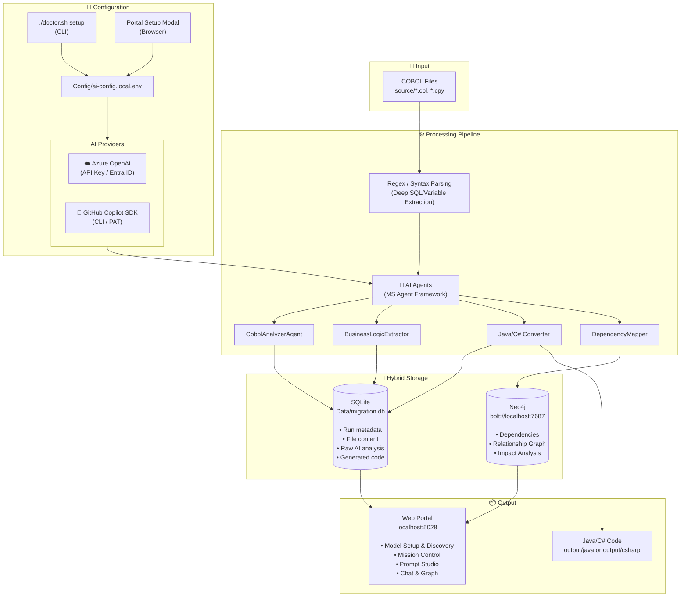
```mermaid
flowchart TB
    subgraph INPUT["📁 Input"]
        COBOL["COBOL Files<br/>source/*.cbl, *.cpy"]
    end
    
    subgraph CONFIG["🔧 Configuration"]
        SETUP_CLI["./doctor.sh setup<br/>(CLI)"]
        SETUP_PORTAL["Portal Setup Modal<br/>(Browser)"]
        SETUP_CLI --> CONFIG_FILE["Config/ai-config.local.env"]
        SETUP_PORTAL --> CONFIG_FILE
        CONFIG_FILE --> PROVIDERS
        subgraph PROVIDERS["AI Providers"]
            AZURE["☁️ Azure OpenAI<br/>(API Key / Entra ID)"]
            COPILOT["🤖 GitHub Copilot SDK<br/>(CLI / PAT)"]
        end
    end

    subgraph PROCESS["⚙️ Processing Pipeline"]
        REGEX["Regex / Syntax Parsing<br/>(Deep SQL/Variable Extraction)"]
        AGENTS["🤖 AI Agents<br/>(MS Agent Framework)"]
        ANALYZER["CobolAnalyzerAgent"]
        EXTRACTOR["BusinessLogicExtractor"]
        CONVERTER["Java/C# Converter"]
        MAPPER["DependencyMapper"]
    end
    
    subgraph STORAGE["💾 Hybrid Storage"]
        SQLITE[("SQLite<br/>Data/migration.db<br/><br/>• Run metadata<br/>• File content<br/>• Raw AI analysis<br/>• Generated code")]
        NEO4J[("Neo4j<br/>bolt://localhost:7687<br/><br/>• Dependencies<br/>• Relationship Graph<br/>• Impact Analysis")]
    end
    
    subgraph OUTPUT["📦 Output"]
        CODE["Java/C# Code<br/>output/java or output/csharp"]
        PORTAL["Web Portal<br/>localhost:5028<br/><br/>• Model Setup &amp; Discovery<br/>• Mission Control<br/>• Prompt Studio<br/>• Chat &amp; Graph"]
    end
    
    COBOL --> REGEX
    REGEX --> AGENTS
    PROVIDERS --> AGENTS
    
    AGENTS --> ANALYZER
    AGENTS --> EXTRACTOR
    AGENTS --> CONVERTER
    AGENTS --> MAPPER
    
    ANALYZER --> SQLITE
    EXTRACTOR --> SQLITE
    CONVERTER --> SQLITE
    CONVERTER --> CODE
    MAPPER --> NEO4J
    
    SQLITE --> PORTAL
    NEO4J --> PORTAL
```

#### Why Two Databases?

| Aspect | SQLite | Neo4j |
|--------|--------|-------|
| **Purpose** | Document storage | Relationship mapping |
| **Strength** | Fast queries, simple setup | Graph traversal, visualization |
| **Use Case** | "What's in this file?" | "What depends on this file?" |
| **Query Style** | SQL SELECT | Cypher graph queries |

**Together:** Fast metadata access + Powerful dependency insights 🚀

#### Why Dependency Graphs Matter

The Neo4j dependency graph enables:
- **Impact Analysis** - "If I change CUSTOMER.cbl, what else breaks?"
- **Circular Dependency Detection** - Find problematic CALL/COPY cycles
- **Critical File Identification** - Most-connected files = highest risk
- **Migration Planning** - Convert files in dependency order
- **Visual Understanding** - See relationships at a glance in the portal

---

### Agent Pipeline

The migration follows a strict **Deep Code Analysis** pipeline:

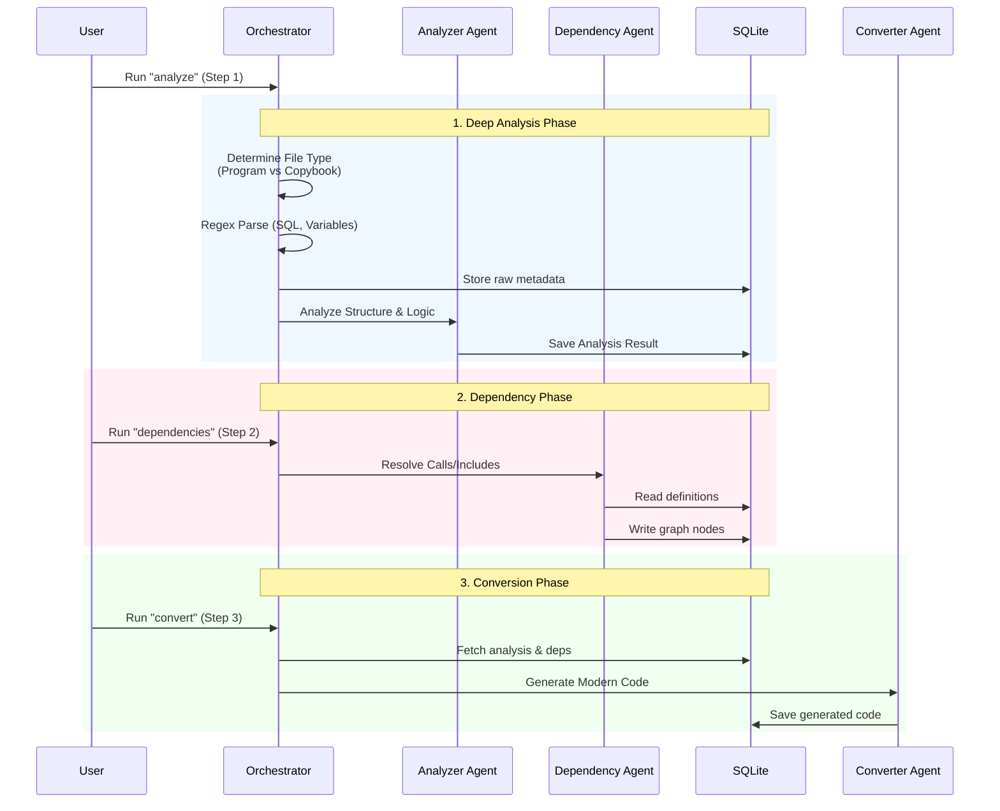
```mermaid
sequenceDiagram
    participant U as User
    participant O as Orchestrator
    participant AA as Analyzer Agent
    participant DA as Dependency Agent
    participant SQ as SQLite
    participant CA as Converter Agent

    U->>O: Run "analyze" (Step 1)
    
    rect rgb(240, 248, 255)
        Note over O, SQ: 1. Deep Analysis Phase
        O->>O: Determine File Type<br/>(Program vs Copybook)
        O->>O: Regex Parse (SQL, Variables)
        O->>SQ: Store raw metadata
        O->>AA: Analyze Structure & Logic
        AA->>SQ: Save Analysis Result
    end
    
    rect rgb(255, 240, 245)
        Note over O, SQ: 2. Dependency Phase
        U->>O: Run "dependencies" (Step 2)
        O->>DA: Resolve Calls/Includes
        DA->>SQ: Read definitions
        DA->>SQ: Write graph nodes
    end

    rect rgb(240, 255, 240)
        Note over O, SQ: 3. Conversion Phase
        U->>O: Run "convert" (Step 3)
        O->>SQ: Fetch analysis & deps
        O->>CA: Generate Modern Code
        CA->>SQ: Save generated code
    end
```

### Process Flow
**Portal Features:** 
- ✅ Dark theme with modern UI
- ✅ Three-panel layout (resources/chat/graph)
- ✅ AI-powered chat interface
- ✅ Suggestion chips for common queries
- ✅ Interactive dependency graph (zoom/pan/filter)
- ✅ Multi-run queries and comparisons
- ✅ File content analysis with line counts
- ✅ Comprehensive data retrieval guide
- ✅ Enhanced dependency tracking (CALL, COPY, PERFORM, EXEC, READ, WRITE, OPEN, CLOSE)
- ✅ Migration report generation per run
- ✅ Mermaid diagram rendering in documentation
- ✅ Collapsible filter sections for cleaner UI
- ✅ Edge type filtering with color-coded visualization
- ✅ Line number context for all dependencies
- ✅ Per-run **🔬 RE Results** button — view persisted business logic extracts and delete unsatisfactory results
- ✅ **AI Provider Setup Modal** — connect to Azure OpenAI or GitHub Copilot SDK from the browser, discover all available models/deployments, and save config
- ✅ **Mission Control** — start/stop/pause migrations, select provider and model, upload source files
- ✅ **Prompt Studio** — generate, AI-enhance, and score agent prompts (works with both Azure and Copilot SDK)
- ✅ **Estate Mission Control** — the whole estate as one graph, and a carve-out plan of clusters, owned and shared data, and waves, with source evidence; convert one slice at a time ([details](#estate-mission-control))
- ✅ **AST Explorer** — the parse tree of one program beside its source ([details](#ast-explorer))
- ✅ **Convert Programs** — choose programs by parse fidelity and call closure, and get the `convert-only` command ([details](#convert-programs))
- ✅ **AI Loop** — per-run model calls, retries, fallbacks, stages and quality gates ([details](docs/estate-mission-control.md#ai-loop))

### Smart Chunking & Token Strategy

Large COBOL files (>3,000 lines or >150K characters) are automatically split at semantic boundaries (DIVISION → SECTION → paragraph) and processed with content-aware reasoning effort. A three-tier complexity scoring system analyzes each file's COBOL patterns (EXEC SQL, CICS, REDEFINES, etc.) to dynamically allocate reasoning effort and output tokens — simple files get fast processing while complex files get thorough analysis.


```mermaid
flowchart TD
    subgraph INPUT["📥 FILE INTAKE"]
        A[COBOL Source File] --> B{File Size Check}
        B -->|"≤ 3,000 lines<br>≤ 150,000 chars"| C[Single-File Processing]
        B -->|"> 3,000 lines<br>> 150,000 chars"| D[Smart Chunking Required]
    end

    subgraph TOKEN_EST["🔢 TOKEN ESTIMATION"]
        C --> E[TokenHelper.EstimateCobolTokens]
        D --> E
        E -->|"COBOL: chars ÷ 3.0"| F[Estimated Input Tokens]
        E -->|"General: chars ÷ 3.5"| F
    end

    subgraph COMPLEXITY["🎯 THREE-TIER COMPLEXITY SCORING"]
        F --> G[Complexity Score Calculation]
        G -->|"Σ regex×weight + density bonuses"| H{Score Threshold}
        H -->|"< 5"| I["🟢 LOW<br>effort: low<br>multiplier: 1.5×"]
        H -->|"5 – 14"| J["🟡 MEDIUM<br>effort: medium<br>multiplier: 2.5×"]
        H -->|"≥ 15"| K["🔴 HIGH<br>effort: high<br>multiplier: 3.5×"]
    end

    subgraph OUTPUT_CALC["📐 OUTPUT TOKEN CALCULATION"]
        I --> L[estimatedOutput = input × multiplier]
        J --> L
        K --> L
        L --> M["clamp(estimated, minTokens, maxTokens)"]
        M -->|"Codex: 32,768 – 100,000"| N[Final maxOutputTokens]
        M -->|"Chat: 16,384 – 65,536"| N
    end

    subgraph CHUNKING["✂️ SMART CHUNKING"]
        D --> O[CobolAdapter.IdentifySemanticUnits]
        O --> P[Divisions / Sections / Paragraphs]
        P --> Q[SemanticUnitChunker.ChunkFileAsync]
        Q --> R{Chunking Decision}
        R -->|"≤ MaxLinesPerChunk"| S[Single Chunk]
        R -->|"Semantic units found"| T["Semantic Boundary Split<br>Priority: DIVISION > SECTION > Paragraph"]
        R -->|"No units / oversized units"| U["Line-Based Fallback<br>overlap: 300 lines"]
    end

    subgraph CONTEXT["📋 CONTEXT WINDOW MANAGEMENT"]
        T --> V[ChunkContextManager]
        U --> V
        S --> V
        V --> W["Full Detail Window<br>(last 3 chunks)"]
        V --> X["Compressed History<br>(older → 30% size)"]
        V --> Y["Cross-Chunk State<br>signatures + type mappings"]
        W --> Z[ChunkContext]
        X --> Z
        Y --> Z
    end

    subgraph RATE_LIMIT["⏱️ DUAL RATE LIMITING"]
        direction TB
        Z --> AA["System A: RateLimiter<br>(Token Bucket + Semaphore)"]
        Z --> AB["System B: RateLimitTracker<br>(Sliding Window TPM/RPM)"]
        
        AA --> AC{Capacity Check}
        AB --> AC
        AC -->|"Budget: 300K TPM × 0.7"| AD[Wait / Proceed]
        AC -->|"Concurrency: max 3 parallel"| AD
        AC -->|"Stagger: 2,000ms between workers"| AD
    end

    subgraph API_CALL["🤖 API CALL + ESCALATION"]
        AD --> AE{Provider Routing}
        AE -->|"Azure Codex<br>(ResponsesApiClient)"| AE1[Responses API Call]
        AE -->|"GitHub/Claude/Grok/GPT<br>(IChatClient)"| AE2["Chat Completions Call<br>+ ApplyModelSpecificOptions"]
        AE1 --> AF{Response Status}
        AE2 --> AF2{Truncation Check}
        AF2 -->|"FinishReason=Stop<br>No truncation signals"| AG[✅ Success]
        AF2 -->|"FinishReason=Length<br>or text signals<br>or unclosed code blocks"| AH2["OutputTruncationException<br>① Double maxTokens<br>② Promote effort<br>③ Thrash guard"]
        AH2 -->|"Max 2 retries"| AE2
        AH2 -->|"All retries failed"| AI["Adaptive Re-Chunking<br>Split at semantic midpoint<br>50-line overlap"]
        AF -->|"Complete"| AG
        AF -->|"Reasoning Exhaustion<br>reasoning ≥ 90% of output"| AH["Escalation Loop<br>① Double maxTokens<br>② Promote effort<br>③ Thrash guard"]
        AH -->|"Max 2 retries"| AE1
        AH -->|"All retries failed"| AI
        AI --> AE
        AF -->|"429 Rate Limited"| AJ["Exponential Backoff<br>5s → 60s max<br>up to 5 retries"]
        AJ --> AE1
    end

    subgraph RECONCILE["🔗 RECONCILIATION"]
        AG --> AK[Record Chunk Result]
        AK --> AL[Validate Chunk Output]
        AL --> AM{More Chunks?}
        AM -->|Yes| V
        AM -->|No| AN[Reconciliation Pass]
        AN --> AO["Merge Results<br>Resolve forward references<br>Deduplicate imports"]
    end

    subgraph FINAL["📤 FINAL OUTPUT"]
        AO --> AP[Converted Java/C# Code]
        AP --> AQ[Write to Output Directory]
    end

    classDef low fill:#d4edda,stroke:#28a745,color:#000
    classDef medium fill:#fff3cd,stroke:#ffc107,color:#000
    classDef high fill:#f8d7da,stroke:#dc3545,color:#000
    classDef process fill:#d1ecf1,stroke:#17a2b8,color:#000
    classDef rate fill:#e2d5f1,stroke:#6f42c1,color:#000

    class I low
    class J medium
    class K high
    class AA,AB,AC,AD rate
    class AE,AF,AG,AH,AI,AJ process
```

> For detailed ASCII diagrams, constants reference tables, and complexity scoring indicator weights, see [smart-chunking-architecture.md](docs/smart-chunking-architecture.md).

---

### 🔄 Agent Flowchart

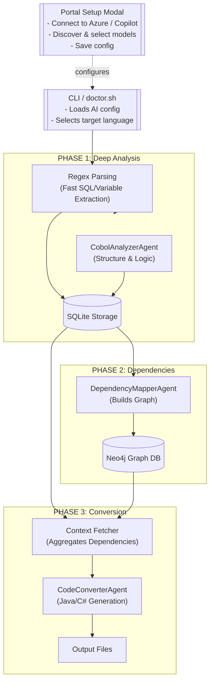
```mermaid
flowchart TD
  CLI[["CLI / doctor.sh\n- Loads AI config\n- Selects target language"]]
  PORTAL_SETUP[["Portal Setup Modal\n- Connect to Azure / Copilot\n- Discover & select models\n- Save config"]]
  
  subgraph ANALYZE_PHASE["PHASE 1: Deep Analysis"]
      REGEX["Regex Parsing\n(Fast SQL/Variable Extraction)"]
      ANALYZER["CobolAnalyzerAgent\n(Structure & Logic)"]
      SQLITE[("SQLite Storage")]
  end
  
  subgraph DEPENDENCY_PHASE["PHASE 2: Dependencies"]
      MAPPER["DependencyMapperAgent\n(Builds Graph)"]
      NEO4J[("Neo4j Graph DB")]
  end
  
  subgraph CONVERT_PHASE["PHASE 3: Conversion"]
      FETCHER["Context Fetcher\n(Aggregates Dependencies)"]
      CONVERTER["CodeConverterAgent\n(Java/C# Generation)"]
      OUTPUT["Output Files"]
  end

  CLI --> REGEX
  PORTAL_SETUP -.->|configures| CLI
  REGEX --> SQLITE
  REGEX --> ANALYZE_PHASE
  
  ANALYZER --> SQLITE
  
  SQLITE --> MAPPER
  MAPPER --> NEO4J
  
  SQLITE --> FETCHER
  NEO4J --> FETCHER
  FETCHER --> CONVERTER
  CONVERTER --> OUTPUT
```

### 🔀 Agent Responsibilities & Interactions

#### Advanced Sequence Flow (Mermaid)

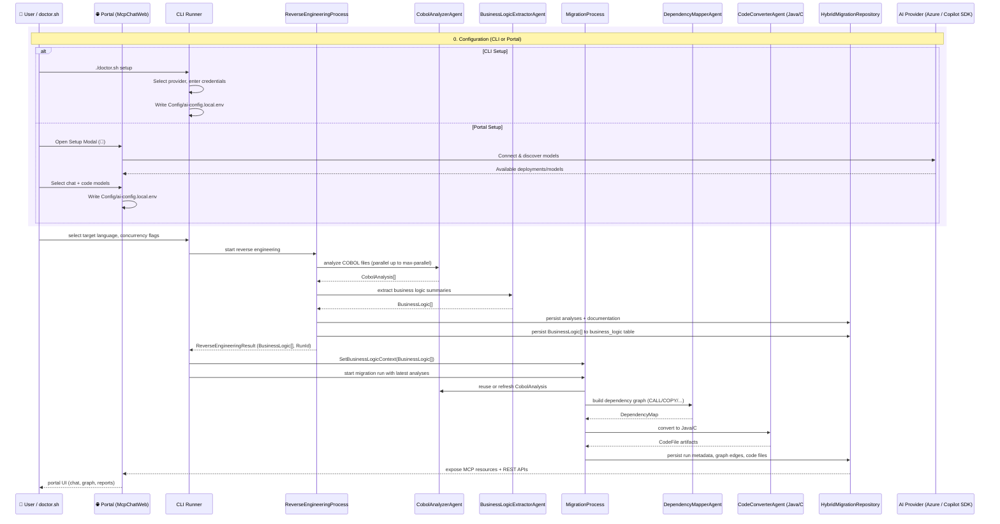
```mermaid
sequenceDiagram
  participant User as 🧑 User / doctor.sh
  participant Portal as 🌐 Portal (McpChatWeb)
  participant CLI as CLI Runner
  participant RE as ReverseEngineeringProcess
  participant Analyzer as CobolAnalyzerAgent
  participant BizLogic as BusinessLogicExtractorAgent
  participant Migration as MigrationProcess
  participant DepMap as DependencyMapperAgent
  participant Converter as CodeConverterAgent (Java/C#)
  participant Repo as HybridMigrationRepository
  participant AI as AI Provider (Azure / Copilot SDK)

  rect rgb(245, 240, 255)
      Note over User, AI: 0. Configuration (CLI or Portal)
      alt CLI Setup
          User->>CLI: ./doctor.sh setup
          CLI->>CLI: Select provider, enter credentials
          CLI->>CLI: Write Config/ai-config.local.env
      else Portal Setup
          User->>Portal: Open Setup Modal (🔧)
          Portal->>AI: Connect & discover models
          AI-->>Portal: Available deployments/models
          User->>Portal: Select chat + code models
          Portal->>Portal: Write Config/ai-config.local.env
      end
  end

  User->>CLI: select target language, concurrency flags
  CLI->>RE: start reverse engineering
  RE->>Analyzer: analyze COBOL files (parallel up to max-parallel)
  Analyzer-->>RE: CobolAnalysis[]
  RE->>BizLogic: extract business logic summaries
  BizLogic-->>RE: BusinessLogic[]
  RE->>Repo: persist analyses + documentation
  RE->>Repo: persist BusinessLogic[] to business_logic table
  RE-->>CLI: ReverseEngineeringResult (BusinessLogic[], RunId)
  CLI->>Migration: SetBusinessLogicContext(BusinessLogic[])
  CLI->>Migration: start migration run with latest analyses
  Migration->>Analyzer: reuse or refresh CobolAnalysis
  Migration->>DepMap: build dependency graph (CALL/COPY/...)
  DepMap-->>Migration: DependencyMap
  Migration->>Converter: convert to Java/C# with business logic context
  Converter-->>Migration: CodeFile artifacts
  Migration->>Repo: persist run metadata, graph edges, code files
  Repo-->>Portal: expose MCP resources + REST APIs
  Portal-->>User: portal UI (chat, graph, reports)
```

#### CobolAnalyzerAgent
- **Purpose:** Deep structural analysis of COBOL files (divisions, paragraphs, copybooks, metrics).
- **Inputs:** COBOL text from `FileHelper` or cached content.
- **Outputs:** `CobolAnalysis` objects consumed by:
  - `ReverseEngineeringProcess` (for documentation & glossary mapping)
  - `DependencyMapperAgent` (seed data for relationships)
  - `CodeConverterAgent` (guides translation prompts)
- **Interactions:**
  - Uses Azure OpenAI via `ResponsesApiClient` / `IChatClient` with concurrency guard.
  - Results persisted by `SqliteMigrationRepository`.

#### BusinessLogicExtractorAgent
- **Purpose:** Convert technical analyses into business language (use cases, user stories, glossary).
- **Inputs:** Output from `CobolAnalyzerAgent` + optional glossary.
- **Outputs:** `BusinessLogic` records and Markdown sections used in `reverse-engineering-details.md`.
- **Interactions:**
  - Runs in parallel with analyzer results.
  - Writes documentation via `FileHelper` and logs via `EnhancedLogger`.
  - Results persisted to the `business_logic` SQLite table via `IMigrationRepository.SaveBusinessLogicAsync`, enabling reuse in subsequent `--skip-reverse-engineering --reuse-re` runs.

#### DependencyMapperAgent
- **Purpose:** Identify CALL/COPY/PERFORM/IO relationships and build graph metadata.
- **Inputs:** COBOL files + analyses (line numbers, paragraphs).
- **Outputs:** `DependencyMap` with nodes/edges stored in both SQLite and Neo4j.
- **Interactions:**
  - Feeds the McpChatWeb graph panel and run-selector APIs.
  - Enables multi-run queries (e.g., "show me CALL tree for run 42").

#### CodeConverterAgent(s)
- **Variants:** `JavaConverterAgent` or `CSharpConverterAgent` (selected via `TargetLanguage`).
- **Purpose:** Generate target-language code from COBOL analyses and dependency context.
- **Inputs:**
  - `CobolAnalysis` per file
  - Target language settings (Quarkus vs. .NET)
  - Migration run metadata (for logging & metrics)
  - `BusinessLogic` records per file (user stories, features, business rules) — injected automatically from RE output in full-pipeline runs, or loaded from DB when `--reuse-re` is used
- **Outputs:** `CodeFile` records saved under `output/java/` or `output/csharp/`.
- **Interactions:**
  - Concurrency guards (pipeline slots vs. AI calls) ensure Azure OpenAI limits respected.
  - Results pushed to portal via repositories for browsing/download.

### ⚡ Concurrency Notes
- **Pipeline concurrency (`--max-parallel`)** controls how many files/chunks run simultaneously (e.g., 8).
- **AI concurrency (`--max-ai-parallel`)** caps concurrent Azure OpenAI calls (e.g., 3) to avoid throttling.
- Both values can be surfaced via CLI flags or environment variables to let `doctor.sh` tune runtime.

### 🔄 End-to-End Data Flow
1. `doctor.sh run` → load configs → choose target language
2. **Source scanning** - Reads all `.cbl`/`.cpy` files from `source/`
3. **Analysis** - `CobolAnalyzerAgent` extracts structure; `BusinessLogicExtractorAgent` generates documentation
4. **Dependencies** - `DependencyMapperAgent` maps CALL/COPY/PERFORM relationships → Neo4j
5. **Conversion** - `JavaConverterAgent` or `CSharpConverterAgent` generates target code → `output/`
6. **Storage** - `HybridMigrationRepository` writes metadata to SQLite, graph edges to Neo4j
7. **Portal** - `McpChatWeb` surfaces chat, graphs, and reports at http://localhost:5028

---

### Three-Panel Portal UI

```
┌─────────────────┬───────────────────────────┬─────────────────────┐
│  📋 Resources   │      💬 AI Chat           │   📊 Graph          │
│                 │                           │                     │
│  MCP Resources  │  Ask about your COBOL:   │  Interactive        │
│  • Run summary  │  "What does CUSTOMER.cbl │  dependency graph   │
│  • File lists   │   do?"                   │                     │
│  • Dependencies │                           │  • Zoom/pan         │
│  • Analyses     │  AI responses with        │  • Filter by type   │
│                 │  SQLite + Neo4j data      │  • Click nodes      │
└─────────────────┴───────────────────────────┴─────────────────────┘
```

**Portal URL:** http://localhost:5028

---

## 🔨 Build & Run

### Build Only

```bash
dotnet build
```

### Run Migration (Recommended)

```bash
./doctor.sh run      # Interactive - prompts for language choice
```

**⚠️ Do NOT use `dotnet run` directly** - it bypasses the interactive menu and configuration checks.

### Launch Portal Only

```bash
./doctor.sh portal   # Opens http://localhost:5028
```

---

## 🔧 Configuration Reference

### Configuration Loading: .env vs appsettings.json

This project uses a **layered configuration system** where `.env` files can override `appsettings.json` values.

#### Config Files Explained

| File | Purpose | Git Tracked? |
|------|---------|--------------|
| `Config/appsettings.json` | **All settings** - models, chunking, Neo4j, output paths | ✅ Yes |
| `Config/ai-config.env.example` | Copy source for your local config | ✅ Yes |
| `Config/ai-config.local.env` | **Your secrets** - API keys, endpoints | ❌ No (gitignored) |

> **Estate data stays local.** Source, output, logs and estate-specific rules are git-ignored, and a pre-commit guard blocks estate names. Run `tools/check-no-estate-data.sh --install-hook` once per clone. See [Keeping estate data private](docs/keeping-estate-data-private.md).

#### What Goes Where?

```
appsettings.json          → Non-secret settings (chunking, Neo4j, file paths)
ai-config.local.env       → Secrets (API keys, endpoints) - NEVER commit!
```

#### Loading Order (Priority)

When you run `./doctor.sh run`, configuration loads in this order:

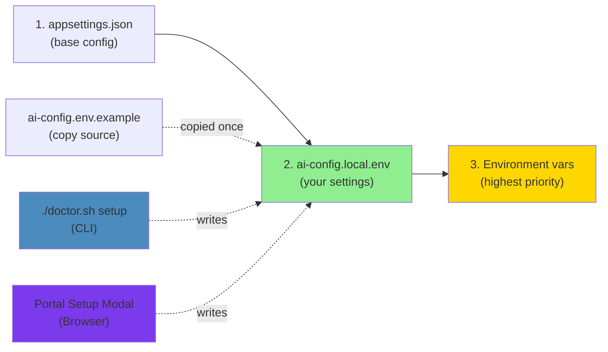
```mermaid
flowchart LR
    A["1. appsettings.json<br/>(base config)"] --> C["2. ai-config.local.env<br/>(your settings)"]
    C --> D["3. Environment vars<br/>(highest priority)"]

    X["ai-config.env.example<br/>(copy source)"] -.->|copied once| C
    E["./doctor.sh setup<br/>(CLI)"] -.->|writes| C
    F["Portal Setup Modal<br/>(Browser)"] -.->|writes| C

    style C fill:#90EE90
    style D fill:#FFD700
    style E fill:#4B8BBE
    style F fill:#7C3AED
```

**Later values override earlier ones.** This means:
- `ai-config.local.env` overrides `appsettings.json`
- Environment variables override everything

`ai-config.env.example` is only ever copied to create your local config. It is not
loaded at runtime, so its placeholder values cannot stand in for a setting you left unset.

#### How doctor.sh Loads Config

```bash
# Inside doctor.sh:
source "$REPO_ROOT/Config/load-config.sh"  # Loads the loader
load_ai_config                              # Executes loading
```

The `load-config.sh` script:
1. Reads `ai-config.local.env` (your settings)
2. Exports all values as environment variables
3. .NET app reads these env vars, which override `appsettings.json`

#### Quick Reference: Key Settings

| Setting | appsettings.json Location | .env Override |
|---------|---------------------------|---------------|
| Codex model | `AISettings.ModelId` | `_CODE_MODEL` |
| Chat model | `AISettings.ChatModelId` | `_CHAT_MODEL` |
| API endpoint | `AISettings.Endpoint` | `_MAIN_ENDPOINT` |
| API key | `AISettings.ApiKey` | `_MAIN_API_KEY` |
| Neo4j enabled | `ApplicationSettings.Neo4j.Enabled` | — |
| Chunking | `ChunkingSettings.*` | — |

> 💡 **Best Practice:** Keep secrets in `ai-config.local.env`, keep everything else in `appsettings.json`.

---

### Required: Azure OpenAI

In `Config/ai-config.local.env`:
```bash
# Master Configuration
_MAIN_ENDPOINT="https://YOUR-RESOURCE.openai.azure.com/"
_MAIN_API_KEY="your key"   # Leave empty to use 'az login' (Entra ID) instead

# Model Selection (override appsettings.json)
_CHAT_MODEL="gpt-5.2-chat"           # For Portal Q&A
_CODE_MODEL="gpt-5.1-codex-mini"     # For Code Conversion
```

> 💡 **Prefer keyless auth?** Run `az login` and leave `_MAIN_API_KEY` empty.
> You need the **"Cognitive Services OpenAI User"** role on your Azure OpenAI resource.
> See [Azure AD / Entra ID Authentication Guide](docs/az-login-auth-guide.md) for full instructions.

> 🧱 **Build fails downloading the Copilot CLI?** The Copilot SDK fetches it from an NPM
> registry at build time and does not read `.npmrc`.
> See [Building behind an NPM registry block](docs/building-behind-an-npm-registry-block.md).

### Neo4j (Dependency Graphs)

`./doctor.sh setup` writes `NEO4J_PASSWORD` to `Config/ai-config.local.env`.
The template value is for local development only and must be changed for production.
Run `./doctor.sh rekt-full` or export the value before invoking Compose directly.
Neo4j HTTP and Bolt ports bind to localhost only.

### Smart Chunking (Large Files)

See [Parallel Jobs Formula](#parallel-jobs-formula) for chunking configuration details.

---

## 📊 What Gets Generated

| Input | Output |
|-------|--------|
| `source/CUSTOMER.cbl` | `output/java/com/example/generated/CustomerService.java` |
| `source/PAYMENT.cbl` | `output/csharp/Generated/PaymentProcessor.cs` |
| Analysis | `output/reverse-engineering-details.md` |
| Report | `output/migration_report_run_X.md` |

---

## 🆘 Troubleshooting

```bash
./doctor.sh               # Check configuration
./doctor.sh test          # Run system tests
./doctor.sh chunking-health  # Check chunking setup
```

| Issue | Solution |
|-------|----------|
| Neo4j connection refused | Load `NEO4J_PASSWORD` from `Config/ai-config.local.env`, then run `docker-compose up -d neo4j` |
| Azure API error | Check `Config/ai-config.local.env` credentials or run `az login` |
| No output generated | Ensure COBOL files are in `source/` |
| Portal won't start | `lsof -ti :5028 \| xargs kill -9` then retry |
| Build fails with `MSB3923 Failed to download file … registry.npmjs.org`, or setup says *Could not fetch user-specific models* | The network blocks the npm registry the Copilot SDK downloads its CLI from. `doctor.sh` falls back to your npm mirror or your installed Copilot CLI automatically; for plain `dotnet` commands, see [Building behind an NPM registry block](docs/building-behind-an-npm-registry-block.md) |
| `rekt-full` stops with *Source identity collisions prevent safe REKT staging* | REKT reads copybooks by name from one folder, so it stops only when two copybooks share a name, differ, and a `COPY` or `INCLUDE` uses that name. The message lists the copies and the files that use them. Rename one copy, or move the estate you are not parsing out of `source/`. Copies with the same text, or that nothing uses, are staged and reported as a note |

---

## 📚 Further Reading

- [Smart Chunking & Token Architecture](docs/smart-chunking-architecture.md) - Full diagrams, constants reference, and complexity scoring details
- [Smart Chunking Guide](docs/smart-chunking-deep-dive.md) - Deep technical details
- [Architecture Documentation](docs/REVERSE_ENGINEERING_ARCHITECTURE.md) - System design
- [Estate Mission Control and the AI Loop](docs/estate-mission-control.md) - Deterministic clusters, carve scores and waves for converting the estate slice by slice, and a per-run view of model calls, retries, fallbacks and quality gates
- [Dependency Health & Semantic Flow Explorer](docs/dependency-health-and-flow-explorer.md) - Deterministic parse-fidelity, topology and JCL chain surfaces for deciding conversion order
- [JCL job facts](docs/jcl-job-facts.md) - Deterministic JCL parser: procedures, symbols, conditions, Db2 runs and dataset lineage across jobs
- [Jobs generated from JCL](docs/jcl-jobs.md) - Each JCL job as a .NET job (C#) or Spring Batch job (Java) that runs the converted programs under the JCL's conditions
- [Conversion Parity Validation](docs/conversion-parity-validation.md) - Deterministic check that generated code represents the COBOL it came from, with per-axis coverage and a configurable threshold
- [Speed Profiles](docs/speed-profiles.md) - TURBO/FAST/BALANCED/THOROUGH env var overrides and complexity scoring
- [Azure AD / Entra ID Authentication Guide](docs/az-login-auth-guide.md) - Keyless auth setup
- [Building behind an NPM registry block](docs/building-behind-an-npm-registry-block.md) - Restoring the Copilot CLI download on a network that blocks the public registry
- [Legacy Modernization Flow](docs/legacy-modernization-flow.md) - How a run moves from COBOL through reverse engineering to generated code
- [Spec-Driven Code Generation](docs/spec-approach-concept.md) - A considered approach, deferred and not implemented; kept for the reasoning rather than as a description of the tool
- [Changelog](CHANGELOG.md) - Version history

---

## ⚙️ Workflows

| Workflow / Agent | Trigger | Description |
|---|---|---|
| [Documentation Updater](.github/workflows/documentation-updater.lock.yml) | Push / PR to `main` | Checks documentation completeness and reports gaps via issues or PR comments |
| [Documentation Audit](.github/workflows/documentation-audit.lock.yml) | Weekly schedule | Performs a full audit of project documentation for accuracy and completeness |
| [Test Enhancer](.github/workflows/test-enhancer.lock.yml) | On demand | Agentic workflow that analyzes the codebase and proposes improvements to test coverage |
| [Branch Reviewer](.github/agents/pr-review.agent.md) | On demand (Copilot CLI) | Reviews branch changes, summarizes commits, and detects breaking changes vs. `main` |

---

## Acknowledgements

Collaboration between Microsoft's Global Black Belt team and [Bankdata](https://www.bankdata.dk/). See [blog post](https://aka.ms/cobol-blog).

## License

MIT License - Copyright (c) Microsoft Corporation.
