# Legacy Modernization Agents to migrate COBOL to Java developed with the Semantic Kernel Process Function

This migration framework was developed to demonstrate AI Agents capabilities for converting legacy code like COBOL to Java. Each Agent has a persona that can be edited depending on the desired outcome.
The migration is using Semantic Kernel Process Function where it does analysis of the COBOL code and it’s dependencies. This information then used to converting Java Quarkus.

## Acknowledgements of collaboration
This project is a collaboration between Microsoft's Global Black Belt team and [Bankdata](https://www.bankdata.dk/). If you want to learn more about the collaboration and background of this project, have a look at [this](https://aka.ms/cobol-blog) and [this](https://www.bankdata.dk/about/news/microsoft-and-bankdata-launch-open-source-ai-framework-for-modernizing-legacy-systems) blog post.

## Call-to-Action
We are looking for real COBOL code to further improve this framework. If you want to actively collaborate, please reach out to us by opening an issue in this repository. - Gustav Kaleta & Julia Kordick

# Want to see the framework in action?
Have a look at the talk Julia did at the WeAreDevelopers World Congress 2025: https://www.youtube.com/watch?v=62OI_y-KRlw

## Table of Contents
- [Quick Start](#-quick-start) - Prerequisites, Dev Container, Neo4j, Demo
- [Latest Features](#-latest-features) - File analysis, multi-run queries, dynamic graphs
- [Architecture](#-architecture) - Hybrid databases, system design, portal UI
- [CLI Reference](#-cli-commands-reference) - Doctor.sh and .NET commands
- [Step-by-Step Guide](#step-by-step-guide) - Configuration to deployment
- [How It Works](#how-it-works---architecture--flow) - Technical details
- [Known Issues & Ideas](#known-issues) - Troubleshooting and roadmap

## 🚀 Quick Start

### Prerequisites
- **.NET 9.0 SDK** - [Download](https://dotnet.microsoft.com/download/dotnet/9.0)
- **Docker Desktop** - For Neo4j graph database
- **Azure OpenAI** - GPT-4.1 deployment (1M tokens/min recommended)
- **Modern browser** - Chrome, Edge, Firefox, or Safari

> **Note:** Hybrid database architecture: SQLite (metadata) + Neo4j (dependency graphs)

### Dev Container Setup

**Fully automated environment** with .NET 9, Java 17, Neo4j, SQLite, Azure CLI, and pre-configured VS Code extensions.

**Included:** C# Dev Kit, Java Pack, Quarkus, Semantic Kernel, Neo4j, SQLite extensions  
**Aliases:** `demo`, `migration-run`, `portal-start`, `neo4j-status`

#### New Portal expierence


#### Meta data and MCP service fronting Neo4J


#### 🚀 Quick Start with Dev Container

**Requirements:**
- Docker Desktop installed and running
- Visual Studio Code with "Dev Containers" extension

#### Screenshots


#### Setup Steps

1. **Clone & open:**
   ```bash
   git clone https://github.com/your-org/Legacy-Modernization-Agents.git
   code Legacy-Modernization-Agents
   ```

2. **Reopen in container** (VS Code prompt or Cmd+Shift+P → "Dev Containers: Reopen in Container")

3. **Wait 3-5 min** - Auto-builds, starts Neo4j, restores packages

4. **Verify databases:**
   ```bash
   docker ps | grep neo4j  # Should show healthy
   # Neo4j: http://localhost:7474 (neo4j/cobol-migration-2025)
   # SQLite: Data/migration.db (created on first run)
   ```

5. **Configure credentials** (see below) and run: `./helper-scripts/demo.sh`

### 📊 Neo4j Database Setup

**Quick Start:**
```bash
# Option 1: Auto-starts in dev container (recommended)
# Option 2: Docker Compose
docker-compose up -d neo4j && docker ps | grep neo4j
# Option 3: Manual docker run
docker-compose up -d neo4j

# Verify it's running
docker ps | grep neo4j

# Access Neo4j Browser
open http://localhost:7474
```

**Option 3: Manual Docker Run**
```bash
docker run -d \
  --name cobol-migration-neo4j \
  -p 7474:7474 \
  -p 7687:7687 \
  -e NEO4J_AUTH=neo4j/cobol-migration-2025 \
  -e NEO4J_PLUGINS='["apoc"]' \
  neo4j:5.15.0
```

#### Neo4j Connection Details
- **HTTP (Browser)**: http://localhost:7474
- **Bolt (Driver)**: bolt://localhost:7687
- **Username**: `neo4j`
- **Password**: `cobol-migration-2025`

#### Verify Neo4j Connection
```bash
# Check if Neo4j is healthy
curl http://localhost:7474

# Or use the demo script which includes health checks
./demo.sh
```

### 🎬 Demo Mode

View existing migration data without running a new analysis:

```bash
./helper-scripts/demo.sh
# OR if in devcontainer:
demo
```

**What it does:** Checks prerequisites, starts Neo4j, finds latest migration, launches portal at http://localhost:5028

**Portal features:** Three-panel UI, AI chat, interactive graph, multi-run queries, file content analysis

**Stop demo:** `pkill -f "dotnet.*McpChatWeb"` or `docker-compose down`

**Troubleshooting:** If port in use, kill process with pkill. If no data shows, run `./doctor.sh run` to populate databases.

## 🆕 Latest Features

### File Content Analysis

Ask natural language questions about COBOL file contents directly in the chat interface:

**Example Queries:**
```plaintext
"What functions are in BDSDA23.cbl?"
"What methods are used in RGNB649.cbl?"
"What does the copybook RENI033.cpy contain code wise?"
"Show me the variables in BDSIW13.cbl"
"What paragraphs are in AGSFZ01.cbl?"
```

**What You Get:**
- ✅ **Program Purpose**: High-level description of what the file does
- ✅ **All Functions/Paragraphs**: Complete list with descriptions and logic summaries
- ✅ **Variables**: Top 15 variables with PIC clauses, types, levels, usage
- ✅ **Copybooks Referenced**: All COPY statements and dependencies
- ✅ **Data Source**: MCP resource URI with API endpoint reference

**How It Works:**
1. Chat endpoint detects file-related queries using regex pattern
2. Queries MCP resource: `insights://runs/{runId}/analyses/{fileName}`
3. Parses `rawAnalysisData` JSON field for detailed structure
4. Extracts from nested arrays: `paragraphs-and-sections-summary`, `variables`, `copybooksReferenced`
5. Falls back to SQLite direct query if MCP unavailable

**Example Response:**
```markdown
📄 Analysis for BDSDA23.cbl (Run 43)

**Purpose:**
Batch data synchronization agent for daily transaction processing

**Functions/Paragraphs (23):**
- **`MAIN-PROCESS`**: Main entry point, orchestrates batch workflow
- **`VALIDATE-INPUT`**: Validates input file records for completeness
- **`PROCESS-TRANSACTIONS`**: Iterates through transactions and updates database
...

**Variables (15):**
- `WS-RECORD-COUNT` PIC 9(8) (numeric)
- `WS-TRANSACTION-DATE` PIC X(10) (alphanumeric)
- `WS-ERROR-FLAG` PIC X (boolean)
... and 8 more

**Copybooks Referenced (5):**
- RENI033.cpy
- BDSCOPY1.cpy
- COMMON.cpy

**Data Source:** MCP Resource URI: `insights://runs/43/analyses/BDSDA23.cbl`
**API:** `GET /api/file-analysis/BDSDA23.cbl?runId=43`
```

### Multi-Run Query Support
Query any historical run: "Show me run 42". Automatically queries both SQLite and Neo4j, updates graph visualization, and labels data sources.

### Dynamic Graph Updates
Graph auto-updates when querying different runs. Frontend detects `runId` in response and refreshes visualization without manual intervention.

---

### 4. 📚 Data Retrieval Guide

Access comprehensive data access documentation directly in the portal via the **"📖 Data Retrieval Guide"** button.

**What's Included:**
- 🗄️ **SQLite Instructions**: 
  - Database location and schema
  - 5 example queries (runs, files, analyses, Java code, dependencies)
  - Tool recommendations (sqlite3 CLI, DB Browser, VS Code extension)
  
- 🔗 **Neo4j Instructions**:
  - Connection details (bolt://localhost:7687)
  - Credentials (neo4j / cobol-migration-2025)
  - 5 Cypher queries (runs, files, dependencies, circular deps, critical files)
  - Tool recommendations (Neo4j Browser, Desktop, cypher-shell)

- 🎯 **MCP API Instructions**:
  - All available MCP resource URIs
  - REST API endpoints (/api/resources, /api/chat, /api/graph)
  - Example API calls with curl commands

- 📋 **Copy-Paste Examples**:
  - Three complete workflows (SQLite, Neo4j, API)
  - Step-by-step commands ready to use
  - No configuration needed

**API Endpoint:**
```bash
GET /api/data-retrieval-guide
```

**Modal Features:**
- Dark theme matching portal design
- Syntax highlighting for code blocks
- Organized in collapsible sections
- Close with X button or click outside

---

## �🏗️ Complete Architecture

### 🗄️ Hybrid Database Architecture

This project uses a **dual-database approach** for optimal performance and functionality:

```mermaid
flowchart TB
    subgraph INPUT["📁 Input Layer"]
        COBOL["COBOL Source Files<br/>(.cbl, .cpy)"]
    end
    
    subgraph PROCESS["🔄 Migration Process"]
        ANALYZER["🔍 CobolAnalyzerAgent<br/>Structure Analysis"]
        CONVERTER["☕ JavaConverterAgent<br/>Code Translation"]
        MAPPER["🗺️ DependencyMapperAgent<br/>Relationship Analysis"]
    end
    
    subgraph STORAGE["💾 Hybrid Storage Layer"]
        SQLITE[("📊 SQLite Database<br/>Data/migration.db<br/><br/>• Run metadata<br/>• File content<br/>• AI analyses<br/>• Java code<br/>• Metrics")]
        NEO4J[("🔗 Neo4j Graph DB<br/>bolt://localhost:7687<br/><br/>• Dependencies<br/>• Relationships<br/>• Graph data<br/>• Visualizations")]
    end
    
    subgraph REPO["🔀 Repository Layer"]
        HYBRID["HybridMigrationRepository<br/>Coordinates both databases"]
    end
    
    subgraph ACCESS["🌐 Access Layer"]
        MCP["🎯 MCP Server<br/>JSON-RPC API"]
        PORTAL["🖥️ Web Portal<br/>localhost:5250"]
        BROWSER["🔍 Neo4j Browser<br/>localhost:7474"]
    end
    
    subgraph OUTPUT["📦 Output"]
        JAVA["☕ Java Quarkus Code"]
        REPORTS["📊 Reports & Logs"]
    end
    
    COBOL --> PROCESS
    PROCESS --> ANALYZER
    PROCESS --> CONVERTER
    PROCESS --> MAPPER
    
    ANALYZER --> HYBRID
    CONVERTER --> HYBRID
    MAPPER --> HYBRID
    
    HYBRID --> SQLITE
    HYBRID --> NEO4J
    
    SQLITE --> MCP
    NEO4J --> MCP
    NEO4J --> BROWSER
    
    MCP --> PORTAL
    
    PROCESS --> JAVA
    PROCESS --> REPORTS
    
    classDef inputStyle fill:#e3f2fd,stroke:#1976d2,stroke-width:3px
    classDef processStyle fill:#f1f8e9,stroke:#689f38,stroke-width:3px
    classDef storageStyle fill:#fff3e0,stroke:#f57c00,stroke-width:3px
    classDef accessStyle fill:#f3e5f5,stroke:#7b1fa2,stroke-width:3px
    classDef outputStyle fill:#e8f5e9,stroke:#388e3c,stroke-width:3px
    
    class COBOL inputStyle
    class ANALYZER,CONVERTER,MAPPER processStyle
    class SQLITE,NEO4J,HYBRID storageStyle
    class MCP,PORTAL,BROWSER accessStyle
    class JAVA,REPORTS outputStyle
```



#### 📊 SQLite Database Stores:
- ✅ **Migration run metadata** (ID, status, timestamps, statistics)
- ✅ **COBOL file content** (original source code)
- ✅ **AI-generated analyses** (structured insights)
- ✅ **Generated Java code** (converted output)
- ✅ **Historical data** (all previous runs)
- ✅ **Metrics and performance** (tokens, costs, timings)

**Location**: `Data/migration.db` (configurable via `MIGRATION_DB_PATH`)

#### 🔗 Neo4j Graph Database Stores:
- ✅ **File-to-file dependencies** (program → copybook)
- ✅ **Call relationships** (program → program)
- ✅ **Transitive dependencies** (indirect relationships)
- ✅ **Graph visualization data** (for UI rendering)
- ✅ **Impact analysis** (what files are affected by changes)

**Connection**: `bolt://localhost:7687` (configured in `appsettings.json`)

#### 🔀 Why Both Databases?

| Aspect | SQLite | Neo4j |
|--------|--------|-------|
| **Purpose** | Document storage | Relationship mapping |
| **Strength** | Fast queries, simple setup | Graph traversal, visualization |
| **Data Type** | Flat/relational data | Connected graph data |
| **Use Case** | "What's in this file?" | "What depends on this file?" |
| **Query Style** | SQL SELECT statements | Cypher graph queries |

**Together they provide**: Fast metadata access + Powerful relationship insights 🚀

### 🌐 System Architecture Overview


### 🖼️ Three-Panel Portal UI

The web portal at `localhost:5250` features a modern three-panel layout:

```mermaid
graph TB
    subgraph PORTAL["üåê Web Portal Layout (localhost:5250)"]
        direction LR
        subgraph LEFT["üìã Left Panel<br/>(300px)"]
            RESOURCES["MCP Resources<br/>• Migration Runs<br/>• COBOL Files<br/>• Dependencies<br/>• Java Files<br/>• Graph Queries"]
        end
        
        subgraph CENTER["💬 Center Panel<br/>(Flexible)"]
            CHAT["Chat Interface<br/>• Ask questions<br/>• AI responses<br/>• Conversation history"]
            CHIPS["6 Suggestion Chips<br/>• Circular Dependencies<br/>• Critical Files<br/>• Impact Analysis<br/>• File Relationships<br/>• Dependency Summary<br/>• Conversion Stats"]
        end
        
        subgraph RIGHT["üìä Right Panel<br/>(500px)"]
            GRAPH["Dependency Graph<br/>• Interactive visualization<br/>• Zoom & pan<br/>• Click for details<br/>• Query filters<br/>• Layout options"]
        end
    end
    
    LEFT -.-> CENTER
    CENTER -.-> RIGHT
    
    classDef leftStyle fill:#e3f2fd,stroke:#1976d2,stroke-width:2px
    classDef centerStyle fill:#f1f8e9,stroke:#689f38,stroke-width:2px
    classDef rightStyle fill:#fff3e0,stroke:#f57c00,stroke-width:2px
    
    class LEFT,RESOURCES leftStyle
    class CENTER,CHAT,CHIPS centerStyle
    class RIGHT,GRAPH rightStyle
```



**Portal Features:** Dark theme, three-panel layout (resources/chat/graph), AI chat, suggestion chips, interactive graph (zoom/pan/filter), multi-run queries, file content analysis, data retrieval guide

### 🔐 Configure Azure OpenAI Credentials

The project requires Azure OpenAI for **two purposes**:

1. **Migration Agents** (CobolAnalyzer, JavaConverter, DependencyMapper) - For code analysis and conversion
2. **MCP Chat Server** - For natural language queries about migration data

**Both use the same Azure OpenAI configuration** from `Config/appsettings.json`.

The project uses a secure two-file configuration system:

1. **`Config/ai-config.env`** - Template with default values (✅ safe to commit)
2. **`Config/ai-config.local.env`** - Your actual credentials (❌ never commit)

**Setup your credentials:**

```bash
# 1. Copy the template to create your local config
cp Config/ai-config.local.env.example Config/ai-config.local.env

# 2. Edit your local config with real values
nano Config/ai-config.local.env
```

**In `Config/ai-config.local.env`, update these lines:**
```bash
# Replace with your actual Azure OpenAI endpoint
AZURE_OPENAI_ENDPOINT="https://YOUR-RESOURCE-NAME.openai.azure.com/"

# Replace with your actual API key  
AZURE_OPENAI_API_KEY="your-32-character-api-key-here"

# Update deployment name to match your Azure setup
AZURE_OPENAI_DEPLOYMENT_NAME="gpt-4.1"
```

**🔍 How to find your Azure OpenAI values:**
- **Endpoint**: Azure Portal → Your OpenAI Resource → "Resource Management" → "Keys and Endpoint" → Endpoint
- **API Key**: Azure Portal → Your OpenAI Resource → "Resource Management" → "Keys and Endpoint" → Key 1
- **Deployment Name**: Azure AI Foundry → Your deployment name (must be "gpt-4.1")

**📋 Example `ai-config.local.env` with real values:**
```bash
# Example - replace with your actual values
AZURE_OPENAI_ENDPOINT="https://my-company-openai.openai.azure.com/"
AZURE_OPENAI_API_KEY="1234567890abcdef1234567890abcdef"
AZURE_OPENAI_DEPLOYMENT_NAME="gpt-4.1"
AZURE_OPENAI_MODEL_ID="gpt-4.1"
```

**⚠️ IMPORTANT**: 
- Make sure your endpoint ends with `/`
- API key should be 32 characters long
- Deployment name must match your Azure OpenAI deployment (e.g., "gpt-4o", "gpt-4.1")

#### 🔍 Where Azure OpenAI Configuration is Used

**1. Main Migration Process** (`Program.cs`)
- Reads from `Config/appsettings.json` → `AISettings` section
- Creates Semantic Kernel builder with Azure OpenAI connection
- Distributes to all three AI agents (Analyzer, Converter, Mapper)

```csharp
// Program.cs - Main migration entry point
var kernelBuilder = Kernel.CreateBuilder();
kernelBuilder.AddAzureOpenAIChatCompletion(
    deploymentName: settings.AISettings.DeploymentName,
    endpoint: settings.AISettings.Endpoint,
    apiKey: settings.AISettings.ApiKey
);
```

**2. MCP Server** (`Mcp/McpServer.cs`)
- Reads from same `Config/appsettings.json` → `AISettings` section
- Initializes Semantic Kernel for natural language chat queries
- Powers the web portal's AI chat feature

```csharp
// McpServer.cs - Chat server initialization
if (_aiSettings != null) {
    var kernelBuilder = Kernel.CreateBuilder();
    kernelBuilder.AddAzureOpenAIChatCompletion(
        deploymentName: _aiSettings.DeploymentName,
        endpoint: _aiSettings.Endpoint,
        apiKey: _aiSettings.ApiKey
    );
    _kernel = kernelBuilder.Build();
}
```

**Configuration File Structure** (`Config/appsettings.json`):
```json
{
  "AISettings": {
    "ServiceType": "AzureOpenAI",
    "Endpoint": "https://your-resource.openai.azure.com/",
    "ApiKey": "YOUR_API_KEY",
    "ModelId": "gpt-4o",
    "DeploymentName": "gpt-4o",
    "CobolAnalyzerModelId": "gpt-4o",
    "JavaConverterModelId": "gpt-4o",
    "DependencyMapperModelId": "gpt-4o",
    "MaxTokens": 32000,
    "Temperature": 0.1
  }
}
```

**One Configuration, Two Uses:**
- ✅ Same credentials used for migration and chat
- ✅ Can use different models per agent if needed
- ✅ Configured once in `appsettings.json`
- ✅ No separate MCP server configuration required

## 🎯 CLI Commands Reference

### Doctor.sh - Three Migration Modes

The `doctor.sh` script provides three distinct migration workflows:

#### 1️⃣ **Reverse Engineering Only** (No UI)
```bash
./doctor.sh reverse-eng
```
**What it does:**
- Extracts business logic, feature descriptions, and use cases from COBOL
- Generates `output/reverse-engineering-details.md` documentation
- **Does NOT** convert code to Java
- **Does NOT** launch web UI
- Use when: You only need business documentation

#### 2️⃣ **Full Migration** (Reverse Eng + Conversion + UI)
```bash
./doctor.sh run
```
**What it does:**
- First runs reverse engineering (or uses existing results)
- Then converts COBOL to Java Quarkus
- Generates all reports and documentation
- **Launches web UI** at http://localhost:5250
- Use when: You want complete migration with business documentation

#### 3️⃣ **Conversion Only** (Skip Reverse Eng, Launch UI)
```bash
./doctor.sh convert-only
```
**What it does:**
- Skips reverse engineering entirely
- Only performs COBOL to Java Quarkus conversion
- Generates Java code and migration reports
- **✅ Launches web UI** at http://localhost:5250
- Use when: You already have documentation or just need code conversion

### Other Doctor.sh Commands
```bash
./doctor.sh                    # Diagnose configuration
./doctor.sh setup              # Interactive setup wizard
./doctor.sh test               # System validation and health check
```

### Direct .NET Commands
```bash
# Full migration with reverse engineering
dotnet run -- --source ./source

# Skip reverse engineering
dotnet run -- --source ./source --skip-reverse-engineering

# Reverse engineering only
dotnet run reverse-engineer --source ./source

# MCP server standalone
dotnet run mcp [--run-id 42]

# Conversation log viewer
dotnet run conversation
```

**Options:** `--verbose`, `--config <path>`, `--run-id <number>`, `--session-id <id>`

## Step-by-Step Guide

1. **Configure:** `cp Config/ai-config.local.env.example Config/ai-config.local.env` → Add Azure OpenAI endpoint, API key, deployment name
2. **Add COBOL files:** `cp your-files/* ./cobol-source/`
3. **Run:** `./doctor.sh run` - Analyzes, converts, launches portal at http://localhost:5250
4. **Explore:** Use portal UI (chat, graph) or connect MCP clients (Claude, Cursor)
5. **Query data:** SQLite (`Data/migration.db`), Neo4j (http://localhost:7474), or MCP API

**Portal features:** Three-panel UI, AI chat, multi-run queries, interactive graph, file content analysis

**Env variables:** `MCP_AUTO_LAUNCH=0` (skip portal), `MIGRATION_DB_PATH` (custom DB location)

### Testing

```bash
# Run integration tests
dotnet test McpChatWeb.Tests/McpChatWeb.Tests.csproj

# Validate configuration
./doctor.sh test
```

## How It Works - Architecture & Flow

### Migration Process (8 Steps)

```mermaid
sequenceDiagram
    participant User as 👤 User
    participant CLI as 🖥️ CLI Program
    participant Process as 🎯 MigrationProcess
    participant Agents as 🤖 AI Agents
    participant AI as 🧠 Azure OpenAI
    participant Repo as 🔀 HybridRepository
    participant SQLite as 📊 SQLite DB
    participant Neo4j as 🔗 Neo4j DB
    
    User->>CLI: ./doctor.sh run
    CLI->>Process: Initialize with settings
    Process->>Repo: Create migration run
    
    Note over Process: Step 1: File Discovery
    Process->>Repo: Save COBOL files → SQLite
    
    Note over Process: Step 2: Dependency Analysis
    Process->>Agents: DependencyMapperAgent
    Agents->>AI: Analyze relationships
    Repo->>Neo4j: CREATE graph nodes & edges
    
    Note over Process: Step 3-4: Analysis & Conversion
    loop For each COBOL file
        Process->>Agents: CobolAnalyzerAgent → JavaConverterAgent
        Agents->>AI: Analyze & convert
        Repo->>SQLite: Save analyses & Java code
    end
    
    Note over Process: Step 5-8: Generation & Finalization
    Process->>Repo: Save metrics, generate reports
    CLI-->>User: Success + Auto-launch portal
```



### Semantic Kernel Orchestration

**Kernel Builder** (Program.cs) configures Azure OpenAI → Distributes to 3 specialized agents:
- **CobolAnalyzerAgent** - Structure analysis (system prompt: COBOL expert)
- **JavaConverterAgent** - Java Quarkus generation (system prompt: Java/Quarkus expert)
- **DependencyMapperAgent** - Relationship mapping (system prompt: Dependency expert)

Each agent uses `kernel.InvokePromptAsync(prompt, args)` with MaxTokens: 32000, Temperature: 0.1

### Data Flow

**SQLite**: Run metadata, COBOL source, analyses, Java output, metrics  
**Neo4j**: Dependency graph (nodes = files, edges = COPY/CALL relationships)  
**MCP Server**: Browser UI → ASP.NET API → McpProcessClient (STDIO bridge) → MCP Server → Both databases

### Real Migration Stats
- 102 COBOL files processed → 99 Java Quarkus files generated (97% success rate)
- 205 Azure OpenAI API calls, ~1.2 hours total, $0.31 cost
- Outputs: `output/`, `Logs/`, `Data/migration.db`, Neo4j @ bolt://localhost:7687

## Work in progress and good to know

- Output: `output/` folder with Java files, `Logs/` with reports and conversation logs
- Token limits: GPT-4.1 max ~32K tokens - adjust per agent in `appsettings.json`  
- Customizable: Change agent personas/prompts for different outcomes (DB2→PostgreSQL, Java→.NET, etc.)
- Other languages: Framework adaptable to APL, PL/I - update agent prompts accordingly

## Known Issues
- Content filtering may block Azure OpenAI calls
- Token limits: Don't exceed agent MaxTokens settings (32K for GPT-4.1)
- Model deployment names must match Azure configuration

## Project Ideas
- Enhance agent prompts for specific migration scenarios
- Add support for additional legacy languages (PL/I, RPG, APL)
- Integrate with CI/CD pipelines  
- Improve test generation capabilities
- Contributions welcome!

## Disclaimer

This software is provided for **demonstration purposes only**. It is not intended to be relied upon for production use. The creators make no representations or warranties of any kind, express or implied, about the completeness, accuracy, reliability, suitability or availability. Any reliance on this software is strictly at your own risk.

## License

MIT License - Copyright (c) Microsoft Corporation. See full license terms in the repository.
