# 🧠 Legacy Modernization Agents to migrate COBOL to Java & C# developed with the Semantic Kernel Process Function

This migration framework was developed to demonstrate AI Agents capabilities for converting legacy code like COBOL to **Java** or **C#** (or both). Each Agent has a persona that can be edited depending on the desired outcome.

The migration uses Semantic Kernel Process Function where it performs analysis of the COBOL code and its dependencies. This information is then used for converting to **Java Quarkus** or **C# .NET**, with automatic validation and comprehensive unit test generation.

## 🆕 Enhanced Features

This enhanced version includes **four major additions** beyond the original framework:

### 1. **Dual-Language Conversion** 🔄
- **Java Quarkus**: Modern microservices framework
- **C# .NET**: Enterprise-grade .NET applications
- **Both**: Convert to both languages simultaneously for comparison

### 2. **Interactive Target Selection** 🎯
Run `./doctor.sh run` and choose your target language through an interactive menu:
- Select Java, C#, or both
- Automatic directory setup for each target
- Optimized conversion workflow per language

### 3. **Validation Agent** ✅
Automatically validates converted code to ensure quality:
- **Completeness Check**: Verifies all COBOL logic was converted
- **Consistency Analysis**: Ensures behavior matches original COBOL
- **Quality Metrics**: Analyzes code structure and best practices
- **Detailed Reports**: Generates validation reports with recommendations

### 4. **Unit Test Agent** 🧪
Automatically generates comprehensive test suites:
- **Java Tests**: JUnit 5 + Mockito test suites
- **C# Tests**: xUnit + Moq test frameworks
- **Coverage Analysis**: Targets >80% code coverage
- **Test Reports**: Detailed metrics and improvement recommendations
- **Test Types**: Business logic, edge cases, error handling, data validation

See [UNIT_TEST_GUIDE.md](UNIT_TEST_GUIDE.md) and [VALIDATION_GUIDE.md](VALIDATION_GUIDE.md) for detailed documentation.

## Acknowledgements of collaboration
This project is a collaboration between Microsoft's Global Black Belt team and [Bankdata](https://www.bankdata.dk/). If you want to learn more about the collaboration and background of this project, have a look at [this](https://aka.ms/cobol-blog) and [this](https://www.bankdata.dk/about/news/microsoft-and-bankdata-launch-open-source-ai-framework-for-modernizing-legacy-systems) blog post.

## Call-to-Action
We are looking for real COBOL code to further improve this framework. If you want to actively collaborate, please reach out to us by opening an issue in this repository. - Gustav Kaleta & Julia Kordick

# Want to see the framework in action?
Have a look at the talk Julia did at the WeAreDevelopers World Congress 2025: https://www.youtube.com/watch?v=62OI_y-KRlw

## Table of Contents
- [Quick Start](#-quick-start)
  - [Prerequisites](#prerequisites)
  - [Dev Container](#dev-container)
- [How It Works - Complete Architecture & Flow](#how-it-works---complete-architecture--flow)
- [Known issues](#known-issues)
- [Project ideas](#project-ideas)
  - [Improvements](#improvements)
- [Disclaimer](#disclaimer)
- [Summary](#summary)

## 🚀 Quick Start

### Prerequisites
- .NET 8.0.x
- Semantic Kernel SDK
- Azure OpenAI account with GPT-4.1 model deployed
- GPT-4.1 supports up to 1M Token per minute which you need edit in https://oai.azure.com/


> **INFO:** Remember to read the entire repo to grasp of the project and how you can utilize it for your code base. 

### Dev Container
This project includes a dev container configuration for Visual Studio Code, which ensures a consistent development environment for all contributors.

> **Note on Java Version**: The project uses Java 17 in the dev container because it's the latest version available in the standard Debian Bookworm repositories. Our dev container is based on `mcr.microsoft.com/devcontainers/dotnet:8.0`, which uses Debian Bookworm as its base image.

#### Requirements to use the Dev Container
- Docker installed on your machine
- Visual Studio Code with the "Dev Containers" extension installed

#### Getting Started with the Dev Container
1. Clone this repository
2. Open the project folder in Visual Studio Code
3. When prompted, click "Reopen in Container", or run the "Dev Containers: Reopen in Container" command from the command palette
4. Wait for the container to build and initialize (this may take a few minutes the first time)
5. The container includes all required dependencies:
   - .NET 8.0
   - Java 17 with Maven
   - Azure CLI
   - Required VS Code extensions

After the container is built, the project will be automatically restored and built.

### 🔐 Configure Azure OpenAI Credentials

The project uses a secure two-file configuration system:

1. **`Config/ai-config.env`** - Template with default values (✅ safe to commit)
2. **`Config/ai-config.local.env`** - Your actual credentials (❌ never commit)

**Setup your credentials:**

```bash
# 1. Copy the template to create your local config
cp Config/ai-config.local.env.example Config/ai-config.local.env

# 2. Edit your local config with real values
nano Config/ai-config.local.env
```

**In `Config/ai-config.local.env`, update these lines:**
```bash
# Replace with your actual Azure OpenAI endpoint
AZURE_OPENAI_ENDPOINT="https://YOUR-RESOURCE-NAME.openai.azure.com/"

# Replace with your actual API key  
AZURE_OPENAI_API_KEY="your-32-character-api-key-here"

# Update deployment name to match your Azure setup
AZURE_OPENAI_DEPLOYMENT_NAME="gpt-4.1"
```

**🔍 How to find your Azure OpenAI values:**
- **Endpoint**: Azure Portal → Your OpenAI Resource → "Resource Management" → "Keys and Endpoint" → Endpoint
- **API Key**: Azure Portal → Your OpenAI Resource → "Resource Management" → "Keys and Endpoint" → Key 1
- **Deployment Name**: Azure AI Foundry → Your deployment name (must be "gpt-4.1")

**📋 Example `ai-config.local.env` with real values:**
```bash
# Example - replace with your actual values
AZURE_OPENAI_ENDPOINT="https://my-company-openai.openai.azure.com/"
AZURE_OPENAI_API_KEY="1234567890abcdef1234567890abcdef"
AZURE_OPENAI_DEPLOYMENT_NAME="gpt-4.1"
AZURE_OPENAI_MODEL_ID="gpt-4.1"
```

**⚠️ IMPORTANT**: 
- Make sure your endpoint ends with `/`
- API key should be 32 characters long
- Deployment name must be exactly "gpt-4.1" to match project configuration

### Setup & Run
```bash
# 1. Validate your configuration
./doctor.sh doctor

# 2. Test configuration  
./doctor.sh test

# 3. Add your COBOL files to cobol-source/ (or use the included samples)
cp your-cobol-files/* ./cobol-source/

# 4. Run migration with interactive menu
./doctor.sh run

# You'll be prompted to select target language:
# 1) Java (Quarkus)
# 2) C# (.NET)
# 3) Both (Java & C#)

# Or run with command-line option:
./doctor.sh run --target java     # Java only
./doctor.sh run --target csharp   # C# only
./doctor.sh run --target both     # Both languages
```

### ⚠️ **Configuration Troubleshooting**

If you see configuration errors:

```bash
# Check what's configured
./doctor.sh doctor

# Run interactive setup (guided process)
./doctor.sh setup

# Common issues:
# ❌ "test-api-key-for-validation" → You need to set real API key
# ❌ "test-resource.openai.azure.com" → You need to set real endpoint  
# ❌ Model not found → Check your deployment name matches Azure
```

### All-in-One Management
The `doctor.sh` script consolidates all functionality:
- `./doctor.sh setup` - Interactive configuration
- `./doctor.sh test` - System validation
- `./doctor.sh run` - Start migration (interactive target selection)
- `./doctor.sh run --target java` - Convert to Java only
- `./doctor.sh run --target csharp` - Convert to C# only
- `./doctor.sh run --target both` - Convert to both languages
- `./doctor.sh doctor` - Diagnose issues
- `./doctor.sh resume` - Resume interrupted migration
- `./doctor.sh help` - Show all commands

### Additional Documentation
- **[UNIT_TEST_GUIDE.md](UNIT_TEST_GUIDE.md)** - Comprehensive guide to unit test generation
- **[VALIDATION_GUIDE.md](VALIDATION_GUIDE.md)** - Code validation features and usage
- **[DUAL_LANGUAGE_MIGRATION_GUIDE.md](DUAL_LANGUAGE_MIGRATION_GUIDE.md)** - Dual-language migration details
- **[CSHARP_CONVERTER_USAGE.md](CSHARP_CONVERTER_USAGE.md)** - C# conversion specifics

## How It Works - Complete Architecture & Flow

The Semantic Kernel process function is used to build an AI-powered COBOL-to-Java/C# migration system that uses Microsoft Semantic Kernel framework to orchestrate multiple specialized AI agents. Here's how it works:

## 🔄 Enhanced Migration Process Flow (When Running `./doctor.sh run`)

When you execute `./doctor.sh run`, the system follows this comprehensive workflow:

### **Pre-Migration: Interactive Target Selection**
```
👤 User runs: ./doctor.sh run
   ↓
🎯 Interactive Menu Displays:
   "Select target language for COBOL conversion:"
   1) Java (Quarkus)
   2) C# (.NET)  
   3) Both (Java & C#)
   ↓
👤 User selects option (e.g., "3" for both)
   ↓
✅ System configures conversion targets
```

### **Complete Migration Workflow (8 Main Steps)**

```mermaid
sequenceDiagram
    participant User as 👤 User
    participant CLI as 🖥️ CLI Program
    participant Process as 🎯 MigrationProcess
    participant Agents as 🤖 AI Agents
    participant AI as 🧠 Azure OpenAI
    participant Files as 📁 FileHelper
    participant Logs as 📊 Loggers
    
    User->>CLI: ./doctor.sh run [--target java|csharp|both]
    CLI->>CLI: Show interactive menu (if no --target)
    CLI->>CLI: Parse command line args
    CLI->>Process: Initialize with settings + target selection
    
    Note over Process: Step 1: File Discovery
    Process->>Files: Scan COBOL directory
    Files-->>Process: List of .cbl and .cpy files
    Process->>Logs: Log file discovery stats
    
    Note over Process: Step 2: Dependency Analysis
    Process->>Agents: DependencyMapperAgent.AnalyzeDependenciesAsync()
    Agents->>AI: Analyze COBOL relationships
    AI-->>Agents: Dependency insights
    Agents-->>Process: DependencyMap with Mermaid diagram
    Process->>Files: Save dependency-map.json + dependency-diagram.md
    
    Note over Process: Step 3: COBOL Analysis
    loop For each COBOL file
        Process->>Agents: CobolAnalyzerAgent.AnalyzeCobolFileAsync()
        Agents->>AI: Analyze COBOL structure & business logic
        AI-->>Agents: Structured analysis
        Agents-->>Process: CobolAnalysis object
        Process->>Logs: Log analysis progress
    end
    
    alt Target includes Java
        Note over Process: Step 4a: Java Conversion
        loop For each analyzed file
            Process->>Agents: JavaConverterAgent.ConvertToJavaAsync()
            Agents->>AI: Convert COBOL to Java Quarkus
            AI-->>Agents: Java code
            Agents-->>Process: JavaFile object
            Process->>Logs: Log Java conversion progress
        end
        
        Note over Process: Step 5a: Java Validation
        loop For each Java file
            Process->>Agents: ValidationAgent.ValidateConversionAsync()
            Agents->>AI: Validate Java code completeness & consistency
            AI-->>Agents: Validation results
            Agents-->>Process: ValidationReport
            Process->>Logs: Log validation metrics
        end
        
        Note over Process: Step 6a: Java Unit Test Generation
        loop For each Java file
            Process->>Agents: UnitTestAgent.GenerateUnitTestsAsync()
            Agents->>AI: Generate JUnit 5 + Mockito tests
            AI-->>Agents: Test code
            Agents-->>Process: JavaFile (test)
            Process->>Logs: Log test generation progress
        end
        
        Note over Process: Step 7a: Java Test Report
        Process->>Agents: UnitTestAgent.GenerateTestReportAsync()
        Agents-->>Process: UnitTestReport with metrics
        Process->>Files: Save unit-test-report.md (Java)
        
        Note over Process: Step 8a: Java File Generation
        loop For each Java file + test
            Process->>Files: Save to java-output/
            Files-->>Process: Confirmation
            Process->>Logs: Log file save progress
        end
    end
    
    alt Target includes C#
        Note over Process: Step 4b: C# Conversion
        loop For each analyzed file
            Process->>Agents: CSharpConverterAgent.ConvertToCSharpAsync()
            Agents->>AI: Convert COBOL to C# .NET
            AI-->>Agents: C# code
            Agents-->>Process: CSharpFile object
            Process->>Logs: Log C# conversion progress
        end
        
        Note over Process: Step 5b: C# Validation
        loop For each C# file
            Process->>Agents: ValidationAgent.ValidateConversionAsync()
            Agents->>AI: Validate C# code completeness & consistency
            AI-->>Agents: Validation results
            Agents-->>Process: ValidationReport
            Process->>Logs: Log validation metrics
        end
        
        Note over Process: Step 6b: C# Unit Test Generation
        loop For each C# file
            Process->>Agents: UnitTestAgent.GenerateUnitTestsAsync()
            Agents->>AI: Generate xUnit + Moq tests
            AI-->>Agents: Test code
            Agents-->>Process: CSharpFile (test)
            Process->>Logs: Log test generation progress
        end
        
        Note over Process: Step 7b: C# Test Report
        Process->>Agents: UnitTestAgent.GenerateTestReportAsync()
        Agents-->>Process: UnitTestReport with metrics
        Process->>Files: Save unit-test-report.md (C#)
        
        Note over Process: Step 8b: C# File Generation
        loop For each C# file + test
            Process->>Files: Save to csharp-output/
            Files-->>Process: Confirmation
            Process->>Logs: Log file save progress
        end
    end
    
    Note over Process: Step 9: Report Generation
    Process->>Files: Generate migration-report.md (per language)
    Process->>Files: Save validation-report.md (per language)
    Process->>Logs: Export conversation logs (JSON + Markdown)
    Process->>Logs: Show API statistics (grouped by agent)
    Process-->>CLI: Migration complete with summary
    CLI-->>User: Success message + metrics + output locations
```



### **Detailed Step-by-Step Explanation**

#### **Step 0: Target Selection** 🎯
```bash
# Interactive mode (no --target flag)
./doctor.sh run
> Select target language for COBOL conversion:
> 1) Java (Quarkus)
> 2) C# (.NET)
> 3) Both (Java & C#)
> Enter your choice [1-3]: 3

# Direct mode (with --target flag)
./doctor.sh run --target both
```

**What happens:**
- System determines which languages to target
- Creates output directories: `java-output/` and/or `csharp-output/`
- Configures agents for selected targets

#### **Step 1: File Discovery** 📁
**Agent:** FileHelper  
**Input:** `cobol-source/` directory  
**Output:** List of COBOL files (.cbl) and copybooks (.cpy)

```
📂 Discovered Files:
   • COBOL Programs: 15 files (.cbl)
   • Copybooks: 8 files (.cpy)
   • Total Size: 45,230 lines
```

#### **Step 2: Dependency Analysis** 🗺️
**Agent:** DependencyMapperAgent  
**AI Model:** GPT-4.1  
**Purpose:** Map relationships between COBOL programs

**Output:**
- `dependency-map.json` - Structured dependency data
- `dependency-diagram.md` - Mermaid visualization

```json
{
  "totalPrograms": 15,
  "totalCopybooks": 8,
  "dependencies": [
    {"source": "CUSTMAST", "target": "CUSTREC", "type": "COPYBOOK"}
  ]
}
```

#### **Step 3: COBOL Analysis** 🔍
**Agent:** CobolAnalyzerAgent  
**AI Model:** GPT-4.1  
**Purpose:** Deep analysis of each COBOL file

**For Each File:**
- Analyzes program structure
- Identifies data divisions and variables
- Maps procedure divisions and paragraphs
- Detects business logic patterns
- Documents copybook usage

**Output:** `CobolAnalysis` object with:
```json
{
  "fileName": "CUSTMAST.cbl",
  "programDescription": "Customer master file update program",
  "variables": [{"name": "WS-CUSTOMER-ID", "level": "01", "type": "PIC X(10)"}],
  "paragraphs": [{"name": "PROCESS-RECORD", "description": "Main processing logic"}],
  "procedureDivisions": ["INITIALIZATION", "MAIN-PROCESS", "TERMINATION"]
}
```

#### **Step 4: Code Conversion** ☕🔷
**Agents:** JavaConverterAgent, CSharpConverterAgent  
**AI Models:** GPT-4.1 (specialized prompts per language)

**For Java:**
- Converts to Java Quarkus framework
- Creates proper package structures
- Implements REST endpoints
- Uses modern Java patterns

**For C#:**
- Converts to C# .NET
- Creates namespace structures  
- Implements ASP.NET Core patterns
- Uses modern C# features

**Output Structure:**

```
java-output/
├── src/main/java/com/example/cobol/
│   ├── CustomerMaster.java
│   └── RecordProcessor.java

csharp-output/
├── CustomerManagement/
│   ├── CustomerMaster.cs
│   └── RecordProcessor.cs
```

#### **Step 5: Validation** ✅
**Agent:** ValidationAgent  
**AI Model:** GPT-4.1  
**Purpose:** Ensure conversion quality and correctness

**Validation Checks:**

1. **Completeness Validation**
   - All COBOL variables converted?
   - All paragraphs/sections migrated?
   - All business logic preserved?

2. **Consistency Validation**  
   - Does converted code behave same as COBOL?
   - Are data flows preserved?
   - Are error handling patterns equivalent?

3. **Quality Analysis**
   - Code follows best practices?
   - Proper error handling?
   - Modern patterns used correctly?

**Output:** `validation-report.md`
```markdown
# Validation Report

## Summary
- Files Validated: 15
- Completeness Score: 98%
- Consistency Score: 95%
- Issues Found: 3 minor

## Recommendations
- Add null checks in RecordProcessor.java
- Enhance error messages in CustomerMaster.cs
```

#### **Step 6: Unit Test Generation** 🧪
**Agent:** UnitTestAgent  
**AI Model:** GPT-4.1  
**Purpose:** Generate comprehensive test suites

**For Java (JUnit 5 + Mockito):**
```java
@Test
@DisplayName("Should process customer record successfully")
void testProcessCustomerRecord() {
    // Arrange
    CustomerRecord record = new CustomerRecord("12345");
    
    // Act
    Result result = processor.processRecord(record);
    
    // Assert
    assertEquals("SUCCESS", result.getStatus());
}
```

**For C# (xUnit + Moq):**
```csharp
[Fact]
public void ProcessCustomerRecord_WithValidData_ShouldReturnSuccess()
{
    // Arrange
    var record = new CustomerRecord { Id = "12345" };
    
    // Act
    var result = processor.ProcessRecord(record);
    
    // Assert
    result.Status.Should().Be("SUCCESS");
}
```

**Test Types Generated:**
- ✅ Business Logic Tests
- ✅ Edge Case Tests
- ✅ Error Handling Tests
- ✅ Data Validation Tests
- ✅ Null Safety Tests

**Output Structure:**
```
java-output/src/test/java/
├── CustomerMasterTest.java
└── RecordProcessorTest.java

csharp-output/Tests/
├── CustomerMasterTests.cs
└── RecordProcessorTests.cs
```

#### **Step 7: Test Report Generation** 📊
**Agent:** UnitTestAgent  
**Purpose:** Analyze test coverage and quality

**Output:** `unit-test-report.md`
```markdown
# Unit Test Report

**Generated:** 2025-11-11 14:30:00 UTC
**Target Language:** Java
**Test Framework:** JUnit 5 + Mockito

## Summary
Generated 42 unit tests across 7 test files

Estimated code coverage: 75.0%

Test Distribution:
  • Business Logic Tests: 28
  • Edge Case Tests: 8
  • Error Handling Tests: 4
  • Data Validation Tests: 2

## Recommendations
- Add integration tests
- Enhance edge case coverage
```

#### **Step 8: File Generation** 💾
**Agent:** FileHelper  
**Purpose:** Save all generated artifacts

**Java Output:**
```
java-output/
├── src/
│   ├── main/java/        # Source code
│   └── test/java/        # Unit tests
├── pom.xml               # Maven configuration
├── dependency-map.json
├── dependency-diagram.md
├── migration-report.md
├── validation-report.md
└── unit-test-report.md
```

**C# Output:**
```
csharp-output/
├── CustomerManagement/   # Source code
├── Tests/                # Unit tests
├── *.csproj             # Project files
├── dependency-map.json
├── dependency-diagram.md
├── migration-report.md
├── validation-report.md
└── unit-test-report.md
```

#### **Step 9: Final Reports** 📈
**Purpose:** Comprehensive migration documentation

**Files Generated:**
- **migration-report.md** - Overall migration summary
- **validation-report.md** - Quality validation results  
- **unit-test-report.md** - Test coverage analysis
- **dependency-diagram.md** - Visual dependency map
- **migration-conversation-log.md** - AI chat transcript
- **FULL_CHAT_LOG_*.json** - Complete conversation data

**API Statistics Display:**
```
╔════════════════════════════════════════════╗
║        API Call Statistics                  ║
╠════════════════════════════════════════════╣
║ Agent                    │ Calls │ Tokens   ║
╠══════════════════════════╪═══════╪══════════╣
║ CobolAnalyzerAgent      │   15  │  45,230  ║
║ JavaConverterAgent      │   15  │  89,450  ║
║ CSharpConverterAgent    │   15  │  92,100  ║
║ ValidationAgent (Java)  │   15  │  34,560  ║
║ ValidationAgent (C#)    │   15  │  35,890  ║
║ UnitTestAgent (Java)    │   15  │  67,820  ║
║ UnitTestAgent (C#)      │   15  │  69,340  ║
║ DependencyMapperAgent   │    1  │  12,450  ║
╠══════════════════════════╧═══════╧══════════╣
║ TOTAL                   │  106  │ 446,840  ║
║ Estimated Cost          │       │  $0.67   ║
╚════════════════════════════════════════════╝
```

### **Complete Workflow Summary**

When you run `./doctor.sh run`, the system executes:

1. 🎯 **Interactive target selection** (Java/C#/Both)
2. 📁 **Discovers** all COBOL files
3. 🗺️ **Maps** dependencies and relationships
4. 🔍 **Analyzes** COBOL structure and business logic
5. ☕🔷 **Converts** to Java and/or C# with modern frameworks
6. ✅ **Validates** converted code for completeness and consistency
7. 🧪 **Generates** comprehensive unit test suites
8. 📊 **Creates** test coverage reports
9. 💾 **Saves** all code, tests, and documentation
10. 📈 **Reports** migration statistics and API usage

**Result:** Production-ready Java Quarkus and/or C# .NET applications with full test coverage, validation reports, and comprehensive documentation! 🚀

## 🧠 How Semantic Kernel Orchestrates AI Agents

```mermaid
graph TB
    subgraph SK_KERNEL ["🧠 Semantic Kernel Framework"]
        direction TB
        KERNEL["🔧 Kernel Builder<br/>• Chat Completion Services<br/>• Service Configuration<br/>• API Connection Management"]
        PROMPT_ENGINE["📝 Prompt Engineering<br/>• System Prompts<br/>• User Prompts<br/>• Context Management"]
        EXECUTION["⚙️ Execution Settings<br/>• Token Limits (32K)<br/>• Temperature (0.1-0.3)<br/>• Model Selection"]
    end
    
    subgraph AGENT_LIFECYCLE ["🔄 Agent Lifecycle Process"]
        direction TB
        INIT["1️⃣ Initialize Agent<br/>• Load Model Configuration<br/>• Set Specialized Prompts<br/>• Configure Logging"]
        PROMPT["2️⃣ Create Task Prompt<br/>• Build System Context<br/>• Add COBOL Content<br/>• Define Output Format"]
        EXECUTE["3️⃣ Execute via Kernel<br/>• Send to AI Service<br/>• Monitor API Call<br/>• Handle Timeouts"]
        PROCESS_RESPONSE["4️⃣ Process Response<br/>• Parse AI Output<br/>• Validate Results<br/>• Extract Structured Data"]
        LOG["5️⃣ Log & Track<br/>• Record API Metrics<br/>• Track Performance<br/>• Store Conversation"]
        
        INIT --> PROMPT
        PROMPT --> EXECUTE
        EXECUTE --> PROCESS_RESPONSE
        PROCESS_RESPONSE --> LOG
    end
    
    subgraph AI_MODELS ["🤖 AI Agent Specializations"]
        direction TB
        ANALYZER_MODEL["🔍 COBOL Analyzer<br/>• Structure Analysis<br/>• Variable Mapping<br/>• Logic Flow Analysis<br/>• Copybook Detection"]
        JAVA_CONVERTER["☕ Java Converter<br/>• Code Translation<br/>• Quarkus Integration<br/>• Best Practices<br/>• Error Handling"]
        CSHARP_CONVERTER["🔷 C# Converter<br/>• .NET Translation<br/>• ASP.NET Core<br/>• Modern C# Patterns<br/>• Framework Integration"]
        DEPENDENCY_MODEL["🗺️ Dependency Mapper<br/>• Relationship Analysis<br/>• Mermaid Diagrams<br/>• Usage Patterns<br/>• Metrics Calculation"]
        VALIDATION_MODEL["✅ Validation Agent<br/>• Completeness Check<br/>• Consistency Analysis<br/>• Quality Assessment<br/>• Issue Detection"]
        UNITTEST_MODEL["🧪 Unit Test Agent<br/>• Test Generation<br/>• JUnit 5 / xUnit<br/>• Coverage Analysis<br/>• Test Reporting"]
    end
    
    %% Connections
    SK_KERNEL --> AGENT_LIFECYCLE
    AGENT_LIFECYCLE --> AI_MODELS
    
    %% Enhanced Styling
    classDef kernelStyle fill:#e3f2fd,stroke:#1976d2,stroke-width:3px,color:#0d47a1
    classDef lifecycleStyle fill:#f1f8e9,stroke:#689f38,stroke-width:3px,color:#1b5e20
    classDef modelStyle fill:#fff3e0,stroke:#f57c00,stroke-width:3px,color:#e65100
    classDef stepStyle fill:#f3e5f5,stroke:#7b1fa2,stroke-width:2px,color:#4a148c
    
    class KERNEL,PROMPT_ENGINE,EXECUTION kernelStyle
    class INIT,PROMPT,EXECUTE,PROCESS_RESPONSE,LOG stepStyle
    class ANALYZER_MODEL,JAVA_CONVERTER,CSHARP_CONVERTER,DEPENDENCY_MODEL,VALIDATION_MODEL,UNITTEST_MODEL modelStyle
```



## 🎯 Core Components Explained

### 1. **Program.cs - Entry Point**
- **Purpose**: Command-line interface and configuration setup
- **Key Functions**:
  - Parses command-line arguments (`--cobol-source`, `--java-output`, `--config`)
  - Loads application settings from JSON configuration
  - Initializes Semantic Kernel with Azure OpenAI or OpenAI
  - Sets up HTTP client with extended timeouts for large files
  - Creates and configures the main MigrationProcess

### 2. **MigrationProcess.cs - Orchestrator**
- **Purpose**: Main workflow orchestrator that coordinates all migration steps
- **Key Responsibilities**:
  - **Agent Initialization**: Creates and configures all AI agents
  - **File Discovery**: Scans directories for COBOL files (.cbl) and copybooks (.cpy)
  - **Dependency Analysis**: Maps relationships between COBOL programs
  - **COBOL Analysis**: Analyzes each file's structure and logic
  - **Java Conversion**: Converts COBOL to Java Quarkus code
  - **File Generation**: Saves all generated Java files
  - **Report Creation**: Generates comprehensive migration reports

### 3. **AI Agents - Specialized Experts**

#### **CobolAnalyzerAgent**
- **Purpose**: Expert in COBOL code analysis
- **AI Prompt**: Specialized system prompt for understanding COBOL structure
- **Output**: Structured analysis including:
  - Data divisions and variables
  - Procedure divisions and paragraphs
  - Logic flow and control structures
  - Copybook references

#### **JavaConverterAgent**
- **Purpose**: Expert in COBOL-to-Java conversion
- **AI Prompt**: Specialized for Java Quarkus code generation
- **Output**: Complete Java classes with:
  - Proper class structures
  - Modern Java data types
  - Quarkus framework integration
  - Error handling and best practices

#### **CSharpConverterAgent** 🆕
- **Purpose**: Expert in COBOL-to-C# conversion
- **AI Prompt**: Specialized for C# .NET code generation
- **Output**: Complete C# classes with:
  - Proper namespace structures
  - Modern C# data types and patterns
  - ASP.NET Core integration
  - LINQ and async/await patterns

#### **DependencyMapperAgent**
- **Purpose**: Expert in dependency analysis and visualization
- **Capabilities**:
  - Analyzes COBOL program relationships
  - Identifies copybook usage patterns
  - Generates Mermaid dependency diagrams
  - Calculates dependency metrics

#### **ValidationAgent** 🆕
- **Purpose**: Expert in code quality validation
- **AI Prompt**: Specialized for conversion verification
- **Output**: Detailed validation reports with:
  - Completeness score (all COBOL elements converted)
  - Consistency score (behavior matches original)
  - Quality metrics (best practices, error handling)
  - Specific issues and recommendations

#### **UnitTestAgent** 🆕
- **Purpose**: Expert in automated test generation
- **AI Prompt**: Specialized for test suite creation
- **Capabilities**:
  - Generates JUnit 5 + Mockito tests (Java)
  - Generates xUnit + Moq tests (C#)
  - Creates comprehensive test coverage
  - Analyzes test quality and generates reports
- **Output**: 
  - Complete test suites
  - Test coverage reports
  - Improvement recommendations

### 4. **Helper Services**

#### **FileHelper**
- **Purpose**: Handles all file operations
- **Functions**:
  - Scanning directories for COBOL files
  - Reading and writing files
  - Creating output directory structures
  - Saving JSON and Markdown reports

#### **EnhancedLogger**
- **Purpose**: Advanced logging with API call tracking
- **Features**:
  - Behind-the-scenes activity logging
  - API call performance metrics
  - Progress bars and status updates
  - Cost analysis and token tracking

#### **ChatLogger**
- **Purpose**: Records AI conversations
- **Output**:
  - Complete chat logs in Markdown format
  - JSON conversation exports
  - Statistics on messages and tokens

## 🔧 Configuration & Settings

### **appsettings.json Structure**
```json
{
  "AISettings": {
    "ServiceType": "AzureOpenAI",
    "Endpoint": "https://your-resource.openai.azure.com/",
    "ApiKey": "your-api-key",
    "DeploymentName": "gpt-4.1",
    "ModelId": "gpt-4.1",
    "CobolAnalyzerModelId": "gpt-4.1",
    "JavaConverterModelId": "gpt-4.1",
    "DependencyMapperModelId": "gpt-4.1"
  },
  "ApplicationSettings": {
    "CobolSourceFolder": "cobol-source",
    "JavaOutputFolder": "java-output"
  }
}
```

## 📊 Performance & Metrics

### **Real Migration Statistics (Enhanced Version)**
- **📁 Source Files**: 102 COBOL files processed
- **☕ Java Files Generated**: 99 Java files + 99 test files
- **🔷 C# Files Generated**: 99 C# files + 99 test files
- **🔗 Dependencies**: Complex relationship mapping
- **✅ Validation**: 99 files validated for both languages
- **🧪 Tests Generated**: 198 test files (Java + C#)
- **⏱️ Processing Time**: ~2 hours for full dual-language migration
- **💰 AI Cost**: ~$0.70 for complete migration (both languages + validation + tests)
- **📞 API Calls**: ~400 calls to Azure OpenAI
- **🎯 Success Rate**: 97% successful conversion with validation

### **Output Artifacts (Per Language)**

#### **Java Quarkus Output** (`java-output/`)
1. **Java Packages**: Organized by functionality
   - `src/main/java/com/example/*` - Business logic (85 files)
   - `src/main/java/org/example/*` - Batch processors (5 files)
   - `src/main/java/com/company/*` - Domain-specific logic (2 files)
   - `src/main/java/com/enterprise/*` - Enterprise services (2 files)
   - `src/main/java/model/*` - Data models (2 files)
   - `src/test/java/` - JUnit 5 test suites (99 files)

2. **Documentation**:
   - `dependency-map.json` - Complete dependency analysis
   - `dependency-diagram.md` - Mermaid visualization
   - `migration-report.md` - Comprehensive migration summary
   - `validation-report.md` - Code quality validation
   - `unit-test-report.md` - Test coverage analysis
   - `migration-conversation-log.md` - AI agent conversations

3. **Build Configuration**:
   - `pom.xml` - Maven configuration for Quarkus

#### **C# .NET Output** (`csharp-output/`)
1. **C# Namespaces**: Organized by functionality
   - `CustomerManagement/` - Customer domain (25 files)
   - `OrderProcessing/` - Order domain (18 files)
   - `Accounting/` - Financial domain (15 files)
   - `Inventory/` - Inventory domain (12 files)
   - `Reporting/` - Reports and analytics (10 files)
   - `Common/` - Shared utilities (19 files)
   - `Tests/` - xUnit test suites (99 files)

2. **Documentation**:
   - `dependency-map.json` - Complete dependency analysis
   - `dependency-diagram.md` - Mermaid visualization
   - `migration-report.md` - Comprehensive migration summary
   - `validation-report.md` - Code quality validation
   - `unit-test-report.md` - Test coverage analysis
   - `migration-conversation-log.md` - AI agent conversations

3. **Build Configuration**:
   - `*.csproj` - .NET project files
   - Solution structure for Visual Studio/Rider

#### **Logs Directory** (`Logs/`)
   - API call tracking logs (per agent)
   - Processing step logs with timestamps
   - Error and warning logs
   - Performance metrics
   - Full conversation logs (JSON + Markdown)

## 🎯 Key Benefits of Semantic Kernel Architecture

1. **🧠 AI Orchestration**: Seamlessly manages multiple AI models and prompts
2. **🔄 Workflow Management**: Handles complex multi-step processes
3. **📊 Observability**: Complete tracking of AI interactions and performance
4. **🎚️ Configurability**: Easy switching between AI providers and models
5. **🧪 Extensibility**: Simple to add new agents and capabilities
6. **🛡️ Error Handling**: Robust error handling and recovery mechanisms
7. **📈 Scalability**: Efficient processing of large COBOL codebases
8. **🔷 Multi-Language Support**: Convert to Java, C#, or both simultaneously
9. **✅ Quality Assurance**: Automatic validation of converted code
10. **🧪 Automated Testing**: Comprehensive test suite generation with coverage analysis

This Semantic Kernel-based architecture transforms the complex task of COBOL-to-Java/C# migration into a manageable, observable, and highly effective automated process! 🚀

## 📍 Where Semantic Kernel Process Functions Are Used

### 🎯 **1. Main Entry Point - Program.cs**

```csharp
// Initialize kernel builder
var kernelBuilder = Kernel.CreateBuilder();

if (settings.AISettings.ServiceType.Equals("OpenAI", StringComparison.OrdinalIgnoreCase))
{
    kernelBuilder.AddOpenAIChatCompletion(
        modelId: settings.AISettings.ModelId,
        apiKey: settings.AISettings.ApiKey);
}
else if (settings.AISettings.ServiceType.Equals("AzureOpenAI", StringComparison.OrdinalIgnoreCase))
{
    kernelBuilder.AddAzureOpenAIChatCompletion(
        deploymentName: settings.AISettings.DeploymentName,
        endpoint: settings.AISettings.Endpoint,
        apiKey: settings.AISettings.ApiKey,
        httpClient: httpClient);
}

// Pass kernel builder to migration process
var migrationProcess = new MigrationProcess(kernelBuilder, logger, fileHelper, settings);
```

**What this does:**
- **Creates the Semantic Kernel foundation** that all agents will use
- **Configures AI service connection** (Azure OpenAI or OpenAI)
- **Sets up HTTP client** with extended timeouts for large COBOL files
- **Passes kernel builder** to the migration orchestrator

---

### 🏗️ **2. Agent Initialization - MigrationProcess.cs**

```csharp
public void InitializeAgents()
{
    // Each agent gets the kernel builder to create their own kernel instances
    _cobolAnalyzerAgent = new CobolAnalyzerAgent(
        _kernelBuilder,  // ← Semantic Kernel builder passed here
        logger,
        _settings.AISettings.CobolAnalyzerModelId,
        _enhancedLogger,
        _chatLogger);
    
    _javaConverterAgent = new JavaConverterAgent(
        _kernelBuilder,  // ← Semantic Kernel builder passed here
        logger,
        _settings.AISettings.JavaConverterModelId,
        _enhancedLogger,
        _chatLogger);
    
    _dependencyMapperAgent = new DependencyMapperAgent(
        _kernelBuilder,  // ← Semantic Kernel builder passed here
        logger,
        _settings.AISettings.DependencyMapperModelId,
        _enhancedLogger,
        _chatLogger);
}
```

**What this does:**
- **Distributes the kernel builder** to each specialized AI agent
- **Enables each agent** to create their own kernel instances
- **Maintains consistency** in AI service configuration across agents

---

### 🔍 **3. COBOL Analysis - CobolAnalyzerAgent.cs**

```csharp
public async Task<CobolAnalysis> AnalyzeCobolFileAsync(CobolFile cobolFile)
{
    // Build kernel instance from the builder
    var kernel = _kernelBuilder.Build();  // ← Creates Semantic Kernel instance
    
    // Create specialized prompts for COBOL analysis
    var systemPrompt = "You are an expert COBOL analyzer...";
    var prompt = $"Analyze the following COBOL program:\n\n{cobolFile.Content}";
    var fullPrompt = $"{systemPrompt}\n\n{prompt}";
    
    // Configure execution settings
    var executionSettings = new OpenAIPromptExecutionSettings
    {
        MaxTokens = 32768,
        Temperature = 0.1,
        TopP = 0.5
    };
    
    var kernelArguments = new KernelArguments(executionSettings);
    
    // Execute AI call through Semantic Kernel
    var functionResult = await kernel.InvokePromptAsync(  // ← SK process function call
        fullPrompt,
        kernelArguments);
    
    var analysisText = functionResult.GetValue<string>();
    // Parse response into structured CobolAnalysis object
}
```

**What this does:**
- **Creates kernel instance** from the shared builder
- **Uses specialized COBOL analysis prompts** 
- **Configures AI parameters** (tokens, temperature)
- **Executes AI call** through `kernel.InvokePromptAsync()` - **this is the core SK process function**
- **Returns structured analysis** of COBOL code

---

### ☕ **4. Java Conversion - JavaConverterAgent.cs**

```csharp
public async Task<JavaFile> ConvertToJavaAsync(CobolFile cobolFile, CobolAnalysis analysis)
{
    // Build kernel instance
    var kernel = _kernelBuilder.Build();  // ← Creates SK instance
    
    // Create Java conversion prompts
    var systemPrompt = "You are an expert in converting COBOL to Java Quarkus...";
    var prompt = $"Convert the following COBOL program to Java:\n\n{cobolFile.Content}";
    
    // Execute conversion through Semantic Kernel
    var functionResult = await kernel.InvokePromptAsync(  // ← SK process function call
        fullPrompt,
        kernelArguments);
    
    var javaCode = functionResult.GetValue<string>();
    // Parse and structure Java output
}
```

**What this does:**
- **Uses same kernel builder** but with Java conversion expertise
- **Applies specialized Java/Quarkus prompts**
- **Executes conversion** through `kernel.InvokePromptAsync()` - **core SK process function**
- **Returns structured Java file** with proper class definitions

---

### 🗺️ **5. Dependency Mapping - DependencyMapperAgent.cs**

```csharp
public async Task<DependencyMap> AnalyzeDependenciesAsync(List<CobolFile> files, List<CobolAnalysis> analyses)
{
    // Build kernel for dependency analysis
    var kernel = _kernelBuilder.Build();  // ← Creates SK instance
    
    // Create dependency analysis prompts
    var systemPrompt = "You are an expert in analyzing COBOL dependencies...";
    
    // Execute dependency analysis through Semantic Kernel
    var functionResult = await kernel.InvokePromptAsync(  // ← SK process function call
        fullPrompt,
        kernelArguments);
    
    // Parse dependency relationships and generate Mermaid diagrams
}

private async Task<string> GenerateMermaidDiagramAsync(DependencyMap dependencyMap)
{
    // Build kernel for diagram generation
    var kernel = _kernelBuilder.Build();  // ← Creates SK instance
    
    // Execute Mermaid generation through Semantic Kernel
    var functionResult = await kernel.InvokePromptAsync(  // ← SK process function call
        diagramPrompt,
        kernelArguments);
    
    return functionResult.GetValue<string>();
}
```

**What this does:**
- **Analyzes program relationships** using AI through SK
- **Generates Mermaid diagrams** using AI through SK
- **Maps copybook usage** and dependencies
- **Calculates metrics** on dependency complexity

---

## 🔧 **Key Semantic Kernel Process Functions Used**

### **Primary SK Function:**
```csharp
kernel.InvokePromptAsync(prompt, kernelArguments)
```
- **Used in**: All 3 AI agents for every AI call
- **Purpose**: Execute AI prompts through configured AI service
- **Parameters**: 
  - `prompt` - The system + user prompt
  - `kernelArguments` - Execution settings (tokens, temperature, etc.)

### **Kernel Creation:**
```csharp
var kernel = _kernelBuilder.Build()
```
- **Used in**: Each agent method that needs AI
- **Purpose**: Create kernel instance from shared configuration
- **Result**: Ready-to-use kernel with AI service connection

### **Configuration Functions:**
```csharp
kernelBuilder.AddAzureOpenAIChatCompletion(...)
kernelBuilder.AddOpenAIChatCompletion(...)
```
- **Used in**: Program.cs initialization
- **Purpose**: Configure AI service connection
- **Result**: Kernel builder ready for agent distribution

---

## 🎯 **Process Function Flow**


## Work in progress and good to know before you start
- The project creates output folders (`java-output/` and/or `csharp-output/`) with:
  - Migration reports with summaries of generated files
  - Dependency analysis and visualizations
  - Validation reports with quality metrics
  - Unit test reports with coverage analysis
  - Complete metrics and recommendations
- The `Logs/` folder contains detailed analysis, API calls, conversion outputs, and full chat logs as markdown
- Depending on COBOL file size, you can adjust the token size. GPT-4.1 has a limit of ~32768 tokens per request
- You can try different models - just update the settings in the configuration
- **Interactive Menu**: Running `./doctor.sh run` without `--target` shows an interactive menu to select Java, C#, or both
- **Validation**: All converted code is automatically validated for completeness and consistency
- **Unit Tests**: Comprehensive test suites are automatically generated with coverage reports

### Customizing Agents
You can customize agent behavior by editing their personas and tasks:
  - **Multi-Language**: Agents support both Java and C# conversion
  - **Target Selection**: Choose your preferred output language(s)
  - **Documentation Focus**: Create a documentation-only agent if needed
  - **Framework-Specific**: Customize for specific frameworks (e.g., Spring Boot, .NET Core)
  - **Database Migration**: Add DB2 to PostgreSQL/SQL Server migration focus
  - **SQL Queries**: Customize how SQL queries are reflected in modern code
  - **Project Structure**: Configure Maven/Gradle for Java or .csproj for C#
  - **Experimental**: Try with other legacy languages (e.g., APL) by updating agent prompts

### ℹ️ Your desired outcome
> Discuss what the desired AI agent persona should be to reflect your specific outcome. The framework is flexible and can be customized for various migration scenarios.
        

### Known issues
Will be updated as we go.
- Content filtering can stop calls to Azure OpenAI.
- Make sure you do not increase your tokensize above the agents setting as it't already at it hightest limit.

## Project ideas
### Improvements
- tbd
- feel free to contribute with ideas and improvements


## Disclaimer
### Important

This software is provided for demonstration purposes only. It is not intended to be relied upon for any purpose. The creators of this software make no representations or warranties of any kind, express or implied, about the completeness, accuracy, reliability, suitability or availability with respect to the software or the information, products, services, or related graphics contained in the software for any purpose. Any reliance you place on such information is therefore strictly at your own risk.


**Summary:** The Semantic Kernel process functions are the **core engine** that powers every AI interaction in the migration tool, providing a consistent, observable, and manageable way to orchestrate complex AI workflows across multiple specialized agents! 🚀


MIT License

    Copyright (c) Microsoft Corporation.

    Permission is hereby granted, free of charge, to any person obtaining a copy
    of this software and associated documentation files (the "Software"), to deal
    in the Software without restriction, including without limitation the rights
    to use, copy, modify, merge, publish, distribute, sublicense, and/or sell
    copies of the Software, and to permit persons to whom the Software is
    furnished to do so, subject to the following conditions:

    The above copyright notice and this permission notice shall be included in all
    copies or substantial portions of the Software.

    THE SOFTWARE IS PROVIDED "AS IS", WITHOUT WARRANTY OF ANY KIND, EXPRESS OR
    IMPLIED, INCLUDING BUT NOT LIMITED TO THE WARRANTIES OF MERCHANTABILITY,
    FITNESS FOR A PARTICULAR PURPOSE AND NONINFRINGEMENT. IN NO EVENT SHALL THE
    AUTHORS OR COPYRIGHT HOLDERS BE LIABLE FOR ANY CLAIM, DAMAGES OR OTHER
    LIABILITY, WHETHER IN AN ACTION OF CONTRACT, TORT OR OTHERWISE, ARISING FROM,
    OUT OF OR IN CONNECTION WITH THE SOFTWARE OR THE USE OR OTHER DEALINGS IN THE
    SOFTWARE
