# Legacy Modernization Agents to migrate COBOL to Java developed with the Semantic Kernel Process Function

This migration framework was developed to demonstrate AI Agents capabilities for converting legacy code like COBOL to Java. Each Agent has a persona that can be edited depending on the desired outcome.
The migration is using Semantic Kernel Process Function where it does analysis of the COBOL code and it’s dependencies. This information then used to converting Java Quarkus.

## Acknowledgements of collaboration
This project is a collaboration between Microsoft's Global Black Belt team and [Bankdata](https://www.bankdata.dk/). If you want to learn more about the collaboration and background of this project, have a look at [this](https://aka.ms/cobol-blog) and [this](https://www.bankdata.dk/about/news/microsoft-and-bankdata-launch-open-source-ai-framework-for-modernizing-legacy-systems) blog post.

## Call-to-Action
We are looking for real COBOL code to further improve this framework. If you want to actively collaborate, please reach out to us by opening an issue in this repository. - Gustav Kaleta & Julia Kordick

# Want to see the framework in action?
Have a look at the talk Julia did at the WeAreDevelopers World Congress 2025: https://www.youtube.com/watch?v=62OI_y-KRlw

## Table of Contents
- [Quick Start](#-quick-start)
  - [Prerequisites](#prerequisites)
  - [Dev Container Setup](#dev-container-setup)
  - [Neo4j Database Setup](#-neo4j-database-setup)
  - [Demo Mode - Quick Launch](#-demo-mode---quick-launch)
- [🆕 Latest Features](#-latest-features)
  - [File Content Analysis](#1-file-content-analysis)
  - [Multi-Run Query Support](#2-multi-run-query-support)
  - [Dynamic Graph Updates](#3-dynamic-graph-updates)
  - [Data Retrieval Guide](#4-data-retrieval-guide)
- [Complete Architecture](#-complete-architecture)
  - [Hybrid Database Architecture](#-hybrid-database-architecture)
  - [System Architecture Overview](#-system-architecture-overview)
  - [Three-Panel Portal UI](#-three-panel-portal-ui)
- [CLI Commands Reference](#-cli-commands-reference)
  - [Doctor.sh Commands](#doctorsh-commands-recommended)
  - [Direct .NET CLI Commands](#direct-net-cli-commands)
  - [Available Options](#available-options)
  - [Quick Start Examples](#quick-start-examples)
- [Step-by-Step Guide](#step-by-step-guide)
  - [1. Configure credentials and storage](#1-configure-credentials-and-storage)
  - [2. Run a migration](#2-run-a-migration)
  - [3. Inspect the generated assets](#3-inspect-the-generated-assets)
  - [4. Launch the MCP server](#4-launch-the-mcp-server)
  - [5. Connect a client](#5-connect-a-client)
  - [6. Chat through the web UI](#6-chat-through-the-web-ui)
- [How It Works - Complete Architecture & Flow](#how-it-works---complete-architecture--flow)
- [Persistence and MCP Architecture](#persistence-and-mcp-architecture)
- [Known issues](#known-issues)
- [Project ideas](#project-ideas)
  - [Improvements](#improvements)
- [Disclaimer](#disclaimer)
- [Summary](#summary)

## 🚀 Quick Start

### Prerequisites
- **.NET 9.0 SDK** (Required - project standardized on .NET 9)
- **Docker Desktop** - Required for Neo4j graph database
- **Semantic Kernel SDK** - Included via NuGet
- **Azure OpenAI** account with GPT-4.1 (or gpt-5-mini) model deployed
- **Neo4j 5.15.0** - Graph database for dependency analysis
- **Modern web browser** - For interactive dependency graph visualization (Chrome, Edge, Firefox, Safari)
- GPT-4.1 supports up to 1M Token per minute which you need edit in https://oai.azure.com/

> **⚠️ IMPORTANT:** This project requires **.NET 9.0 SDK**. If you have .NET 8 installed, you may see build errors. Install .NET 9.0 from https://dotnet.microsoft.com/download/dotnet/9.0

> **INFO:** This project uses a **hybrid database approach** with both SQLite (metadata) and Neo4j (dependency graphs). Read the complete architecture section below to understand how they work together.

### Dev Container Setup

This project includes a **fully configured dev container** that sets up everything automatically - including Neo4j!

#### 📦 What's Included in the Dev Container
- ✅ **.NET 9.0 SDK** - Latest .NET runtime for the migration framework
- ✅ **Java 17 + Maven** - For Quarkus development and Java output validation
- ✅ **Docker-in-Docker** - Enables running Neo4j container inside dev container
- ✅ **Neo4j 5.15.0** - Graph database (auto-starts via `docker-compose up -d neo4j`)
- ✅ **SQLite3** - Command-line tool for database inspection and queries
- ✅ **cypher-shell** - Neo4j CLI for running Cypher queries
- ✅ **Azure CLI** - For Azure OpenAI resource management
- ✅ **Node.js LTS** - For frontend development and tooling
- ✅ **VS Code Extensions**:
  - C# Dev Kit (C# development)
  - Java Extension Pack (Java development)
  - Quarkus Extension (Quarkus support)
  - Semantic Kernel Extension (SK debugging)
  - GitHub Copilot (AI assistance)
  - Neo4j Extension (graph visualization)
  - SQLite Extension (database inspection)
- ✅ **Helpful Bash Aliases**:
  - `demo` - Launch portal in demo mode
  - `migration-run` - Run full migration
  - `portal-start` - Start McpChatWeb portal
  - `neo4j-status` - Check Neo4j status
  - `neo4j-start/stop/logs` - Manage Neo4j

#### New Portal expierence


#### Meta data and MCP service fronting Neo4J


#### 🚀 Quick Start with Dev Container

**Requirements:**
- Docker Desktop installed and running
- Visual Studio Code with "Dev Containers" extension

**Steps:**
1. **Clone the repository**
   ```bash
   git clone https://github.com/your-org/Legacy-Modernization-Agents.git
   cd Legacy-Modernization-Agents
   ```

2. **Open in VS Code**
   ```bash
   code .
   ```

3. **Reopen in Container**
   - When prompted, click **"Reopen in Container"**
   - Or use Command Palette: `Dev Containers: Reopen in Container`

4. **Wait for initialization** (first time takes 3-5 minutes)
   - ✅ Container builds with .NET 9.0 and Java 17
   - ✅ Neo4j container starts automatically (`docker-compose up -d neo4j`)
   - ✅ Project restores dependencies (`dotnet restore`)
   - ✅ Project builds successfully (`dotnet build`)
   - ✅ All tools and extensions install
   - ✅ **SQLite database** - Created automatically in `Data/` on first migration run
   - ✅ **Neo4j database** - Initialized automatically when Neo4j container starts

5. **Verify databases are ready**
   ```bash
   # Check Neo4j is running
   docker ps | grep neo4j
   # Should show: cobol-migration-neo4j (healthy)
   
   # Neo4j will be accessible at:
   # - Browser: http://localhost:7474
   # - Bolt: bolt://localhost:7687
   # - Credentials: neo4j / YOUR_NEO4J_PASSWORD
   
   # SQLite database will be created at:
   # Data/migration.db (created on first run)
   ```

6. **Configure Azure OpenAI credentials** (see section below)

7. **Run your first demo**
   ```bash
   ./demo.sh
   ```

**🎯 After container starts, you're ready to go!**
- ✅ Neo4j running and ready for graph storage
- ✅ SQLite will be created automatically on first migration
- ✅ .NET 9.0 and all tools configured
- ✅ No manual database setup required!

### 📊 Neo4j Database Setup

This project uses **Neo4j 5.15.0** as a graph database to store and visualize COBOL file dependencies.

#### Why Neo4j?
- **Graph Relationships**: Perfect for dependency mapping
- **Cypher Queries**: Powerful graph query language
- **Visualization**: Built-in browser for exploring dependencies
- **Performance**: Fast traversal of complex relationships

#### Installation Options

**Option 1: Dev Container (Easiest - Recommended)**
```bash
# Neo4j starts automatically when you open the dev container!
# No manual setup needed
```

**Option 2: Docker Compose (Local Development)**
```bash
# Start Neo4j with docker-compose
docker-compose up -d neo4j

# Verify it's running
docker ps | grep neo4j

# Access Neo4j Browser
open http://localhost:7474
```

**Option 3: Manual Docker Run**
```bash
docker run -d \
  --name cobol-migration-neo4j \
  -p 7474:7474 \
  -p 7687:7687 \
  -e NEO4J_AUTH=neo4j/cobol-migration-2025 \
  -e NEO4J_PLUGINS='["apoc"]' \
  neo4j:5.15.0
```

#### Neo4j Connection Details
- **HTTP (Browser)**: http://localhost:7474
- **Bolt (Driver)**: bolt://localhost:7687
- **Username**: `neo4j`
- **Password**: `cobol-migration-2025`

#### Verify Neo4j Connection
```bash
# Check if Neo4j is healthy
curl http://localhost:7474

# Or use the demo script which includes health checks
./demo.sh
```

### 🎬 Demo Mode - Quick Launch

The easiest way to see the portal in action **without running a full migration**:

```bash
# One command to start everything!
./demo.sh
```

#### What Demo Mode Does

**Automatic Setup:**
1. ✅ Checks prerequisites (Docker, .NET)
2. ✅ Starts Neo4j if not running
3. ✅ Finds your latest migration run
4. ✅ Cleans up old portal instances
5. ✅ Launches web portal at http://localhost:5250
6. ✅ Displays existing data (no new migration)

**Demo Script Output:**
```
╔══════════════════════════════════════════════════════════════╗
║   COBOL Migration Portal - Demo Mode                        ║
║   (View existing data - No new analysis)                    ║
╚══════════════════════════════════════════════════════════════╝

🔍 Checking prerequisites...
✅ All prerequisites met

📊 Starting Neo4j...
✅ Neo4j is running

💾 Checking database...
✅ Database found with Run 43

🚀 Starting web portal...
⏳ Waiting for portal to start ✅

🌐 Access your demo:
   Portal:        http://localhost:5250
   Neo4j Browser: http://localhost:7474

📊 Portal Features:
   • Three-panel dashboard layout
   • 8 MCP resources (summary, files, dependencies, graph)
   • AI-powered chat interface
   • Interactive dependency graph visualization
   • Multi-run support (query any historical run)
   • File content analysis ("what functions are in BDSDA23.cbl")
   • Real-time run detection and graph updates
   • Data retrieval guide modal
```

#### Features Available in Demo Mode

**Portal (http://localhost:5250)**
- 💬 **Chat Interface** - Ask questions about COBOL code
- 🎯 **Suggestion Chips** - 6 pre-configured queries:
  - Circular dependencies
  - Critical files
  - Impact analysis
  - Copybook usage
  - Dependency summary
  - Main programs
- 📊 **Dependency Graph** - Interactive vis-network visualization
- 📋 **Resource Browser** - View all available MCP resources

**Neo4j Browser (http://localhost:7474)**
- 🔍 **Graph Visualization** - Full Neo4j Browser experience
- 📈 **Query Interface** - Run custom Cypher queries
- 🔗 **Relationship Explorer** - Trace dependencies visually
- **Credentials:** Username: `neo4j` / Password: `cobol-migration-2025`

#### Example Demo Flow

1. **Start the demo:**
   ```bash
   ./demo.sh
   ```

2. **Open portal:** http://localhost:5250

3. **Try a suggestion chip:**
   - Click "🔄 Circular Dependencies"
   - See the AI analyze the codebase

4. **View the graph:**
   - Look at the right panel
   - See nodes and edges representing COBOL files
   - Click nodes for details

5. **Ask custom questions:**
   - "Which files depend on BDSMFJLI.cpy?"
   - "Show me all copybooks used by BDSMFJL.cbl"
   - "What are the most complex programs?"

6. **Explore Neo4j:**
   - Open http://localhost:7474
   - Login with credentials above
   - Run: `MATCH (f:CobolFile) RETURN f LIMIT 25`

#### Stopping the Demo

**Stop portal only:**
```bash
pkill -f "dotnet.*McpChatWeb"
```

**Stop everything:**
```bash
docker-compose down
```

#### Troubleshooting Demo Mode

**Port Already in Use:**
```bash
# Kill existing process
pkill -f "dotnet.*McpChatWeb"
# Then run demo.sh again
./demo.sh
```

**Neo4j Not Starting:**
```bash
# Check Docker is running
docker ps

# Restart Neo4j
docker-compose restart neo4j
```

**No Data Showing:**
The portal displays data from the latest successful migration run. If no data appears:
- Check `Data/migration.db` exists
- Verify Neo4j contains data: http://localhost:7474
- Run a full migration with `./doctor.sh run` to populate data

> **Note:** Demo mode uses existing data from SQLite (`Data/migration.db`) and Neo4j. No new analysis is performed - perfect for demos and presentations!

## � Latest Features

### 1. 🔍 File Content Analysis

Ask natural language questions about COBOL file contents directly in the chat interface:

**Example Queries:**
```plaintext
"What functions are in BDSDA23.cbl?"
"What methods are used in RGNB649.cbl?"
"What does the copybook RENI033.cpy contain code wise?"
"Show me the variables in BDSIW13.cbl"
"What paragraphs are in AGSFZ01.cbl?"
```

**What You Get:**
- ✅ **Program Purpose**: High-level description of what the file does
- ✅ **All Functions/Paragraphs**: Complete list with descriptions and logic summaries
- ✅ **Variables**: Top 15 variables with PIC clauses, types, levels, usage
- ✅ **Copybooks Referenced**: All COPY statements and dependencies
- ✅ **Data Source**: MCP resource URI with API endpoint reference

**How It Works:**
1. Chat endpoint detects file-related queries using regex pattern
2. Queries MCP resource: `insights://runs/{runId}/analyses/{fileName}`
3. Parses `rawAnalysisData` JSON field for detailed structure
4. Extracts from nested arrays: `paragraphs-and-sections-summary`, `variables`, `copybooksReferenced`
5. Falls back to SQLite direct query if MCP unavailable

**Example Response:**
```markdown
📄 Analysis for BDSDA23.cbl (Run 43)

**Purpose:**
Batch data synchronization agent for daily transaction processing

**Functions/Paragraphs (23):**
- **`MAIN-PROCESS`**: Main entry point, orchestrates batch workflow
- **`VALIDATE-INPUT`**: Validates input file records for completeness
- **`PROCESS-TRANSACTIONS`**: Iterates through transactions and updates database
...

**Variables (15):**
- `WS-RECORD-COUNT` PIC 9(8) (numeric)
- `WS-TRANSACTION-DATE` PIC X(10) (alphanumeric)
- `WS-ERROR-FLAG` PIC X (boolean)
... and 8 more

**Copybooks Referenced (5):**
- RENI033.cpy
- BDSCOPY1.cpy
- COMMON.cpy

**Data Source:** MCP Resource URI: `insights://runs/43/analyses/BDSDA23.cbl`
**API:** `GET /api/file-analysis/BDSDA23.cbl?runId=43`
```

---

### 2. 🔄 Multi-Run Query Support

Query any historical migration run directly from chat - no need to manually change database settings!

**Example Queries:**
```plaintext
"Show me run 42"
"What's in run id 40?"
"Display run 35 data"
"Tell me about run 38"
```

**What Happens:**
1. ✅ Chat detects run ID mention (regex: `\brun\s*(?:id\s*)?(\d+)\b`)
2. ✅ Queries **both** SQLite and Neo4j for that specific run
3. ✅ Returns comprehensive data from both databases with clear source labels
4. ✅ Graph visualization **automatically updates** to show the requested run
5. ✅ Response includes `runId` field to trigger frontend updates

**Response Format:**
```json
{
  "response": "📊 Data for Run 42...\n\n**SQLite Data:**\n- Status: Running\n- Started: 2025-10-08T07:06:16Z\n- Files: 102\n\n**Neo4j Data:**\n- Nodes: 128\n- Edges: 64\n- Graph available: Yes\n\n**Source:** SQLite (Data/migration.db) + Neo4j (bolt://localhost:7687)",
  "runId": 42
}
```

**API Endpoints:**
- `GET /api/search/run/{runId}` - Query specific run from both databases
- `GET /api/graph?runId={id}` - Get dependency graph for specific run
- `GET /api/runs/{runId}/combined-data` - Redirect to search endpoint

---

### 3. 📊 Dynamic Graph Updates

The dependency graph visualization **automatically updates** when you ask about different runs in chat!

**How It Works:**
1. User types: "show me run 42"
2. Chat returns response with `runId: 42` field
3. Frontend (`main.js`) detects `runId` in response
4. Calls `window.dependencyGraph.loadGraphForRun(42)`
5. Graph fetches `/api/graph?runId=42` and renders new data
6. Graph title updates to: **"Dependency Graph | Run 42"**

**Features:**
- ✅ **Automatic Updates**: No manual refresh needed
- ✅ **Visual Feedback**: Graph title shows current run
- ✅ **Retry Logic**: 500ms delay if graph not ready yet
- ✅ **Console Logging**: "✅ Updating graph to Run 42" messages for debugging

**Code Integration:**
```javascript
// main.js - Detects runId in chat response
if (payload.runId && window.dependencyGraph) {
    console.log(`✅ Updating graph to Run ${payload.runId}`);
    window.dependencyGraph.loadGraphForRun(payload.runId);
}

// graph.js - Exposes public method
loadGraphForRun(runId) {
    console.log(`🔄 Loading graph for run ${runId}`);
    this.fetchGraphData(runId);
}
```

---

### 4. 📚 Data Retrieval Guide

Access comprehensive data access documentation directly in the portal via the **"📖 Data Retrieval Guide"** button.

**What's Included:**
- 🗄️ **SQLite Instructions**: 
  - Database location and schema
  - 5 example queries (runs, files, analyses, Java code, dependencies)
  - Tool recommendations (sqlite3 CLI, DB Browser, VS Code extension)
  
- 🔗 **Neo4j Instructions**:
  - Connection details (bolt://localhost:7687)
  - Credentials (neo4j / cobol-migration-2025)
  - 5 Cypher queries (runs, files, dependencies, circular deps, critical files)
  - Tool recommendations (Neo4j Browser, Desktop, cypher-shell)

- 🎯 **MCP API Instructions**:
  - All available MCP resource URIs
  - REST API endpoints (/api/resources, /api/chat, /api/graph)
  - Example API calls with curl commands

- 📋 **Copy-Paste Examples**:
  - Three complete workflows (SQLite, Neo4j, API)
  - Step-by-step commands ready to use
  - No configuration needed

**API Endpoint:**
```bash
GET /api/data-retrieval-guide
```

**Modal Features:**
- Dark theme matching portal design
- Syntax highlighting for code blocks
- Organized in collapsible sections
- Close with X button or click outside

---

## �🏗️ Complete Architecture

### 🗄️ Hybrid Database Architecture

This project uses a **dual-database approach** for optimal performance and functionality:

```mermaid
flowchart TB
    subgraph INPUT["📁 Input Layer"]
        COBOL["COBOL Source Files<br/>(.cbl, .cpy)"]
    end
    
    subgraph PROCESS["🔄 Migration Process"]
        ANALYZER["🔍 CobolAnalyzerAgent<br/>Structure Analysis"]
        CONVERTER["☕ JavaConverterAgent<br/>Code Translation"]
        MAPPER["🗺️ DependencyMapperAgent<br/>Relationship Analysis"]
    end
    
    subgraph STORAGE["💾 Hybrid Storage Layer"]
        SQLITE[("📊 SQLite Database<br/>Data/migration.db<br/><br/>• Run metadata<br/>• File content<br/>• AI analyses<br/>• Java code<br/>• Metrics")]
        NEO4J[("🔗 Neo4j Graph DB<br/>bolt://localhost:7687<br/><br/>• Dependencies<br/>• Relationships<br/>• Graph data<br/>• Visualizations")]
    end
    
    subgraph REPO["🔀 Repository Layer"]
        HYBRID["HybridMigrationRepository<br/>Coordinates both databases"]
    end
    
    subgraph ACCESS["🌐 Access Layer"]
        MCP["🎯 MCP Server<br/>JSON-RPC API"]
        PORTAL["🖥️ Web Portal<br/>localhost:5250"]
        BROWSER["🔍 Neo4j Browser<br/>localhost:7474"]
    end
    
    subgraph OUTPUT["📦 Output"]
        JAVA["☕ Java Quarkus Code"]
        REPORTS["📊 Reports & Logs"]
    end
    
    COBOL --> PROCESS
    PROCESS --> ANALYZER
    PROCESS --> CONVERTER
    PROCESS --> MAPPER
    
    ANALYZER --> HYBRID
    CONVERTER --> HYBRID
    MAPPER --> HYBRID
    
    HYBRID --> SQLITE
    HYBRID --> NEO4J
    
    SQLITE --> MCP
    NEO4J --> MCP
    NEO4J --> BROWSER
    
    MCP --> PORTAL
    
    PROCESS --> JAVA
    PROCESS --> REPORTS
    
    classDef inputStyle fill:#e3f2fd,stroke:#1976d2,stroke-width:3px
    classDef processStyle fill:#f1f8e9,stroke:#689f38,stroke-width:3px
    classDef storageStyle fill:#fff3e0,stroke:#f57c00,stroke-width:3px
    classDef accessStyle fill:#f3e5f5,stroke:#7b1fa2,stroke-width:3px
    classDef outputStyle fill:#e8f5e9,stroke:#388e3c,stroke-width:3px
    
    class COBOL inputStyle
    class ANALYZER,CONVERTER,MAPPER processStyle
    class SQLITE,NEO4J,HYBRID storageStyle
    class MCP,PORTAL,BROWSER accessStyle
    class JAVA,REPORTS outputStyle
```



#### 📊 SQLite Database Stores:
- ✅ **Migration run metadata** (ID, status, timestamps, statistics)
- ✅ **COBOL file content** (original source code)
- ✅ **AI-generated analyses** (structured insights)
- ✅ **Generated Java code** (converted output)
- ✅ **Historical data** (all previous runs)
- ✅ **Metrics and performance** (tokens, costs, timings)

**Location**: `Data/migration.db` (configurable via `MIGRATION_DB_PATH`)

#### 🔗 Neo4j Graph Database Stores:
- ✅ **File-to-file dependencies** (program → copybook)
- ✅ **Call relationships** (program → program)
- ✅ **Transitive dependencies** (indirect relationships)
- ✅ **Graph visualization data** (for UI rendering)
- ✅ **Impact analysis** (what files are affected by changes)

**Connection**: `bolt://localhost:7687` (configured in `appsettings.json`)

#### 🔀 Why Both Databases?

| Aspect | SQLite | Neo4j |
|--------|--------|-------|
| **Purpose** | Document storage | Relationship mapping |
| **Strength** | Fast queries, simple setup | Graph traversal, visualization |
| **Data Type** | Flat/relational data | Connected graph data |
| **Use Case** | "What's in this file?" | "What depends on this file?" |
| **Query Style** | SQL SELECT statements | Cypher graph queries |

**Together they provide**: Fast metadata access + Powerful relationship insights 🚀

### 🌐 System Architecture Overview


### 🖼️ Three-Panel Portal UI

The web portal at `localhost:5250` features a modern three-panel layout:

```mermaid
graph TB
    subgraph PORTAL["üåê Web Portal Layout (localhost:5250)"]
        direction LR
        subgraph LEFT["üìã Left Panel<br/>(300px)"]
            RESOURCES["MCP Resources<br/>• Migration Runs<br/>• COBOL Files<br/>• Dependencies<br/>• Java Files<br/>• Graph Queries"]
        end
        
        subgraph CENTER["💬 Center Panel<br/>(Flexible)"]
            CHAT["Chat Interface<br/>• Ask questions<br/>• AI responses<br/>• Conversation history"]
            CHIPS["6 Suggestion Chips<br/>• Circular Dependencies<br/>• Critical Files<br/>• Impact Analysis<br/>• File Relationships<br/>• Dependency Summary<br/>• Conversion Stats"]
        end
        
        subgraph RIGHT["üìä Right Panel<br/>(500px)"]
            GRAPH["Dependency Graph<br/>• Interactive visualization<br/>• Zoom & pan<br/>• Click for details<br/>• Query filters<br/>• Layout options"]
        end
    end
    
    LEFT -.-> CENTER
    CENTER -.-> RIGHT
    
    classDef leftStyle fill:#e3f2fd,stroke:#1976d2,stroke-width:2px
    classDef centerStyle fill:#f1f8e9,stroke:#689f38,stroke-width:2px
    classDef rightStyle fill:#fff3e0,stroke:#f57c00,stroke-width:2px
    
    class LEFT,RESOURCES leftStyle
    class CENTER,CHAT,CHIPS centerStyle
    class RIGHT,GRAPH rightStyle
```



**Portal Features:**
- 🎨 **Responsive Design**: Adapts to different screen sizes
- 🌓 **Dark Theme**: Easy on the eyes for long sessions
- 🔄 **Real-time Updates**: Graph updates as you query
- 🎯 **Interactive Graph**: Click nodes for details, zoom, pan, hover for tooltips
- 💬 **AI Chat**: Natural language queries about your migration
- 🏷️ **Quick Suggestions**: Pre-built query chips for common questions
- 📊 **Graph Visualization**: 
  - **49 unique nodes** (5 COBOL programs + 44 copybooks)
  - **64 dependency edges** (COPY relationships)
  - **Color coding**: Blue nodes = programs, Red nodes = copybooks
  - **Query filters**: Full graph, circular dependencies, critical files, programs only, copybooks only
  - **Layout options**: Force-directed, hierarchical, circular
  - **Interactive controls**: Zoom in/out, fit to view, physics toggle
  - **Auto-deduplication**: Server and client-side duplicate node prevention
- 🔍 **Dynamic Run Detection**: Automatically displays current migration run ID
- 🔎 **Multi-Run Query Support**: Ask about any historical run ("show me run 42")
  - Automatically queries both SQLite and Neo4j databases
  - Clear source indicators (SQLite vs Neo4j data)
  - Graph visualization updates to match requested run
- 📝 **File Content Analysis**: Query COBOL file internals with natural language
  - "What functions are in BDSDA23.cbl?"
  - "What methods are used in RGNB649.cbl?"
  - "What does the copybook RENI033.cpy contain code wise?"
  - Returns: Program purpose, all functions/paragraphs, variables (with PIC clauses), copybooks referenced
  - Data sourced from MCP resources with SQLite fallback
- 📚 **Data Retrieval Guide**: Interactive modal with comprehensive instructions
  - SQLite query examples and tools
  - Neo4j Cypher query examples
  - MCP resource URIs and API endpoints
  - Copy-paste ready commands

### 🔐 Configure Azure OpenAI Credentials

The project requires Azure OpenAI for **two purposes**:

1. **Migration Agents** (CobolAnalyzer, JavaConverter, DependencyMapper) - For code analysis and conversion
2. **MCP Chat Server** - For natural language queries about migration data

**Both use the same Azure OpenAI configuration** from `Config/appsettings.json`.

The project uses a secure two-file configuration system:

1. **`Config/ai-config.env`** - Template with default values (✅ safe to commit)
2. **`Config/ai-config.local.env`** - Your actual credentials (❌ never commit)

**Setup your credentials:**

```bash
# 1. Copy the template to create your local config
cp Config/ai-config.local.env.example Config/ai-config.local.env

# 2. Edit your local config with real values
nano Config/ai-config.local.env
```

**In `Config/ai-config.local.env`, update these lines:**
```bash
# Replace with your actual Azure OpenAI endpoint
AZURE_OPENAI_ENDPOINT="https://YOUR-RESOURCE-NAME.openai.azure.com/"

# Replace with your actual API key  
AZURE_OPENAI_API_KEY="your-32-character-api-key-here"

# Update deployment name to match your Azure setup
AZURE_OPENAI_DEPLOYMENT_NAME="gpt-4.1"
```

**🔍 How to find your Azure OpenAI values:**
- **Endpoint**: Azure Portal → Your OpenAI Resource → "Resource Management" → "Keys and Endpoint" → Endpoint
- **API Key**: Azure Portal → Your OpenAI Resource → "Resource Management" → "Keys and Endpoint" → Key 1
- **Deployment Name**: Azure AI Foundry → Your deployment name (must be "gpt-4.1")

**📋 Example `ai-config.local.env` with real values:**
```bash
# Example - replace with your actual values
AZURE_OPENAI_ENDPOINT="https://my-company-openai.openai.azure.com/"
AZURE_OPENAI_API_KEY="1234567890abcdef1234567890abcdef"
AZURE_OPENAI_DEPLOYMENT_NAME="gpt-4.1"
AZURE_OPENAI_MODEL_ID="gpt-4.1"
```

**⚠️ IMPORTANT**: 
- Make sure your endpoint ends with `/`
- API key should be 32 characters long
- Deployment name must match your Azure OpenAI deployment (e.g., "gpt-4o", "gpt-4.1")

#### 🔍 Where Azure OpenAI Configuration is Used

**1. Main Migration Process** (`Program.cs`)
- Reads from `Config/appsettings.json` → `AISettings` section
- Creates Semantic Kernel builder with Azure OpenAI connection
- Distributes to all three AI agents (Analyzer, Converter, Mapper)

```csharp
// Program.cs - Main migration entry point
var kernelBuilder = Kernel.CreateBuilder();
kernelBuilder.AddAzureOpenAIChatCompletion(
    deploymentName: settings.AISettings.DeploymentName,
    endpoint: settings.AISettings.Endpoint,
    apiKey: settings.AISettings.ApiKey
);
```

**2. MCP Server** (`Mcp/McpServer.cs`)
- Reads from same `Config/appsettings.json` → `AISettings` section
- Initializes Semantic Kernel for natural language chat queries
- Powers the web portal's AI chat feature

```csharp
// McpServer.cs - Chat server initialization
if (_aiSettings != null) {
    var kernelBuilder = Kernel.CreateBuilder();
    kernelBuilder.AddAzureOpenAIChatCompletion(
        deploymentName: _aiSettings.DeploymentName,
        endpoint: _aiSettings.Endpoint,
        apiKey: _aiSettings.ApiKey
    );
    _kernel = kernelBuilder.Build();
}
```

**Configuration File Structure** (`Config/appsettings.json`):
```json
{
  "AISettings": {
    "ServiceType": "AzureOpenAI",
    "Endpoint": "https://your-resource.openai.azure.com/",
    "ApiKey": "YOUR_API_KEY",
    "ModelId": "gpt-4o",
    "DeploymentName": "gpt-4o",
    "CobolAnalyzerModelId": "gpt-4o",
    "JavaConverterModelId": "gpt-4o",
    "DependencyMapperModelId": "gpt-4o",
    "MaxTokens": 32000,
    "Temperature": 0.1
  }
}
```

**One Configuration, Two Uses:**
- ✅ Same credentials used for migration and chat
- ✅ Can use different models per agent if needed
- ✅ Configured once in `appsettings.json`
- ✅ No separate MCP server configuration required

## 🎯 CLI Commands Reference

The migration tool provides multiple commands for different workflows:

### Doctor.sh Commands (Recommended)

The `doctor.sh` helper script provides a user-friendly wrapper around all functionality:

```bash
# Configuration Management
./doctor.sh                    # Run configuration diagnostics (default)
./doctor.sh doctor            # Same as above - diagnose configuration
./doctor.sh setup             # Interactive configuration setup
./doctor.sh validate          # Validate system requirements

# Testing & Verification
./doctor.sh test              # Full system validation and component check

# Migration Operations
./doctor.sh run               # Run full migration + launch MCP web UI
./doctor.sh resume            # Resume interrupted migration
./doctor.sh monitor           # Monitor migration progress

# Reverse Engineering (New!)
./doctor.sh reverse-eng       # Extract business logic from COBOL
                             # Aliases: reverse-engineer, reverse

# Other Operations
./doctor.sh chat-test         # Test chat logging functionality
./doctor.sh conversation      # Generate conversation logs
```

**What `doctor.sh` does:**
- ✅ Validates configuration before running
- ✅ Checks for all required components
- ✅ Provides helpful error messages
- ✅ Auto-launches MCP web UI after migration
- ✅ Manages directories and dependencies

### Direct .NET CLI Commands

For advanced users or CI/CD integration, use these direct commands:

#### 1. Full Migration (Default Command)
```bash
# Basic migration
dotnet run -- --cobol-source ./cobol-source --java-output ./java-output

# With verbose logging
dotnet run -- --cobol-source ./source --java-output ./java-output --verbose

# Custom configuration
dotnet run -- --cobol-source ./my-cobol --java-output ./my-java --config ./my-config.json
```

#### 2. Reverse Engineering Command
```bash
# Extract business logic from COBOL
dotnet run reverse-engineer --cobol-source ./cobol-source

# Custom output location
dotnet run reverse-engineer --cobol-source ./source --output ./my-analysis

# Integrated mode (reverse engineer, then convert)
dotnet run -- --cobol-source ./source --java-output ./java-output --reverse-engineer-only
```

**Output:** Generates markdown file in `output/`:
- `reverse-engineering-details.md` - Business logic, feature descriptions, use cases, and technical analysis

See [REVERSE_ENGINEERING.md](REVERSE_ENGINEERING.md) for detailed documentation.

#### 3. MCP Server Command
```bash
# Start MCP server with latest migration run
dotnet run mcp

# Start MCP server for a specific run
dotnet run mcp --run-id 42

# Custom configuration
dotnet run mcp --config ./Config/appsettings.json
```

**What it does:**
- Exposes migration insights via Model Context Protocol
- Serves 9 MCP resources per run (summary, files, graph, dependencies, etc.)
- Powers the web portal's data access layer
- Enables AI assistants (Claude, Cursor) to query migration data

#### 4. Conversation Log Command
```bash
# Generate conversation log from latest session
dotnet run conversation

# Generate log for specific session
dotnet run conversation --session-id abc123

# Custom log directory
dotnet run conversation --log-dir ./my-logs

# Live conversation feed (updates in real-time)
dotnet run conversation --live
```

**What it does:**
- Converts raw migration logs into readable conversation format
- Shows AI agent interactions and decisions
- Useful for debugging and understanding migration process

### Available Options

#### Global Options (for default migration command)
- `--cobol-source <path>` - Path to COBOL source files (required)
- `--java-output <path>` - Path for Java output files (required)
- `--reverse-engineer-output <path>` - Custom output for reverse engineering
- `--reverse-engineer-only` - Run reverse engineering as part of full migration
- `--config <path>` - Custom configuration file path
- `--verbose` - Enable detailed logging

#### Reverse Engineer Options
- `--cobol-source <path>` - Path to COBOL source files (required)
- `--output <path>` - Output directory for markdown files (default: `./reverse-engineering-output`)

#### MCP Server Options
- `--run-id <number>` - Specific migration run to expose (default: latest)
- `-r <number>` - Alias for --run-id
- `--config <path>` - Configuration file path
- `-c <path>` - Alias for --config

#### Conversation Log Options
- `--session-id <id>` - Specific session to process (default: latest)
- `-sid <id>` - Alias for --session-id
- `--log-dir <path>` - Logs directory (default: `./Logs`)
- `-ld <path>` - Alias for --log-dir
- `--live` - Enable live feed mode
- `-l` - Alias for --live

### Quick Start Examples

```bash
# First time setup
./doctor.sh setup              # Interactive configuration
./doctor.sh test               # Validate everything works

# Extract business logic only
./doctor.sh reverse-eng        # Quick business analysis

# Full migration workflow
./doctor.sh run                # Analyze + convert + launch web UI

# Advanced: Custom paths
dotnet run reverse-engineer --cobol-source ./legacy --output ./analysis
dotnet run -- --cobol-source ./legacy --java-output ./modernized
```

### Setup & Run
```bash
# 1. Validate your configuration
./doctor.sh doctor

# 2. Test configuration  
./doctor.sh test

# 3. Add your COBOL files to source/ (or use the included samples)
cp your-cobol-files/* ./source/

# 4. Run migration (automatically launches the MCP web UI)
./doctor.sh run
```

### ✅ Run the integration tests

The `McpChatWeb` project ships with lightweight integration tests that spin up the minimal API with a fake MCP client. To execute them you need the .NET 9.0 SDK:

```bash
dotnet test McpChatWeb.Tests/McpChatWeb.Tests.csproj
```

### ⚠️ **Troubleshooting**

#### .NET Version Issues

If you see this error:
```
error NETSDK1045: The current .NET SDK does not support targeting .NET 9.0
```

**Solution:** Install .NET 9.0 SDK
```bash
# Download from Microsoft
https://dotnet.microsoft.com/download/dotnet/9.0

# Or use Homebrew (macOS)
brew install dotnet

# Verify installation
dotnet --version
# Should show: 9.0.x

# Clean and rebuild
cd Legacy-Modernization-Agents
dotnet clean
dotnet restore
dotnet build
```

#### Configuration Issues

```bash
# Check what's configured
./doctor.sh doctor

# Run interactive setup (guided process)
./doctor.sh setup

# Common issues:
# ❌ "test-api-key-for-validation" → You need to set real API key
# ❌ "test-resource.openai.azure.com" → You need to set real endpoint  
# ❌ Model not found → Check your deployment name matches Azure
```

#### Neo4j Connection Issues

```bash
# Check if Neo4j is running
docker ps | grep neo4j

# Start Neo4j
docker-compose up -d neo4j

# Check logs
docker logs cobol-migration-neo4j

# Restart if needed
docker restart cobol-migration-neo4j
```

### All-in-One Management
The `doctor.sh` script consolidates all functionality:
- `./doctor.sh setup` - Interactive configuration
- `./doctor.sh test` - System validation
- `./doctor.sh run` - Start migration
- `./doctor.sh doctor` - Diagnose issues
- `./doctor.sh resume` - Resume interrupted migration
- `./doctor.sh help` - Show all commands

## Step-by-Step Guide

Follow these five steps to go from a clean checkout to an interactive MCP session over your migration insights.

### 1. Configure credentials and storage
- Copy `Config/ai-config.local.env.example` to `Config/ai-config.local.env` and fill in your Azure OpenAI details (see [Configure Azure OpenAI Credentials](#-configure-azure-openai-credentials)).
- Optional: set the `MIGRATION_DB_PATH` environment variable if you prefer to store the SQLite database somewhere other than `Data/migration.db`.
  - Relative paths are resolved from the repository root.
  - The database will be created automatically on first run.

### 2. Run a migration
- Place your COBOL sources in the folder configured by `ApplicationSettings.CobolSourceFolder` (default `source`).
- Either run the helper script:
  ```bash
  ./doctor.sh run
  ```
  or execute the console app directly:
  ```bash
  dotnet run -- --cobol-source source --java-output java-output
  ```
- The helper script now *automatically* starts the `McpChatWeb` experience once the migration finishes. By default it serves <http://localhost:5028>, opens your browser, and attaches to the latest migration database so you can explore the resources immediately. Set `MCP_AUTO_LAUNCH=0` if you prefer to skip the automatic web startup.
- The process analyzes dependencies, converts COBOL to Java Quarkus, and persists every run in SQLite.

### 3. Inspect the generated assets
- Generated Java code lands in the configured `java-output` directory.
- Detailed reports, conversations, and API metrics are written to `Logs/`.
- The SQLite database (default `Data/migration.db`) contains structured copies of every run, COBOL file, analysis, dependency map, and generated Java artifact.

### 4. Launch the MCP server
- `./doctor.sh run` automatically boots the MCP-backed `McpChatWeb` minimal API on <http://localhost:5028> and points it at the most recent migration run so you can immediately browse resources and chat.
- To launch manually (or target a different run), run:
  ```bash
  MIGRATION_DB_PATH=/absolute/path/to/migration.db ASPNETCORE_URLS=http://localhost:5028 dotnet run --project McpChatWeb
  ```
  Use `MCP_WEB_HOST` and `MCP_WEB_PORT` to change the host or port when using the helper script.
- If you still want to connect directly over STDIO, you can run the legacy host: 
  ```bash
  dotnet run -- mcp --config Config/appsettings.json [--run-id <id>]
  ```
- The MCP process selects the latest successful run by default and remains compatible with any MCP-capable client.

### 5. Connect a client
- Use your preferred MCP client (for example, Claude Desktop, Cursor, or the reference CLI) and point it at the running process.
- Typical first commands:
  - `resources/list` – discover available resource URIs (runs, files, dependency maps).
  - `resources/read` – fetch structured JSON payloads for analysis in your tooling.
  - `messages/create` – ask natural-language questions about the surfaced run (conversion summaries, dependency overviews, etc.).

### 6. Chat through the web UI
Once you have migration data stored in SQLite you can browse it via the bundled `McpChatWeb` minimal API + SPA frontend. `./doctor.sh run` launches it automatically, but you can also start it manually:

```bash
# Run from the solution root
MIGRATION_DB_PATH=/absolute/path/to/migration.db ASPNETCORE_URLS=http://localhost:5250 dotnet run --project McpChatWeb
```

Then open <http://localhost:5250> (or the port shown in the console). The portal features:

#### **🖥️ Three-Panel Dashboard**
- **Left Panel (300px)**: MCP Resources list with all available data
- **Center Panel**: AI chat interface with suggestion chips
- **Right Panel (500px)**: Interactive dependency graph visualization

#### **💬 Chat Features**
- **Natural Language Queries**: Ask questions in plain English
- **Multi-Run Support**: Query any historical run ("show me run 42")
- **File Content Analysis**: Ask about specific files ("what functions are in BDSDA23.cbl")
- **Suggestion Chips**: Quick access to common queries:
  - 🔄 Circular Dependencies
  - ⭐ Critical Files (High Impact)
  - 🎯 File Impact Analysis
  - 📊 Show All Relationships
  - 📈 Dependency Summary
  - ✅ Conversion Statistics

#### **📊 Graph Visualization**
- **Interactive Controls**: Zoom, pan, click nodes for details
- **Query Filters**: Full graph, circular dependencies, critical files, programs only, copybooks only
- **Layout Options**: Force-directed, hierarchical, circular
- **Physics Toggle**: Enable/disable force simulation
- **Auto-Updates**: Graph changes when you query different runs

#### **📚 Additional Features**
- **Data Retrieval Guide**: Click "📖 Data Retrieval Guide" for comprehensive data access instructions
- **Run Detection**: Badge shows current run ID in graph header
- **Source Indicators**: Clear labels for SQLite vs Neo4j data
- **Dark Theme**: Professional dark UI for comfortable viewing

> ℹ️ The web app uses the existing migration assembly as its MCP backend. Ensure the `Config/appsettings.json` and the generated SQLite database are accessible from the working directory before launching.

#### Architecture at a glance

```mermaid
flowchart LR
  subgraph Client
    user["🧑‍💻 Browser<br/>index.html + main.js"]
  end

  subgraph WebApp["ASP.NET Core (McpChatWeb)"]
    api["/api/resources /api/chat"]
    service["IMcpClient (McpProcessClient)"]
  end

  subgraph MCPProcess["dotnet CobolToQuarkusMigration.dll"]
    server["MCP server mode\n(resources/list, messages/create)"]
  end

  db[("SQLite migration DB\n(Data/migration.db)")]

  user -->|HTTP fetch /api/*| api
  api --> service
  service -->|JSON-RPC over STDIO| server
  server --> db
  db --> server
```



The browser UI calls the minimal API endpoints, which forward requests to the MCP process bridge (`McpProcessClient`). The bridge launches the existing migration executable in MCP mode over STDIO, giving the chat UI access to the same insights persisted in SQLite.

### MCP automation environment variables
- `MCP_AUTO_LAUNCH` (default `1`): set to `0` to skip starting `McpChatWeb` after `./doctor.sh run`.
- `MCP_AUTO_OPEN` (default `1`): set to `0` to prevent auto-opening a browser window.
- `MCP_WEB_HOST` / `MCP_WEB_PORT` (default `localhost:5250`): override the host or port used by the helper script.

---

## 📖 Portal Usage Guide

### Getting Started

1. **Launch the portal:**
   ```bash
   ./demo.sh
   # Or manually:
   cd McpChatWeb && dotnet run
   ```

2. **Open your browser:**
   - Portal: http://localhost:5250
   - Neo4j Browser: http://localhost:7474

3. **Verify data is loaded:**
   - Look for "Run 43" badge in graph header
   - Check that MCP resources list shows 8 resources
   - Graph should display nodes and edges

### Common Usage Scenarios

#### 🔍 Scenario 1: Explore File Contents

**Goal:** Understand what's inside a specific COBOL file

**Steps:**
1. Type in chat: `"What functions are in BDSDA23.cbl?"`
2. Wait for AI response with:
   - Program purpose
   - All functions/paragraphs with descriptions
   - Variables with PIC clauses
   - Copybooks referenced
3. Click on suggested follow-up chips if available

**Pro Tips:**
- Works for both programs (.cbl) and copybooks (.cpy)
- Ask about methods, functions, paragraphs, or sections - all work
- Response shows top 15 variables, use "... and X more" indicator to know total count

#### 🔄 Scenario 2: Query Different Runs

**Goal:** Compare different migration runs or investigate historical data

**Steps:**
1. Type in chat: `"Show me run 42"`
2. Watch the graph automatically update to Run 42
3. Check graph header badge changes from "Run 43" to "Run 42"
4. Response shows data from both SQLite and Neo4j with source labels

**Pro Tips:**
- Graph updates automatically - no manual refresh needed
- Can query any run ID (1-43 in demo data)
- Use "run id X" or "run X" - both work
- Check browser console for debug messages

#### 📊 Scenario 3: Analyze Dependencies

**Goal:** Understand file relationships and dependencies

**Steps:**
1. Click suggestion chip: **"🔄 Circular Dependencies"**
2. AI analyzes the graph and reports circular dependency chains
3. Click on graph nodes to see individual file details
4. Use filters to focus on specific node types:
   - **Programs Only**: Shows just .cbl files
   - **Copybooks Only**: Shows just .cpy files
   - **Full Graph**: Shows everything

**Pro Tips:**
- Circular dependencies can cause compilation issues - fix them first!
- Red nodes = copybooks, Blue nodes = programs
- Hover over nodes for tooltips with file info
- Zoom with mouse wheel, pan by dragging

#### ⭐ Scenario 4: Find Critical Files

**Goal:** Identify high-impact files that many programs depend on

**Steps:**
1. Click suggestion chip: **"⭐ Critical Files (High Impact)"**
2. AI identifies files with high fan-in (many dependencies)
3. These are critical files - changes affect many programs
4. Use graph filter **"Critical Files"** to visualize them

**Pro Tips:**
- Critical files should be tested thoroughly before changes
- High fan-in means many programs COPY this file
- Consider refactoring if a file has too many dependents

#### 🎯 Scenario 5: Impact Analysis

**Goal:** Understand what will be affected if you change a specific file

**Steps:**
1. Type in chat: `"What depends on RENI033.cpy?"`
2. AI lists all programs that reference this copybook
3. Click graph nodes to explore relationships visually
4. Use **"Show All Relationships"** to see the full impact

**Pro Tips:**
- Impact analysis helps with change management
- Test all dependent programs after modifying a copybook
- Use Neo4j Browser for more complex graph queries

#### 📈 Scenario 6: View Statistics

**Goal:** Get overview of migration progress and metrics

**Steps:**
1. Click suggestion chip: **"📈 Dependency Summary"**
2. AI provides comprehensive statistics:
   - Total files processed
   - Programs vs copybooks ratio
   - Dependency counts and averages
   - Conversion success rate
3. Click **"✅ Conversion Statistics"** for Java-specific metrics

**Pro Tips:**
- Use statistics to track migration progress over time
- Compare stats across different runs
- Check success rate to identify problem files

### Advanced Features

#### 📚 Data Retrieval Guide

**Access raw data** using the comprehensive guide:

1. Click **"📖 Data Retrieval Guide"** button at bottom of chat
2. Modal opens with three sections:
   - **SQLite**: Database queries for metadata
   - **Neo4j**: Graph queries for dependencies  
   - **MCP API**: Programmatic access endpoints
3. Copy example commands and run in your terminal
4. Close modal with X or click outside

**Example SQLite Query:**
```bash
sqlite3 Data/migration.db
SELECT * FROM runs WHERE id = 43;
SELECT file_name, is_copybook FROM cobol_files WHERE run_id = 43 LIMIT 10;
```

**Example Neo4j Queries:**
```bash
# View all files in a run
echo 'MATCH (r:Run {id: 43})-[:ANALYZED]->(f:CobolFile) RETURN f.fileName, f.isCopybook ORDER BY f.isCopybook DESC;' | \
cypher-shell -u neo4j -p cobol-migration-2025

# Find hub files (most connected)
echo 'MATCH (f:CobolFile) WHERE f.runId = 43 OPTIONAL MATCH (f)<-[incoming:DEPENDS_ON]-() OPTIONAL MATCH (f)-[outgoing:DEPENDS_ON]->() WITH f, count(DISTINCT incoming) as inCount, count(DISTINCT outgoing) as outCount RETURN f.fileName, inCount + outCount as TotalConnections ORDER BY TotalConnections DESC LIMIT 10;' | \
cypher-shell -u neo4j -p cobol-migration-2025

# Find circular dependencies
echo 'MATCH path = (start:CobolFile)-[:DEPENDS_ON*2..10]->(start) WHERE start.runId = 43 RETURN [node in nodes(path) | node.fileName] as Cycle, length(path) as Length ORDER BY Length LIMIT 20;' | \
cypher-shell -u neo4j -p cobol-migration-2025

# Impact analysis for a specific file
echo 'MATCH (source:CobolFile {fileName: "BDSMFJL.cbl", runId: 43}) OPTIONAL MATCH path1 = (source)<-[:DEPENDS_ON*1..5]-(affected) OPTIONAL MATCH path2 = (source)-[:DEPENDS_ON*1..5]->(dependency) RETURN source.fileName, collect(DISTINCT affected.fileName) as AffectedFiles, collect(DISTINCT dependency.fileName) as Dependencies;' | \
cypher-shell -u neo4j -p cobol-migration-2025
```

**Example API Call:**
```bash
curl http://localhost:5250/api/search/run/43 | jq '.'
curl http://localhost:5250/api/graph?runId=43 | jq '.nodes | length'
```

#### 🎨 Graph Customization

**Customize the visualization** using controls:

1. **Layout Options:**
   - Force-directed (default) - organic, dynamic layout
   - Hierarchical - top-down tree structure
   - Circular - nodes arranged in circle

2. **Physics Toggle:**
   - ON: Nodes move dynamically, settling into optimal positions
   - OFF: Static layout, good for screenshots

3. **Zoom Controls:**
   - Zoom In/Out: + and - buttons
   - Fit to View: See all nodes at once
   - Mouse wheel: Smooth zoom

4. **Node Interaction:**
   - Click: Select and highlight
   - Hover: Show tooltip with details
   - Drag: Move individual nodes

### Troubleshooting

#### Graph Not Updating

**Symptom:** Asked about run 42 but graph still shows run 43

**Solutions:**
1. Check browser console for errors (F12)
2. Verify API response includes `runId` field:
   ```bash
   curl -X POST http://localhost:5250/api/chat \
     -H "Content-Type: application/json" \
     -d '{"prompt":"show me run 42"}' | jq '.runId'
   ```
3. Manually reload graph: Click any filter button
4. Refresh browser page (F5)

#### No Data Showing

**Symptom:** Portal loads but shows no resources or empty graph

**Solutions:**
1. Verify database exists:
   ```bash
   ls -lh Data/migration.db
   ```
2. Check Neo4j is running:
   ```bash
   docker ps | grep neo4j
   ```
3. Restart portal:
   ```bash
   pkill -f "dotnet.*McpChatWeb"
   ./demo.sh
   ```

#### Chat Not Responding

**Symptom:** Type message but no response from AI

**Solutions:**
1. Check MCP server logs in terminal
2. Verify Azure OpenAI credentials:
   ```bash
   ./doctor.sh doctor
   ```
3. Check for rate limiting (429 errors)
4. Try simpler query first: "hello"

#### File Analysis Returns Empty

**Symptom:** Asked about file but got "No analysis data available"

**Solutions:**
1. Verify file exists in run:
   ```bash
   sqlite3 Data/migration.db "SELECT file_name FROM cobol_files WHERE run_id = 43 AND file_name = 'BDSDA23.cbl';"
   ```
2. Check MCP resource manually:
   ```bash
   curl http://localhost:5250/api/resources | jq '.[] | select(.uri | contains("analyses"))'
   ```
3. Try different run: "what functions are in BDSDA23.cbl for run 42"

### Performance Tips

- ✅ **Large Graphs**: Use filters to reduce visible nodes
- ✅ **Slow Queries**: Be specific in questions to reduce AI processing
- ✅ **Browser Performance**: Close other tabs if graph is laggy
- ✅ **Database Size**: Archive old runs if database > 1GB

### Keyboard Shortcuts

- `Enter` - Send chat message
- `Ctrl+/` or `Cmd+/` - Focus chat input
- `Esc` - Close modal
- Mouse wheel - Zoom graph
- `Shift+Drag` - Pan graph

## How It Works - Complete Architecture & Flow

The Semantic Kernel process function is used to build an AI-powered COBOL-to-Java migration system that uses Microsoft Semantic Kernel framework to orchestrate multiple specialized AI agents. Here's how it works:


## 🔄 Migration Process Flow (8 Main Steps)

```mermaid
sequenceDiagram
    participant User as 👤 User
    participant CLI as 🖥️ CLI Program
    participant Process as 🎯 MigrationProcess
    participant Agents as 🤖 AI Agents
    participant AI as 🧠 Azure OpenAI
    participant Repo as 🔀 HybridRepository
    participant SQLite as 📊 SQLite DB
    participant Neo4j as 🔗 Neo4j DB
    participant Files as 📁 FileHelper
    participant Logs as 📊 Loggers
    
    User->>CLI: ./doctor.sh run or dotnet run
    CLI->>CLI: Parse command line args
    CLI->>CLI: Load Config/appsettings.json
    CLI->>Process: Initialize with settings
    Process->>Repo: Create migration run (ID, timestamp)
    Repo->>SQLite: INSERT INTO runs
    
    Note over Process: Step 1: File Discovery
    Process->>Files: Scan COBOL directory
    Files-->>Process: List of .cbl and .cpy files
    Process->>Repo: Save COBOL files metadata
    Repo->>SQLite: INSERT INTO cobol_files
    Process->>Logs: Log file discovery stats
    
    Note over Process: Step 2: Dependency Analysis
    Process->>Agents: DependencyMapperAgent.AnalyzeDependenciesAsync()
    Agents->>AI: Analyze COBOL relationships
    AI-->>Agents: Dependency insights
    Agents-->>Process: DependencyMap with graph
    Process->>Repo: Save dependency map
    Repo->>SQLite: INSERT INTO dependency_maps
    Repo->>Neo4j: CREATE nodes & relationships
    Process->>Files: Save dependency-map.json
    
    Note over Process: Step 3: COBOL Analysis
    loop For each COBOL file
        Process->>Agents: CobolAnalyzerAgent.AnalyzeCobolFileAsync()
        Agents->>AI: Analyze COBOL structure
        AI-->>Agents: Structured analysis
        Agents-->>Process: CobolAnalysis object
        Process->>Repo: Save analysis
        Repo->>SQLite: INSERT INTO analyses
        Process->>Logs: Log analysis progress
    end
    
    Note over Process: Step 4: Java Conversion
    loop For each analyzed file
        Process->>Agents: JavaConverterAgent.ConvertToJavaAsync()
        Agents->>AI: Convert COBOL to Java Quarkus
        AI-->>Agents: Java code
        Agents-->>Process: JavaFile object
        Process->>Repo: Save Java file
        Repo->>SQLite: INSERT INTO java_files
        Process->>Logs: Log conversion progress
    end
    
    Note over Process: Step 5: File Generation
    loop For each Java file
        Process->>Files: Save Java file to output directory
        Files-->>Process: Confirmation
        Process->>Logs: Log file save progress
    end
    
    Note over Process: Step 6: Metrics Collection
    Process->>Repo: Save performance metrics
    Repo->>SQLite: INSERT INTO metrics
    Process->>Logs: Log API call statistics
    
    Note over Process: Step 7: Report Generation
    Process->>Files: Generate migration-report.md
    Process->>Logs: Export conversation logs
    Process->>Logs: Show API statistics
    
    Note over Process: Step 8: Finalization
    Process->>Repo: Mark run as completed
    Repo->>SQLite: UPDATE runs SET status='Completed'
    Process-->>CLI: Migration complete
    CLI-->>User: Success + metrics
    CLI->>CLI: Auto-launch McpChatWeb portal
```



## 🧠 How Semantic Kernel Orchestrates AI Agents

Semantic Kernel acts as the **intelligent orchestration layer** that coordinates multiple specialized AI agents throughout the migration process.

```mermaid
flowchart TB
    subgraph CONFIG["⚙️ Configuration Phase"]
        SETTINGS["📋 Load Settings<br/>appsettings.json"]
        ENV["🔐 Load Credentials<br/>ai-config.local.env"]
        BUILDER["🏗️ Kernel Builder<br/>Configure AI Service"]
    end
    
    subgraph KERNEL["🧠 Semantic Kernel Core"]
        SK["Kernel Instance"]
        PROMPT_ENGINE["📝 Prompt Engine<br/>System + User Prompts"]
        EXEC_SETTINGS["⚙️ Execution Settings<br/>MaxTokens: 32000<br/>Temperature: 0.1<br/>TopP: 0.5"]
        API_HANDLER["🔌 API Handler<br/>Azure OpenAI<br/>Connection Pool<br/>Retry Logic"]
    end
    
    subgraph AGENTS["🤖 Specialized AI Agents"]
        direction LR
        ANALYZER["� CobolAnalyzerAgent<br/><br/>Mission:<br/>• Analyze COBOL structure<br/>• Map variables & data<br/>• Identify logic flow<br/>• Detect copybooks<br/><br/>Output:<br/>CobolAnalysis JSON"]
        
        CONVERTER["☕ JavaConverterAgent<br/><br/>Mission:<br/>• Translate COBOL → Java<br/>• Apply Quarkus patterns<br/>• Generate clean code<br/>• Handle edge cases<br/><br/>Output:<br/>JavaFile with code"]
        
        MAPPER["🗺️ DependencyMapperAgent<br/><br/>Mission:<br/>• Map relationships<br/>• Create graph data<br/>• Generate Mermaid<br/>• Calculate metrics<br/><br/>Output:<br/>DependencyMap"]
    end
    
    subgraph PROCESS["🔄 Agent Execution Flow"]
        direction TB
        STEP1["1️⃣ Agent.Initialize()<br/>Load specialized prompts<br/>Configure model settings"]
        STEP2["2️⃣ BuildPrompt()<br/>System context + COBOL content<br/>Define output format"]
        STEP3["3️⃣ kernel.InvokePromptAsync()<br/>⚡ Send to AI service<br/>Monitor progress<br/>Handle timeouts"]
        STEP4["4️⃣ ParseResponse()<br/>Extract structured data<br/>Validate output<br/>Apply sanitization"]
        STEP5["5️⃣ PersistData()<br/>Save to SQLite<br/>Save to Neo4j<br/>Log metrics"]
        
        STEP1 --> STEP2
        STEP2 --> STEP3
        STEP3 --> STEP4
        STEP4 --> STEP5
    end
    
    subgraph STORAGE["💾 Persistence Layer"]
        HYBRID["🔀 HybridRepository<br/>Coordinates both databases"]
        SQLITE[("📊 SQLite<br/>Metadata & Content")]
        NEO4J[("� Neo4j<br/>Dependencies & Graph")]
    end
    
    subgraph LOGGING["📊 Observability"]
        ENHANCED["📈 EnhancedLogger<br/>API call tracking<br/>Performance metrics<br/>Cost analysis"]
        CHAT["� ChatLogger<br/>Conversation history<br/>Token counting<br/>Export to Markdown"]
    end
    
    %% Flow connections
    SETTINGS --> BUILDER
    ENV --> BUILDER
    BUILDER --> SK
    
    SK --> PROMPT_ENGINE
    SK --> EXEC_SETTINGS
    SK --> API_HANDLER
    
    SK -.distributes to.-> ANALYZER
    SK -.distributes to.-> CONVERTER
    SK -.distributes to.-> MAPPER
    
    ANALYZER --> PROCESS
    CONVERTER --> PROCESS
    MAPPER --> PROCESS
    
    PROCESS --> HYBRID
    HYBRID --> SQLITE
    HYBRID --> NEO4J
    
    PROCESS --> ENHANCED
    PROCESS --> CHAT
    
    %% Styling
    classDef configStyle fill:#e3f2fd,stroke:#1976d2,stroke-width:2px
    classDef kernelStyle fill:#f1f8e9,stroke:#689f38,stroke-width:3px
    classDef agentStyle fill:#fff3e0,stroke:#f57c00,stroke-width:3px
    classDef processStyle fill:#f3e5f5,stroke:#7b1fa2,stroke-width:2px
    classDef storageStyle fill:#ffebee,stroke:#c62828,stroke-width:2px
    classDef logStyle fill:#e0f2f1,stroke:#00695c,stroke-width:2px
    
    class SETTINGS,ENV,BUILDER configStyle
    class SK,PROMPT_ENGINE,EXEC_SETTINGS,API_HANDLER kernelStyle
    class ANALYZER,CONVERTER,MAPPER agentStyle
    class STEP1,STEP2,STEP3,STEP4,STEP5 processStyle
    class HYBRID,SQLITE,NEO4J storageStyle
    class ENHANCED,CHAT logStyle
```



### 🔑 Key Semantic Kernel Features in Use

#### 1. **Kernel Builder Pattern**
```csharp
// Program.cs - Creates the foundation
var kernelBuilder = Kernel.CreateBuilder();
kernelBuilder.AddAzureOpenAIChatCompletion(
    deploymentName: "gpt-5-mini",
    endpoint: settings.AISettings.Endpoint,
    apiKey: settings.AISettings.ApiKey
);
```

#### 2. **Agent Distribution**
```csharp
// MigrationProcess.cs - Shares kernel with agents
_cobolAnalyzerAgent = new CobolAnalyzerAgent(_kernelBuilder, logger, ...);
_javaConverterAgent = new JavaConverterAgent(_kernelBuilder, logger, ...);
_dependencyMapperAgent = new DependencyMapperAgent(_kernelBuilder, logger, ...);
```

#### 3. **Prompt Execution**
```csharp
// Inside each agent
var kernel = _kernelBuilder.Build();
var functionResult = await kernel.InvokePromptAsync(
    prompt: $"{systemPrompt}\n\n{userPrompt}",
    arguments: new KernelArguments(executionSettings)
);
```

#### 4. **Execution Settings**
```csharp
var executionSettings = new OpenAIPromptExecutionSettings
{
    MaxTokens = 32000,        // Large context window
    Temperature = 0.1,        // Deterministic output
    TopP = 0.5,              // Focused sampling
    ExtensionData = new Dictionary<string, object>
    {
        ["max_completion_tokens"] = 32000  // For gpt-5-mini
    }
};
```

### 🎯 Agent Specialization via Prompts

Each agent has a **distinct system prompt** that shapes its behavior:

**CobolAnalyzerAgent System Prompt:**
```
You are an expert COBOL code analyzer with deep knowledge of:
- COBOL syntax (all dialects: COBOL-74, COBOL-85, Enterprise COBOL)
- Data structures (01 levels, OCCURS, REDEFINES)
- Program flow (PERFORM, GO TO, EVALUATE)
- Copybook dependencies and includes
...
```

**JavaConverterAgent System Prompt:**
```
You are an expert in converting COBOL to modern Java using Quarkus framework.
Rules:
1. Use Java 17+ features (records, switch expressions, var)
2. Apply Quarkus CDI patterns (@ApplicationScoped, @Inject)
3. Generate clean, idiomatic Java code
4. Use ONLY simple lowercase package names (com.example.cobol)
5. Return ONLY valid Java code - NO explanations or markdown
...
```

**DependencyMapperAgent System Prompt:**
```
You are an expert in analyzing COBOL program dependencies.
Your tasks:
1. Identify all COPY statements and their targets
2. Map program-to-program CALL relationships
3. Analyze data flow between programs
4. Generate Mermaid diagram syntax
5. Calculate dependency metrics (fan-in, fan-out, depth)
...
```

### 📊 Observability & Metrics

Semantic Kernel enables comprehensive tracking:

- **API Call Metrics**: Response times, token counts, costs
- **Conversation Logs**: Full chat history in Markdown
- **Error Tracking**: Failed calls, retries, error messages
- **Performance Analysis**: Bottleneck identification
- **Cost Analysis**: Per-agent and total migration costs

**Example from a real migration:**
- 📞 **205 API calls** across 3 agents
- ⏱️ **1.2 hours** total processing time
- 💰 **$0.31** total cost
- 🎯 **97% success rate** (99/102 files)

This Semantic Kernel orchestration provides a **robust, observable, and extensible** foundation for complex AI agent workflows! 🚀

## 🎯 Core Components Explained

### 1. **Program.cs - Entry Point**
- **Purpose**: Command-line interface and configuration setup
- **Key Functions**:
  - Parses command-line arguments (`--cobol-source`, `--java-output`, `--config`)
  - Loads application settings from JSON configuration
  - Initializes Semantic Kernel with Azure OpenAI or OpenAI
  - Sets up HTTP client with extended timeouts for large files
  - Creates and configures the main MigrationProcess

### 2. **MigrationProcess.cs - Orchestrator**
- **Purpose**: Main workflow orchestrator that coordinates all migration steps
- **Key Responsibilities**:
  - **Agent Initialization**: Creates and configures all AI agents
  - **File Discovery**: Scans directories for COBOL files (.cbl) and copybooks (.cpy)
  - **Dependency Analysis**: Maps relationships between COBOL programs
  - **COBOL Analysis**: Analyzes each file's structure and logic
  - **Java Conversion**: Converts COBOL to Java Quarkus code
  - **File Generation**: Saves all generated Java files
  - **Report Creation**: Generates comprehensive migration reports

### 3. **AI Agents - Specialized Experts**

#### **CobolAnalyzerAgent**
- **Purpose**: Expert in COBOL code analysis
- **AI Prompt**: Specialized system prompt for understanding COBOL structure
- **Output**: Structured analysis including:
  - Data divisions and variables
  - Procedure divisions and paragraphs
  - Logic flow and control structures
  - Copybook references

#### **JavaConverterAgent**
- **Purpose**: Expert in COBOL-to-Java conversion
- **AI Prompt**: Specialized for Java Quarkus code generation
- **Output**: Complete Java classes with:
  - Proper class structures
  - Modern Java data types
  - Quarkus framework integration
  - Error handling and best practices

#### **DependencyMapperAgent**
- **Purpose**: Expert in dependency analysis and visualization
- **Capabilities**:
  - Analyzes COBOL program relationships
  - Identifies copybook usage patterns
  - Generates Mermaid dependency diagrams
  - Calculates dependency metrics

### 4. **Helper Services**

#### **FileHelper**
- **Purpose**: Handles all file operations
- **Functions**:
  - Scanning directories for COBOL files
  - Reading and writing files
  - Creating output directory structures
  - Saving JSON and Markdown reports

#### **EnhancedLogger**
- **Purpose**: Advanced logging with API call tracking
- **Features**:
  - Behind-the-scenes activity logging
  - API call performance metrics
  - Progress bars and status updates
  - Cost analysis and token tracking

#### **ChatLogger**
- **Purpose**: Records AI conversations
- **Output**:
  - Complete chat logs in Markdown format
  - JSON conversation exports
  - Statistics on messages and tokens

## 🔧 Configuration & Settings

### **appsettings.json Structure**
```json
{
  "AISettings": {
    "ServiceType": "AzureOpenAI",
    "Endpoint": "https://your-resource.openai.azure.com/",
    "ApiKey": "your-api-key",
    "DeploymentName": "gpt-4.1",
    "ModelId": "gpt-4.1",
    "CobolAnalyzerModelId": "gpt-4.1",
    "JavaConverterModelId": "gpt-4.1",
    "DependencyMapperModelId": "gpt-4.1"
  },
  "ApplicationSettings": {
    "CobolSourceFolder": "cobol-source",
    "JavaOutputFolder": "java-output",
    "MigrationDatabasePath": "Data/migration.db"
  }
}
```

## 📊 Performance & Metrics

### **Real Migration Statistics**
- **📁 Source Files**: 102 COBOL files processed
- **☕ Generated Files**: 99 Java files created
- **🔗 Dependencies**: Complex relationship mapping
- **⏱️ Processing Time**: ~1.2 hours for full migration
- **💰 AI Cost**: $0.31 for complete migration
- **📞 API Calls**: 205 calls to Azure OpenAI
- **🎯 Success Rate**: 97% successful conversion

### **Output Artifacts**
1. **Java Packages**: Organized by functionality
   - `com.example.*` - Business logic (85 files)
   - `org.example.*` - Batch processors (5 files)
   - `com.company.*` - Domain-specific logic (2 files)
   - `com.enterprise.*` - Enterprise services (2 files)
   - `model.*` - Data models (2 files)

2. **Documentation**:
   - `dependency-map.json` - Complete dependency analysis
   - `dependency-diagram.md` - Mermaid visualization
   - `migration-report.md` - Comprehensive migration summary
   - `migration-conversation-log.md` - AI agent conversations

3. **Logs Directory**:
   - API call tracking logs
   - Processing step logs
   - Error and warning logs
   - Performance metrics

## 🎯 Key Benefits of Semantic Kernel Architecture

1. **🧠 AI Orchestration**: Seamlessly manages multiple AI models and prompts
2. **🔄 Workflow Management**: Handles complex multi-step processes
3. **📊 Observability**: Complete tracking of AI interactions and performance
4. **🎚️ Configurability**: Easy switching between AI providers and models
5. **🧪 Extensibility**: Simple to add new agents and capabilities
6. **🛡️ Error Handling**: Robust error handling and recovery mechanisms
7. **📈 Scalability**: Efficient processing of large COBOL codebases

This Semantic Kernel-based architecture transforms the complex task of COBOL-to-Java migration into a manageable, observable, and highly effective automated process! 🚀

## Persistence and MCP Architecture

### SQLite-backed migration history
- Every invocation of `MigrationProcess` opens (or creates) the SQLite database defined by `ApplicationSettings.MigrationDatabasePath`.
- The repository layer (`Persistence/SqliteMigrationRepository.cs`) captures:
  - `migration_runs` – one record per execution (status, timestamps, statistics).
  - `cobol_files` – original source contents and metadata.
  - `analyses` – structured COBOL analysis results serialized as JSON.
  - `dependency_maps` – relationship graphs plus Mermaid diagrams.
  - `java_files` – generated Java source plus target paths.
- Transactions ensure that partially failed runs cannot corrupt previous history.

### MCP server capabilities
- `dotnet run -- mcp` spins up `Mcp/McpServer.cs`, a JSON-RPC STDIO host implementing the Model Context Protocol.
- Each run and its artifacts are exposed as MCP resources (e.g., `migration-run/{id}`, `cobol-file/{id}`) with rich JSON payloads.
- `messages/create` asks natural-language questions; answers are grounded in the persisted analyses, dependencies, and generated Java code.
- The server selects the most recent run by default, but you can target a specific run id with `--run-id`.

### Data flow overview
1. CLI loads configuration, establishes the SQLite repository, and starts a `migration_runs` transaction.
2. Agents execute as before, but now persist their outputs through `IMigrationRepository`.
3. When the run completes, the transaction is committed and metrics are stored alongside artifacts.
4. The MCP server reads the same database to serve resources and conversational responses to MCP clients.

## 📍 Where Semantic Kernel Process Functions Are Used

### 🎯 **1. Main Entry Point - Program.cs**

```csharp
// Initialize kernel builder
var kernelBuilder = Kernel.CreateBuilder();

if (settings.AISettings.ServiceType.Equals("OpenAI", StringComparison.OrdinalIgnoreCase))
{
    kernelBuilder.AddOpenAIChatCompletion(
        modelId: settings.AISettings.ModelId,
        apiKey: settings.AISettings.ApiKey);
}
else if (settings.AISettings.ServiceType.Equals("AzureOpenAI", StringComparison.OrdinalIgnoreCase))
{
    kernelBuilder.AddAzureOpenAIChatCompletion(
        deploymentName: settings.AISettings.DeploymentName,
        endpoint: settings.AISettings.Endpoint,
        apiKey: settings.AISettings.ApiKey,
        httpClient: httpClient);
}

// Pass kernel builder to migration process
var migrationProcess = new MigrationProcess(kernelBuilder, logger, fileHelper, settings);
```

**What this does:**
- **Creates the Semantic Kernel foundation** that all agents will use
- **Configures AI service connection** (Azure OpenAI or OpenAI)
- **Sets up HTTP client** with extended timeouts for large COBOL files
- **Passes kernel builder** to the migration orchestrator

---

### 🏗️ **2. Agent Initialization - MigrationProcess.cs**

```csharp
public void InitializeAgents()
{
    // Each agent gets the kernel builder to create their own kernel instances
    _cobolAnalyzerAgent = new CobolAnalyzerAgent(
        _kernelBuilder,  // ← Semantic Kernel builder passed here
        logger,
        _settings.AISettings.CobolAnalyzerModelId,
        _enhancedLogger,
        _chatLogger);
    
    _javaConverterAgent = new JavaConverterAgent(
        _kernelBuilder,  // ← Semantic Kernel builder passed here
        logger,
        _settings.AISettings.JavaConverterModelId,
        _enhancedLogger,
        _chatLogger);
    
    _dependencyMapperAgent = new DependencyMapperAgent(
        _kernelBuilder,  // ← Semantic Kernel builder passed here
        logger,
        _settings.AISettings.DependencyMapperModelId,
        _enhancedLogger,
        _chatLogger);
}
```

**What this does:**
- **Distributes the kernel builder** to each specialized AI agent
- **Enables each agent** to create their own kernel instances
- **Maintains consistency** in AI service configuration across agents

---

### 🔍 **3. COBOL Analysis - CobolAnalyzerAgent.cs**

```csharp
public async Task<CobolAnalysis> AnalyzeCobolFileAsync(CobolFile cobolFile)
{
    // Build kernel instance from the builder
    var kernel = _kernelBuilder.Build();  // ← Creates Semantic Kernel instance
    
    // Create specialized prompts for COBOL analysis
    var systemPrompt = "You are an expert COBOL analyzer...";
    var prompt = $"Analyze the following COBOL program:\n\n{cobolFile.Content}";
    var fullPrompt = $"{systemPrompt}\n\n{prompt}";
    
    // Configure execution settings
    var executionSettings = new OpenAIPromptExecutionSettings
    {
        MaxTokens = 32768,
        Temperature = 0.1,
        TopP = 0.5
    };
    
    var kernelArguments = new KernelArguments(executionSettings);
    
    // Execute AI call through Semantic Kernel
    var functionResult = await kernel.InvokePromptAsync(  // ← SK process function call
        fullPrompt,
        kernelArguments);
    
    var analysisText = functionResult.GetValue<string>();
    // Parse response into structured CobolAnalysis object
}
```

**What this does:**
- **Creates kernel instance** from the shared builder
- **Uses specialized COBOL analysis prompts** 
- **Configures AI parameters** (tokens, temperature)
- **Executes AI call** through `kernel.InvokePromptAsync()` - **this is the core SK process function**
- **Returns structured analysis** of COBOL code

---

### ☕ **4. Java Conversion - JavaConverterAgent.cs**

```csharp
public async Task<JavaFile> ConvertToJavaAsync(CobolFile cobolFile, CobolAnalysis analysis)
{
    // Build kernel instance
    var kernel = _kernelBuilder.Build();  // ← Creates SK instance
    
    // Create Java conversion prompts
    var systemPrompt = "You are an expert in converting COBOL to Java Quarkus...";
    var prompt = $"Convert the following COBOL program to Java:\n\n{cobolFile.Content}";
    
    // Execute conversion through Semantic Kernel
    var functionResult = await kernel.InvokePromptAsync(  // ← SK process function call
        fullPrompt,
        kernelArguments);
    
    var javaCode = functionResult.GetValue<string>();
    // Parse and structure Java output
}
```

**What this does:**
- **Uses same kernel builder** but with Java conversion expertise
- **Applies specialized Java/Quarkus prompts**
- **Executes conversion** through `kernel.InvokePromptAsync()` - **core SK process function**
- **Returns structured Java file** with proper class definitions

---

### 🗺️ **5. Dependency Mapping - DependencyMapperAgent.cs**

```csharp
public async Task<DependencyMap> AnalyzeDependenciesAsync(List<CobolFile> files, List<CobolAnalysis> analyses)
{
    // Build kernel for dependency analysis
    var kernel = _kernelBuilder.Build();  // ← Creates SK instance
    
    // Create dependency analysis prompts
    var systemPrompt = "You are an expert in analyzing COBOL dependencies...";
    
    // Execute dependency analysis through Semantic Kernel
    var functionResult = await kernel.InvokePromptAsync(  // ← SK process function call
        fullPrompt,
        kernelArguments);
    
    // Parse dependency relationships and generate Mermaid diagrams
}

private async Task<string> GenerateMermaidDiagramAsync(DependencyMap dependencyMap)
{
    // Build kernel for diagram generation
    var kernel = _kernelBuilder.Build();  // ← Creates SK instance
    
    // Execute Mermaid generation through Semantic Kernel
    var functionResult = await kernel.InvokePromptAsync(  // ← SK process function call
        diagramPrompt,
        kernelArguments);
    
    return functionResult.GetValue<string>();
}
```

**What this does:**
- **Analyzes program relationships** using AI through SK
- **Generates Mermaid diagrams** using AI through SK
- **Maps copybook usage** and dependencies
- **Calculates metrics** on dependency complexity

---

## 🔧 **Key Semantic Kernel Process Functions Used**

### **Primary SK Function:**
```csharp
kernel.InvokePromptAsync(prompt, kernelArguments)
```
- **Used in**: All 3 AI agents for every AI call
- **Purpose**: Execute AI prompts through configured AI service
- **Parameters**: 
  - `prompt` - The system + user prompt
  - `kernelArguments` - Execution settings (tokens, temperature, etc.)

### **Kernel Creation:**
```csharp
var kernel = _kernelBuilder.Build()
```
- **Used in**: Each agent method that needs AI
- **Purpose**: Create kernel instance from shared configuration
- **Result**: Ready-to-use kernel with AI service connection

### **Configuration Functions:**
```csharp
kernelBuilder.AddAzureOpenAIChatCompletion(...)
kernelBuilder.AddOpenAIChatCompletion(...)
```
- **Used in**: Program.cs initialization
- **Purpose**: Configure AI service connection
- **Result**: Kernel builder ready for agent distribution

---

## 🎯 **Process Function Flow**


## Work in prograss and good to know before you start
- The project will create a Java-output folder will create a migration report with a summary of the generated files, dependencies analysis, metrics etc.
- The Logs folder will have analysis, apiCalls ConversionsOutput and a full chat log of the conversion as markdown.
- Depending on the Cobol file size you can always adjust the tokensize. GPT-4.1 has a limit for approx 32768 tokens, hence this specific setting. Ajust these accordingly for each agent.
- You can try different models, just remember to change the settings in the projects.
- If you want to change the agents output, you can change their persona and their tasks.
  - If you for example do not want to convert code to Java you can change it to only do .NET
  - If you for example only want to create documentation you can change the Java agent persona or create a new agent.
  - If you want it to focus on specific areas or ouput you change or add those into the agents persona directly.
    -   For example it needs to focus on DB2 migration to PostgreSQL
    -   For example you want to reflect the SQL queries in a desired way add those to the agent's.
    -   For example if you want the Java folder struckture to reflect Maven so it you can easily build your project
    -   For example you want to the output to be .NET focused in instead - change that Java Agent for this specifically
    -   (Experimental) For example you have another legacy code language you can use the same approach like with APL
        - Replace cobol code with APL and remember to update the agents to focus on APL and not Cobol
        - Update the Java agent or create a new  agent to reflect the desired programming language output

### ℹ️ Your desired outcome. 
> Please dicuss what the desires AI agents persona in order to reflect your desired outcome
        

### Known issues
Will be updated as we go.
- Content filtering can stop calls to Azure OpenAI.
- Make sure you do not increase your tokensize above the agents setting as it't already at it hightest limit.

## Project ideas
### Improvements
- tbd
- feel free to contribute with ideas and improvements


## Disclaimer
### Important

This software is provided for demonstration purposes only. It is not intended to be relied upon for any purpose. The creators of this software make no representations or warranties of any kind, express or implied, about the completeness, accuracy, reliability, suitability or availability with respect to the software or the information, products, services, or related graphics contained in the software for any purpose. Any reliance you place on such information is therefore strictly at your own risk.


**Summary:** The Semantic Kernel process functions are the **core engine** that powers every AI interaction in the migration tool, providing a consistent, observable, and manageable way to orchestrate complex AI workflows across multiple specialized agents! 🚀


MIT License

    Copyright (c) Microsoft Corporation.

    Permission is hereby granted, free of charge, to any person obtaining a copy
    of this software and associated documentation files (the "Software"), to deal
    in the Software without restriction, including without limitation the rights
    to use, copy, modify, merge, publish, distribute, sublicense, and/or sell
    copies of the Software, and to permit persons to whom the Software is
    furnished to do so, subject to the following conditions:

    The above copyright notice and this permission notice shall be included in all
    copies or substantial portions of the Software.

    THE SOFTWARE IS PROVIDED "AS IS", WITHOUT WARRANTY OF ANY KIND, EXPRESS OR
    IMPLIED, INCLUDING BUT NOT LIMITED TO THE WARRANTIES OF MERCHANTABILITY,
    FITNESS FOR A PARTICULAR PURPOSE AND NONINFRINGEMENT. IN NO EVENT SHALL THE
    AUTHORS OR COPYRIGHT HOLDERS BE LIABLE FOR ANY CLAIM, DAMAGES OR OTHER
    LIABILITY, WHETHER IN AN ACTION OF CONTRACT, TORT OR OTHERWISE, ARISING FROM,
    OUT OF OR IN CONNECTION WITH THE SOFTWARE OR THE USE OR OTHER DEALINGS IN THE
    SOFTWARE
