# 🧠 Legacy Modernization Agents to migrate COBOL to Java developed with the Semantic Kernel Process Function

This migration framework was developed to demonstrate AI Agents capabilities for converting legacy code like COBOL to Java. Each Agent has a persona that can be edited depending on the desired outcome.
The migration is using Semantic Kernel Process Function where it does analysis of the COBOL code and it’s dependencies. This information then used to converting Java Quarkus.

## Acknowledgements of collaboration
This project is a collaboration between Microsoft's Global Black Belt team and [Bankdata](https://www.bankdata.dk/). If you want to learn more about the collaboration and background of this project, have a look at [this](https://aka.ms/cobol-blog) and [this](https://www.bankdata.dk/about/news/microsoft-and-bankdata-launch-open-source-ai-framework-for-modernizing-legacy-systems) blog post.

## Call-to-Action
We are looking for real COBOL code to further improve this framework. If you want to actively collaborate, please reach out to us by opening an issue in this repository. - Gustav Kaleta & Julia Kordick

# Want to see the framework in action?
Have a look at the talk Julia did at the WeAreDevelopers World Congress 2025: https://www.youtube.com/watch?v=62OI_y-KRlw

## Table of Contents
- [Quick Start](#-quick-start)
  - [Three Ways to Run](#three-ways-to-run-this-project)
  - [Prerequisites](#prerequisites)
  - [Dev Container Setup](#dev-container-setup)
  - [Neo4j Database Setup](#-neo4j-database-setup)
  - [Demo Mode - Quick Launch](#-demo-mode---quick-launch)
- [🆕 Latest Features](#-latest-features)
  - [File Content Analysis](#1-file-content-analysis)
  - [Multi-Run Query Support](#2-multi-run-query-support)
  - [Dynamic Graph Updates](#3-dynamic-graph-updates)
  - [Data Retrieval Guide](#4-data-retrieval-guide)
- [Complete Architecture](#-complete-architecture)
  - [Hybrid Database Architecture](#-hybrid-database-architecture)
  - [System Architecture Overview](#-system-architecture-overview)
  - [Three-Panel Portal UI](#-three-panel-portal-ui)
- [Step-by-Step Guide](#step-by-step-guide)
  - [1. Configure credentials and storage](#1-configure-credentials-and-storage)
  - [2. Run a migration](#2-run-a-migration)
  - [3. Inspect the generated assets](#3-inspect-the-generated-assets)
  - [4. Launch the MCP server](#4-launch-the-mcp-server)
  - [5. Connect a client](#5-connect-a-client)
  - [6. Chat through the web UI](#6-chat-through-the-web-ui)
- [How It Works - Complete Architecture & Flow](#how-it-works---complete-architecture--flow)
- [Persistence and MCP Architecture](#persistence-and-mcp-architecture)
- [Data Persistence](#-data-persistence)
- [Known issues](#known-issues)
- [Project ideas](#project-ideas)
  - [Improvements](#improvements)
- [Disclaimer](#disclaimer)
- [Summary](#summary)

## 🚀 Quick Start

### Three Ways to Run This Project

1. **🎯 View Portal with Existing Data** (No new migration) - Perfect for exploring the UI
   ```bash
   ./demo.sh
   ```
   - Opens http://localhost:5028 with existing data from previous runs
   - Connects to both SQLite (metadata) and Neo4j (dependency graphs)
   - Full chat functionality with MCP server integration
   - Interactive dependency graph visualization
   - **Best for:** Exploring features, demos, testing queries

2. **🔬 Full Migration + Portal** (Recommended first time)
   ```bash
   ./doctor.sh run
   ```
   - Analyzes COBOL files in `cobol-source/` directory
   - Converts to Java Quarkus in `java-output/` directory
   - Stores metadata in SQLite (`Data/migration.db`)
   - Stores dependencies in Neo4j graph database
   - Auto-starts portal at http://localhost:5028
   - Creates new migration run with unique ID
   - **Best for:** Actual migrations, generating new data

3. **🌐 Portal Only** (View-only mode with databases)
   ```bash
   # Ensure Neo4j is running first
   docker-compose up -d neo4j
   
   # Start portal connected to both databases
   cd McpChatWeb && dotnet run --urls http://localhost:5028
   ```
   - Connects to existing SQLite database at `Data/migration.db`
   - Connects to Neo4j at `bolt://localhost:7687`
   - Full MCP server integration for AI chat
   - Can query any previous migration run
   - **Best for:** Quick access, development, API testing
   - **Note:** Requires at least one previous migration run for data

### Prerequisites
- **.NET 9.0 SDK** (Required - project standardized on .NET 9)
- **Docker Desktop** - Required for Neo4j graph database
- **Semantic Kernel SDK** - Included via NuGet
- **Azure OpenAI** account with GPT-4.1 (or gpt-5-mini) model deployed
- **Neo4j 5.15.0** - Graph database for dependency analysis
- **Modern web browser** - For interactive dependency graph visualization (Chrome, Edge, Firefox, Safari)
- GPT-4.1 supports up to 1M Token per minute which you need edit in https://oai.azure.com/

> **⚠️ IMPORTANT:** This project requires **.NET 9.0 SDK**. If you have .NET 8 installed, you may see build errors. Install .NET 9.0 from https://dotnet.microsoft.com/download/dotnet/9.0

> **INFO:** This project uses a **hybrid database approach** with both SQLite (metadata) and Neo4j (dependency graphs). Read the complete architecture section below to understand how they work together.

> **🎉 NEW:** Scripts now detect ANY Neo4j container on ports 7474/7687 - no more port conflicts!

### Dev Container Setup (Recommended - Fully Automated)

This project includes a **fully automated dev container** that sets up everything for you - no manual configuration needed!

#### 📦 What's Automatically Installed & Configured

**Runtime & Languages:**
- ✅ .NET 9.0 SDK - Latest framework for running the migration
- ✅ Java 17 + Maven - For Quarkus Java code generation
- ✅ Docker-in-Docker - Run containers inside the dev container

**Databases (Auto-Start & Auto-Connect):**
- ✅ Neo4j 5.15.0 - **Auto-starts on container creation and restart**
  - Port 7474: Neo4j Browser UI
  - Port 7687: Bolt protocol for programmatic access
  - Credentials: neo4j/cobol-migration-2025
  - Data persisted in Docker volume: `cobol-migration-neo4j`
- ✅ SQLite 3.x - Automatically created at `Data/migration.db`
  - Stores: Run metadata, COBOL content, Java output, analyses
  - No setup needed - created on first migration

**Portal Auto-Start Intelligence:**
- ✅ **On container restart:** Portal auto-launches if `Data/migration.db` exists
- ✅ **On first run:** Instructions displayed to run `./doctor.sh run`
- ✅ **MCP Server:** Auto-starts when portal starts (stdio communication)
- ✅ **Database Connections:** Both SQLite and Neo4j connected automatically
- ✅ **Fixed Ports:** 5028 (Portal), 7474 (Neo4j Browser), 7687 (Neo4j Bolt)

**Development Tools:**
- ✅ SQLite3 CLI + VS Code SQLite extension - Query databases
- ✅ cypher-shell - Neo4j command-line interface
- ✅ Azure CLI - For Azure OpenAI configuration
- ✅ VS Code Extensions - C#, Java, Semantic Kernel, Neo4j, SQLite, GitHub Copilot
- ✅ Helpful bash aliases - `demo`, `migration-run`, `neo4j-status`, `verify-setup`
- ✅ **Auto-Diagnostics** - Doctor.sh automatically fixes common issues

> **📘 Full Auto-Start Documentation:** See [DEVCONTAINER_AUTO_START.md](DEVCONTAINER_AUTO_START.md) for complete guide on how portal auto-starts, port locking, and troubleshooting.

#### 🚀 Complete Step-by-Step Guide

##### Step 1: Prerequisites (5 minutes)
1. **Install Docker Desktop**
   - Download from https://www.docker.com/products/docker-desktop
   - Start Docker Desktop and wait until it shows "Docker is running"
   - Verify: `docker --version` should show version 20.x or higher

2. **Install Visual Studio Code**
   - Download from https://code.visualstudio.com/
   - Install the "Dev Containers" extension:
     - Open VS Code
     - Click Extensions (Ctrl+Shift+X / Cmd+Shift+X)
     - Search for "Dev Containers"
     - Install the extension by Microsoft

3. **Get Azure OpenAI credentials ready**
   - You'll need: Endpoint URL, API Key, and Deployment Name (must be "gpt-4.1")
   - Have these ready before starting the container

##### Step 2: Clone and Open Project (2 minutes)
```bash
# Clone the repository
git clone https://github.com/your-org/Legacy-Modernization-Agents.git
cd Legacy-Modernization-Agents

# Open in VS Code
code .
```

##### Step 3: Start Dev Container (3-5 minutes first time)
1. **VS Code will detect the dev container configuration**
   - A notification will appear: "Folder contains a Dev Container configuration file"
   - Click **"Reopen in Container"**
   
   **Alternative:** Use Command Palette
   - Press `F1` or `Ctrl+Shift+P` (Windows/Linux) / `Cmd+Shift+P` (Mac)
   - Type: "Dev Containers: Reopen in Container"
   - Press Enter

2. **Wait for automatic setup** (shows progress in bottom-right)
   - ⏳ Pulling base image (mcr.microsoft.com/devcontainers/dotnet:9.0)
   - ⏳ Building dev container with Java 17, Docker, tools
   - ⏳ Installing .NET dependencies (`dotnet restore`)
   - ⏳ Building project (`dotnet build`)
   - ⏳ Starting Neo4j container (`docker-compose up -d neo4j`)
   - ✅ **"Dev container ready!"** message appears

3. **What happens automatically:**
   - .NET 9.0 project restores and builds
   - Neo4j 5.15.0 container starts (ports 7474, 7687)
   - Docker volumes created for Neo4j data persistence
   - All VS Code extensions installed and activated
   - Terminal configured with helpful aliases

##### Step 4: Verify Setup (1 minute)
Open a new terminal in VS Code (Terminal → New Terminal) and run:

```bash
# Check all components
verify-setup

# Expected output:
# ✅ .NET SDK installed (version 9.0.x)
# ✅ Java installed (version 17.x)
# ✅ Docker accessible
# ✅ Neo4j container running
# ✅ Neo4j healthy at http://localhost:7474
# ✅ Workspace structure verified
# ⚠️  No migration data yet (run: ./demo.sh)
```

**Alternative manual checks:**
```bash
# Check Neo4j status
docker ps | grep neo4j
# Should show: cobol-migration-neo4j (healthy)

# Check Neo4j is accessible
curl http://localhost:7474
# Should return HTML (Neo4j browser)

# Check .NET version
dotnet --version
# Should show: 9.0.x
```

##### Step 5: Configure Azure OpenAI (2 minutes)
```bash
# Copy the configuration template
cp Config/ai-config.local.env.example Config/ai-config.local.env

# Edit with your credentials
nano Config/ai-config.local.env
```

**Required values:**
```bash
AZURE_OPENAI_ENDPOINT=https://your-resource.openai.azure.com/
AZURE_OPENAI_API_KEY=your-api-key-here
AZURE_OPENAI_DEPLOYMENT_NAME=gpt-4.1  # Must be exactly "gpt-4.1"
```

**Save and exit:** `Ctrl+O`, `Enter`, `Ctrl+X`

**Verify configuration:**
```bash
cat Config/ai-config.local.env | grep -v "^#"
# Should show your credentials (API key will be masked in output)
```

##### Step 6: Run Your First Migration (30 seconds)
```bash
# Run demo with sample COBOL files
./demo.sh

# Expected output:
# ✅ Prerequisites check passed
# ✅ Neo4j is running
# ✅ Found existing migration run 44
# 🚀 Starting web portal...
# ✅ Portal started at http://localhost:5028
```

The portal will automatically open at http://localhost:5028

##### Step 7: Explore the Portal (Interactive)
1. **Chat Interface** (Left Panel)
   - Type: "What files were analyzed in this migration?"
   - Try: "Show me dependencies for BDSM043.cbl"
   - Ask: "What Java files were generated?"

2. **Run Selector** (Top Right)
   - Click the dropdown showing "Current Run: 44"
   - Select different migration runs to compare results
   - Graph updates automatically when you switch runs

3. **Dependency Graph** (Right Panel)
   - **Zoom:** Mouse wheel or pinch gesture
   - **Pan:** Click and drag background
   - **Select node:** Click any file node
   - **View details:** Selected node shows in chat
   - **Layout options:** 
     - Force-Directed (default) - Organic clustering
     - Hierarchical - Top-down dependency tree

##### Step 8: Access Neo4j Browser (Optional)
Open http://localhost:7474 in your browser

**Login credentials:**
- Username: `neo4j`
- Password: `cobol-migration-2025`

**Try sample queries:**
```cypher
// Count all files
MATCH (n) RETURN count(n);

// Show all dependencies
MATCH (source)-[r:DEPENDS_ON]->(target)
RETURN source.name, target.name;

// Find files with most dependencies
MATCH (f)-[r:DEPENDS_ON]->()
RETURN f.name, count(r) as deps
ORDER BY deps DESC LIMIT 10;
```

##### Step 9: Run a Full Migration (Optional)
```bash
# Run complete migration process
./doctor.sh run

# This will:
# 1. Analyze all COBOL files in cobol-source/
# 2. Build dependency graph in Neo4j
# 3. Generate Java/Quarkus code in java-output/
# 4. Create migration report
# 5. Save metadata to SQLite

# Takes 2-5 minutes depending on code complexity
```

#### ✅ What's Fully Automated

| Component | Status | Automation |
|-----------|--------|------------|
| **Neo4j Container** | ✅ Automatic | Starts on container creation via `postCreateCommand` |
| **Neo4j Persistence** | ✅ Automatic | Restarts on container restart via `postStartCommand` |
| **.NET Dependencies** | ✅ Automatic | `dotnet restore` runs on container creation |
| **Project Build** | ✅ Automatic | `dotnet build` runs on container creation |
| **Docker Volumes** | ✅ Automatic | Created for Neo4j data, logs, imports |
| **VS Code Extensions** | ✅ Automatic | All extensions install on container creation |
| **Bash Aliases** | ✅ Automatic | Available immediately in terminal |
| **Port Forwarding** | ✅ Automatic | Ports 5028, 7474, 7687 forwarded automatically |
| **Azure OpenAI Config** | ⚠️ Manual | You must add your credentials in Step 5 |

#### 🆘 Troubleshooting

**Container won't start:**
```bash
# Check Docker Desktop is running
docker ps

# Rebuild container from scratch
# Command Palette → "Dev Containers: Rebuild Container"
```

**Neo4j not running:**
```bash
# Check status
neo4j-status

# Start manually
docker-compose up -d neo4j

# Check logs for errors
docker logs cobol-migration-neo4j
```

**Portal won't start:**
```bash
# Check if process is running
ps aux | grep "dotnet.*McpChatWeb"

# Kill and restart
pkill -f "dotnet.*McpChatWeb"
./demo.sh
```

**Build errors:**
```bash
# Clean and rebuild
dotnet clean
dotnet restore
dotnet build
```

#### 📚 Next Steps

After setup is complete:
- Read [Complete Architecture](#-complete-architecture) to understand the system
- Check [Latest Features](#-latest-features) for new capabilities
- See [How It Works](#how-it-works---complete-architecture--flow) for detailed flow
- Review [.devcontainer/README.md](.devcontainer/README.md) for dev container details

**🎯 Summary:** The dev container is fully automated. After opening in VS Code, everything installs and configures automatically - you only need to add Azure OpenAI credentials and run `./demo.sh`!

### 📊 Neo4j Database Setup

This project uses **Neo4j 5.15.0** as a graph database to store and visualize COBOL file dependencies.

#### Why Neo4j?
- **Graph Relationships**: Perfect for dependency mapping
- **Cypher Queries**: Powerful graph query language
- **Visualization**: Built-in browser for exploring dependencies
- **Performance**: Fast traversal of complex relationships

#### Installation Options

**Option 1: Dev Container (Easiest - Recommended)**
```bash
# Neo4j starts automatically when you open the dev container!
# No manual setup needed
```

**Option 2: Docker Compose (Local Development)**
```bash
# Start Neo4j with docker-compose
docker-compose up -d neo4j

# Verify it's running
docker ps | grep neo4j

# Access Neo4j Browser
open http://localhost:7474
```

**Option 3: Manual Docker Run**
```bash
docker run -d \
  --name cobol-migration-neo4j \
  -p 7474:7474 \
  -p 7687:7687 \
  -e NEO4J_AUTH=neo4j/cobol-migration-2025 \
  -e NEO4J_PLUGINS='["apoc"]' \
  neo4j:5.15.0
```

#### Neo4j Connection Details
- **HTTP (Browser)**: http://localhost:7474
- **Bolt (Driver)**: bolt://localhost:7687
- **Username**: `neo4j`
- **Password**: `cobol-migration-2025`

#### Verify Neo4j Connection
```bash
# Check if Neo4j is healthy
curl http://localhost:7474

# Or use the demo script which includes health checks
./demo.sh
```

### 🎬 Demo Mode - Quick Launch

The easiest way to see the portal in action **without running a full migration**:

```bash
# One command to start everything!
./demo.sh
```

**What `demo.sh` does:**
1. ✅ Checks prerequisites (Docker, .NET)
2. ✅ Detects ANY Neo4j container on ports 7474/7687 (auto-uses existing instances)
3. ✅ Finds your latest migration run
4. ✅ Cleans up old portal instances
5. ✅ Launches web portal at http://localhost:5028
6. ✅ Displays existing data (no new migration)

> **🆕 Smart Neo4j Detection:** `demo.sh` now works with ANY Neo4j container (neo4j-test, cobol-migration-neo4j, etc.) - no more port conflicts!

**Demo script output:**
```
╔══════════════════════════════════════════════════════════════╗
║   COBOL Migration Portal - Demo Mode                        ║
║   (View existing data - No new analysis)                    ║
╚══════════════════════════════════════════════════════════════╝

🔍 Checking prerequisites...
✅ All prerequisites met

📊 Starting Neo4j...
✅ Neo4j is running

💾 Checking database...
✅ Database found with Run 43

🚀 Starting web portal...
⏳ Waiting for portal to start ✅

🌐 Access your demo:
   Portal:        http://localhost:5028
   Neo4j Browser: http://localhost:7474

📊 Portal Features:
   • Three-panel dashboard layout
   • 8 MCP resources (summary, files, dependencies, graph)
   • AI-powered chat interface
   • Interactive dependency graph visualization
   • Multi-run support (query any historical run)
   • File content analysis ("what functions are in BDSDA23.cbl")
   • Real-time run detection and graph updates
   • Data retrieval guide modal
```

**Stop the demo:**
```bash
# Stop portal
pkill -f "dotnet.*McpChatWeb"

# Stop Neo4j
docker-compose down
```

## 🆕 Latest Features

### 1. 🎨 Enhanced Portal UI (Oct 29, 2025)

**Visual Improvements:**
- ✅ **Dark Theme Consistency**: Fixed legend box and tooltip backgrounds for unified dark theme
- ✅ **Rich Graph Colors**: Enhanced dependency graph with vibrant node colors and better contrast
- ✅ **Dynamic Node Sizing**: Nodes scale based on connection count (20 + connections × 3)
- ✅ **Plain Text Tooltips**: Fixed tooltip rendering bug by switching from HTML to text

**Smart Run Selection:**
- ✅ **Fixed Run Filtering**: Graph correctly displays different data for different run selections
- ✅ **Dynamic RunId Extraction**: MCP server extracts runId from URI using regex pattern
- ✅ **Data-Only Dropdown**: Run selector only shows runs with actual graph data (44, 49)
- ✅ **Database Synchronization**: Added Run 49 to SQLite for consistency with Neo4j

**User Experience:**
- ✅ **Example Queries**: Interactive suggestion cards for COBOL analysis and migration planning
- ✅ **Generic Model Reference**: Shows "Processing with AI" instead of specific model names
- ✅ **Clean Interface**: Removed technical MCP URIs from user-facing portal

### 2. 🔍 Intelligent Multi-Source Chat

**Database Integration:**
- ✅ **Hybrid Queries**: Combines SQLite metadata with Neo4j graph insights in single response
- ✅ **Context Augmentation**: Automatically enriches prompts with relevant database context
- ✅ **Schema-Aware**: Fixed queries to match actual SQLite structure (file_name, is_copybook, content)
- ✅ **Smart Detection**: Triggers copybook context when query mentions "copybook"

**Example Query:**
```plaintext
"Show me top 2 copybooks and explain what they do"
```

**What You Get:**
- Available copybooks from SQLite (up to 20 listed)
- Run metadata (total files, programs vs copybooks)
- Graph relationships from Neo4j
- Comprehensive AI-generated explanation combining both sources

**How It Works:**
1. Chat endpoint detects query keywords (copybook, critical, complex, etc.)
2. Queries SQLite for relevant metadata (runs, file counts, copybook names)
3. Augments user prompt: `CONTEXT FROM DATABASE:\n{metadata}\n\nUSER QUESTION: {query}`
4. Sends enriched prompt to OpenAI via MCP server
5. MCP queries Neo4j for graph data and combines with SQLite context
6. Returns comprehensive answer using both data sources

### 3. 🔍 File Content Analysis

Ask natural language questions about COBOL file contents directly in the chat interface:

**Example Queries:**
```plaintext
"What functions are in BDSDA23.cbl?"
"What methods are used in RGNB649.cbl?"
"What does the copybook RENI033.cpy contain code wise?"
"Show me the variables in BDSIW13.cbl"
"What paragraphs are in AGSFZ01.cbl?"
```

**What You Get:**
- ✅ **Program Purpose**: High-level description of what the file does
- ✅ **All Functions/Paragraphs**: Complete list with descriptions and logic summaries
- ✅ **Variables**: Top 15 variables with PIC clauses, types, levels, usage
- ✅ **Copybooks Referenced**: All COPY statements and dependencies
- ✅ **Data Source**: MCP resource URI with API endpoint reference

**How It Works:**
1. Chat endpoint detects file-related queries using regex pattern
2. Queries MCP resource: `insights://runs/{runId}/analyses/{fileName}`
3. Parses `rawAnalysisData` JSON field for detailed structure
4. Extracts from nested arrays: `paragraphs-and-sections-summary`, `variables`, `copybooksReferenced`
5. Falls back to SQLite direct query if MCP unavailable

**Example Response:**
```markdown
📄 Analysis for BDSDA23.cbl (Run 43)

**Purpose:**
Batch data synchronization agent for daily transaction processing

**Functions/Paragraphs (23):**
- **`MAIN-PROCESS`**: Main entry point, orchestrates batch workflow
- **`VALIDATE-INPUT`**: Validates input file records for completeness
- **`PROCESS-TRANSACTIONS`**: Iterates through transactions and updates database
...

**Variables (15):**
- `WS-RECORD-COUNT` PIC 9(8) (numeric)
- `WS-TRANSACTION-DATE` PIC X(10) (alphanumeric)
- `WS-ERROR-FLAG` PIC X (boolean)
... and 8 more

**Copybooks Referenced (5):**
- RENI033.cpy
- BDSCOPY1.cpy
- COMMON.cpy

**Data Source:** MCP Resource URI: `insights://runs/43/analyses/BDSDA23.cbl`
**API:** `GET /api/file-analysis/BDSDA23.cbl?runId=43`
```

---

### 2. 🔄 Multi-Run Query Support

Query any historical migration run directly from chat - no need to manually change database settings!

**Example Queries:**
```plaintext
"Show me run 42"
"What's in run id 40?"
"Display run 35 data"
"Tell me about run 38"
```

**What Happens:**
1. ✅ Chat detects run ID mention (regex: `\brun\s*(?:id\s*)?(\d+)\b`)
2. ✅ Queries **both** SQLite and Neo4j for that specific run
3. ✅ Returns comprehensive data from both databases with clear source labels
4. ✅ Graph visualization **automatically updates** to show the requested run
5. ✅ Response includes `runId` field to trigger frontend updates

**Response Format:**
```json
{
  "response": "📊 Data for Run 42...\n\n**SQLite Data:**\n- Status: Running\n- Started: 2025-10-08T07:06:16Z\n- Files: 102\n\n**Neo4j Data:**\n- Nodes: 128\n- Edges: 64\n- Graph available: Yes\n\n**Source:** SQLite (Data/migration.db) + Neo4j (bolt://localhost:7687)",
  "runId": 42
}
```

**API Endpoints:**
- `GET /api/search/run/{runId}` - Query specific run from both databases
- `GET /api/graph?runId={id}` - Get dependency graph for specific run
- `GET /api/runs/{runId}/combined-data` - Redirect to search endpoint

---

### 3. 📊 Dynamic Graph Updates

The dependency graph visualization **automatically updates** when you ask about different runs in chat!

**How It Works:**
1. User types: "show me run 42"
2. Chat returns response with `runId: 42` field
3. Frontend (`main.js`) detects `runId` in response
4. Calls `window.dependencyGraph.loadGraphForRun(42)`
5. Graph fetches `/api/graph?runId=42` and renders new data
6. Graph title updates to: **"Dependency Graph | Run 42"**

**Features:**
- ✅ **Automatic Updates**: No manual refresh needed
- ✅ **Visual Feedback**: Graph title shows current run
- ✅ **Retry Logic**: 500ms delay if graph not ready yet
- ✅ **Console Logging**: "✅ Updating graph to Run 42" messages for debugging

**Code Integration:**
```javascript
// main.js - Detects runId in chat response
if (payload.runId && window.dependencyGraph) {
    console.log(`✅ Updating graph to Run ${payload.runId}`);
    window.dependencyGraph.loadGraphForRun(payload.runId);
}

// graph.js - Exposes public method
loadGraphForRun(runId) {
    console.log(`🔄 Loading graph for run ${runId}`);
    this.fetchGraphData(runId);
}
```

---

### 4. 📚 Data Retrieval Guide

Access comprehensive data access documentation directly in the portal via the **"📖 Data Retrieval Guide"** button.

**What's Included:**
- 🗄️ **SQLite Instructions**: 
  - Database location and schema
  - 5 example queries (runs, files, analyses, Java code, dependencies)
  - Tool recommendations (sqlite3 CLI, DB Browser, VS Code extension)
  
- 🔗 **Neo4j Instructions**:
  - Connection details (bolt://localhost:7687)
  - Credentials (neo4j / cobol-migration-2025)
  - 5 Cypher queries (runs, files, dependencies, circular deps, critical files)
  - Tool recommendations (Neo4j Browser, Desktop, cypher-shell)

- 🎯 **MCP API Instructions**:
  - All available MCP resource URIs
  - REST API endpoints (/api/resources, /api/chat, /api/graph)
  - Example API calls with curl commands

- 📋 **Copy-Paste Examples**:
  - Three complete workflows (SQLite, Neo4j, API)
  - Step-by-step commands ready to use
  - No configuration needed

**API Endpoint:**
```bash
GET /api/data-retrieval-guide
```

**Modal Features:**
- Dark theme matching portal design
- Syntax highlighting for code blocks
- Organized in collapsible sections
- Close with X button or click outside

---

## �🏗️ Complete Architecture

### 🗄️ Hybrid Database Architecture

This project uses a **dual-database approach** for optimal performance and functionality:


#### 📊 SQLite Database Stores:
- ✅ **Migration run metadata** (ID, status, timestamps, statistics)
- ✅ **COBOL file content** (original source code)
- ✅ **AI-generated analyses** (structured insights)
- ✅ **Generated Java code** (converted output)
- ✅ **Historical data** (all previous runs)
- ✅ **Metrics and performance** (tokens, costs, timings)

**Location**: `Data/migration.db` (configurable via `MIGRATION_DB_PATH`)

#### 🔗 Neo4j Graph Database Stores:
- ✅ **File-to-file dependencies** (program → copybook)
- ✅ **Call relationships** (program → program)
- ✅ **Transitive dependencies** (indirect relationships)
- ✅ **Graph visualization data** (for UI rendering)
- ✅ **Impact analysis** (what files are affected by changes)

**Connection**: `bolt://localhost:7687` (configured in `appsettings.json`)

#### 🔀 Why Both Databases?

| Aspect | SQLite | Neo4j |
|--------|--------|-------|
| **Purpose** | Document storage | Relationship mapping |
| **Strength** | Fast queries, simple setup | Graph traversal, visualization |
| **Data Type** | Flat/relational data | Connected graph data |
| **Use Case** | "What's in this file?" | "What depends on this file?" |
| **Query Style** | SQL SELECT statements | Cypher graph queries |

**Together they provide**: Fast metadata access + Powerful relationship insights 🚀

### 🌐 System Architecture Overview

```mermaid
flowchart LR
    subgraph CLIENTS["👥 Client Applications"]
        BROWSER["🌐 Web Browser"]
        CLAUDE["💬 Claude Desktop"]
        vscode["⌨️ vscode IDE"]
    end
    
    subgraph PORTAL["🖥️ McpChatWeb Portal<br/>:5028"]
        UI["Three-Panel UI<br/>Resources | Chat | Graph"]
        API["/api endpoints"]
    end
    
    subgraph MCP_LAYER["🎯 MCP Server Layer"]
        MCP_SERVER["MCP JSON-RPC Server<br/>(STDIO)"]
        MCP_CLIENT["McpProcessClient<br/>(Bridge)"]
    end
    
    subgraph DATA_LAYER["💾 Data Layer"]
        HYBRID_REPO["HybridMigrationRepository"]
        SQLITE_REPO["SqliteMigrationRepository"]
        NEO4J_REPO["Neo4jMigrationRepository"]
    end
    
    subgraph DATABASES["🗄️ Databases"]
        SQLITE_DB[("📊 SQLite<br/>migration.db")]
        NEO4J_DB[("🔗 Neo4j<br/>:7687")]
    end
    
    BROWSER --> PORTAL
    CLAUDE --> MCP_SERVER
    vscode --> MCP_SERVER
    
    PORTAL --> API
    API --> MCP_CLIENT
    MCP_CLIENT --> MCP_SERVER
    
    MCP_SERVER --> HYBRID_REPO
    HYBRID_REPO --> SQLITE_REPO
    HYBRID_REPO --> NEO4J_REPO
    
    SQLITE_REPO --> SQLITE_DB
    NEO4J_REPO --> NEO4J_DB
    
    classDef clientStyle fill:#e3f2fd,stroke:#1976d2,stroke-width:2px
    classDef portalStyle fill:#f1f8e9,stroke:#689f38,stroke-width:2px
    classDef mcpStyle fill:#fff3e0,stroke:#f57c00,stroke-width:2px
    classDef dataStyle fill:#f3e5f5,stroke:#7b1fa2,stroke-width:2px
    classDef dbStyle fill:#ffebee,stroke:#c62828,stroke-width:2px
    
    class BROWSER,CLAUDE,vscode clientStyle
    class UI,API portalStyle
    class MCP_SERVER,MCP_CLIENT mcpStyle
    class HYBRID_REPO,SQLITE_REPO,NEO4J_REPO dataStyle
    class SQLITE_DB,NEO4J_DB dbStyle
```



### 🖼️ Three-Panel Portal UI

The web portal at `localhost:5028` features a modern three-panel layout:

```mermaid
graph TB
    subgraph PORTAL["🌐 Web Portal Layout (localhost:5028)"]
        direction LR
        subgraph LEFT["📋 Left Panel<br/>(300px)"]
            RESOURCES["MCP Resources<br/>• Migration Runs<br/>• COBOL Files<br/>• Dependencies<br/>• Java Files<br/>• Graph Queries"]
        end
        
        subgraph CENTER["💬 Center Panel<br/>(Flexible)"]
            CHAT["Chat Interface<br/>• Ask questions<br/>• AI responses<br/>• Conversation history"]
            CHIPS["6 Suggestion Chips<br/>• Circular Dependencies<br/>• Critical Files<br/>• Impact Analysis<br/>• File Relationships<br/>• Dependency Summary<br/>• Conversion Stats"]
        end
        
        subgraph RIGHT["📊 Right Panel<br/>(500px)"]
            GRAPH["Dependency Graph<br/>• Interactive visualization<br/>• Zoom & pan<br/>• Click for details<br/>• Query filters<br/>• Layout options"]
        end
    end
    
    LEFT -.-> CENTER
    CENTER -.-> RIGHT
    
    classDef leftStyle fill:#e3f2fd,stroke:#1976d2,stroke-width:2px
    classDef centerStyle fill:#f1f8e9,stroke:#689f38,stroke-width:2px
    classDef rightStyle fill:#fff3e0,stroke:#f57c00,stroke-width:2px
    
    class LEFT,RESOURCES leftStyle
    class CENTER,CHAT,CHIPS centerStyle
    class RIGHT,GRAPH rightStyle
```



**Portal Features:**
- 🎨 **Responsive Design**: Adapts to different screen sizes
- 🌓 **Dark Theme**: Easy on the eyes for long sessions
- 🔄 **Real-time Updates**: Graph updates as you query
- 🎯 **Interactive Graph**: Click nodes for details, zoom, pan, hover for tooltips
- 💬 **AI Chat**: Natural language queries about your migration
- 🏷️ **Quick Suggestions**: Pre-built query chips for common questions
- 📊 **Graph Visualization**: 
  - **49 unique nodes** (5 COBOL programs + 44 copybooks)
  - **64 dependency edges** (COPY relationships)
  - **Color coding**: Blue nodes = programs, Red nodes = copybooks
  - **Query filters**: Full graph, circular dependencies, critical files, programs only, copybooks only
  - **Layout options**: Force-directed, hierarchical, circular
  - **Interactive controls**: Zoom in/out, fit to view, physics toggle
  - **Auto-deduplication**: Server and client-side duplicate node prevention
- 🔍 **Dynamic Run Detection**: Automatically displays current migration run ID
- 🔎 **Multi-Run Query Support**: Ask about any historical run ("show me run 42")
  - Automatically queries both SQLite and Neo4j databases
  - Clear source indicators (SQLite vs Neo4j data)
  - Graph visualization updates to match requested run
- 📝 **File Content Analysis**: Query COBOL file internals with natural language
  - "What functions are in BDSDA23.cbl?"
  - "What methods are used in RGNB649.cbl?"
  - "What does the copybook RENI033.cpy contain code wise?"
  - Returns: Program purpose, all functions/paragraphs, variables (with PIC clauses), copybooks referenced
  - Data sourced from MCP resources with SQLite fallback
- 📚 **Data Retrieval Guide**: Interactive modal with comprehensive instructions
  - SQLite query examples and tools
  - Neo4j Cypher query examples
  - MCP resource URIs and API endpoints
  - Copy-paste ready commands

### 🔐 Configure Azure OpenAI Credentials

The project uses a secure two-file configuration system:

1. **`Config/ai-config.env`** - Template with default values (✅ safe to commit)
2. **`Config/ai-config.local.env`** - Your actual credentials (❌ never commit)

**Setup your credentials:**

```bash
# 1. Copy the template to create your local config
cp Config/ai-config.local.env.example Config/ai-config.local.env

# 2. Edit your local config with real values
nano Config/ai-config.local.env
```

**In `Config/ai-config.local.env`, update these lines:**
```bash
# Replace with your actual Azure OpenAI endpoint
AZURE_OPENAI_ENDPOINT="https://YOUR-RESOURCE-NAME.openai.azure.com/"

# Replace with your actual API key  
AZURE_OPENAI_API_KEY="your-32-character-api-key-here"

# Update deployment name to match your Azure setup
AZURE_OPENAI_DEPLOYMENT_NAME="gpt-4.1"
```

**🔍 How to find your Azure OpenAI values:**
- **Endpoint**: Azure Portal → Your OpenAI Resource → "Resource Management" → "Keys and Endpoint" → Endpoint
- **API Key**: Azure Portal → Your OpenAI Resource → "Resource Management" → "Keys and Endpoint" → Key 1
- **Deployment Name**: Azure AI Foundry → Your deployment name (must be "gpt-4.1")

**📋 Example `ai-config.local.env` with real values:**
```bash
# Example - replace with your actual values
AZURE_OPENAI_ENDPOINT="https://my-company-openai.openai.azure.com/"
AZURE_OPENAI_API_KEY="1234567890abcdef1234567890abcdef"
AZURE_OPENAI_DEPLOYMENT_NAME="gpt-4.1"
AZURE_OPENAI_MODEL_ID="gpt-4.1"
```

**⚠️ IMPORTANT**: 
- Make sure your endpoint ends with `/`
- API key should be 32 characters long
- Deployment name must be exactly "gpt-4.1" to match project configuration

### Setup & Run
```bash
# 1. Validate your configuration
./doctor.sh doctor

# 2. Test configuration  
./doctor.sh test

# 3. Add your COBOL files to cobol-source/ (or use the included samples)
cp your-cobol-files/* ./cobol-source/

# 4. Run migration (automatically launches the MCP web UI)
./doctor.sh run
```

### ✅ Run the integration tests

The `McpChatWeb` project ships with lightweight integration tests that spin up the minimal API with a fake MCP client. To execute them you need the .NET 9.0 SDK:

```bash
dotnet test McpChatWeb.Tests/McpChatWeb.Tests.csproj
```

### ⚠️ **Troubleshooting**

#### .NET Version Issues

If you see this error:
```
error NETSDK1045: The current .NET SDK does not support targeting .NET 9.0
```

**Solution:** Install .NET 9.0 SDK
```bash
# Download from Microsoft
https://dotnet.microsoft.com/download/dotnet/9.0

# Or use Homebrew (macOS)
brew install dotnet

# Verify installation
dotnet --version
# Should show: 9.0.x

# Clean and rebuild
cd Legacy-Modernization-Agents
dotnet clean
dotnet restore
dotnet build
```

#### Configuration Issues

```bash
# Check what's configured
./doctor.sh doctor

# Run interactive setup (guided process)
./doctor.sh setup

# Common issues:
# ❌ "test-api-key-for-validation" → You need to set real API key
# ❌ "test-resource.openai.azure.com" → You need to set real endpoint  
# ❌ Model not found → Check your deployment name matches Azure
```

#### Neo4j Connection Issues

```bash
# Check if Neo4j is running
docker ps | grep neo4j

# Start Neo4j
docker-compose up -d neo4j

# Check logs
docker logs cobol-migration-neo4j

# Restart if needed
docker restart cobol-migration-neo4j
```

### All-in-One Management
The `doctor.sh` script consolidates all functionality:
- `./doctor.sh setup` - Interactive configuration
- `./doctor.sh test` - System validation
- `./doctor.sh run` - Start migration
- `./doctor.sh doctor` - Diagnose issues
- `./doctor.sh resume` - Resume interrupted migration
- `./doctor.sh help` - Show all commands

## Step-by-Step Guide

Follow these steps to go from a clean checkout to an interactive migration experience.

### Quick Start for New Users

**Option 1: Just See the Portal (Fastest)**
```bash
./demo.sh
```
Opens http://localhost:5028 showing existing data from previous runs. Perfect for exploring the UI without running a migration.

**Option 2: Full Migration (Recommended First Time)**
```bash
./doctor.sh run
```
Analyzes COBOL → Converts to Java → Auto-starts portal at http://localhost:5028

**Option 3: Portal Preview (Empty UI)**
```bash
cd McpChatWeb && dotnet run --urls http://localhost:5028
```
See the interface without any migration data.

---

### Detailed Setup Steps

### 1. Configure credentials and storage
- Copy `Config/ai-config.local.env.example` to `Config/ai-config.local.env` and fill in your Azure OpenAI details (see [Configure Azure OpenAI Credentials](#-configure-azure-openai-credentials)).
- Optional: set the `MIGRATION_DB_PATH` environment variable if you prefer to store the SQLite database somewhere other than `Data/migration.db`.
  - Relative paths are resolved from the repository root.
  - The database will be created automatically on first run.

### 2. Run a migration
- Place your COBOL sources in the folder configured by `ApplicationSettings.CobolSourceFolder` (default `cobol-source`).
- Either run the helper script:
  ```bash
  ./doctor.sh run
  ```
  or execute the console app directly:
  ```bash
  dotnet run -- --cobol-source cobol-source --java-output java-output
  ```
- The helper script now *automatically* starts the `McpChatWeb` experience once the migration finishes. By default it serves <http://localhost:5028>, opens your browser, and attaches to the latest migration database so you can explore the resources immediately. Set `MCP_AUTO_LAUNCH=0` if you prefer to skip the automatic web startup.
- The process analyzes dependencies, converts COBOL to Java Quarkus, and persists every run in SQLite.
- **🆕 Smart Neo4j Handling:** Both `demo.sh` and `doctor.sh` now detect ANY Neo4j container on ports 7474/7687 and use it automatically - no more container name conflicts!

### 3. Inspect the generated assets
- Generated Java code lands in the configured `java-output` directory.
- Detailed reports, conversations, and API metrics are written to `Logs/`.
- The SQLite database (default `Data/migration.db`) contains structured copies of every run, COBOL file, analysis, dependency map, and generated Java artifact.

### 4. Launch the MCP server
- `./doctor.sh run` automatically boots the MCP-backed `McpChatWeb` minimal API on <http://localhost:5028> and points it at the most recent migration run so you can immediately browse resources and chat.
- To launch manually (or target a different run), run:
  ```bash
  MIGRATION_DB_PATH=/absolute/path/to/migration.db ASPNETCORE_URLS=http://localhost:5028 dotnet run --project McpChatWeb
  ```
  Use `MCP_WEB_HOST` and `MCP_WEB_PORT` to change the host or port when using the helper script.
- If you still want to connect directly over STDIO, you can run the legacy host: 
  ```bash
  dotnet run -- mcp --config Config/appsettings.json [--run-id <id>]
  ```
- The MCP process selects the latest successful run by default and remains compatible with any MCP-capable client.

### 5. Connect a client
- Use your preferred MCP client (for example, Claude Desktop, vscode, or the reference CLI) and point it at the running process.
- Typical first commands:
  - `resources/list` – discover available resource URIs (runs, files, dependency maps).
  - `resources/read` – fetch structured JSON payloads for analysis in your tooling.
  - `messages/create` – ask natural-language questions about the surfaced run (conversion summaries, dependency overviews, etc.).

### 6. Chat through the web UI
Once you have migration data stored in SQLite you can browse it via the bundled `McpChatWeb` minimal API + SPA frontend. `./doctor.sh run` launches it automatically, but you can also start it manually:

```bash
# Run from the solution root
MIGRATION_DB_PATH=/absolute/path/to/migration.db ASPNETCORE_URLS=http://localhost:5028 dotnet run --project McpChatWeb
```

Then open <http://localhost:5028> (or the port shown in the console). The portal features:

#### **🖥️ Three-Panel Dashboard**
- **Left Panel (300px)**: MCP Resources list with all available data
- **Center Panel**: AI chat interface with suggestion chips
- **Right Panel (500px)**: Interactive dependency graph visualization

#### **💬 Chat Features**
- **Natural Language Queries**: Ask questions in plain English
- **Multi-Run Support**: Query any historical run ("show me run 42")
- **File Content Analysis**: Ask about specific files ("what functions are in BDSDA23.cbl")
- **Suggestion Chips**: Quick access to common queries:
  - 🔄 Circular Dependencies
  - ⭐ Critical Files (High Impact)
  - 🎯 File Impact Analysis
  - 📊 Show All Relationships
  - 📈 Dependency Summary
  - ✅ Conversion Statistics

#### **🎯 Run Selection**
- **Dropdown Selector**: Choose from all historical migration runs in header
- **Current Run Indicator**: Shows "(Current)" label on active run
- **Refresh Button**: Reload list of available runs
- **Automatic Graph Sync**: Graph updates when you select different run
- **Run Badge**: Header shows current run number ("Run X")

#### **📊 Graph Visualization**
- **Interactive Controls**: Zoom, pan, click nodes for details
- **Query Filters**: Full graph, circular dependencies, critical files, programs only, copybooks only
- **Layout Options**: Force-directed, hierarchical, circular
- **Physics Toggle**: Enable/disable force simulation
- **Auto-Updates**: Graph changes when you query different runs or select from dropdown

#### **📚 Additional Features**
- **Data Retrieval Guide**: Click "📖 Data Retrieval Guide" for comprehensive data access instructions
- **Run Detection**: Badge shows current run ID in graph header
- **Source Indicators**: Clear labels for SQLite vs Neo4j data
- **Dark Theme**: Professional dark UI for comfortable viewing

> ℹ️ The web app uses the existing migration assembly as its MCP backend. Ensure the `Config/appsettings.json` and the generated SQLite database are accessible from the working directory before launching.

#### Architecture at a glance


The browser UI calls the minimal API endpoints, which forward requests to the MCP process bridge (`McpProcessClient`). The bridge launches the existing migration executable in MCP mode over STDIO, giving the chat UI access to the same insights persisted in SQLite.

### MCP automation environment variables
- `MCP_AUTO_LAUNCH` (default `1`): set to `0` to skip starting `McpChatWeb` after `./doctor.sh run`.
- `MCP_AUTO_OPEN` (default `1`): set to `0` to prevent auto-opening a browser window.
- `MCP_WEB_HOST` / `MCP_WEB_PORT` (default `localhost:5028`): override the host or port used by the helper script.

---

## 📖 How to Use the Migration Portal

### Getting Started

1. **Launch the portal:**
   ```bash
   ./demo.sh
   # Or manually:
   cd McpChatWeb && dotnet run
   ```

2. **Open your browser:**
   - Portal: http://localhost:5028
   - Neo4j Browser: http://localhost:7474

3. **Verify data is loaded:**
   - Look for "Run 43" badge in graph header
   - Check that MCP resources list shows 8 resources
   - Graph should display nodes and edges

### Common Usage Scenarios

#### 🔍 Scenario 1: Explore File Contents

**Goal:** Understand what's inside a specific COBOL file

**Steps:**
1. Type in chat: `"What functions are in BDSDA23.cbl?"`
2. Wait for AI response with:
   - Program purpose
   - All functions/paragraphs with descriptions
   - Variables with PIC clauses
   - Copybooks referenced
3. Click on suggested follow-up chips if available

**Pro Tips:**
- Works for both programs (.cbl) and copybooks (.cpy)
- Ask about methods, functions, paragraphs, or sections - all work
- Response shows top 15 variables, use "... and X more" indicator to know total count

#### 🔄 Scenario 2: Query Different Runs

**Goal:** Compare different migration runs or investigate historical data

**Steps:**
1. Type in chat: `"Show me run 42"`
2. Watch the graph automatically update to Run 42
3. Check graph header badge changes from "Run 43" to "Run 42"
4. Response shows data from both SQLite and Neo4j with source labels

**Pro Tips:**
- Graph updates automatically - no manual refresh needed
- Can query any run ID (1-43 in demo data)
- Use "run id X" or "run X" - both work
- Check browser console for debug messages

#### 📊 Scenario 3: Analyze Dependencies

**Goal:** Understand file relationships and dependencies

**Steps:**
1. Click suggestion chip: **"🔄 Circular Dependencies"**
2. AI analyzes the graph and reports circular dependency chains
3. Click on graph nodes to see individual file details
4. Use filters to focus on specific node types:
   - **Programs Only**: Shows just .cbl files
   - **Copybooks Only**: Shows just .cpy files
   - **Full Graph**: Shows everything

**Pro Tips:**
- Circular dependencies can cause compilation issues - fix them first!
- Red nodes = copybooks, Blue nodes = programs
- Hover over nodes for tooltips with file info
- Zoom with mouse wheel, pan by dragging

#### ⭐ Scenario 4: Find Critical Files

**Goal:** Identify high-impact files that many programs depend on

**Steps:**
1. Click suggestion chip: **"⭐ Critical Files (High Impact)"**
2. AI identifies files with high fan-in (many dependencies)
3. These are critical files - changes affect many programs
4. Use graph filter **"Critical Files"** to visualize them

**Pro Tips:**
- Critical files should be tested thoroughly before changes
- High fan-in means many programs COPY this file
- Consider refactoring if a file has too many dependents

#### 🎯 Scenario 5: Impact Analysis

**Goal:** Understand what will be affected if you change a specific file

**Steps:**
1. Type in chat: `"What depends on RENI033.cpy?"`
2. AI lists all programs that reference this copybook
3. Click graph nodes to explore relationships visually
4. Use **"Show All Relationships"** to see the full impact

**Pro Tips:**
- Impact analysis helps with change management
- Test all dependent programs after modifying a copybook
- Use Neo4j Browser for more complex graph queries

#### 📈 Scenario 6: View Statistics

**Goal:** Get overview of migration progress and metrics

**Steps:**
1. Click suggestion chip: **"📈 Dependency Summary"**
2. AI provides comprehensive statistics:
   - Total files processed
   - Programs vs copybooks ratio
   - Dependency counts and averages
   - Conversion success rate
3. Click **"✅ Conversion Statistics"** for Java-specific metrics

**Pro Tips:**
- Use statistics to track migration progress over time
- Compare stats across different runs
- Check success rate to identify problem files

### Advanced Features

#### 📚 Data Retrieval Guide

**Access raw data** using the comprehensive guide:

1. Click **"📖 Data Retrieval Guide"** button at bottom of chat
2. Modal opens with three sections:
   - **SQLite**: Database queries for metadata
   - **Neo4j**: Graph queries for dependencies  
   - **MCP API**: Programmatic access endpoints
3. Copy example commands and run in your terminal
4. Close modal with X or click outside

**Example SQLite Query:**
```bash
sqlite3 Data/migration.db
SELECT * FROM runs WHERE id = 43;
SELECT file_name, is_copybook FROM cobol_files WHERE run_id = 43 LIMIT 10;
```

**Example Neo4j Query:**
```bash
echo 'MATCH (r:Run {runId: 43})-[:CONTAINS]->(f:CobolFile) RETURN f.fileName LIMIT 25;' | \
cypher-shell -u neo4j -p cobol-migration-2025
```

**Example API Call:**
```bash
curl http://localhost:5028/api/search/run/43 | jq '.'
curl http://localhost:5028/api/graph?runId=43 | jq '.nodes | length'
```

#### 🎨 Graph Customization

**Customize the visualization** using controls:

1. **Layout Options:**
   - Force-directed (default) - organic, dynamic layout
   - Hierarchical - top-down tree structure
   - Circular - nodes arranged in circle

2. **Physics Toggle:**
   - ON: Nodes move dynamically, settling into optimal positions
   - OFF: Static layout, good for screenshots

3. **Zoom Controls:**
   - Zoom In/Out: + and - buttons
   - Fit to View: See all nodes at once
   - Mouse wheel: Smooth zoom

4. **Node Interaction:**
   - Click: Select and highlight
   - Hover: Show tooltip with details
   - Drag: Move individual nodes

### Troubleshooting

#### Graph Not Updating

**Symptom:** Asked about run 42 but graph still shows run 43

**Solutions:**
1. Check browser console for errors (F12)
2. Verify API response includes `runId` field:
   ```bash
   curl -X POST http://localhost:5028/api/chat \
     -H "Content-Type: application/json" \
     -d '{"prompt":"show me run 42"}' | jq '.runId'
   ```
3. Manually reload graph: Click any filter button
4. Refresh browser page (F5)

#### No Data Showing

**Symptom:** Portal loads but shows no resources or empty graph

**Solutions:**
1. Verify database exists:
   ```bash
   ls -lh Data/migration.db
   ```
2. Check Neo4j is running:
   ```bash
   docker ps | grep neo4j
   ```
3. Restart portal:
   ```bash
   pkill -f "dotnet.*McpChatWeb"
   ./demo.sh
   ```

#### Chat Not Responding

**Symptom:** Type message but no response from AI

**Solutions:**
1. Check MCP server logs in terminal
2. Verify Azure OpenAI credentials:
   ```bash
   ./doctor.sh doctor
   ```
3. Check for rate limiting (429 errors)
4. Try simpler query first: "hello"

#### File Analysis Returns Empty

**Symptom:** Asked about file but got "No analysis data available"

**Solutions:**
1. Verify file exists in run:
   ```bash
   sqlite3 Data/migration.db "SELECT file_name FROM cobol_files WHERE run_id = 43 AND file_name = 'BDSDA23.cbl';"
   ```
2. Check MCP resource manually:
   ```bash
   curl http://localhost:5028/api/resources | jq '.[] | select(.uri | contains("analyses"))'
   ```
3. Try different run: "what functions are in BDSDA23.cbl for run 42"

### Performance Tips

- ✅ **Large Graphs**: Use filters to reduce visible nodes
- ✅ **Slow Queries**: Be specific in questions to reduce AI processing
- ✅ **Browser Performance**: Close other tabs if graph is laggy
- ✅ **Database Size**: Archive old runs if database > 1GB

### Keyboard Shortcuts

- `Enter` - Send chat message
- `Ctrl+/` or `Cmd+/` - Focus chat input
- `Esc` - Close modal
- Mouse wheel - Zoom graph
- `Shift+Drag` - Pan graph

## How It Works - Complete Architecture & Flow

The Semantic Kernel process function is used to build an AI-powered COBOL-to-Java migration system that uses Microsoft Semantic Kernel framework to orchestrate multiple specialized AI agents. Here's how it works:


## 🔄 Migration Process Flow (6 Main Steps)

```mermaid
sequenceDiagram
    participant User as 👤 User
    participant CLI as 🖥️ CLI Program
    participant Process as 🎯 MigrationProcess
    participant Agents as 🤖 AI Agents
    participant AI as 🧠 Azure OpenAI
    participant Files as 📁 FileHelper
    participant Logs as 📊 Loggers
    
    User->>CLI: ./doctor.sh run or dotnet run
    CLI->>CLI: Parse command line args
    CLI->>Process: Initialize with settings
    
    Note over Process: Step 1: File Discovery
    Process->>Files: Scan COBOL directory
    Files-->>Process: List of .cbl and .cpy files
    Process->>Logs: Log file discovery stats
    
    Note over Process: Step 2: Dependency Analysis
    Process->>Agents: DependencyMapperAgent.AnalyzeDependenciesAsync()
    Agents->>AI: Analyze COBOL relationships
    AI-->>Agents: Dependency insights
    Agents-->>Process: DependencyMap with Mermaid diagram
    Process->>Files: Save dependency-map.json
    
    Note over Process: Step 3: COBOL Analysis
    loop For each COBOL file
        Process->>Agents: CobolAnalyzerAgent.AnalyzeCobolFileAsync()
        Agents->>AI: Analyze COBOL structure
        AI-->>Agents: Structured analysis
        Agents-->>Process: CobolAnalysis object
        Process->>Logs: Log analysis progress
    end
    
    Note over Process: Step 4: Java Conversion
    loop For each analyzed file
        Process->>Agents: JavaConverterAgent.ConvertToJavaAsync()
        Agents->>AI: Convert COBOL to Java Quarkus
        AI-->>Agents: Java code
        Agents-->>Process: JavaFile object
        Process->>Logs: Log conversion progress
    end
    
    Note over Process: Step 5: File Generation
    loop For each Java file
        Process->>Files: Save Java file to output directory
        Files-->>Process: Confirmation
        Process->>Logs: Log file save progress
    end
    
    Note over Process: Step 6: Report Generation
    Process->>Files: Generate migration-report.md
    Process->>Logs: Export conversation logs
    Process->>Logs: Show API statistics
    Process-->>CLI: Migration complete
    CLI-->>User: Success message + metrics
```



## 🧠 How Semantic Kernel Orchestrates AI Agents

Semantic Kernel acts as the **intelligent orchestration layer** that coordinates multiple specialized AI agents throughout the migration process.


### 🔑 Key Semantic Kernel Features in Use

#### 1. **Kernel Builder Pattern**
```csharp
// Program.cs - Creates the foundation
var kernelBuilder = Kernel.CreateBuilder();
kernelBuilder.AddAzureOpenAIChatCompletion(
    deploymentName: "gpt-5-mini",
    endpoint: settings.AISettings.Endpoint,
    apiKey: settings.AISettings.ApiKey
);
```

#### 2. **Agent Distribution**
```csharp
// MigrationProcess.cs - Shares kernel with agents
_cobolAnalyzerAgent = new CobolAnalyzerAgent(_kernelBuilder, logger, ...);
_javaConverterAgent = new JavaConverterAgent(_kernelBuilder, logger, ...);
_dependencyMapperAgent = new DependencyMapperAgent(_kernelBuilder, logger, ...);
```

#### 3. **Prompt Execution**
```csharp
// Inside each agent
var kernel = _kernelBuilder.Build();
var functionResult = await kernel.InvokePromptAsync(
    prompt: $"{systemPrompt}\n\n{userPrompt}",
    arguments: new KernelArguments(executionSettings)
);
```

#### 4. **Execution Settings**
```csharp
var executionSettings = new OpenAIPromptExecutionSettings
{
    MaxTokens = 32000,        // Large context window
    Temperature = 0.1,        // Deterministic output
    TopP = 0.5,              // Focused sampling
    ExtensionData = new Dictionary<string, object>
    {
        ["max_completion_tokens"] = 32000  // For gpt-5-mini
    }
};
```

### 🎯 Agent Specialization via Prompts

Each agent has a **distinct system prompt** that shapes its behavior:

**CobolAnalyzerAgent System Prompt:**
```
You are an expert COBOL code analyzer with deep knowledge of:
- COBOL syntax (all dialects: COBOL-74, COBOL-85, Enterprise COBOL)
- Data structures (01 levels, OCCURS, REDEFINES)
- Program flow (PERFORM, GO TO, EVALUATE)
- Copybook dependencies and includes
...
```

**JavaConverterAgent System Prompt:**
```
You are an expert in converting COBOL to modern Java using Quarkus framework.
Rules:
1. Use Java 17+ features (records, switch expressions, var)
2. Apply Quarkus CDI patterns (@ApplicationScoped, @Inject)
3. Generate clean, idiomatic Java code
4. Use ONLY simple lowercase package names (com.example.cobol)
5. Return ONLY valid Java code - NO explanations or markdown
...
```

**DependencyMapperAgent System Prompt:**
```
You are an expert in analyzing COBOL program dependencies.
Your tasks:
1. Identify all COPY statements and their targets
2. Map program-to-program CALL relationships
3. Analyze data flow between programs
4. Generate Mermaid diagram syntax
5. Calculate dependency metrics (fan-in, fan-out, depth)
...
```

### 📊 Observability & Metrics

Semantic Kernel enables comprehensive tracking:

- **API Call Metrics**: Response times, token counts, costs
- **Conversation Logs**: Full chat history in Markdown
- **Error Tracking**: Failed calls, retries, error messages
- **Performance Analysis**: Bottleneck identification
- **Cost Analysis**: Per-agent and total migration costs

**Example from a real migration:**
- 📞 **205 API calls** across 3 agents
- ⏱️ **1.2 hours** total processing time
- 💰 **$0.31** total cost
- 🎯 **97% success rate** (99/102 files)

This Semantic Kernel orchestration provides a **robust, observable, and extensible** foundation for complex AI agent workflows! 🚀

---

## 🔄 Complete End-to-End Architecture Flow

This section shows how all components work together from migration to portal visualization:

```mermaid
flowchart TB
    subgraph INPUT["📥 Input Stage"]
        COBOL_FILES["📁 cobol-source/<br/>COBOL programs (.cbl)<br/>Copybooks (.cpy)"]
        CONFIG["⚙️ Configuration<br/>ai-config.local.env<br/>appsettings.json"]
    end
    
    subgraph MIGRATION["🔄 Migration Process<br/>(doctor.sh run / dotnet run)"]
        direction TB
        SK_KERNEL["🧠 Semantic Kernel<br/>Azure OpenAI Connection"]
        
        subgraph AGENTS["🤖 AI Agents Pipeline"]
            AGENT1["1️⃣ DependencyMapperAgent<br/>Analyzes file relationships"]
            AGENT2["2️⃣ CobolAnalyzerAgent<br/>Parses COBOL structure"]
            AGENT3["3️⃣ JavaConverterAgent<br/>Generates Java code"]
        end
        
        SK_KERNEL --> AGENT1
        AGENT1 --> AGENT2
        AGENT2 --> AGENT3
    end
    
    subgraph PERSISTENCE["💾 Dual Database Persistence"]
        SQLITE[("📊 SQLite<br/>Data/migration.db<br/><br/>Stores:<br/>• Run metadata<br/>• COBOL content<br/>• Analyses (JSON)<br/>• Java output<br/>• Metrics")]
        
        NEO4J[("🔗 Neo4j<br/>bolt://localhost:7687<br/><br/>Stores:<br/>• File nodes<br/>• DEPENDS_ON edges<br/>• Graph properties<br/>• RunId filtering")]
    end
    
    subgraph PORTAL["🌐 Web Portal<br/>(http://localhost:5028)"]
        direction TB
        WEBSERVER["🖥️ ASP.NET Core<br/>McpChatWeb<br/><br/>Endpoints:<br/>• /api/chat<br/>• /api/runs/all<br/>• /api/resources<br/>• /api/graph"]
        
        MCP_SERVER["🎯 MCP Server<br/>(stdio)<br/><br/>Provides:<br/>• MCP resources<br/>• Graph queries<br/>• File analyses"]
        
        HYBRID_REPO["🔀 HybridRepository<br/><br/>Orchestrates:<br/>• SQLite queries<br/>• Neo4j queries<br/>• Data combination"]
        
        WEBSERVER <--> MCP_SERVER
        MCP_SERVER --> HYBRID_REPO
    end
    
    subgraph UI["💻 User Interface<br/>(Three-Panel Layout)"]
        RESOURCES["📋 Resources Panel<br/><br/>• Example queries<br/>• Migration runs<br/>• Interactive cards"]
        
        CHAT["💬 Chat Panel<br/><br/>• AI-powered Q&A<br/>• Multi-source context<br/>• OpenAI responses"]
        
        GRAPH["📊 Graph Panel<br/><br/>• Dependency visualization<br/>• Interactive nodes<br/>• Run selector"]
    end
    
    subgraph CLIENTS["👥 External Clients"]
        BROWSER["🌐 Web Browser<br/>Interactive portal"]
        CLAUDE["💬 Claude Desktop<br/>MCP client"]
        vscode["⌨️ vscode IDE<br/>MCP client"]
    end
    
    %% Main flow connections
    COBOL_FILES --> MIGRATION
    CONFIG --> MIGRATION
    
    MIGRATION --> SQLITE
    MIGRATION --> NEO4J
    
    SQLITE --> HYBRID_REPO
    NEO4J --> HYBRID_REPO
    
    HYBRID_REPO --> WEBSERVER
    
    WEBSERVER --> RESOURCES
    WEBSERVER --> CHAT
    WEBSERVER --> GRAPH
    
    BROWSER --> UI
    CLAUDE --> MCP_SERVER
    vscode --> MCP_SERVER
    
    %% Output
    MIGRATION -.generates.-> JAVA_OUTPUT["☕ java-output/<br/>Quarkus Java files"]
    
    %% Styling
    classDef inputStyle fill:#e3f2fd,stroke:#1976d2,stroke-width:2px
    classDef migrationStyle fill:#f1f8e9,stroke:#689f38,stroke-width:3px
    classDef dbStyle fill:#ffebee,stroke:#c62828,stroke-width:2px
    classDef portalStyle fill:#fff3e0,stroke:#f57c00,stroke-width:2px
    classDef uiStyle fill:#f3e5f5,stroke:#7b1fa2,stroke-width:2px
    classDef clientStyle fill:#e0f2f1,stroke:#00695c,stroke-width:2px
    classDef outputStyle fill:#fce4ec,stroke:#880e4f,stroke-width:2px
    
    class COBOL_FILES,CONFIG inputStyle
    class SK_KERNEL,AGENT1,AGENT2,AGENT3 migrationStyle
    class SQLITE,NEO4J dbStyle
    class WEBSERVER,MCP_SERVER,HYBRID_REPO portalStyle
    class RESOURCES,CHAT,GRAPH uiStyle
    class BROWSER,CLAUDE,vscode clientStyle
    class JAVA_OUTPUT outputStyle
```



### 📊 Data Flow Explanation

#### 1️⃣ **Migration Stage** (First Time / New Run)
```bash
./doctor.sh run
```
**What happens:**
1. Reads COBOL files from `cobol-source/` directory
2. AI agents analyze and convert files using Semantic Kernel
3. **Writes to SQLite**: Stores run metadata, file content, analyses
4. **Writes to Neo4j**: Creates file nodes and dependency edges
5. Generates Java output in `java-output/` directory
6. Auto-starts portal connected to both databases

**Result:** New migration run (e.g., Run 49) available in both databases

---

#### 2️⃣ **Portal Access Stage** (View Existing Data)
```bash
./demo.sh
# OR
cd McpChatWeb && dotnet run --urls http://localhost:5028
```
**What happens:**
1. Portal starts ASP.NET Core web server
2. **Connects to SQLite** at `Data/migration.db`
3. **Connects to Neo4j** at `bolt://localhost:7687`
4. Starts MCP server as child process (stdio communication)
5. MCP server queries both databases via HybridRepository
6. Portal serves UI at http://localhost:5028

**Result:** Full access to all previous migration runs with chat and graph

---

#### 3️⃣ **User Interaction Stage** (Chat & Visualization)

**Scenario A: User asks about copybooks**
```
User: "Show me the top 5 copybooks"
```
**Flow:**
1. Browser sends POST to `/api/chat`
2. Portal detects keyword "copybook"
3. **Queries SQLite**: `SELECT file_name FROM cobol_files WHERE is_copybook = 1 LIMIT 20`
4. Augments prompt: `CONTEXT: Available copybooks: BDCOMMIC.cpy, SQLCA.cpy...`
5. Sends enriched prompt to MCP server
6. MCP server queries Neo4j for graph relationships
7. MCP server sends to Azure OpenAI
8. Returns combined answer with both SQLite metadata + Neo4j graph insights

---

**Scenario B: User selects different run in graph**
```
User: Clicks "Run 44" in dropdown
```
**Flow:**
1. Browser sends GET to `/api/graph/44`
2. Portal extracts runId parameter
3. MCP server calls `BuildGraphPayloadAsync(runId: 44)`
4. **Queries Neo4j**: `MATCH (n) WHERE n.runId = 44 RETURN n, relationships`
5. Returns graph data (48 nodes, 80 edges)
6. Browser updates visualization dynamically

---

**Scenario C: User asks about Lines of Code**
```
User: "Create a table of the 5 largest files by LOC"
```
**Flow:**
1. Browser sends POST to `/api/chat`
2. Portal detects keyword "LOC" or "lines of code"
3. **Queries SQLite**: Calculates LOC from `content` field:
   ```sql
   SELECT file_name, 
          LENGTH(content) - LENGTH(REPLACE(content, '\n', '')) as loc
   FROM cobol_files
   ORDER BY loc DESC LIMIT 5
   ```
4. Augments prompt with actual LOC data
5. AI generates formatted ASCII table with real numbers
6. Returns complete answer to user

---

### 🔄 DevContainer Auto-Start Behavior

**On Container Creation** (`postCreateCommand`):
```bash
dotnet restore && dotnet build
docker-compose up -d neo4j
# Shows: "✅ Dev container ready! Run ./doctor.sh run"
```

**On Container Restart** (`postStartCommand`):
```bash
docker start cobol-migration-neo4j  # Restart Neo4j

if [ -f "./Data/migration.db" ]; then
  # Previous migration exists!
  cd McpChatWeb
  dotnet run --urls http://localhost:5028 > /tmp/portal.log 2>&1 &
  # Shows: "✅ Portal running at http://localhost:5028"
else
  # No previous migration
  # Shows: "Run ./doctor.sh run to start migration"
fi
```

**Result:**
- ✅ Neo4j always running after container restart
- ✅ Portal auto-starts if data exists
- ✅ Both databases connected automatically
- ✅ Ready for immediate use

---

## 🎯 Core Components Explained

### 1. **Program.cs - Entry Point**
- **Purpose**: Command-line interface and configuration setup
- **Key Functions**:
  - Parses command-line arguments (`--cobol-source`, `--java-output`, `--config`)
  - Loads application settings from JSON configuration
  - Initializes Semantic Kernel with Azure OpenAI or OpenAI
  - Sets up HTTP client with extended timeouts for large files
  - Creates and configures the main MigrationProcess

### 2. **MigrationProcess.cs - Orchestrator**
- **Purpose**: Main workflow orchestrator that coordinates all migration steps
- **Key Responsibilities**:
  - **Agent Initialization**: Creates and configures all AI agents
  - **File Discovery**: Scans directories for COBOL files (.cbl) and copybooks (.cpy)
  - **Dependency Analysis**: Maps relationships between COBOL programs
  - **COBOL Analysis**: Analyzes each file's structure and logic
  - **Java Conversion**: Converts COBOL to Java Quarkus code
  - **File Generation**: Saves all generated Java files
  - **Report Creation**: Generates comprehensive migration reports

### 3. **AI Agents - Specialized Experts**

#### **CobolAnalyzerAgent**
- **Purpose**: Expert in COBOL code analysis
- **AI Prompt**: Specialized system prompt for understanding COBOL structure
- **Output**: Structured analysis including:
  - Data divisions and variables
  - Procedure divisions and paragraphs
  - Logic flow and control structures
  - Copybook references

#### **JavaConverterAgent**
- **Purpose**: Expert in COBOL-to-Java conversion
- **AI Prompt**: Specialized for Java Quarkus code generation
- **Output**: Complete Java classes with:
  - Proper class structures
  - Modern Java data types
  - Quarkus framework integration
  - Error handling and best practices

#### **DependencyMapperAgent**
- **Purpose**: Expert in dependency analysis and visualization
- **Capabilities**:
  - Analyzes COBOL program relationships
  - Identifies copybook usage patterns
  - Generates Mermaid dependency diagrams
  - Calculates dependency metrics

### 4. **Helper Services**

#### **FileHelper**
- **Purpose**: Handles all file operations
- **Functions**:
  - Scanning directories for COBOL files
  - Reading and writing files
  - Creating output directory structures
  - Saving JSON and Markdown reports

#### **EnhancedLogger**
- **Purpose**: Advanced logging with API call tracking
- **Features**:
  - Behind-the-scenes activity logging
  - API call performance metrics
  - Progress bars and status updates
  - Cost analysis and token tracking

#### **ChatLogger**
- **Purpose**: Records AI conversations
- **Output**:
  - Complete chat logs in Markdown format
  - JSON conversation exports
  - Statistics on messages and tokens

## 🔧 Configuration & Settings

### **appsettings.json Structure**
```json
{
  "AISettings": {
    "ServiceType": "AzureOpenAI",
    "Endpoint": "https://your-resource.openai.azure.com/",
    "ApiKey": "your-api-key",
    "DeploymentName": "gpt-4.1",
    "ModelId": "gpt-4.1",
    "CobolAnalyzerModelId": "gpt-4.1",
    "JavaConverterModelId": "gpt-4.1",
    "DependencyMapperModelId": "gpt-4.1"
  },
  "ApplicationSettings": {
    "CobolSourceFolder": "cobol-source",
    "JavaOutputFolder": "java-output",
    "MigrationDatabasePath": "Data/migration.db"
  }
}
```

## 📊 Performance & Metrics

### **Real Migration Statistics**
- **📁 Source Files**: 102 COBOL files processed
- **☕ Generated Files**: 99 Java files created
- **🔗 Dependencies**: Complex relationship mapping
- **⏱️ Processing Time**: ~1.2 hours for full migration
- **💰 AI Cost**: $0.31 for complete migration
- **📞 API Calls**: 205 calls to Azure OpenAI
- **🎯 Success Rate**: 97% successful conversion

### **Output Artifacts**
1. **Java Packages**: Organized by functionality
   - `com.example.*` - Business logic (85 files)
   - `org.example.*` - Batch processors (5 files)
   - `com.company.*` - Domain-specific logic (2 files)
   - `com.enterprise.*` - Enterprise services (2 files)
   - `model.*` - Data models (2 files)

2. **Documentation**:
   - `dependency-map.json` - Complete dependency analysis
   - `dependency-diagram.md` - Mermaid visualization
   - `migration-report.md` - Comprehensive migration summary
   - `migration-conversation-log.md` - AI agent conversations

3. **Logs Directory**:
   - API call tracking logs
   - Processing step logs
   - Error and warning logs
   - Performance metrics

## 🎯 Key Benefits of Semantic Kernel Architecture

1. **🧠 AI Orchestration**: Seamlessly manages multiple AI models and prompts
2. **🔄 Workflow Management**: Handles complex multi-step processes
3. **📊 Observability**: Complete tracking of AI interactions and performance
4. **🎚️ Configurability**: Easy switching between AI providers and models
5. **🧪 Extensibility**: Simple to add new agents and capabilities
6. **🛡️ Error Handling**: Robust error handling and recovery mechanisms
7. **📈 Scalability**: Efficient processing of large COBOL codebases

This Semantic Kernel-based architecture transforms the complex task of COBOL-to-Java migration into a manageable, observable, and highly effective automated process! 🚀

## Persistence and MCP Architecture

### SQLite-backed migration history
- Every invocation of `MigrationProcess` opens (or creates) the SQLite database defined by `ApplicationSettings.MigrationDatabasePath`.
- The repository layer (`Persistence/SqliteMigrationRepository.cs`) captures:
  - `migration_runs` – one record per execution (status, timestamps, statistics).
  - `cobol_files` – original source contents and metadata.
  - `analyses` – structured COBOL analysis results serialized as JSON.
  - `dependency_maps` – relationship graphs plus Mermaid diagrams.
  - `java_files` – generated Java source plus target paths.
- Transactions ensure that partially failed runs cannot corrupt previous history.

### MCP server capabilities
- `dotnet run -- mcp` spins up `Mcp/McpServer.cs`, a JSON-RPC STDIO host implementing the Model Context Protocol.
- Each run and its artifacts are exposed as MCP resources (e.g., `migration-run/{id}`, `cobol-file/{id}`) with rich JSON payloads.
- `messages/create` asks natural-language questions; answers are grounded in the persisted analyses, dependencies, and generated Java code.
- The server selects the most recent run by default, but you can target a specific run id with `--run-id`.

### Data flow overview
1. CLI loads configuration, establishes the SQLite repository, and starts a `migration_runs` transaction.
2. Agents execute as before, but now persist their outputs through `IMigrationRepository`.
3. When the run completes, the transaction is committed and metrics are stored alongside artifacts.
4. The MCP server reads the same database to serve resources and conversational responses to MCP clients.

## Data Persistence

### Storage and Durability Guarantees

All migration data is **automatically persisted** and survives system restarts, container restarts, and shutdowns:

#### SQLite Database (`Data/migration.db`)
- ✅ **44 migration runs** currently stored (9.8MB)
- ✅ Survives container restarts, system reboots, crashes
- ✅ Stores run metadata, analyses, dependencies, metrics
- ✅ ACID-compliant transactions
- ✅ Gitignored (security - contains business data)

#### Neo4j Graph Database (Docker volumes)
- ✅ **3 persistent Docker volumes** (`neo4j_data`, `neo4j_logs`, `neo4j_import`)
- ✅ Survives container deletion and recreation
- ✅ Stores dependency graph for visualization
- ✅ Graph queries persist across restarts

### Verification

Test data persistence:
```bash
./verify-data-persistence.sh
```

**Expected output:**
```
✅ SQLite database exists (9.8MB, 44 runs)
✅ Neo4j volumes exist (3 volumes)
✅ Data/ directory gitignored
✅ Database schema complete (6 tables)
```

### Data Locations

```
Local Filesystem:
  Data/migration.db          → All migration metadata (PERSISTED)
  
Docker Volumes:
  neo4j_data                 → Graph database (PERSISTED)
  neo4j_logs                 → Neo4j logs (PERSISTED)
  neo4j_import               → Import staging (PERSISTED)
```

### Backup and Restore

```bash
# SQLite backup
cp Data/migration.db Data/migration.db.$(date +%Y%m%d).backup

# Neo4j backup
docker-compose down neo4j
docker run --rm -v legacy-modernization-agents_neo4j_data:/data \
  -v $(pwd)/backups:/backup alpine tar czf /backup/neo4j_backup.tar.gz /data
```

**📖 Complete Guide:** See [DATA_PERSISTENCE.md](DATA_PERSISTENCE.md) for:
- Detailed storage architecture
- Database schemas
- What survives restarts vs. what doesn't
- Security and privacy considerations
- Troubleshooting data issues
- Advanced backup strategies

## �📍 Where Semantic Kernel Process Functions Are Used

### 🎯 **1. Main Entry Point - Program.cs**

```csharp
// Initialize kernel builder
var kernelBuilder = Kernel.CreateBuilder();

if (settings.AISettings.ServiceType.Equals("OpenAI", StringComparison.OrdinalIgnoreCase))
{
    kernelBuilder.AddOpenAIChatCompletion(
        modelId: settings.AISettings.ModelId,
        apiKey: settings.AISettings.ApiKey);
}
else if (settings.AISettings.ServiceType.Equals("AzureOpenAI", StringComparison.OrdinalIgnoreCase))
{
    kernelBuilder.AddAzureOpenAIChatCompletion(
        deploymentName: settings.AISettings.DeploymentName,
        endpoint: settings.AISettings.Endpoint,
        apiKey: settings.AISettings.ApiKey,
        httpClient: httpClient);
}

// Pass kernel builder to migration process
var migrationProcess = new MigrationProcess(kernelBuilder, logger, fileHelper, settings);
```

**What this does:**
- **Creates the Semantic Kernel foundation** that all agents will use
- **Configures AI service connection** (Azure OpenAI or OpenAI)
- **Sets up HTTP client** with extended timeouts for large COBOL files
- **Passes kernel builder** to the migration orchestrator

---

### 🏗️ **2. Agent Initialization - MigrationProcess.cs**

```csharp
public void InitializeAgents()
{
    // Each agent gets the kernel builder to create their own kernel instances
    _cobolAnalyzerAgent = new CobolAnalyzerAgent(
        _kernelBuilder,  // ← Semantic Kernel builder passed here
        logger,
        _settings.AISettings.CobolAnalyzerModelId,
        _enhancedLogger,
        _chatLogger);
    
    _javaConverterAgent = new JavaConverterAgent(
        _kernelBuilder,  // ← Semantic Kernel builder passed here
        logger,
        _settings.AISettings.JavaConverterModelId,
        _enhancedLogger,
        _chatLogger);
    
    _dependencyMapperAgent = new DependencyMapperAgent(
        _kernelBuilder,  // ← Semantic Kernel builder passed here
        logger,
        _settings.AISettings.DependencyMapperModelId,
        _enhancedLogger,
        _chatLogger);
}
```

**What this does:**
- **Distributes the kernel builder** to each specialized AI agent
- **Enables each agent** to create their own kernel instances
- **Maintains consistency** in AI service configuration across agents

---

### 🔍 **3. COBOL Analysis - CobolAnalyzerAgent.cs**

```csharp
public async Task<CobolAnalysis> AnalyzeCobolFileAsync(CobolFile cobolFile)
{
    // Build kernel instance from the builder
    var kernel = _kernelBuilder.Build();  // ← Creates Semantic Kernel instance
    
    // Create specialized prompts for COBOL analysis
    var systemPrompt = "You are an expert COBOL analyzer...";
    var prompt = $"Analyze the following COBOL program:\n\n{cobolFile.Content}";
    var fullPrompt = $"{systemPrompt}\n\n{prompt}";
    
    // Configure execution settings
    var executionSettings = new OpenAIPromptExecutionSettings
    {
        MaxTokens = 32768,
        Temperature = 0.1,
        TopP = 0.5
    };
    
    var kernelArguments = new KernelArguments(executionSettings);
    
    // Execute AI call through Semantic Kernel
    var functionResult = await kernel.InvokePromptAsync(  // ← SK process function call
        fullPrompt,
        kernelArguments);
    
    var analysisText = functionResult.GetValue<string>();
    // Parse response into structured CobolAnalysis object
}
```

**What this does:**
- **Creates kernel instance** from the shared builder
- **Uses specialized COBOL analysis prompts** 
- **Configures AI parameters** (tokens, temperature)
- **Executes AI call** through `kernel.InvokePromptAsync()` - **this is the core SK process function**
- **Returns structured analysis** of COBOL code

---

### ☕ **4. Java Conversion - JavaConverterAgent.cs**

```csharp
public async Task<JavaFile> ConvertToJavaAsync(CobolFile cobolFile, CobolAnalysis analysis)
{
    // Build kernel instance
    var kernel = _kernelBuilder.Build();  // ← Creates SK instance
    
    // Create Java conversion prompts
    var systemPrompt = "You are an expert in converting COBOL to Java Quarkus...";
    var prompt = $"Convert the following COBOL program to Java:\n\n{cobolFile.Content}";
    
    // Execute conversion through Semantic Kernel
    var functionResult = await kernel.InvokePromptAsync(  // ← SK process function call
        fullPrompt,
        kernelArguments);
    
    var javaCode = functionResult.GetValue<string>();
    // Parse and structure Java output
}
```

**What this does:**
- **Uses same kernel builder** but with Java conversion expertise
- **Applies specialized Java/Quarkus prompts**
- **Executes conversion** through `kernel.InvokePromptAsync()` - **core SK process function**
- **Returns structured Java file** with proper class definitions

---

### 🗺️ **5. Dependency Mapping - DependencyMapperAgent.cs**

```csharp
public async Task<DependencyMap> AnalyzeDependenciesAsync(List<CobolFile> files, List<CobolAnalysis> analyses)
{
    // Build kernel for dependency analysis
    var kernel = _kernelBuilder.Build();  // ← Creates SK instance
    
    // Create dependency analysis prompts
    var systemPrompt = "You are an expert in analyzing COBOL dependencies...";
    
    // Execute dependency analysis through Semantic Kernel
    var functionResult = await kernel.InvokePromptAsync(  // ← SK process function call
        fullPrompt,
        kernelArguments);
    
    // Parse dependency relationships and generate Mermaid diagrams
}

private async Task<string> GenerateMermaidDiagramAsync(DependencyMap dependencyMap)
{
    // Build kernel for diagram generation
    var kernel = _kernelBuilder.Build();  // ← Creates SK instance
    
    // Execute Mermaid generation through Semantic Kernel
    var functionResult = await kernel.InvokePromptAsync(  // ← SK process function call
        diagramPrompt,
        kernelArguments);
    
    return functionResult.GetValue<string>();
}
```

**What this does:**
- **Analyzes program relationships** using AI through SK
- **Generates Mermaid diagrams** using AI through SK
- **Maps copybook usage** and dependencies
- **Calculates metrics** on dependency complexity

---

## 🔧 **Key Semantic Kernel Process Functions Used**

### **Primary SK Function:**
```csharp
kernel.InvokePromptAsync(prompt, kernelArguments)
```
- **Used in**: All 3 AI agents for every AI call
- **Purpose**: Execute AI prompts through configured AI service
- **Parameters**: 
  - `prompt` - The system + user prompt
  - `kernelArguments` - Execution settings (tokens, temperature, etc.)

### **Kernel Creation:**
```csharp
var kernel = _kernelBuilder.Build()
```
- **Used in**: Each agent method that needs AI
- **Purpose**: Create kernel instance from shared configuration
- **Result**: Ready-to-use kernel with AI service connection

### **Configuration Functions:**
```csharp
kernelBuilder.AddAzureOpenAIChatCompletion(...)
kernelBuilder.AddOpenAIChatCompletion(...)
```
- **Used in**: Program.cs initialization
- **Purpose**: Configure AI service connection
- **Result**: Kernel builder ready for agent distribution

---

## 🎯 **Process Function Flow**


## Work in prograss and good to know before you start
- The project will create a Java-output folder will create a migration report with a summary of the generated files, dependencies analysis, metrics etc.
- The Logs folder will have analysis, apiCalls ConversionsOutput and a full chat log of the conversion as markdown.
- Depending on the Cobol file size you can always adjust the tokensize. GPT-4.1 has a limit for approx 32768 tokens, hence this specific setting. Ajust these accordingly for each agent.
- You can try different models, just remember to change the settings in the projects.
- If you want to change the agents output, you can change their persona and their tasks.
  - If you for example do not want to convert code to Java you can change it to only do .NET
  - If you for example only want to create documentation you can change the Java agent persona or create a new agent.
  - If you want it to focus on specific areas or ouput you change or add those into the agents persona directly.
    -   For example it needs to focus on DB2 migration to PostgreSQL
    -   For example you want to reflect the SQL queries in a desired way add those to the agent's.
    -   For example if you want the Java folder struckture to reflect Maven so it you can easily build your project
    -   For example you want to the output to be .NET focused in instead - change that Java Agent for this specifically
    -   (Experimental) For example you have another legacy code language you can use the same approach like with APL
        - Replace cobol code with APL and remember to update the agents to focus on APL and not Cobol
        - Update the Java agent or create a new  agent to reflect the desired programming language output

### ℹ️ Your desired outcome. 
> Please dicuss what the desires AI agents persona in order to reflect your desired outcome
        

### Known issues
Will be updated as we go.
- Content filtering can stop calls to Azure OpenAI.
- Make sure you do not increase your tokensize above the agents setting as it't already at it hightest limit.

### Common Troubleshooting

#### Neo4j Port Conflicts
**Fixed in latest version!** Both `demo.sh` and `doctor.sh` now automatically detect ANY Neo4j container on ports 7474/7687.

If you still see port conflicts:
```bash
# Check which Neo4j containers are running
docker ps -a | grep neo4j

# Option 1: Let the scripts auto-detect (recommended)
./demo.sh  # or ./doctor.sh run

# Option 2: Stop conflicting containers manually
docker stop $(docker ps -q --filter "ancestor=neo4j")
```

#### Portal Won't Start
```bash
# Kill existing portal processes
pkill -f "dotnet.*McpChatWeb"

# Verify port 5028 is free
lsof -ti:5028

# Try again
./demo.sh
```

#### Migration Fails
```bash
# Run auto-diagnostics
./doctor.sh run

# The script automatically checks:
# ✅ Neo4j container status (auto-starts if needed)
# ✅ Azure OpenAI configuration
# ✅ Port 5028 availability (auto-kills conflicts)
# ✅ Database accessibility
```

For more help, see:
- [DEMO.md](DEMO.md) - Demo mode troubleshooting
- [DEVCONTAINER_AUTO_START.md](DEVCONTAINER_AUTO_START.md) - DevContainer issues
- [DATA_PERSISTENCE.md](DATA_PERSISTENCE.md) - Database and persistence issues

## Project ideas
### Improvements
- tbd
- feel free to contribute with ideas and improvements


## Disclaimer
### Important

This software is provided for demonstration purposes only. It is not intended to be relied upon for any purpose. The creators of this software make no representations or warranties of any kind, express or implied, about the completeness, accuracy, reliability, suitability or availability with respect to the software or the information, products, services, or related graphics contained in the software for any purpose. Any reliance you place on such information is therefore strictly at your own risk.


**Summary:** The Semantic Kernel process functions are the **core engine** that powers every AI interaction in the migration tool, providing a consistent, observable, and manageable way to orchestrate complex AI workflows across multiple specialized agents! 🚀


MIT License

    Copyright (c) Microsoft Corporation.

    Permission is hereby granted, free of charge, to any person obtaining a copy
    of this software and associated documentation files (the "Software"), to deal
    in the Software without restriction, including without limitation the rights
    to use, copy, modify, merge, publish, distribute, sublicense, and/or sell
    copies of the Software, and to permit persons to whom the Software is
    furnished to do so, subject to the following conditions:

    The above copyright notice and this permission notice shall be included in all
    copies or substantial portions of the Software.

    THE SOFTWARE IS PROVIDED "AS IS", WITHOUT WARRANTY OF ANY KIND, EXPRESS OR
    IMPLIED, INCLUDING BUT NOT LIMITED TO THE WARRANTIES OF MERCHANTABILITY,
    FITNESS FOR A PARTICULAR PURPOSE AND NONINFRINGEMENT. IN NO EVENT SHALL THE
    AUTHORS OR COPYRIGHT HOLDERS BE LIABLE FOR ANY CLAIM, DAMAGES OR OTHER
    LIABILITY, WHETHER IN AN ACTION OF CONTRACT, TORT OR OTHERWISE, ARISING FROM,
    OUT OF OR IN CONNECTION WITH THE SOFTWARE OR THE USE OR OTHER DEALINGS IN THE
    SOFTWARE
