# Legacy Modernization Agents - COBOL to Java/C# Migration

This open source migration framework was developed to demonstrate AI Agents capabilities for converting legacy code like COBOL to Java or C# .NET. Each Agent has a persona that can be edited depending on the desired outcome.
The migration uses Microsoft Agent Framework with a dual-API architecture (Responses API + Chat Completions API) to analyze COBOL code and its dependencies, then convert to either Java Quarkus or C# .NET (user's choice).

## 🎬 Portal Demo


*The web portal provides real-time visualization of migration progress, dependency graphs, and AI-powered Q&A.*

---

## 📋 Table of Contents
- [Quick Start](#-quick-start)
- [Usage: doctor.sh](#-usage-doctorsh)
- [Reverse Engineering Reports](#-reverse-engineering-reports)
- [Folder Structure](#-folder-structure)
- [Customizing Agent Behavior](#-customizing-agent-behavior)
- [File Splitting & Naming](#-file-splitting--naming)
- [Architecture](#-architecture)
- [Build & Run](#-build--run)

---

## 🚀 Quick Start

### Prerequisites

| Requirement | Version | Notes |
|-------------|---------|-------|
| **.NET SDK** | 10.0+ | [Download](https://dotnet.microsoft.com/download) |
| **Docker Desktop** | Latest | Must be running for Neo4j |
| **AI Endpoint** | — | Endpoint + API Key or via `az login` (see below) |

### Supported LLMs

This project supports **two Azure OpenAI API types** with specific models:

| API Type | Model Example | Used For | Interface |
|----------|---------------|----------|-----------|
| **Responses API** | `gpt-5.1-codex-mini` | Code generation (agents) | `ResponsesApiClient` |
| **Chat Completions API** | `gpt-5.1-chat` | Reports, portal chat | `IChatClient` |

> ⚠️ **Want to use different models?** You can swap models, but you may need to update API calls:
> - Codex models → Responses API (`ResponsesApiClient`)
> - Chat models → Chat Completions API (`IChatClient`)
> 
> See [Agents/Infrastructure/](Agents/Infrastructure/) for API client implementations.

> [!IMPORTANT]
> **Azure OpenAI Quota Recommendation: 1M+ TPM**
> 
> For optimal performance, we recommend setting your Azure OpenAI model quota to **1,000,000 tokens per minute (TPM)** or higher.
> 
> | Quota | Experience |
> |-------|------------|
> | 300K TPM | Works, but slower with throttling pauses |
> | **1M TPM** | **Recommended** - smooth parallel processing |
> 
> **Higher quota = faster migration.** The tool processes multiple files and chunks in parallel, so more TPM means less waiting.
> 
> To increase quota: Azure Portal → Your OpenAI Resource → Model deployments → Edit → Tokens per Minute

#### Parallel Jobs Formula

To avoid throttling (429 errors), use this formula to calculate safe parallel job limits:

```
                        TPM × SafetyFactor
MaxParallelJobs = ─────────────────────────────────
                  TokensPerRequest × RequestsPerMinute
```


**Where:**
- **TPM** = Your Azure quota (tokens per minute)
- **SafetyFactor** = 0.7 (recommended, see below)
- **TokensPerRequest** = Input + Output tokens (~30,000 for code conversion)
- **RequestsPerMinute** = 60 / SecondsPerRequest

**Understanding SafetyFactor (0.7 = 70%):**

The SafetyFactor reserves headroom below your quota limit to handle:

| Why You Need Headroom | What Happens Without It |
|----------------------|------------------------|
| **Token estimation variance** | AI responses vary in length - a 25K estimate might actually be 35K |
| **Burst protection** | Multiple requests completing simultaneously can spike token usage |
| **Retry overhead** | Failed requests that retry consume additional tokens |
| **Shared quota** | Other applications using the same Azure deployment |

| SafetyFactor | Use Case |
|--------------|----------|
| 0.5 (50%) | Shared deployment, conservative, many retries expected |
| **0.7 (70%)** | **Recommended** - good balance of speed and safety |
| 0.85 (85%) | Dedicated deployment, stable workloads |
| 0.95+ | ⚠️ Risky - expect frequent 429 throttling errors |

**Example Calculation:**

| Your Quota | Tokens/Request | Request Time | Safe Parallel Jobs |
|------------|----------------|--------------|-------------------|
| 300K TPM | 30K | 30 sec | `(300,000 × 0.7) / (30,000 × 2)` = **3-4 jobs** |
| 1M TPM | 30K | 30 sec | `(1,000,000 × 0.7) / (30,000 × 2)` = **11-12 jobs** |
| 2M TPM | 30K | 30 sec | `(2,000,000 × 0.7) / (30,000 × 2)` = **23 jobs** |

**Configure in `appsettings.json`:**
```json
{
  "ChunkingSettings": {
    "MaxParallelChunks": 6,        // Parallel code conversion jobs
    "MaxParallelAnalysis": 6,      // Parallel analysis jobs
    "RateLimitSafetyFactor": 0.7,  // 70% of quota
    "TokenBudgetPerMinute": 300000 // Match your Azure TPM quota
  }
}
```

> 💡 **Rule of thumb:** With 1M TPM, use `MaxParallelChunks: 6` for safe operation. Scale proportionally with your quota.

### Framework: Microsoft Agent Framework

This project uses **Microsoft Agent Framework** (`Microsoft.Agents.AI.*`), **not** Semantic Kernel.

```xml
<!-- From CobolToQuarkusMigration.csproj -->
<PackageReference Include="Microsoft.Agents.AI.AzureAI" Version="1.0.0-preview.*" />
<PackageReference Include="Microsoft.Agents.AI.OpenAI" Version="1.0.0-preview.*" />
<PackageReference Include="Microsoft.Extensions.AI" Version="10.0.1" />
```

**Why Agent Framework over Semantic Kernel?**
- Simpler `IChatClient` abstraction
- Native support for both Responses API and Chat Completions API which is key for being future proof for LLM Api's
- Better streaming and async patterns
- Lighter dependency footprint

### Setup (2 minutes)

```bash
# 1. Clone and enter
git clone https://github.com/Azure-Samples/Legacy-Modernization-Agents.git
cd Legacy-Modernization-Agents

# 2. Configure Azure OpenAI
cp Config/ai-config.local.env.example Config/ai-config.local.env
# Edit: _MAIN_ENDPOINT (required), _CODE_MODEL / _CHAT_MODEL (optional)
# Auth: use 'az login' (recommended) OR set _MAIN_API_KEY
# See azlogin-auth-guide.md for Entra ID setup details

# 3. Start Neo4j (dependency graph storage)
docker-compose up -d neo4j

# 4. Build
dotnet build

# 5. Run migration but we recommend using the next section with doctor.sh run or portal for just loading the portal
./doctor.sh run
```

---

## 🎯 Usage: doctor.sh

**Always use `./doctor.sh run` to run migrations, not `dotnet run` directly.**

### Main Commands

```bash
./doctor.sh run           # Full migration: analyze → convert → launch portal
./doctor.sh portal        # Launch web portal only (http://localhost:5028)
./doctor.sh reverse-eng   # Extract business logic docs (no code conversion)
./doctor.sh convert-only  # Code conversion only (skip analysis)
```

### doctor.sh run - Interactive Options

When you run `./doctor.sh run`, you'll be prompted:

```
╔══════════════════════════════════════════════════════════════╗
║   COBOL Migration - Target Language Selection                ║
╚══════════════════════════════════════════════════════════════╝

Select target language:
  [1] Java Quarkus
  [2] C# .NET

Enter choice (1-2): 
```

After migration completes:
```
Migration complete! Generate report? (Y/n): Y
Launch web portal? (Y/n): Y
```

### Speed Profile

After selecting your action and target language, `doctor.sh` prompts for a **speed profile** that controls how much reasoning effort the AI model spends per file. This applies to migrations, reverse engineering, and conversion-only runs.

```
Speed Profile
======================================
  1) TURBO
  2) FAST
  3) BALANCED (default)
  4) THOROUGH

Enter choice (1-4) [default: 3]:
```

| Profile | Reasoning Effort | Max Output Tokens | Best For |
|---------|-----------------|-------------------|----------|
| **TURBO** | Low on ALL files, no exceptions | 65,536 | Testing, smoke runs. Speed from low reasoning effort, not token starvation. |
| **FAST** | Low on most, medium on complex | 32,768 | Quick iterations, proof-of-concept runs. Good balance of speed and quality. |
| **BALANCED** | Content-aware (low/medium/high based on file complexity) | 100,000 | Production migrations. Simple files get low effort, complex files get high effort. |
| **THOROUGH** | Medium-to-high on all files | 100,000 | Critical codebases where accuracy matters more than speed. Highest token cost. |

The speed profile works by setting environment variables that override the three-tier content-aware reasoning system configured in `appsettings.json`. No C# code changes are needed — the existing `Program.cs` environment variable override mechanism handles everything at startup.

### Other Commands

```bash
./doctor.sh               # Health check - verify configuration
./doctor.sh test          # Run system tests
./doctor.sh setup         # Interactive setup wizard
./doctor.sh chunking-health  # Check smart chunking configuration
```

---

## 📝 Reverse Engineering Reports

**Reverse Engineering (RE)** extracts business knowledge from COBOL code **before** any conversion happens. This is the "understand first" phase.

### What It Does

The `BusinessLogicExtractorAgent` analyzes COBOL source code and produces human-readable documentation that captures:

| Output | Description | Example |
|--------|-------------|---------|
| **Business Purpose** | What problem does this program solve? | "Processes monthly customer billing statements" |
| **Use Cases** | CRUD operations identified | CREATE customer, UPDATE balance, VALIDATE account |
| **Business Rules** | Validation logic as requirements | "Account number must be 10 digits" |
| **Data Dictionary** | Field meanings in business terms | `WS-CUST-BAL` → "Customer Current Balance" |
| **Dependencies** | What other programs/copybooks it needs | CALLS: PAYMENT.cbl, COPIES: COMMON.cpy |

### Why This Helps

| Benefit | How |
|---------|-----|
| **Knowledge Preservation** | Documents tribal knowledge before COBOL experts retire |
| **Migration Planning** | Understand complexity before estimating conversion effort |
| **Validation** | Business team can verify extracted rules match expectations |
| **Onboarding** | New developers understand legacy systems without reading COBOL |
| **Compliance** | Audit trail of business rules for regulatory requirements |

### Running Reverse Engineering Only

```bash
./doctor.sh reverse-eng    # Extract business logic (no code conversion)
```

This generates `output/reverse-engineering-details.md` containing all extracted business knowledge.

### Sample Output

```markdown
# Reverse Engineering Report: CUSTOMER.cbl

## Business Purpose
Manages customer account lifecycle including creation, 
balance updates, and account closure with audit trail.

## Use Cases

### Use Case 1: Create Customer Account
**Trigger:** New customer registration request
**Key Steps:**
1. Validate customer data (name, address, tax ID)
2. Generate unique account number
3. Initialize balance to zero
4. Write audit record

### Use Case 2: Update Balance
**Trigger:** Transaction posted to account
**Business Rules:**
- Balance cannot go negative without overdraft flag
- Transactions > $10,000 require manager approval code

## Business Rules
| Rule ID | Description | Field |
|---------|-------------|-------|
| BR-001 | Account number must be exactly 10 digits | WS-ACCT-NUM |
| BR-002 | Customer name is required (non-blank) | WS-CUST-NAME |
```

### Glossary Integration

Add business terms to `Data/glossary.json` for better translations:

```json
{
  "terms": [
    { "term": "WS-CUST-BAL", "translation": "Customer Current Balance" },
    { "term": "CALC-INT-RT", "translation": "Calculate Interest Rate" },
    { "term": "PRCS-PMT", "translation": "Process Payment" }
  ]
}
```

The extractor uses these translations to produce more readable reports.

---

## 📁 Folder Structure

```
Legacy-Modernization-Agents/
├── source/                    # ⬅️ DROP YOUR COBOL FILES HERE
│   ├── CUSTOMER.cbl
│   ├── PAYMENT.cbl
│   └── COMMON.cpy
│
├── output/                    # ⬅️ GENERATED CODE APPEARS HERE
│   ├── java/                  # Java Quarkus output
│   │   └── com/example/generated/
│   └── csharp/                # C# .NET output
│       └── Generated/
│
├── Agents/                    # AI agent implementations
├── Config/                    # Configuration files
├── Data/                      # SQLite database (migration.db)
└── Logs/                      # Execution logs
```

**Workflow:**
1. Drop COBOL files (`.cbl`, `.cpy`) into `source/`
2. Run `./doctor.sh run`
3. Choose target language (Java or C#)
4. Collect generated code from `output/java/` or `output/csharp/`

---

## 🛠️ Customizing Agent Behavior

Each agent has a **system prompt** that defines its behavior. To customize output (e.g., DDD patterns, specific frameworks), edit these files:

### Agent Prompt Locations

| Agent | File | Line | What It Does |
|-------|------|------|--------------|
| **CobolAnalyzerAgent** | `Agents/CobolAnalyzerAgent.cs` | ~116 | Extracts structure, variables, paragraphs, SQL |
| **BusinessLogicExtractorAgent** | `Agents/BusinessLogicExtractorAgent.cs` | ~44 | Extracts user stories, features, business rules |
| **JavaConverterAgent** | `Agents/JavaConverterAgent.cs` | ~66 | Converts to Java Quarkus |
| **CSharpConverterAgent** | `Agents/CSharpConverterAgent.cs` | ~64 | Converts to C# .NET |
| **DependencyMapperAgent** | `Agents/DependencyMapperAgent.cs` | ~129 | Maps CALL/COPY/PERFORM relationships |
| **ChunkAwareJavaConverter** | `Agents/ChunkAwareJavaConverter.cs` | ~268 | Large file chunked conversion (Java) |
| **ChunkAwareCSharpConverter** | `Agents/ChunkAwareCSharpConverter.cs` | ~269 | Large file chunked conversion (C#) |

### Example: Adding DDD Patterns

To make the Java converter generate Domain-Driven Design code, edit `Agents/JavaConverterAgent.cs` around line 66:

```csharp
var systemPrompt = @"
You are an expert in converting COBOL programs to Java with Quarkus framework.

DOMAIN-DRIVEN DESIGN REQUIREMENTS:
- Identify bounded contexts from COBOL program sections
- Create Aggregate Roots for main business entities
- Use Value Objects for immutable data (PIC X fields)
- Implement Repository pattern for data access
- Create Domain Events for state changes
- Separate Application Services from Domain Services

OUTPUT STRUCTURE:
- domain/        → Entities, Value Objects, Aggregates
- application/   → Application Services, DTOs
- infrastructure/→ Repositories, External Services
- ports/         → Interfaces (Ports & Adapters)

...existing prompt content...
";
```

Similarly for C#, edit `Agents/CSharpConverterAgent.cs`.

---

## 📐 File Splitting & Naming

### Configuration

File splitting is controlled in `Config/appsettings.json`:

```json
{
  "AssemblySettings": {
    "SplitStrategy": "ClassPerFile",
    "Java": {
      "PackagePrefix": "com.example.generated",
      "ServiceSuffix": "Service"
    },
    "CSharp": {
      "NamespacePrefix": "Generated",
      "ServiceSuffix": "Service"
    }
  }
}
```

### Split Strategies

| Strategy | Output |
|----------|--------|
| `SingleFile` | One large file with all classes |
| `ClassPerFile` | **Default** - One file per class (recommended) |
| `FilePerChunk` | One file per processing chunk |
| `LayeredArchitecture` | Organized into Services/, Repositories/, Models/ |

### Implementation Location

The split logic is in `Models/AssemblySettings.cs`:

```csharp
public enum FileSplitStrategy
{
    SingleFile,           // All code in one file
    ClassPerFile,         // One file per class (DEFAULT)
    FilePerChunk,         // Preserves chunk boundaries
    LayeredArchitecture   // Service/Repository/Model folders
}
```

### Naming Conversion

Naming strategies are configured in `ConversionSettings`:

```json
{
  "ConversionSettings": {
    "NamingStrategy": "Hybrid",
    "PreserveLegacyNamesAsComments": true
  }
}
```

| Strategy | Input | Output |
|----------|-------|--------|
| `Hybrid` | `CALCULATE-TOTAL` | Business-meaningful name |
| `PascalCase` | `CALCULATE-TOTAL` | `CalculateTotal` |
| `camelCase` | `CALCULATE-TOTAL` | `calculateTotal` |
| `Preserve` | `CALCULATE-TOTAL` | `CALCULATE_TOTAL` |

---

## 🏗️ Architecture

### Hybrid Database Architecture

This project uses a **dual-database approach** for optimal performance, enhanced with Regex-based deep analysis:

```mermaid
flowchart TB
    subgraph INPUT["📁 Input"]
        COBOL["COBOL Files<br/>source/*.cbl, *.cpy"]
    end
    
    subgraph PROCESS["⚙️ Processing Pipeline"]
        REGEX["Regex / Syntax Parsing<br/>(Deep SQL/Variable Extraction)"]
        AGENTS["🤖 AI Agents<br/>(MS Agent Framework)"]
        ANALYZER["CobolAnalyzerAgent"]
        EXTRACTOR["BusinessLogicExtractor"]
        CONVERTER["Java/C# Converter"]
        MAPPER["DependencyMapper"]
    end
    
    subgraph STORAGE["💾 Hybrid Storage"]
        SQLITE[("SQLite<br/>Data/migration.db<br/><br/>• Run metadata<br/>• File content<br/>• Raw AI analysis<br/>• Generated code")]
        NEO4J[("Neo4j<br/>bolt://localhost:7687<br/><br/>• Dependencies<br/>• Relationship Graph<br/>• Impact Analysis")]
    end
    
    subgraph OUTPUT["📦 Output"]
        CODE["Java/C# Code<br/>output/java or output/csharp"]
        PORTAL["Web Portal & MCP Server<br/>localhost:5028"]
    end
    
    COBOL --> REGEX
    REGEX --> AGENTS
    
    AGENTS --> ANALYZER
    AGENTS --> EXTRACTOR
    AGENTS --> CONVERTER
    AGENTS --> MAPPER
    
    ANALYZER --> SQLITE
    EXTRACTOR --> SQLITE
    CONVERTER --> SQLITE
    CONVERTER --> CODE
    MAPPER --> NEO4J
    
    SQLITE --> PORTAL
    NEO4J --> PORTAL
```



#### Why Two Databases?

| Aspect | SQLite | Neo4j |
|--------|--------|-------|
| **Purpose** | Document storage | Relationship mapping |
| **Strength** | Fast queries, simple setup | Graph traversal, visualization |
| **Use Case** | "What's in this file?" | "What depends on this file?" |
| **Query Style** | SQL SELECT | Cypher graph queries |

**Together:** Fast metadata access + Powerful dependency insights 🚀

#### Why Dependency Graphs Matter

The Neo4j dependency graph enables:
- **Impact Analysis** - "If I change CUSTOMER.cbl, what else breaks?"
- **Circular Dependency Detection** - Find problematic CALL/COPY cycles
- **Critical File Identification** - Most-connected files = highest risk
- **Migration Planning** - Convert files in dependency order
- **Visual Understanding** - See relationships at a glance in the portal

---

### Agent Pipeline

The migration follows a strict **Deep Code Analysis** pipeline:


### Process Flow
**Portal Features:** 
- ✅ Dark theme with modern UI
- ✅ Three-panel layout (resources/chat/graph)
- ✅ AI-powered chat interface
- ✅ Suggestion chips for common queries
- ✅ Interactive dependency graph (zoom/pan/filter)
- ✅ Multi-run queries and comparisons
- ✅ File content analysis with line counts
- ✅ Comprehensive data retrieval guide
- ✅ Enhanced dependency tracking (CALL, COPY, PERFORM, EXEC, READ, WRITE, OPEN, CLOSE)
- ✅ Migration report generation per run
- ✅ Mermaid diagram rendering in documentation
- ✅ Collapsible filter sections for cleaner UI
- ✅ Edge type filtering with color-coded visualization
- ✅ Line number context for all dependencies

### 🔄 Agent Flowchart


### 🔀 Agent Responsibilities & Interactions

#### Advanced Sequence Flow (Mermaid)

```mermaid
sequenceDiagram
  participant User as 🧑 User / doctor.sh
  participant CLI as CLI Runner
  participant RE as ReverseEngineeringProcess
  participant Analyzer as CobolAnalyzerAgent
  participant BizLogic as BusinessLogicExtractorAgent
  participant Migration as MigrationProcess
  participant DepMap as DependencyMapperAgent
  participant Converter as CodeConverterAgent (Java/C#)
  participant Repo as HybridMigrationRepository
  participant Portal as MCP Server & McpChatWeb

  User->>CLI: select target language, concurrency flags
  CLI->>RE: start reverse engineering
  RE->>Analyzer: analyze COBOL files (parallel up to max-parallel)
  Analyzer-->>RE: CobolAnalysis[]
  RE->>BizLogic: extract business logic summaries
  BizLogic-->>RE: BusinessLogic[]
  RE->>Repo: persist analyses + documentation
  RE-->>CLI: ReverseEngineeringResult
  CLI->>Migration: start migration run with latest analyses
  Migration->>Analyzer: reuse or refresh CobolAnalysis
  Migration->>DepMap: build dependency graph (CALL/COPY/...)
  DepMap-->>Migration: DependencyMap
  Migration->>Converter: convert to Java/C# (AI-limited concurrency)
  Converter-->>Migration: CodeFile artifacts
  Migration->>Repo: persist run metadata, graph edges, code files
  Repo-->>Portal: expose MCP resources + REST APIs
  Portal-->>User: portal UI (chat, graph, reports)
```



#### CobolAnalyzerAgent
- **Purpose:** Deep structural analysis of COBOL files (divisions, paragraphs, copybooks, metrics).
- **Inputs:** COBOL text from `FileHelper` or cached content.
- **Outputs:** `CobolAnalysis` objects consumed by:
  - `ReverseEngineeringProcess` (for documentation & glossary mapping)
  - `DependencyMapperAgent` (seed data for relationships)
  - `CodeConverterAgent` (guides translation prompts)
- **Interactions:**
  - Uses Azure OpenAI via `ResponsesApiClient` / `IChatClient` with concurrency guard.
  - Results persisted by `SqliteMigrationRepository`.

#### BusinessLogicExtractorAgent
- **Purpose:** Convert technical analyses into business language (use cases, user stories, glossary).
- **Inputs:** Output from `CobolAnalyzerAgent` + optional glossary.
- **Outputs:** `BusinessLogic` records and Markdown sections used in `reverse-engineering-details.md`.
- **Interactions:**
  - Runs in parallel with analyzer results.
  - Writes documentation via `FileHelper` and logs via `EnhancedLogger`.

#### DependencyMapperAgent
- **Purpose:** Identify CALL/COPY/PERFORM/IO relationships and build graph metadata.
- **Inputs:** COBOL files + analyses (line numbers, paragraphs).
- **Outputs:** `DependencyMap` with nodes/edges stored in both SQLite and Neo4j.
- **Interactions:**
  - Feeds the McpChatWeb graph panel and run-selector APIs.
  - Enables multi-run queries (e.g., "show me CALL tree for run 42").

#### CodeConverterAgent(s)
- **Variants:** `JavaConverterAgent` or `CSharpConverterAgent` (selected via `TargetLanguage`).
- **Purpose:** Generate target-language code from COBOL analyses and dependency context.
- **Inputs:**
  - `CobolAnalysis` per file
  - Target language settings (Quarkus vs. .NET)
  - Migration run metadata (for logging & metrics)
- **Outputs:** `CodeFile` records saved under `output/java/` or `output/csharp/`.
- **Interactions:**
  - Concurrency guards (pipeline slots vs. AI calls) ensure Azure OpenAI limits respected.
  - Results pushed to portal via repositories for browsing/download.

### ⚡ Concurrency Notes
- **Pipeline concurrency (`--max-parallel`)** controls how many files/chunks run simultaneously (e.g., 8).
- **AI concurrency (`--max-ai-parallel`)** caps concurrent Azure OpenAI calls (e.g., 3) to avoid throttling.
- Both values can be surfaced via CLI flags or environment variables to let `doctor.sh` tune runtime.

### 🔄 End-to-End Data Flow
1. `doctor.sh run` → load configs → choose target language
2. **Source scanning** - Reads all `.cbl`/`.cpy` files from `source/`
3. **Analysis** - `CobolAnalyzerAgent` extracts structure; `BusinessLogicExtractorAgent` generates documentation
4. **Dependencies** - `DependencyMapperAgent` maps CALL/COPY/PERFORM relationships → Neo4j
5. **Conversion** - `JavaConverterAgent` or `CSharpConverterAgent` generates target code → `output/`
6. **Storage** - `HybridMigrationRepository` writes metadata to SQLite, graph edges to Neo4j
7. **Portal** - `McpChatWeb` surfaces chat, graphs, and reports at http://localhost:5028

---

### Three-Panel Portal UI

```
┌─────────────────┬───────────────────────────┬─────────────────────┐
│  📋 Resources   │      💬 AI Chat           │   📊 Graph          │
│                 │                           │                     │
│  MCP Resources  │  Ask about your COBOL:   │  Interactive        │
│  • Run summary  │  "What does CUSTOMER.cbl │  dependency graph   │
│  • File lists   │   do?"                   │                     │
│  • Dependencies │                           │  • Zoom/pan         │
│  • Analyses     │  AI responses with        │  • Filter by type   │
│                 │  SQLite + Neo4j data      │  • Click nodes      │
└─────────────────┴───────────────────────────┴─────────────────────┘
```

**Portal URL:** http://localhost:5028

---

## 🔨 Build & Run

### Build Only

```bash
dotnet build
```

### Run Migration (Recommended)

```bash
./doctor.sh run      # Interactive - prompts for language choice
```

**⚠️ Do NOT use `dotnet run` directly** - it bypasses the interactive menu and configuration checks.

### Launch Portal Only

```bash
./doctor.sh portal   # Opens http://localhost:5028
```

---

## 🔧 Configuration Reference

### Configuration Loading: .env vs appsettings.json

This project uses a **layered configuration system** where `.env` files can override `appsettings.json` values.

#### Config Files Explained

| File | Purpose | Git Tracked? |
|------|---------|--------------|
| `Config/appsettings.json` | **All settings** - models, chunking, Neo4j, output paths | ✅ Yes |
| `Config/ai-config.env` | Template defaults | ✅ Yes |
| `Config/ai-config.local.env` | **Your secrets** - API keys, endpoints | ❌ No (gitignored) |

#### What Goes Where?

```
appsettings.json          → Non-secret settings (chunking, Neo4j, file paths)
ai-config.local.env       → Secrets (API keys, endpoints) - NEVER commit!
```

#### Loading Order (Priority)

When you run `./doctor.sh run`, configuration loads in this order:


**Later values override earlier ones.** This means:
- `ai-config.local.env` overrides `appsettings.json`
- Environment variables override everything

#### How doctor.sh Loads Config

```bash
# Inside doctor.sh:
source "$REPO_ROOT/Config/load-config.sh"  # Loads the loader
load_ai_config                              # Executes loading
```

The `load-config.sh` script:
1. Reads `ai-config.local.env` first (your secrets)
2. Falls back to `ai-config.env` for any unset values
3. Exports all values as environment variables
4. .NET app reads these env vars, which override `appsettings.json`

#### Quick Reference: Key Settings

| Setting | appsettings.json Location | .env Override |
|---------|---------------------------|---------------|
| Codex model | `AISettings.ModelId` | `_CODE_MODEL` |
| Chat model | `AISettings.ChatModelId` | `_CHAT_MODEL` |
| API endpoint | `AISettings.Endpoint` | `_MAIN_ENDPOINT` |
| API key | `AISettings.ApiKey` | `_MAIN_API_KEY` |
| Neo4j enabled | `ApplicationSettings.Neo4j.Enabled` | — |
| Chunking | `ChunkingSettings.*` | — |

> 💡 **Best Practice:** Keep secrets in `ai-config.local.env`, keep everything else in `appsettings.json`.

---

### Required: Azure OpenAI

In `Config/ai-config.local.env`:
```bash
# Master Configuration
_MAIN_ENDPOINT="https://YOUR-RESOURCE.openai.azure.com/"
_MAIN_API_KEY="your key"   # Leave empty to use 'az login' (Entra ID) instead

# Model Selection (override appsettings.json)
_CHAT_MODEL="gpt-5.2-chat"           # For Portal Q&A
_CODE_MODEL="gpt-5.1-codex-mini"     # For Code Conversion
```

> 💡 **Prefer keyless auth?** Run `az login` and leave `_MAIN_API_KEY` empty.
> You need the **"Cognitive Services OpenAI User"** role on your Azure OpenAI resource.
> See [Azure AD / Entra ID Authentication Guide](azlogin-auth-guide.md) for full instructions.

### Neo4j (Dependency Graphs)

In `Config/appsettings.json`:
```json
{
  "ApplicationSettings": {
    "Neo4j": {
      "Enabled": true,
      "Uri": "bolt://localhost:7687",
      "Username": "neo4j",
      "Password": "cobol-migration-2025"
    }
  }
}
```

Start with: `docker-compose up -d neo4j`

### Smart Chunking (Large Files)

See [Parallel Jobs Formula](#parallel-jobs-formula) for chunking configuration details.

---

## 📊 What Gets Generated

| Input | Output |
|-------|--------|
| `source/CUSTOMER.cbl` | `output/java/com/example/generated/CustomerService.java` |
| `source/PAYMENT.cbl` | `output/csharp/Generated/PaymentProcessor.cs` |
| Analysis | `output/reverse-engineering-details.md` |
| Report | `output/migration_report_run_X.md` |

---

## 🆘 Troubleshooting

```bash
./doctor.sh               # Check configuration
./doctor.sh test          # Run system tests
./doctor.sh chunking-health  # Check chunking setup
```

| Issue | Solution |
|-------|----------|
| Neo4j connection refused | `docker-compose up -d neo4j` |
| Azure API error | Check `Config/ai-config.local.env` credentials or run `az login` |
| No output generated | Ensure COBOL files are in `source/` |
| Portal won't start | `lsof -ti :5028 \| xargs kill -9` then retry |

---

## 📚 Further Reading

- [Smart Chunking Guide](docs/Smart-chuncking-how%20it-works.md) - Deep technical details
- [Architecture Documentation](docs/REVERSE_ENGINEERING_ARCHITECTURE.md) - System design
- [Changelog](CHANGELOG.md) - Version history

---

## Acknowledgements

Collaboration between Microsoft's Global Black Belt team and [Bankdata](https://www.bankdata.dk/). See [blog post](https://aka.ms/cobol-blog).

## License

MIT License - Copyright (c) Microsoft Corporation.
