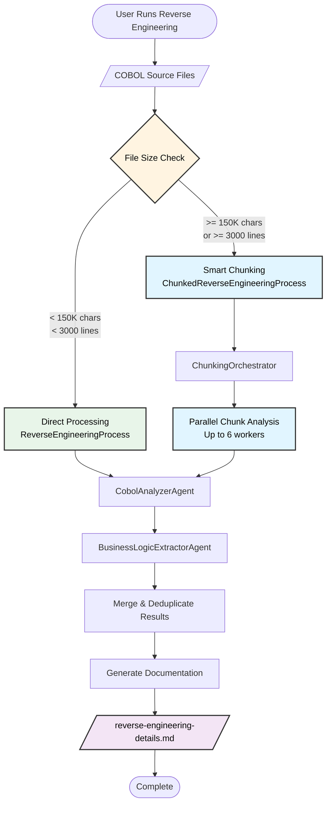
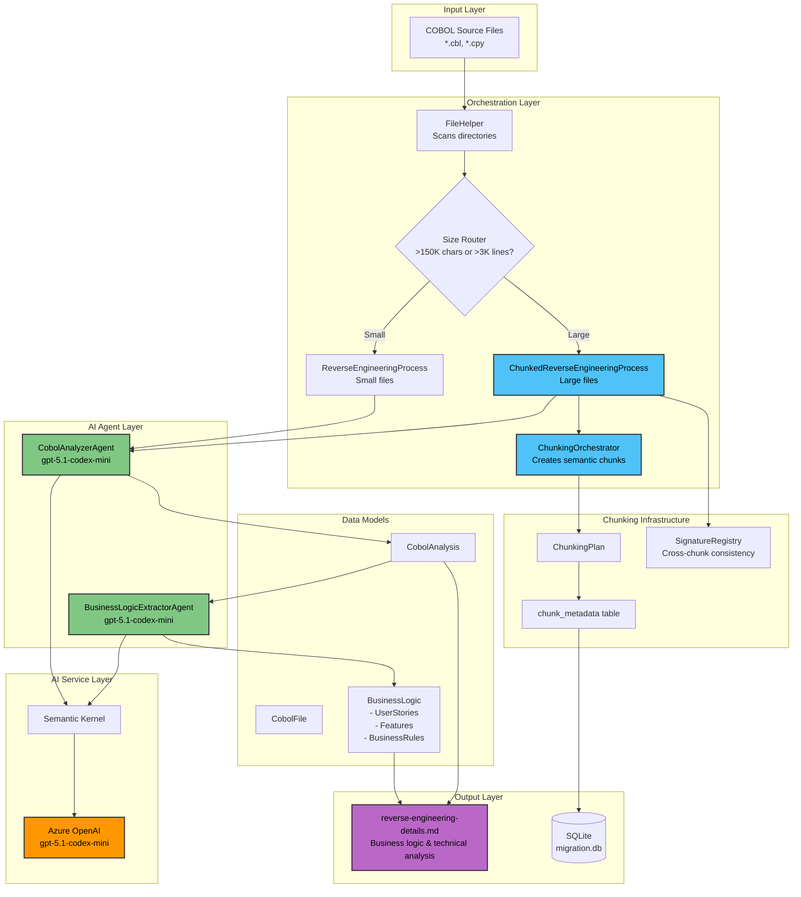
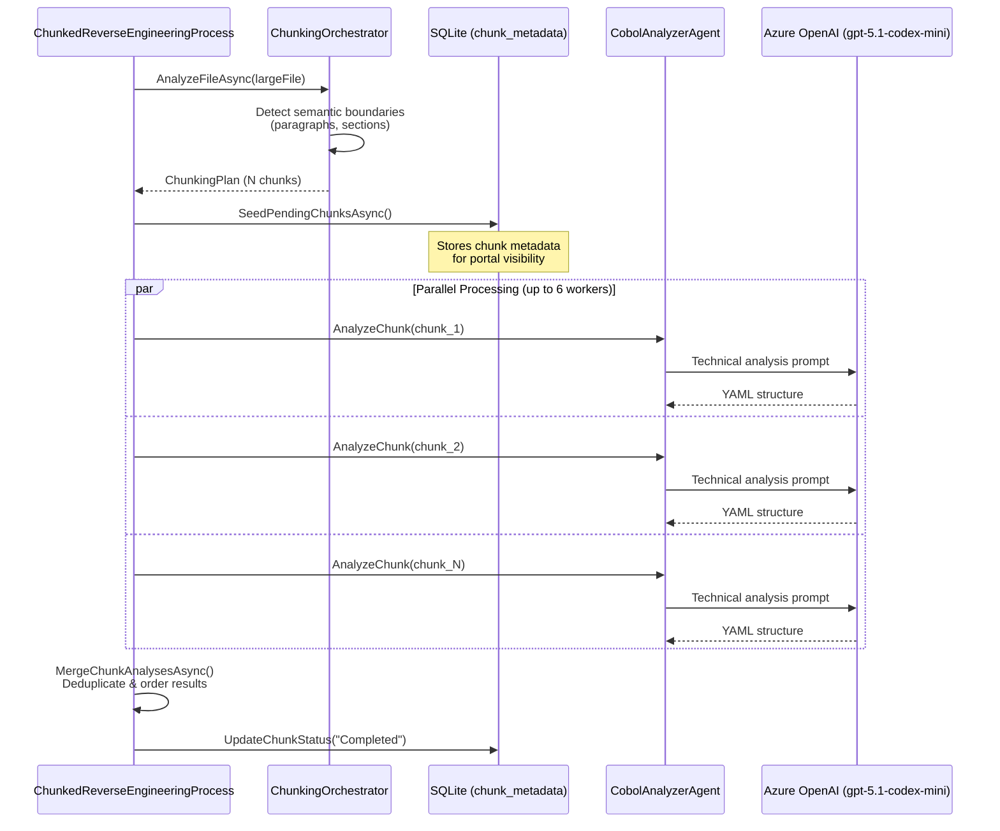
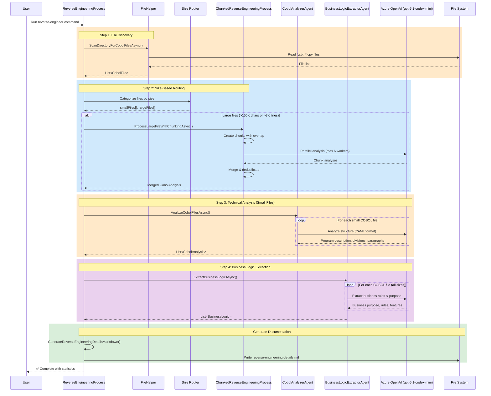
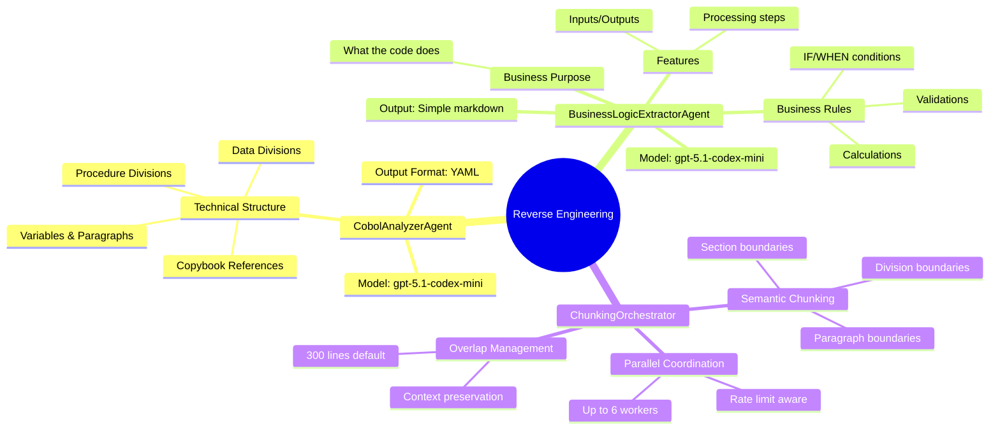
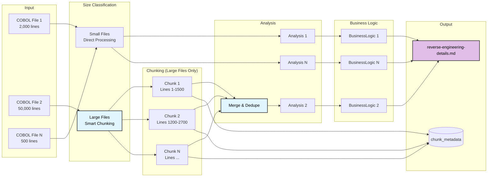
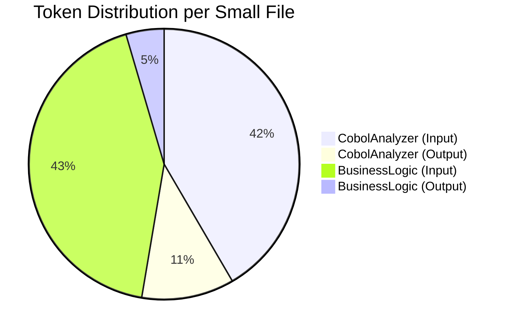

# Reverse Engineering Process Architecture

> **Version:** 0.2 (Smart Chunking)  
> **Last Updated:** December 2025

## Overview

The reverse engineering process extracts business logic from COBOL source code, generating comprehensive documentation. Version 0.2 introduces **Smart Chunking** for large files (>150K chars or >3000 lines), enabling analysis of enterprise-scale codebases.

## AI Models Used

| Component | Model | Purpose |
|-----------|-------|---------|
| COBOL Analyzer | `gpt-5.1-codex-mini` | Technical structure analysis (divisions, paragraphs, data) |
| Business Logic Extractor | `gpt-5.1-codex-mini` | Business rules, features, user stories extraction |
| Portal Chat | `gpt-5.1-chat` | Interactive Q&A about migration results |

**Configuration:** `Config/appsettings.json`
```json
{
  "AISettings": {
    "CobolAnalyzerModelId": "gpt-5.1-codex-mini",
    "ChatModelId": "gpt-5.1-chat",
    "MaxTokens": 16384,
    "Temperature": 0.1
  }
}
```

## High-Level Flow



## Detailed Architecture



## Smart Chunking (v0.2)

### When Chunking is Triggered

Files are automatically routed to `ChunkedReverseEngineeringProcess` when:
- Character count >= 150,000 chars, OR
- Line count >= 3,000 lines

### Chunking Configuration

From `Config/appsettings.json`:
```json
{
  "ChunkingSettings": {
    "MaxTokensPerChunk": 28000,
    "MaxLinesPerChunk": 1500,
    "OverlapLines": 300,
    "MinSemanticUnitSize": 50,
    "EnableChunking": true,
    "EnableParallelProcessing": true,
    "MaxParallelAnalysis": 6,
    "TokenBudgetPerMinute": 300000,
    "ParallelStaggerDelayMs": 2000
  }
}
```

### Chunking Process



### Semantic Boundary Detection

Chunks are split at COBOL semantic boundaries to preserve context:

1. **Division boundaries** (IDENTIFICATION, DATA, PROCEDURE)
2. **Section boundaries** (INPUT-OUTPUT SECTION, WORKING-STORAGE, etc.)
3. **Paragraph boundaries** (named paragraphs in PROCEDURE DIVISION)
4. **COPY statement boundaries**

Overlap lines (default: 300) ensure context is maintained across chunks.

## Step-by-Step Process Flow



## Agent Responsibilities



## Data Flow



## Key Design Decisions

### 1. **Automatic Size-Based Routing**
- Files are categorized based on character count (150K) and line count (3K)
- No manual chunking flags required - detection is automatic
- `SmartMigrationOrchestrator` handles routing for full migrations

### 2. **Parallel Processing**
- Large files: chunks processed in parallel (up to 6 workers)
- Multiple large files: also processed in parallel
- Rate limiting prevents API throttling (TokenBudgetPerMinute: 300,000)

### 3. **Semantic Boundary Detection**
- Chunks split at COBOL paragraph/section boundaries
- Overlap lines (300) maintain cross-chunk context
- Preserves COBOL structure semantics

### 4. **Simplified Prompts**
- Direct, actionable instructions to AI
- Removed complex classification systems
- Focus on extraction over categorization

### 5. **Unified Output**
- Single markdown file: `reverse-engineering-details.md`
- Combines business logic and technical analysis
- Focus on actionable documentation

### 6. **Agent Specialization**
- **CobolAnalyzerAgent**: Technical structure (what's in the code)
- **BusinessLogicExtractorAgent**: Business intent (what it means)

### 7. **Progress Visibility**
- Chunk metadata stored in SQLite for portal dashboard
- Real-time progress tracking via SSE updates
- Portal available at `http://localhost:5028`

## Performance Characteristics

### Small File (~1,000 lines)
- **File Discovery**: < 1 second
- **Technical Analysis**: ~30 seconds, ~3,000 tokens
- **Business Logic**: ~10 seconds, ~1,300 tokens
- **Documentation**: < 1 second
- **Total**: ~40 seconds per file

### Large File (~50,000 lines, chunked)
- **Chunking**: ~2 seconds
- **Parallel Analysis**: ~3-5 minutes (6 workers)
- **Merge & Dedupe**: ~2 seconds
- **Business Logic**: ~30 seconds
- **Total**: ~5-6 minutes per file

### Parallelization Benefits
| Workers | 50K LOC File | Speedup |
|---------|--------------|---------|
| 1 | ~30 min | 1x |
| 3 | ~12 min | 2.5x |
| 6 | ~6 min | 5x |

## Token Usage Pattern



### Rate Limiting Configuration
```json
{
  "RateLimitSettings": {
    "TokensPerMinute": 300000,
    "MaxInputTokens": 10000,
    "MaxOutputTokens": 16384,
    "MinDelayBetweenRequestsMs": 20000,
    "EnableAutoThrottle": true
  }
}
```

## Database Schema (Chunking)

### chunk_metadata Table
```sql
CREATE TABLE chunk_metadata (
    id INTEGER PRIMARY KEY,
    run_id INTEGER,
    source_file TEXT,
    chunk_index INTEGER,
    start_line INTEGER,
    end_line INTEGER,
    content_hash TEXT,
    status TEXT,  -- Pending, Processing, Completed, Failed
    tokens_used INTEGER,
    processing_time_ms INTEGER,
    created_at TEXT,
    completed_at TEXT
);
```

### signatures Table
```sql
CREATE TABLE signatures (
    id INTEGER PRIMARY KEY,
    run_id INTEGER,
    source_file TEXT,
    signature_type TEXT,  -- Class, Method, Interface
    signature_name TEXT,
    chunk_index INTEGER
);
```

## Portal Integration

The web portal at `http://localhost:5028` provides:

- **Chunks Tab**: Real-time progress of chunk processing
- **RE Report Tab**: Generated business logic documentation
- **Architecture Tab**: Mermaid diagrams from analysis
- **Chat**: Interactive Q&A about results (using `gpt-5.1-chat`)

## Future Enhancements

1. **Incremental Analysis**: Cache results, only re-analyze changed files
2. **Domain Glossary Integration**: Add business term definitions to improve accuracy
3. **Pattern Library**: Build reusable patterns from successful analyses
4. **Quality Metrics**: Score completeness and confidence of extractions
5. **Cross-File Analysis**: Detect patterns across multiple COBOL files
6. **Cost Tracking**: Per-run token usage and API cost reporting

## CLI Commands

```bash
# Run reverse engineering only
./doctor.sh reverse-eng

# Check chunking infrastructure health
./doctor.sh chunking-health

# Start portal to view results
./doctor.sh portal
```

## Troubleshooting

### Large File Not Chunking
- Check file size: `wc -l yourfile.cbl`
- Threshold: 150K chars OR 3000 lines
- Verify ChunkingSettings.EnableChunking = true

### Chunk Processing Slow
- Increase MaxParallelAnalysis (default: 6)
- Check TokenBudgetPerMinute matches your Azure quota
- Monitor rate limiting in logs

### Incomplete Results
- Check chunk_metadata table for Failed status
- Review Logs/ folder for error details
- Run `./doctor.sh chunking-health` for diagnostics
