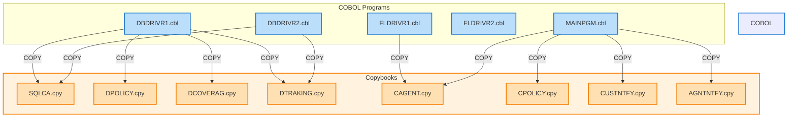

# COBOL Dependency Diagram

```mermaid
graph TB
  %% Subgraph: COBOL Programs
  subgraph COBOL Programs
    style COBOL Programs fill:#e3f2fd,stroke:#1976d2,stroke-width:2px
    DBDRIVR1["DBDRIVR1.cbl"]
    DBDRIVR2["DBDRIVR2.cbl"]
    FLDRIVR1["FLDRIVR1.cbl"]
    FLDRIVR2["FLDRIVR2.cbl"]
    MAINPGM["MAINPGM.cbl"]
    %% Program node styles
    style DBDRIVR1 fill:#bbdefb,stroke:#1976d2,stroke-width:2px
    style DBDRIVR2 fill:#bbdefb,stroke:#1976d2,stroke-width:2px
    style FLDRIVR1 fill:#bbdefb,stroke:#1976d2,stroke-width:2px
    style FLDRIVR2 fill:#bbdefb,stroke:#1976d2,stroke-width:2px
    style MAINPGM fill:#bbdefb,stroke:#1976d2,stroke-width:2px
  end

  %% Subgraph: Copybooks
  subgraph Copybooks
    style Copybooks fill:#fff3e0,stroke:#f57c00,stroke-width:2px
    SQLCA["SQLCA.cpy"]
    DPOLICY["DPOLICY.cpy"]
    DCOVERAG["DCOVERAG.cpy"]
    DTRAKING["DTRAKING.cpy"]
    CAGENT["CAGENT.cpy"]
    CPOLICY["CPOLICY.cpy"]
    CUSTNTFY["CUSTNTFY.cpy"]
    AGNTNTFY["AGNTNTFY.cpy"]
    %% Copybook node styles
    style SQLCA fill:#ffe0b2,stroke:#f57c00,stroke-width:2px
    style DPOLICY fill:#ffe0b2,stroke:#f57c00,stroke-width:2px
    style DCOVERAG fill:#ffe0b2,stroke:#f57c00,stroke-width:2px
    style DTRAKING fill:#ffe0b2,stroke:#f57c00,stroke-width:2px
    style CAGENT fill:#ffe0b2,stroke:#f57c00,stroke-width:2px
    style CPOLICY fill:#ffe0b2,stroke:#f57c00,stroke-width:2px
    style CUSTNTFY fill:#ffe0b2,stroke:#f57c00,stroke-width:2px
    style AGNTNTFY fill:#ffe0b2,stroke:#f57c00,stroke-width:2px
  end

  %% Dependencies
  DBDRIVR1 -->|COPY| SQLCA
  DBDRIVR1 -->|COPY| DPOLICY
  DBDRIVR1 -->|COPY| DCOVERAG
  DBDRIVR1 -->|COPY| DTRAKING

  DBDRIVR2 -->|COPY| SQLCA
  DBDRIVR2 -->|COPY| DTRAKING

  FLDRIVR1 -->|COPY| CAGENT

  MAINPGM -->|COPY| CPOLICY
  MAINPGM -->|COPY| CAGENT
  MAINPGM -->|COPY| CUSTNTFY
  MAINPGM -->|COPY| AGNTNTFY
```