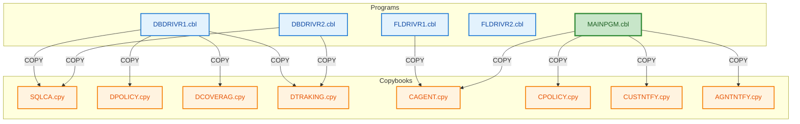

# COBOL Dependency Diagram

```mermaid
graph TB
  %% Styles
  classDef program fill:#e3f2fd,stroke:#1976d2,stroke-width:2px,color:#0d47a1;
  classDef copybook fill:#fff3e0,stroke:#f57c00,stroke-width:2px,color:#e65100;
  classDef mainProgram fill:#c8e6c9,stroke:#388e3c,stroke-width:3px,color:#1b5e20;

  %% Programs Subgraph
  subgraph Programs
    direction TB
    DBDRIVR1["DBDRIVR1.cbl"]
    DBDRIVR2["DBDRIVR2.cbl"]
    FLDRIVR1["FLDRIVR1.cbl"]
    FLDRIVR2["FLDRIVR2.cbl"]
    MAINPGM["MAINPGM.cbl"]
  end

  %% Copybooks Subgraph
  subgraph Copybooks
    direction TB
    SQLCA["SQLCA.cpy"]
    DPOLICY["DPOLICY.cpy"]
    DCOVERAG["DCOVERAG.cpy"]
    DTRAKING["DTRAKING.cpy"]
    CAGENT["CAGENT.cpy"]
    CPOLICY["CPOLICY.cpy"]
    CUSTNTFY["CUSTNTFY.cpy"]
    AGNTNTFY["AGNTNTFY.cpy"]
  end

  %% Dependencies
  DBDRIVR1 -->|COPY| SQLCA
  DBDRIVR1 -->|COPY| DPOLICY
  DBDRIVR1 -->|COPY| DCOVERAG
  DBDRIVR1 -->|COPY| DTRAKING

  DBDRIVR2 -->|COPY| SQLCA
  DBDRIVR2 -->|COPY| DTRAKING

  FLDRIVR1 -->|COPY| CAGENT

  MAINPGM -->|COPY| CPOLICY
  MAINPGM -->|COPY| CAGENT
  MAINPGM -->|COPY| CUSTNTFY
  MAINPGM -->|COPY| AGNTNTFY

  %% Assign styles
  class DBDRIVR1,DBDRIVR2,FLDRIVR1,FLDRIVR2 program;
  class MAINPGM mainProgram;
  class SQLCA,DPOLICY,DCOVERAG,DTRAKING,CAGENT,CPOLICY,CUSTNTFY,AGNTNTFY copybook;
```