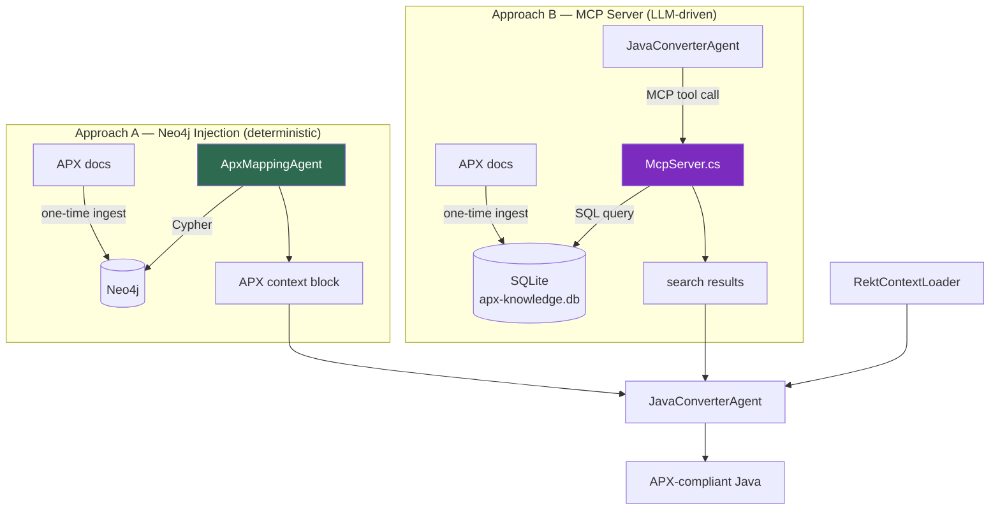
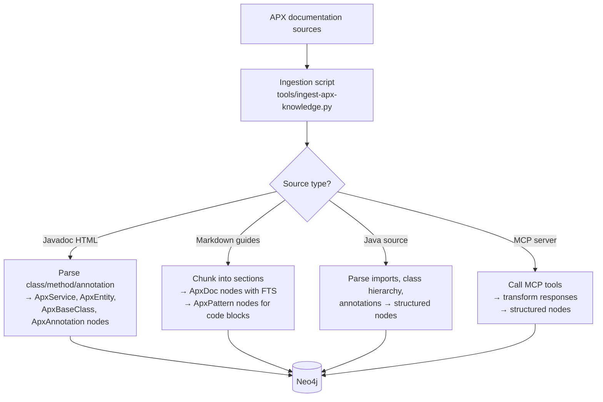
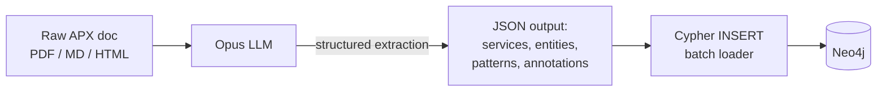
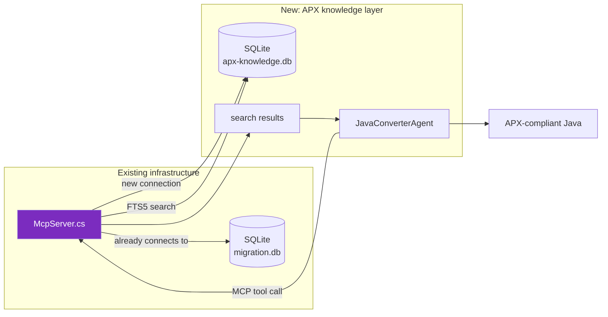
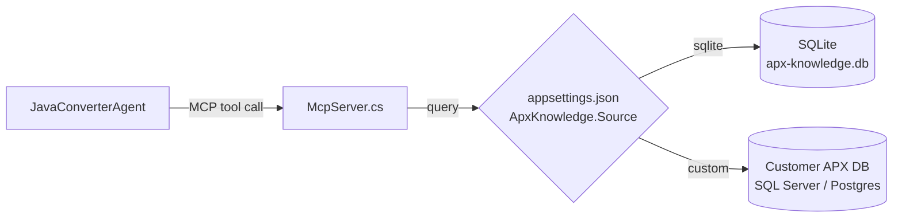

# APX Mapping Agent — Implementation Plan

**Last updated**: 2026-05-21

## Overview

This document describes two independent approaches for injecting Java APX framework knowledge into the COBOL-to-Java conversion pipeline. Both solve the same problem — making the converter generate APX-compliant Java instead of generic Quarkus — but they differ in architecture, determinism, and effort.

| | Approach A: Neo4j Injection | Approach B: MCP Server |
|---|---|---|
| **How** | Deterministic agent pre-queries Neo4j, injects APX context into the converter prompt | LLM calls MCP tools mid-conversation to search an APX SQLite database |
| **Who decides what data to use** | Code (Cypher queries) | LLM (chooses when/what to ask) |
| **Deterministic** | ✅ Yes | ❌ No — LLM may skip lookups or ask wrong questions |
| **Extra LLM cost** | None — no LLM calls for APX lookup | Adds tool-call tokens per conversion |
| **Infrastructure** | Reuses existing REKT Neo4j container | Reuses existing `McpServer.cs` + SQLite |
| **Best for** | Production migrations where correctness matters | Exploratory / ad-hoc conversions where flexibility matters |
| **Effort** | ~3 days | ~2 days |

**Recommendation**: Use **Approach A** for the conversion pipeline (deterministic, reliable). Use **Approach B** for interactive chat / Q&A about APX in the portal. Both can coexist — the hybrid gives deterministic baseline + flexible edge-case handling.



---

# Approach A — Neo4j Injection (Deterministic)

The `ApxMappingAgent` is a non-LLM agent that queries the REKT Neo4j graph for APX knowledge and produces a structured context block. This block is injected into the converter prompt alongside REKT data — no LLM decides what to include.

## A1 — Neo4j schema for APX knowledge

### Node labels

| Label | Properties | Description |
|---|---|---|
| `:ApxService` | `name`, `package`, `baseClass`, `description`, `lifecycle` | A service class in the APX framework |
| `:ApxEntity` | `name`, `package`, `baseClass`, `tableName`, `description` | A JPA/data entity in APX |
| `:ApxDto` | `name`, `package`, `fields[]`, `description` | A data transfer object |
| `:ApxPattern` | `type`, `name`, `template`, `description`, `example` | A code pattern (batch job, event handler, REST endpoint, etc.) |
| `:ApxBaseClass` | `name`, `package`, `methods[]`, `description` | A base class or interface to extend |
| `:ApxAnnotation` | `name`, `package`, `usage`, `description` | Framework-specific annotations |
| `:ApxConfig` | `key`, `value`, `description` | Configuration conventions |
| `:ApxDoc` | `title`, `section`, `content`, `source` | Raw documentation chunks for FTS |

### Relationship types

| Relationship | From → To | Description |
|---|---|---|
| `EXTENDS` | `:ApxService` → `:ApxBaseClass` | Service extends a base class |
| `USES_ENTITY` | `:ApxService` → `:ApxEntity` | Service operates on an entity |
| `USES_DTO` | `:ApxService` → `:ApxDto` | Service accepts/returns a DTO |
| `IMPLEMENTS_PATTERN` | `:ApxService` → `:ApxPattern` | Service follows a pattern |
| `ANNOTATED_WITH` | `:ApxService`/`:ApxEntity` → `:ApxAnnotation` | Framework annotation usage |
| `MAPS_FROM_COBOL` | `:CobolFile` → `:ApxService` | Target-architecture mapping |
| `MAPS_FROM_DATA` | `:DataStructure` → `:ApxEntity`/`:ApxDto` | Data structure mapping |

### Example Cypher

```cypher
// Create an APX service node
CREATE (:ApxService {
  name: 'AccountService',
  package: 'com.example.apx.account',
  baseClass: 'ApxBaseService',
  description: 'Handles account lifecycle operations',
  lifecycle: 'singleton'
})

// Link a COBOL program to its APX target
MATCH (c:CobolFile {name: 'ACCTMGR.cbl'})
MATCH (s:ApxService {name: 'AccountService'})
CREATE (c)-[:MAPS_FROM_COBOL {wave: 1, strategy: 'rearchitect'}]->(s)

// Query: what APX context does a program need?
MATCH (c:CobolFile {name: $programName})-[:MAPS_FROM_COBOL]->(s:ApxService)
OPTIONAL MATCH (s)-[:EXTENDS]->(b:ApxBaseClass)
OPTIONAL MATCH (s)-[:USES_ENTITY]->(e:ApxEntity)
OPTIONAL MATCH (s)-[:USES_DTO]->(d:ApxDto)
OPTIONAL MATCH (s)-[:IMPLEMENTS_PATTERN]->(p:ApxPattern)
OPTIONAL MATCH (s)-[:ANNOTATED_WITH]->(a:ApxAnnotation)
RETURN s, b, collect(DISTINCT e) AS entities,
       collect(DISTINCT d) AS dtos,
       collect(DISTINCT p) AS patterns,
       collect(DISTINCT a) AS annotations
```

---

## A2 — Ingest APX documentation into Neo4j

### Data sources

| Source | Format | What it contains |
|---|---|---|
| APX Javadoc | HTML / JSON | Class hierarchy, method signatures, annotations |
| APX developer guides | Markdown / PDF | Patterns, best practices, architecture decisions |
| APX sample projects | Java source | Concrete implementation examples |

### Ingestion pipeline



### Ingest script: `tools/ingest-apx-knowledge.py`

```
Usage:
  python tools/ingest-apx-knowledge.py \
    --neo4j-uri bolt://localhost:7688 \
    --neo4j-user neo4j \
    --neo4j-pass cobol-rekt-2026 \
    --javadoc-dir  /path/to/apx-javadoc/ \
    --guides-dir   /path/to/apx-guides/ \
    --source-dir   /path/to/apx-samples/ \
    --mcp-endpoint http://localhost:3000  \
    --scan-run-id  APX-001
```

Each source type is optional — supply whatever you have.

### Using an LLM (Opus) to accelerate ingestion

For unstructured documentation (PDFs, markdown guides, mixed-format docs), an LLM can dramatically speed up the ingestion by extracting structured data:



**How it works**:

1. **Chunk** the raw documentation into manageable sections (~2-4K tokens each)
2. **Send** each chunk to Claude Opus with a structured extraction prompt:
   ```
   Extract all Java APX framework classes, services, entities, DTOs,
   patterns, annotations, and their relationships from this documentation.
   Return as JSON with this schema: { services: [...], entities: [...],
   patterns: [...], annotations: [...], relationships: [...] }
   ```
3. **Validate** the JSON output (schema check, dedup)
4. **Load** into Neo4j via parameterized Cypher

**Estimated time** (for a typical APX documentation set of ~500 pages):
- Opus processing: ~20-30 minutes (parallel chunks)
- Neo4j loading: ~2 minutes
- Manual review/fixup: ~1 hour
- **Total: ~2 hours vs 2-3 days manual extraction**

This is a one-time cost. The knowledge graph is then reused for every conversion run.

---

## A3 — The `ApxMappingAgent` (C#)

### Location

`Agents/ApxMappingAgent.cs`

### Interface

```csharp
public class ApxMappingAgent
{
    // No LLM — pure graph query
    public async Task<ApxContext?> GetApxContextAsync(
        string programName,
        RektContext? rektContext)
    {
        // 1. Query Neo4j for COBOL → APX mapping
        // 2. Query Neo4j for APX service details (base class, entities, DTOs)
        // 3. Query Neo4j for relevant APX patterns
        // 4. Query Neo4j for relevant APX documentation chunks
        // 5. Assemble into ApxContext
    }
}
```

### `ApxContext` data model

```csharp
public class ApxContext
{
    public ApxServiceInfo? TargetService { get; set; }
    public List<ApxEntityInfo> Entities { get; set; } = new();
    public List<ApxDtoInfo> Dtos { get; set; } = new();
    public List<ApxPatternInfo> Patterns { get; set; } = new();
    public List<string> Annotations { get; set; } = new();
    public string? BaseClassName { get; set; }
    public string? BaseClassPackage { get; set; }
    public List<string> RelevantDocs { get; set; } = new();
}
```

### Prompt injection

The `ApxContext` is rendered into a prompt block and injected alongside the REKT block:

```
═══════════════ APX TARGET FRAMEWORK CONTEXT ═══════════════
TARGET SERVICE: AccountService extends ApxBaseService
  Package: com.example.apx.account
  Lifecycle: singleton

BASE CLASS CONTRACT:
  - Extend ApxBaseService (provides transaction management, logging)
  - Override processRequest(ApxRequest) → ApxResponse
  - Use @ApxService annotation on class
  - Use @ApxTransaction on methods that modify data

TARGET ENTITIES (use these instead of inventing):
  - AccountEntity (table: ACCOUNTS) — id, accountNumber, balance, status
  - TransactionEntity (table: TRANSACTIONS) — id, accountId, amount, type

PATTERNS TO FOLLOW:
  - Batch Job: extend ApxBatchJob, implement execute(ApxJobContext)
  - Error Handling: throw ApxBusinessException(code, message) for business errors
    DO NOT use generic RuntimeException

APX ANNOTATIONS (use these, not generic Jakarta):
  - @ApxService → replaces @ApplicationScoped
  - @ApxEntity → replaces @Entity
  - @ApxRepository → replaces @Inject on repository fields
═════════════════════════════════════════════════════════════

GROUND TRUTH — do not invent APX classes, annotations, or patterns
that are not listed above. If no APX mapping exists for a COBOL
construct, use standard Jakarta/Quarkus conventions and add a
TODO comment.
```

---

## A4 — Integration into the conversion pipeline

### Changes needed

| File | Change |
|---|---|
| `Agents/ApxMappingAgent.cs` | New file — the agent itself |
| `Helpers/ApxContext.cs` | New file — data model |
| `Helpers/RektPromptInjector.cs` | Add `InjectApxContext()` method |
| `Agents/JavaConverterAgent.cs` | Call `ApxMappingAgent` before conversion, pass result to injector |
| `doctor.sh` | Add `--apx-framework` flag to enable APX mode |
| `Config/appsettings.json` | Add APX Neo4j connection settings |
| `tools/ingest-apx-knowledge.py` | New file — ingestion script |
| `doctor.sh` | Add `apx-ingest` command |

### CLI usage

```bash
# One-time: ingest APX documentation into Neo4j
./doctor.sh apx-ingest --javadoc-dir /path/to/apx-javadoc --guides-dir /path/to/guides

# Convert with APX framework targeting
./doctor.sh convert-only --program ACCTMGR --target java --apx-framework --no-portal
```

### Estimated effort (Approach A)

| Step | Work | Time |
|---|---|---|
| A1. Neo4j schema | Cypher constraints + indexes | 2 hours |
| A2. Ingestion script | Python script + Opus extraction | 1 day |
| A3. ApxMappingAgent | C# agent + context model | 1 day |
| A4. Pipeline integration | Injector + CLI flags + tests | 0.5 day |
| **Total** | | **~3 days** |

---

---

# Approach B — MCP Server with SQLite (LLM-driven)

This approach reuses the existing `Mcp/McpServer.cs` infrastructure that already talks to SQLite for migration data. Instead of pre-loading APX context deterministically, the converter agent **calls MCP tools mid-conversation** to search an APX knowledge database. The LLM decides what to look up and when.

> **Important**: This means the LLM controls what APX data gets used. It may ask the wrong question, skip a lookup, or misinterpret results. This is acceptable for exploratory work and interactive chat, but less reliable than Approach A for production migrations.



## B1 — APX knowledge database (SQLite)

Create `Data/apx-knowledge.db` alongside the existing `migration.db`:

```sql
-- APX class registry
CREATE TABLE apx_classes (
    id INTEGER PRIMARY KEY,
    name TEXT NOT NULL,
    package TEXT,
    type TEXT CHECK(type IN ('service','entity','dto','base_class','annotation','interface')),
    base_class TEXT,
    description TEXT,
    example_code TEXT,
    javadoc_url TEXT
);

-- Code patterns and templates
CREATE TABLE apx_patterns (
    id INTEGER PRIMARY KEY,
    type TEXT NOT NULL,   -- batch-job, rest-endpoint, event-handler, repository
    name TEXT NOT NULL,
    template TEXT,        -- code template with placeholders
    description TEXT,
    when_to_use TEXT
);

-- COBOL → APX mapping rules
CREATE TABLE apx_cobol_mappings (
    id INTEGER PRIMARY KEY,
    cobol_construct TEXT NOT NULL,  -- e.g. 'EXEC SQL CURSOR', 'CALL USING', 'PERFORM VARYING'
    apx_equivalent TEXT NOT NULL,  -- e.g. 'ApxRepository.findAll()', '@ApxScheduled', 'for loop'
    notes TEXT
);

-- Full-text search over documentation
CREATE VIRTUAL TABLE apx_docs USING fts5(
    title, section, content, source,
    tokenize='porter unicode61'
);

-- Class relationships
CREATE TABLE apx_class_relations (
    from_class TEXT NOT NULL,
    to_class TEXT NOT NULL,
    relation TEXT CHECK(relation IN ('extends','implements','uses','contains','depends_on')),
    PRIMARY KEY (from_class, to_class, relation)
);
```

## B2 — Add APX tools to the existing MCP server

The existing `Mcp/McpServer.cs` has an empty tools array. Add APX-specific tools that query the SQLite database:

```csharp
// In McpServer.cs → HandleToolsListAsync
var tools = new JsonArray
{
    BuildTool("apx_search_docs", "Search APX framework documentation",
        new JsonObject {
            ["query"] = BuildParam("string", "Search query, e.g. 'batch job base class'"),
            ["category"] = BuildParam("string", "Optional: service|entity|pattern|annotation")
        }),
    BuildTool("apx_get_class", "Get APX class details by name",
        new JsonObject {
            ["className"] = BuildParam("string", "APX class name, e.g. 'ApxBaseService'")
        }),
    BuildTool("apx_get_pattern", "Get APX code pattern by type",
        new JsonObject {
            ["patternType"] = BuildParam("string", "Pattern type: batch-job|rest-endpoint|event-handler|repository")
        }),
    BuildTool("apx_map_cobol_construct", "Find APX equivalent for a COBOL construct",
        new JsonObject {
            ["construct"] = BuildParam("string", "COBOL construct, e.g. 'EXEC SQL CURSOR'")
        })
};
```

Tool handlers query the APX SQLite database:

```csharp
// In McpServer.cs → HandleToolsCallAsync
case "apx_search_docs":
    var query = args.GetProperty("query").GetString();
    var results = await _apxDb.QueryAsync(
        "SELECT title, content FROM apx_docs WHERE apx_docs MATCH $query LIMIT 5", query);
    await WriteToolResultAsync(request.Id, FormatResults(results));
    break;

case "apx_get_class":
    var className = args.GetProperty("className").GetString();
    var cls = await _apxDb.QueryAsync(
        "SELECT * FROM apx_classes WHERE name = $name", className);
    await WriteToolResultAsync(request.Id, FormatResults(cls));
    break;

case "apx_get_pattern":
    var patternType = args.GetProperty("patternType").GetString();
    var patterns = await _apxDb.QueryAsync(
        "SELECT * FROM apx_patterns WHERE type = $type", patternType);
    await WriteToolResultAsync(request.Id, FormatResults(patterns));
    break;

case "apx_map_cobol_construct":
    var construct = args.GetProperty("construct").GetString();
    var mapping = await _apxDb.QueryAsync(
        "SELECT * FROM apx_cobol_mappings WHERE cobol_construct LIKE $construct", construct);
    await WriteToolResultAsync(request.Id, FormatResults(mapping));
    break;
```

## B3 — Connecting the customer's own APX database

If the customer already has their APX documentation in a database (SQL Server, PostgreSQL, etc.), the MCP server can front it via a configurable connection:



Configuration in `appsettings.json`:

```json
{
  "ApxKnowledge": {
    "Enabled": true,
    "Source": "sqlite",
    "SqlitePath": "Data/apx-knowledge.db",
    "CustomConnectionString": ""
  }
}
```

The MCP tools abstract the data source — the LLM calls `apx_search_docs` regardless of where the data lives.

### Estimated effort (Approach B)

| Step | Work | Time |
|---|---|---|
| B1. SQLite schema + ingestion | Create DB, ingest docs with Opus | 0.5 day |
| B2. MCP tools | Add 4 tools to McpServer.cs | 0.5 day |
| B3. Custom DB support | Configurable connection string | 0.5 day |
| **Total** | | **~1.5 days** |

---

---

# Using Opus to populate the APX knowledge base

Both approaches need APX documentation to be ingested into a structured store (Neo4j or SQLite). An LLM like Opus can do this quickly.

### How it works

1. **Gather** raw APX docs (Javadoc HTML, markdown guides, PDF, sample Java projects) into a folder
2. **Chunk** into sections of ~2-4K tokens each
3. **Send** each chunk to Opus with a structured extraction prompt:
   ```
   Extract all Java APX framework classes, services, entities, DTOs,
   patterns, annotations, and their relationships from this documentation.
   Return as JSON: { services: [...], entities: [...], patterns: [...],
   annotations: [...], relationships: [...] }
   ```
4. **Validate** the JSON (schema check, dedup)
5. **Load** into Neo4j (Approach A) or SQLite (Approach B) via batch inserts

### Estimated time for a typical APX documentation set (~500 pages)

| Step | Time |
|---|---|
| Opus extraction (parallel chunks) | 20-30 minutes |
| Neo4j / SQLite loading | 2 minutes |
| Manual review and corrections | 1 hour |
| **Total** | **~2 hours** |

This is a one-time cost. Compare to 2-3 days of manual extraction.

---

# Combining both approaches (hybrid)

For maximum reliability, use both:

| Layer | What it does | When it fires |
|---|---|---|
| **Approach A** (deterministic) | `ApxMappingAgent` pre-queries Neo4j, injects known APX context | Always — before the LLM sees the prompt |
| **Approach B** (LLM-driven) | Converter calls MCP tools for edge cases not covered by pre-loaded context | On demand — LLM decides during conversion |

This gives you a guaranteed deterministic baseline (90% of cases) plus flexible LLM-driven lookup for the remaining 10%.

---

## Open questions

1. **APX version** — Which APX version/release to target? The schema supports versioning via scan-run IDs.
2. **Mapping granularity** — Map at program level (1 COBOL program → 1 APX service) or section level (COBOL sections → APX methods)?
3. **Shared vs per-project** — Should the APX knowledge graph be shared across projects or per-customer?
4. **Customer DB access** — Does the customer already have an APX documentation database, and in what format?
