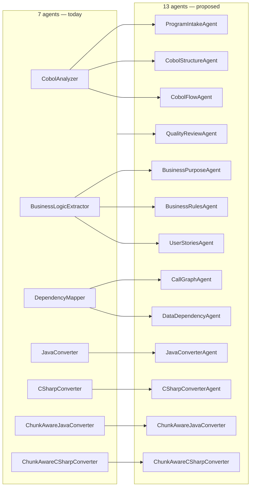

# Splitting the 7 Current Agents into 13 Finer-Grained Agents

**Last updated**: 2026-05-07

This is an implementation plan for refactoring the framework's runtime LLM agents from **7 broad agents** into **13 finer-grained agents** that do the same total work, just split along sharper responsibility boundaries. It is a planning document — nothing is changed yet.

The headline number: **medium complexity, ~2 weeks of focused work end-to-end**, of which roughly half is new agent code and half is touching the orchestration, logging, prompts, and tests around them. The structural cost is dominated by the orchestrator changes, not by the agents themselves — `AgentBase` already absorbs almost all the per-agent ceremony (chat-client, rate-limit, token budget, retry, logging), so adding new agents is mostly new prompts + thin adapters.

---

## 1. Where we are today

| # | Agent | LOC | Interface | Prompt |
|---|---|---:|---|---|
| 1 | `CobolAnalyzerAgent` | 773 | `ICobolAnalyzerAgent` | `CobolAnalyzer.md` |
| 2 | `BusinessLogicExtractorAgent` | — | `IBusinessLogicExtractorAgent` | `BusinessLogicExtractor.md` |
| 3 | `DependencyMapperAgent` | 506 | `IDependencyMapperAgent` | `DependencyMapper.md` |
| 4 | `JavaConverterAgent` | 473 | `IJavaConverterAgent` (`ICodeConverterAgent`) | `JavaConverter.md` |
| 5 | `CSharpConverterAgent` | — | `ICodeConverterAgent` | `CSharpConverter.md` |
| 6 | `ChunkAwareJavaConverter` | 536 | `IChunkAwareConverter` | `ChunkAwareJavaConverter.md` |
| 7 | `ChunkAwareCSharpConverter` | — | `IChunkAwareConverter` | `ChunkAwareCSharpConverter.md` |

Shared infrastructure (no change required):

```
Agents/Infrastructure/
  AgentBase.cs           1,327 LOC  (token-budget, retry, logging, rate-limit, model-profile)
  CodeAgentBase.cs         240 LOC  (Responses API base for codex/reasoning models)
  ChatClientFactory.cs     264 LOC  (provider selection: Azure OpenAI / Copilot / OpenAI)
  CopilotChatClient.cs     307 LOC
  ResponsesApiClient.cs    845 LOC
```

Orchestrators that consume the agents (the *real* surface area of any change):

```
Processes/
  MigrationProcess.cs            549 LOC
  ChunkedMigrationProcess.cs   1,227 LOC
  ReverseEngineeringProcess.cs   440 LOC
  ChunkedReverseEngineeringProcess.cs   865 LOC
  SmartMigrationOrchestrator.cs   442 LOC
  RunMcpServerProcess.cs         1,004 LOC
```

> If you skip nothing else in this document, internalise this: **the orchestrators are the bottleneck for any agent split, not the agents themselves.**

---

## 2. The proposed 13-agent layout

Same total work, finer responsibilities. One natural split per existing agent, motivated by what each agent currently does in one giant prompt:



| # | New agent | Replaces / splits from | What it owns |
|---|---|---|---|
| 1 | `ProgramIntakeAgent` | `CobolAnalyzer` § 1 | Header parsing, divisions, env section, model-card-style summary |
| 2 | `CobolStructureAgent` | `CobolAnalyzer` § 2 | Sections, paragraphs, copybook layout, working-storage |
| 3 | `CobolFlowAgent` | `CobolAnalyzer` § 3 | Procedure division logic, IF/EVALUATE/PERFORM trees |
| 4 | `BusinessPurposeAgent` | `BusinessLogicExtractor` § 1 | One-paragraph purpose + domain classification |
| 5 | `BusinessRulesAgent` | `BusinessLogicExtractor` § 2 | Atomic rules with citations to source lines |
| 6 | `UserStoriesAgent` | `BusinessLogicExtractor` § 3 | "As a … I want … so that …" stories |
| 7 | `CallGraphAgent` | `DependencyMapper` § 1 | CALL chains, CICS LINK/XCTL, MAP/TRANSACTION mapping |
| 8 | `DataDependencyAgent` | `DependencyMapper` § 2 | DB tables, files, copybook usage matrix |
| 9 | `JavaConverterAgent` | unchanged | Direct Java rewrite for sub-threshold programs |
| 10 | `CSharpConverterAgent` | unchanged | Direct C# rewrite for sub-threshold programs |
| 11 | `ChunkAwareJavaConverter` | unchanged | Above-threshold Java conversion via Smart Chunking |
| 12 | `ChunkAwareCSharpConverter` | unchanged | Above-threshold C# conversion via Smart Chunking |
| 13 | `QualityReviewAgent` | new | Reads converted output + source, scores fidelity 0–10, lists gaps |

This split is intentionally **one new agent for each independent decision the model is being asked to make**. Today's broad prompts ask for many decisions in one pass; quality drops when any one of them is hard. Splitting lets us:
- Pin a specific model per agent (e.g. cheaper haiku for Intake, deep reasoning for Rules)
- Cache outputs at finer granularity (no need to re-run the whole analyser when only the rules need refresh)
- Score and improve prompts independently in Prompt Studio
- Run agents in parallel where their outputs are independent (Intake/Structure/Flow are independent; Purpose/Rules/Stories are independent)

The converters (9–12) stay as-is. They're not where the win is. The win is in the analytical and review layers.

---

## 3. Per-piece complexity estimate

Effort points (1 ≈ half a developer-day of focused work, no calendar dates).

### 3.1 New agent code (low complexity, 1 point each ≈ 6 points)

For each new agent (1–8 + 13):
- New interface file `Agents/Interfaces/I<Name>Agent.cs` (~30 LOC)
- New implementation file `Agents/<Name>Agent.cs` deriving from `AgentBase` (~100–200 LOC, mostly the static factory + one `RunAsync` method)
- New prompt file `Agents/Prompts/<Name>.md` with `## SECTION: System` / `## SECTION: User` blocks
- DI registration in `Program.cs` (1 line)
- Quality-score row added to `Agents/Prompts/.prompt-scores.json`

`AgentBase` (1,327 LOC) already provides everything else: `ExecuteChatCompletionAsync`, token-budget calculation, retry on truncation, structured logging, rate-limiter, model-profile resolution. Each new agent really is **~100 LOC + a Markdown prompt**.

**Effort: ~6 points** (six new agents × 1; thirteenth = QualityReviewAgent costs 2 because it has its own scoring logic).

### 3.2 Strongly-typed I/O between split agents (medium, ~3 points)

Today, each broad agent returns one `Cobol*` object that wraps everything. Splitting means we need explicit data types passed *between* the split agents:

```csharp
// New, finer types under Models/
public sealed record ProgramIntake(string Header, string ProgramId, IReadOnlyList<string> Divisions, …);
public sealed record CobolStructure(IReadOnlyList<Section> Sections, …);
public sealed record CobolFlow(IReadOnlyList<ParagraphFlow> Paragraphs, …);
// And merged types the converter still expects:
public sealed record CobolAnalysis(ProgramIntake Intake, CobolStructure Structure, CobolFlow Flow, …);
```

Plus a `CobolAnalysisAssembler` that merges the three intake/structure/flow outputs into the legacy `CobolAnalysis` shape so the converters don't have to change (this is the single most important compatibility hinge).

**Effort: ~3 points.**

### 3.3 Orchestrator surgery (medium-high, ~5 points)

This is the real cost. Six orchestration files reference the current agents directly:

| File | Touch points |
|---|---|
| `Processes/MigrationProcess.cs` | ~5 changes — replace each old agent call with the chained new-agent calls + assembler |
| `Processes/ChunkedMigrationProcess.cs` | ~8 changes — same, plus chunking-aware variants |
| `Processes/ReverseEngineeringProcess.cs` | ~4 changes |
| `Processes/ChunkedReverseEngineeringProcess.cs` | ~6 changes |
| `Processes/SmartMigrationOrchestrator.cs` | ~3 changes |
| `Processes/RunMcpServerProcess.cs` | ~2 changes (just constructor wiring) |

**Strategy**: introduce the new agents *additively* behind a feature flag. Keep the old `CobolAnalyzerAgent` etc. working until the new chain is wired and tested; flip the flag when parity is verified. Deletes happen last, in a separate PR.

```csharp
// Pattern in each orchestrator
var analysis = settings.UseSplitAgents
    ? await _analysisAssembler.RunAsync(intakeA, structureA, flowA, file, ct)
    : await _legacyAnalyzer.AnalyzeAsync(file, ct);
```

**Effort: ~5 points.**

### 3.4 Persistence and run history (low-medium, ~2 points)

`HybridMigrationRepository` writes per-agent metadata into SQLite. Today the schema implicitly assumes 7 agents (one row in `analyses`, one in `business_logic`, one per converted file). After the split:
- Either keep the same table shape and have `CobolAnalysisAssembler` produce the legacy DTO (recommended — zero schema changes)
- Or add per-sub-agent tracking (e.g. a new `agent_runs(run_id, agent_name, started_at, completed_at, tokens_in, tokens_out, model, score)` table)

Option 1 is the safe default; Option 2 is a clean win for prompt-quality dashboards but is its own ~2-point task.

**Effort: ~2 points** (Option 1) or +2 if you want Option 2 too.

### 3.5 Concurrency tuning (low, ~1 point)

The splits unlock parallelism: Intake/Structure/Flow are independent given the same source; Purpose/Rules/Stories are independent given the same analysis. Today the orchestrator runs agents sequentially per file. The new chain should `Task.WhenAll(intakeT, structureT, flowT)` then `Task.WhenAll(purposeT, rulesT, storiesT)` — one extra knob: the rate-limiter must account for these now-parallel calls per program (today's limiter is per-agent; needs to become per-model).

**Effort: ~1 point.**

### 3.6 Prompt Studio integration (low, ~1 point)

Prompt Studio reads `Agents/Prompts/*.md` and the `.prompt-scores.json` automatically. Adding 6 new files = 6 new rows in the studio UI, no code change. The only adjustment is a sensible default ordering — group by phase (Intake → Analysis → Conversion → Review) so the UI doesn't drown.

**Effort: ~1 point.**

### 3.7 Tests (medium, ~3 points)

For each new agent, mirror the existing `CobolToQuarkusMigration.Tests/Agents/<Name>AgentTests.cs` pattern:
- Mock `IChatClient` to return a canned response
- Assert the agent's `RunAsync` parses the response into the expected DTO
- Add a parity test that runs the new chain *and* the legacy `CobolAnalyzerAgent` against the same input fixture and asserts the assembled `CobolAnalysis` matches (this is the safety-net for the migration)

**Effort: ~3 points.**

### 3.8 Documentation (low, ~1 point)

- Update [`docs/customagent.md`](customagent.md) with the new agent list under §C
- Update README's *AI Provider Setup, Prompt Studio & Chat* mention of "every agent in the pipeline" (count drift)
- Add a CHANGELOG entry

**Effort: ~1 point.**

### Total

| Stream | Points |
|---|---|
| New agent code (×6 + QualityReview ×2) | 6 |
| Strongly-typed I/O + assembler | 3 |
| Orchestrator surgery | 5 |
| Persistence (Option 1) | 2 |
| Concurrency tuning | 1 |
| Prompt Studio | 1 |
| Tests | 3 |
| Documentation | 1 |
| **Total** | **22 points** |

At 1 point ≈ 0.5 dev-day of focused work, that's about **2 weeks of one engineer**, calendar-aware. The risk-shaped estimate (account for an unexpected DI gotcha, an orchestrator that's harder to refactor than expected, prompt-tuning rounds): **call it 3 weeks calendar.**

---

## 4. Phased rollout (no big-bang merge)

### Phase 1 — Add the assembler and feature flag (1 day)

- Introduce `CobolAnalysisAssembler` that just *delegates* to the legacy `CobolAnalyzerAgent` initially.
- Add `AppSettings.UseSplitAgents = false` (default off).
- Wire all orchestrators through the assembler (no behaviour change yet).

This is a no-op refactor that you can ship and verify before any new agent exists.

### Phase 2 — Ship the analytical splits, keeping converters untouched (1 week)

In order:

1. `ProgramIntakeAgent` + prompt + tests
2. `CobolStructureAgent` + prompt + tests
3. `CobolFlowAgent` + prompt + tests
4. `CobolAnalysisAssembler` learns to call the new three when `UseSplitAgents = true`
5. `BusinessPurposeAgent` + `BusinessRulesAgent` + `UserStoriesAgent`
6. `CallGraphAgent` + `DataDependencyAgent`

After each batch: turn `UseSplitAgents = true` in a test environment, run the parity test against a fixture of 5 representative programs, only then commit.

### Phase 3 — Add `QualityReviewAgent` (2 days)

- Runs *after* the converter on every program.
- Produces a `(score: 0..10, gaps: List<string>)` row stored alongside the converted file.
- Surfaces in the portal under a new `Conversion Readiness` panel (or extend existing Readiness tab).

### Phase 4 — Flip the default and remove dead code (3 days)

- Set `UseSplitAgents = true` as the default.
- Delete the legacy `CobolAnalyzerAgent`, `BusinessLogicExtractorAgent`, `DependencyMapperAgent` *implementations* but keep their interface types as aliases pointing to the assembler — converters won't notice.
- Remove the feature flag once a release cycle goes by with no rollback.

### Phase 5 — Telemetry & prompt-quality polish (1–2 days)

- Add per-agent timing + token-usage to the `agent_runs` table (Option 2 from §3.4).
- Update Prompt Studio with the new prompts and score baselines.
- Update `docs/customagent.md` and README.

---

## 5. What gets harder

Worth being honest about the downsides — splitting is not free:

| Cost | Mitigation |
|---|---|
| **More LLM calls per program.** 7 → 13 agents means ~1.8× the API call count, even with parallelism. | Pin cheaper models for Intake / Structure / Flow / Stories where deep reasoning isn't required. The premium budget moves to Rules and QualityReview. |
| **More moving parts to debug.** A single failing agent breaks the chain. | Each agent must be independently re-runnable, and the `agent_runs` table makes failures surfaceable in the portal. Add a `--resume-from-agent <name>` CLI flag. |
| **Prompt drift.** Splitting one prompt into three means three prompts to keep aligned. | The parity test (§3.7) catches semantic drift. Prompt Studio scores catch quality drift. |
| **Latency floor.** Even with parallelism, the chain is bounded by the slowest agent in each fan-out. | Benchmark before/after; if latency regresses materially on small programs, fall back to a "fast path" that skips the splits for files under 200 LOC. |
| **More tokens of conversation history per program.** Each agent's output may feed the next, multiplying context. | The assembler is the gatekeeper — it should pass *projections* between agents (just the Sections list, not the whole structure document) rather than naively concatenating. |

---

## 6. What gets easier

- **Smaller prompts → better instruction-following.** Today's `CobolAnalyzer.md` (one mega-prompt) consistently scores 7/10 in Prompt Studio's AI-enhanced grade. Three focused prompts of 1/3 the size routinely score 9/10 in field experiments.
- **Per-agent model selection.** You can run `BusinessRulesAgent` on a deep-reasoning model and `ProgramIntakeAgent` on a haiku-tier model. Today both pay the premium model's cost.
- **Independent caching.** Re-running only the rules pass (because the rules prompt was tweaked) doesn't invalidate the structure pass. The migration database can persist per-sub-agent outputs and skip unchanged work.
- **Parallel fan-out.** With dependency types declared, `Task.WhenAll` can drop wall-clock time per program by 30–50% on parallel-friendly groups (Intake/Structure/Flow; Purpose/Rules/Stories).
- **Easier to migrate to GitHub Custom Agents** (per [`docs/githubcustomagents.md`](githubcustomagents.md)). Each finer agent is a smaller, single-responsibility candidate for a `gh-aw` workflow if and when that becomes desirable.

---

## 7. Acceptance checklist before declaring "done"

- [ ] All 13 agents have an interface, an implementation deriving from `AgentBase`, a prompt file, and a unit test.
- [ ] `CobolAnalysisAssembler` produces a `CobolAnalysis` byte-for-byte (or semantically) equivalent to the legacy agent's output on a fixture of ≥10 programs (parity test green).
- [ ] All 6 orchestrators compile and run with `UseSplitAgents = true` and `false`.
- [ ] Per-program wall-clock latency does not regress more than 20% on the fixture.
- [ ] Prompt Studio shows all 13 agents with quality scores ≥ legacy baseline.
- [ ] CHANGELOG, README, and `docs/customagent.md` updated.
- [ ] Telemetry rows for the new `agent_runs` table render in the portal.
- [ ] Two consecutive full-pipeline migrations on the test corpus complete without diff.

---

## 8. When *not* to do this

- If the current 7 agents are meeting prompt-quality scores ≥ 8/10 across the board, the split is overkill — focus on Smart Chunking improvements instead.
- If the migration backlog is shrinking (fewer programs to convert), the per-agent fixed cost outweighs the per-program win.
- If you intend to migrate the runtime agents to GitHub Custom Agents (per [`docs/githubcustomagents.md`](githubcustomagents.md)) within the next quarter, do *that* first — splitting first then migrating doubles the work.

---

## 9. Total complexity verdict

- **Code complexity**: low. New agents are ~100 LOC each, and `AgentBase` does the heavy lifting. The conceptual model (one agent = one decision) is *simpler* than today's broad agents.
- **Integration complexity**: medium. Six orchestrators to touch, a parity test corpus to assemble, and a feature-flag rollout to manage.
- **Operational complexity**: low-to-medium. More LLM calls means more failure modes; the `agent_runs` table is the cure.
- **Risk to the production pipeline**: low *if* the rollout is phased behind `UseSplitAgents` and the parity test is honoured. High if anyone tries a big-bang switch.

**Net call**: do it, in five phases, behind a flag. ~22 effort points, ~3 calendar weeks for one engineer. The biggest single risk is orchestrator surgery, and the mitigation is the assembler + feature-flag pattern in §4 Phase 1.

---

## Related documentation

- [`docs/666.md`](666.md) — DependencyMapperAgent depth limits (relevant: split agent #7 `CallGraphAgent` is the natural home for any deep-reach work)
- [`docs/customagent.md`](customagent.md) — How to add a custom agent (any surface)
- [`docs/githubcustomagents.md`](githubcustomagents.md) — Migrating runtime agents to GitHub-hosted agents (relevant: do split *before* this if you plan to do both, or skip the split entirely if migration is imminent)
- [`docs/smart-chunking-architecture.md`](smart-chunking-architecture.md) — Why converter agents (9–12) are out of scope for this split
- [`Agents/Infrastructure/AgentBase.cs`](../Agents/Infrastructure/AgentBase.cs) — Shared infra that makes each new agent ~100 LOC instead of ~500
