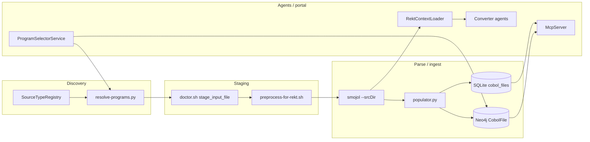

# Basename Identity Coupling — Audit and Migration Note

**Last updated**: 2026-05-27
**Status**: Reference. No code changes proposed; this exists so the eventual
non-flat-staging work is not surprising.

## Why this exists

P0 fixed nested-directory discovery but kept staging flat: every COBOL program
is reduced to its basename (`PROG.cbl`) for downstream identity. Duplicate
basenames in different subdirectories now warn but still collide on the last
write. Lifting that limitation later will touch many places — this note maps
every place identity = basename today so the migration is planned, not
discovered the hard way.

## Identity rules in effect today

| Identity | Used as the key for | Source of truth |
|---|---|---|
| `basename(prog.cbl)` (incl. extension) | resolve-programs.py output, doctor.sh `cp` staging, `find` results | `Helpers.SourceTypeRegistry` |
| stem = `basename` minus extension, case-insensitive | analyzer→converter linkage, REKT output naming, parse logs, copybook lookups | smojol / orchestrator |
| `cobol_files.file_name` (basename, with ext) | SQLite ingest, run history, Neo4j ingest | `Tools/graph-populator/populator.py` |
| Neo4j `CobolFile { fileName, uid }` where `uid = (runId, fileName)` | every relationship that hangs off a program | populator.py `_make_uid` |
| `RektContext.ProgramId` = stem | all REKT context lookups in C# agents | `Helpers/RektContextLoader.cs` |
| `TypeBinding.cobolName` = stem-ish | `Helpers/SharedTypeRegistry.cs` keys | converter agents |

## Components that assume basename identity

Each arrow that crosses a stage boundary passes a **basename** today.

## File-by-file coupling map

(Generated by grep; line numbers are advisory.)

### Discovery
- `Helpers/SourceTypeRegistry.cs` — emits full paths but **callers only use `Path.GetFileName`**.
- `Helpers/FileHelper.cs:57, 85` — populates `CobolFile.FileName = Path.GetFileName(filePath)`. Full path is stored on the model too (`FilePath`) but not used downstream.
- `Tools/resolve-programs.py:enumerate_program_files` — explicitly returns basenames after warning on duplicates.

### Staging
- `doctor.sh` `stage_input_file` (full-scan path) — `target = "$staging_dir/$file_name"`, basename.
- `doctor.sh` `--program` selector staging — recursive `find` by basename, then `cp` into flat staging.
- `Tools/preprocess-for-rekt.sh` — writes preprocessed copies to `.preprocessed/$fname` (basename); collisions silent.

### Parse / ingest
- `smojol-cli.jar run "$fname"` — `--srcDir=/source/.rekt-staging`, basename passed positionally.
- REKT output files: `output/rekt/<stem>-deps.json`, `flow-ast-<stem>.json`, `<stem>.parse.log`. Stems must be unique across the run.
- `Tools/graph-populator/populator.py:569` — `uid = _make_uid(run_id, f.name)`. `f.name` is basename. Two real files with same basename ⇒ same `uid` ⇒ Neo4j MERGE collapses them.
- `Tools/graph-populator/populator.py:573` — `isCopybook` derived from `f.suffix.lower() in (".cpy",)`.

### Runtime (agents / portal / MCP)
- `Helpers/RektContextLoader.cs:61, 377, 419, 494` — strips extension via `Path.GetFileNameWithoutExtension`; loads REKT artifacts by stem.
- `Helpers/NamingHelper.cs:47` — `baseName = Path.GetFileNameWithoutExtension(cobolFileName)`.
- `Helpers/SharedTypeRegistry.cs:45` — `progName = Path.GetFileName(program)`.
- `Helpers/RegressionFixtureAgent.cs:31` — stem.
- `Agents/ConversionParityAgent.cs:156` — stem.
- `Mcp/McpServer.cs:801, 1201` — basename match against attachments / candidate names.
- `McpChatWeb/Services/ProgramSelectorService.cs:64, 68, 117, 137, 248, 270, 273, 302, 306, 337` — basename / stem comparisons throughout.
- `McpChatWeb/Program.cs:471, 689, 883, 967, 988, 1001, 1004, 1347, 1348` — SQLite queries keyed on `file_name` (basename).

## Migration blast radius

If a future change replaces basename identity with a source-relative path (or a
hashed path-derived id), the work breaks into three waves:

### Wave 1 — Identity model (additive, no break)
1. Introduce a `ProgramKey` value object in C# wrapping `{ relativePath, basename, stem }`. Default `ToString()` returns basename so existing logs and prompts are unchanged.
2. Extend `cobol_files` and `CobolFile` (Neo4j) with `relative_path` column / property. Populate going forward; do not change existing keys.
3. Add a `program_aliases` table mapping every observed `(relative_path, basename)` to the canonical `ProgramKey`.

### Wave 2 — Producers
1. Populator (`Tools/graph-populator/populator.py`): change `_make_uid` to hash `relative_path`; keep old `uid` as `legacy_uid` on the node so old reports keep linking.
2. Staging (`doctor.sh`, `preprocess-for-rekt.sh`): preserve subdirs in the staging dir, e.g. `staging/sources/src/X.cbl`. Update the smojol `--srcDir` to the staging root and **pass the staged relative path** (smojol resolves COPY by walking `--copyBooksDir`; verify copybook resolution still works with subdirs — this is the riskiest piece).
3. REKT output naming: change `<stem>-deps.json` → `<relPathHash>-deps.json`. Add a manifest `output/rekt/index.json` mapping `relPathHash → { relativePath, stem }` so existing tooling can resolve.
4. resolve-programs.py: emit `relativePath` lines, document the change in `--help`, and add a `--legacy-basenames` flag for one release.

### Wave 3 — Consumers
1. `RektContextLoader`, `NamingHelper`, `SharedTypeRegistry`, `ProgramSelectorService`, `ConversionParityAgent`, `RegressionFixtureAgent` — switch all from stem/basename to `ProgramKey`.
2. MCP server (`Mcp/McpServer.cs`) — attachment lookup, candidate matching: accept either basename (legacy) or `ProgramKey`.
3. Portal SQL queries — switch `WHERE file_name = ...` to `WHERE file_name = ... AND COALESCE(relative_path, '') = ...`. Compatible with old rows that have NULL relative_path.

## Risk hotspots (read before any future fix)

1. **smojol copybook resolution.** smojol matches COPY directives by name against files in `--copyBooksDir`. If we preserve subdirs, smojol may not recurse — verify by experiment before depending on it.
2. **Neo4j MERGE on `uid`.** Changing `uid` mid-history will produce orphan / duplicate nodes. Always backfill in a migration step that rewrites `uid` while preserving relationships.
3. **SQLite UPSERT keys.** Multiple places do `INSERT ... ON CONFLICT(file_name) DO UPDATE`. These need the conflict target updated atomically with the schema change.
4. **Selector resolver "--include-callees"** depends on REKT deps files keyed by stem. If we hash the key, the graph walk needs to translate stem→key during traversal.
5. **Cache keys** (when the response cache lands, §4 of the throttling design): if cache keys embed program identity, switching identity mid-cycle invalidates the entire cache. Do the cache work after the identity change OR make the cache key include the identity scheme version.

## What is safe to do today

- New code may freely use `Path.GetFileName(filePath)` / stem — Wave 1 will wrap, not break.
- New schemas should include both `basename` and `relative_path` from the start so Wave 1 has nothing to backfill.
- Logs and prompt text should continue to use basenames for human readability.

## What to avoid

- Do not introduce more places that depend on stem uniqueness across the corpus. If you need uniqueness, use `(runId, stem)` as the key.
- Do not delete the existing duplicate-basename warning in `resolve-programs.py` — it is the only early signal users get.
- Do not assume `CobolFile.FilePath` is set correctly downstream of staging — staging strips it. Use the discovery-time path or re-walk.
