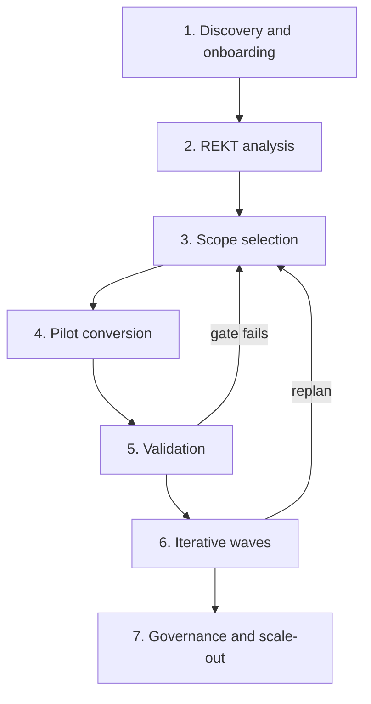

# Project Steps

**Last updated**: 2026-09-02

The phased adoption path for using this framework in a modernization program. It is
the primary home for the **sequence and decision gates**; for business framing see
the [Executive Overview](Executive-Overview.md) or the one-page
[Sales Folder](Sales-Folder.md), for architecture and limits the
[Technical Overview](Technical-Overview.md), and for exact commands the
[Quick Start](../quick-start.md).

Commands here are kept minimal by design. Where a step needs specific flags, follow
the [Quick Start](../quick-start.md) rather than copying long command strings.

Accountable-role names below are generic program roles; the tool does not itself
implement or enforce a governance hierarchy (see
[Executive Overview](Executive-Overview.md)).

## Phase 1 — Discovery and source onboarding

- **Goal:** Assemble the COBOL portfolio and a working environment.
- **Inputs:** COBOL programs and copybooks (`.cbl`, `.cob`, `.cpy`); the
  prerequisites from [Quick Start](../quick-start.md) (.NET 10 SDK, Docker, common CLI
  tools); a chosen AI provider.
- **Actions:** Configure a provider (`./doctor.sh setup`), which stores credentials
  such as API keys or optional personal access tokens in a local, git-ignored
  environment file. GitHub Copilot can also use an authenticated Copilot or GitHub
  CLI session, while key-less Microsoft Entra ID for Azure OpenAI uses the default
  credential chain. Place sources into the `source/` folder (recursive subfolders
  are supported). Plan network controls before launching the portal: it has no
  application-level authentication and listens on all interfaces, so use a trusted
  restricted network, firewall or loopback binding, or an authenticated TLS reverse
  proxy.
- **Outputs:** A configured environment and an inventory of the supported,
  discovered COBOL programs and copybooks.
- **Decision gate:** Environment healthy, sources loaded, and portal access
  restricted to authorized users? If not, resolve setup before proceeding.
- **Accountable role:** Modernization Lead (with platform/IT support).

## Phase 2 — REKT analysis

- **Goal:** Produce authoritative structural facts for the whole portfolio.
- **Inputs:** The onboarded sources.
- **Actions:** Run the static analysis: `./doctor.sh rekt-full`. This parses every
  program, writes structural facts, ingests them into the graph, and launches the
  portal. Re-run when sources change.
- **Outputs:** Per-program AST/control-flow/data-flow facts; the populated graph;
  the running portal.
- **Decision gate:** Is parse fidelity acceptable across the corpus? Review the
  confidence levels — some programs may degrade to a dependencies-only view (see
  [Technical Overview](Technical-Overview.md)). Decide whether low-fidelity programs
  need special handling.
- **Accountable role:** Enterprise Architect.

## Phase 3 — Scope selection

- **Goal:** Decide what to modernize and in what order.
- **Inputs:** The analysis and portal views.
- **Actions:** Review dependencies, business capabilities, and the
  target-architecture recommendation; group programs into waves in the
  write-capable Migration Planner. To use wave/component selectors later, save the
  target architecture from the portal (see
  [target-architecture recommendation](../target-architecture-recommendation.md)).
- **Outputs:** An agreed, ordered wave plan and a pilot candidate (one program or a
  small related set).
- **Decision gate:** Is there consensus on the plan and a low-risk pilot scope?
- **Accountable role:** Modernization Lead (with Business Owner sign-off on
  priorities).

## Phase 4 — Pilot conversion

- **Goal:** Prove the approach on real code.
- **Inputs:** The pilot scope; the REKT facts.
- **Actions:** Convert the pilot to Java or C#, grounded in REKT context (the
  recommended default). Optionally review and tune agent prompts in Prompt Studio
  first — generated prompts are "a starting point, not a final answer." See
  [Quick Start](../quick-start.md) for the exact command and selectors.
- **Outputs:** Generated code and supporting run artifacts. Portal-managed runs use
  isolated timestamped folders; direct CLI conversions use shared language output
  folders and should be archived when retention is required.
- **Decision gate:** Is the drafted output good enough to review productively?
- **Accountable role:** Developer (execution); Enterprise Architect (approach
  review).

## Phase 5 — Validation

- **Goal:** Judge quality with humans in the loop.
- **Inputs:** The pilot run outputs.
- **Actions:** Review the generated code against the original and optionally run
  the Java compile check. The repository contains a structural parity component,
  but it is not invoked by the default conversion orchestration; if a team
  explicitly integrates it, read its score as a **coverage indicator, not a
  correctness proof**. Note that **no tests are run automatically** and no
  semantic-equivalence guarantee is made (see
  [Technical Overview](Technical-Overview.md)). Add the program's own testing,
  compilation, and review as your standards require.
- **Outputs:** A validation verdict and a list of prompt or scope adjustments.
- **Decision gate:** Does the pilot meet your quality bar? If not, adjust prompts or
  scope and return to Phase 3/4.
- **Accountable role:** Developer and Enterprise Architect (technical sign-off).

## Phase 6 — Iterative waves

- **Goal:** Convert the portfolio wave by wave, consistently.
- **Inputs:** The validated approach; the wave plan.
- **Actions:** Convert each wave, relying on smart chunking for large programs and
  reusing persisted reverse-engineering where helpful. Track progress in the portal;
  re-run analysis when sources change. Retain portal-managed run folders or archive
  direct CLI outputs according to the program's audit requirements.
- **Outputs:** Converted programs per wave and updated portal dashboards;
  independently retained run records where required.
- **Decision gate:** After each wave — proceed, or replan the next wave based on what
  was learned?
- **Accountable role:** Modernization Lead (wave ownership); Developers (execution).

## Phase 7 — Governance and scale-out

- **Goal:** Sustain the effort and hand converted code to downstream delivery.
- **Inputs:** Completed waves; migration reports and telemetry.
- **Actions:** Report progress and risk to stakeholders using portal telemetry and
  migration summaries; maintain your own governance and approval process. Route
  converted code into the activities the tool does **not** cover — deployment,
  cutover, data migration, and CI/CD (see
  [Technical Overview](Technical-Overview.md)).
- **Outputs:** Stakeholder reporting; converted code entering delivery pipelines.
- **Decision gate:** Is the program on track on scope, risk, and value to continue
  investment?
- **Accountable role:** Business Owner (investment); Modernization Lead (delivery).

## A note on effort estimates

The Migration Planner's effort figures (for example, lines-of-code-per-developer or
wave multipliers) are **editable configuration defaults, not validated industry
benchmarks**. Calibrate them with your own data before using them for commitments.
