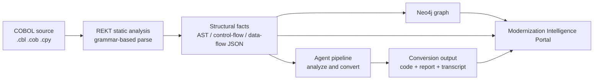

# Technical Overview

**Last updated**: 2026-09-02

A conceptual overview for CTOs, architects, and technical decision-makers. It
favors accuracy over marketing and is explicit about limits. See also the
[Executive Overview](Executive-Overview.md) ([glossary](Executive-Overview.md#glossary)),
[Sales Folder](Sales-Folder.md), [Project Steps](Project-Steps.md), and
[Quick Start](../quick-start.md).

## Architecture at a glance

The framework is a **.NET 10** solution with two entry points — a command-line
converter and the `McpChatWeb` ASP.NET Core portal — driven by `doctor.sh`; a
Docker Compose stack provides the analysis toolchain and graph databases.

## Analysis and REKT grounding

**REKT** is the static-analysis stage: a grammar-based, open-source COBOL toolkit,
run in a container to produce an abstract syntax tree, control-flow graph, and
data-flow facts per program. Those facts are ingested into a graph database and can
ground conversion prompts as an **authoritative structural blueprint**. See
[REKT-grounded conversion](../rekt-grounded-conversion.md).

Parse fidelity is **corpus-dependent**: some programs parse fully, others degrade
to a dependencies-only view. A **confidence ladder** — from full native facts
through partial and LLM-hypothesized structure to raw source — signals how much
downstream steps should trust it.

## Dependency and context capture

Two dependency mechanisms should not be conflated:

- An **in-pipeline dependency mapper** that is single-pass and **one-hop**: no
  transitive closure, no copybook-of-copybook expansion, and limited `EXEC CICS`
  and dynamic-`CALL` coverage
  ([dependency mapper limitations](../dependency-mapper-agent-limitations.md)).
- The **REKT/graph** representation, AST-based, where multi-hop and transitive
  traversal live; this feeds the portal.

Program identity derives from filename stems, which can collide across subfolders —
documented and currently unmitigated
([basename coupling map](../basename-coupling-map.md)).

## The agent pipeline

The repository defines specialized agents for analysis, business-logic and
structural extraction, data and dependency mapping, Java/C# conversion with
chunked variants, code review, parity scoring, test synthesis, documentation, and
migration summary. The default conversion orchestration does **not** currently
invoke every defined agent: code review, parity scoring, test synthesis,
documentation, and migration-summary implementations should be treated as
available components that require explicit wiring rather than guaranteed stages of
every run. Each agent has an **editable Markdown prompt**; shared infrastructure
handles token budgeting, retry, and rate-limit (429) back-off.

**Target languages are exactly two: Java and C#.** Large files (roughly ≥150K
characters or ≥3,000 lines) are split at semantic boundaries with **no silent
truncation** — the tool fails rather than drop content. See
[smart chunking](../smart-chunking-architecture.md).

## Target outputs

Portal-managed runs write to isolated, timestamped folders containing generated
code and run artifacts. Direct command-line conversions instead write to shared
`output/java/` or `output/csharp/` paths and can overwrite files with matching
names, so teams that use the direct CLI should archive outputs as part of their
delivery process. Reverse-engineering results can persist for reuse without
re-running analysis.

## Review and parity evidence — read carefully

The repository contains a parity component, but the default conversion
orchestration does not currently invoke it or persist a parity artifact. If a team
explicitly wires it into its workflow, the score is a **deterministic, purely
lexical heuristic**: whether expected names (methods, fields, CALL targets,
SQL-derived repositories) appear in the converted text, via case-insensitive
substring matching.

It measures **structural coverage, not correctness**. It is
**not** compilation-based, execution-based, or a semantic/AST diff. A Java-only
optional compile check exists (there is no C# equivalent), and **no automated
test-execution step exists anywhere** — synthesized tests are AI output and are not
run. **No semantic-equivalence or correctness guarantee is claimed anywhere.**

## REKT-grounded vs LLM-only conversion

Conversion can run **grounded** in REKT facts (recommended when a scan exists) or
in **pure-LLM mode** (`--no-rekt-context`). The comparison below is
**rationale-based, not measured**.

> **No empirical head-to-head dataset comparing REKT-grounded to LLM-only exists.**
> Any "X% better with REKT" figure would be fabricated. The one real A/B dataset in
> the repo ([P1 A/B protocol](../p1-ab-validation-protocol.md)) compares **two
> REKT-grounded modes** (raw-AST vs. curated program-facts), **not** REKT vs.
> LLM-only.

| Aspect | REKT-grounded | LLM-only (`--no-rekt-context`) |
| --- | --- | --- |
| Input to model | Structural blueprint from static analysis | Raw COBOL source only |
| Stated intent | Reduce hallucinated names, missing fields, dropped CALL chains | Faster per call; lower fidelity |
| Enables REKT-derived selectors (for example, `--wave`) and supplies facts to the optional parity component | Yes | No |
| Known risk | Requires a successful scan; corpus-dependent | Duplicate-type errors on multi-file batches |
| When to use | Whenever a scan exists — the default path | Quick smoke tests, prompt experiments, or corpora REKT cannot parse |

## Portal

The portal is an ASP.NET Core app (port 5028) with four
surfaces: a **Visual Cockpit** of persona dashboards, a **Modernization
Intelligence** area (ten subviews; the wave planner and the capability-dictionary
editor are write-capable, the rest read-only derived facts), an **Insights Hub** of
persona narratives, and an **AST Galaxy** force-graph with multiple view modes.

The current portal is development-oriented: it listens on all network interfaces
and does not configure application-level authentication or authorization. Some
endpoints can start or stop conversion processes, update prompts, and save provider
configuration. Do **not** expose port 5028 directly to the internet or an untrusted
network. For shared use, restrict access with loopback or firewall rules, or place
the portal behind an authenticated TLS reverse proxy.

## Providers

The active setup and settings-based client factory support **Azure OpenAI** (API
key or key-less Microsoft Entra ID) and **GitHub Copilot**. Claude-family models
come through the Copilot SDK, not a separate Anthropic provider. Although the
codebase contains OpenAI-related packages and configuration concepts, direct
OpenAI is not exposed through the active setup and orchestration path and should
not be treated as a currently supported customer workflow. Per-agent model
overrides are supported. API keys and optional personal access tokens can be read
from a local, git-ignored environment file. GitHub Copilot can instead use
authenticated Copilot or GitHub CLI sessions, and key-less Azure OpenAI uses
`DefaultAzureCredential`; those modes rely on their external credential chains and
caches rather than an application-managed credential vault.

Converting or analysing a program sends its source code to the AI provider you
configure; provider selection and data-handling requirements are your
organisation's decision. The analysis and portal stack — static analysis, Neo4j,
the portal — runs locally via Docker; the model calls do not.

## Current vs. optional capabilities

- **Verified current:** REKT static analysis; Java/C# conversion; smart chunking
  with no silent truncation; deterministic capability discovery and semantic
  search; target-architecture recommendation; migration wave planner;
  portal-managed isolated run outputs; the portal.
- **Optional / opt-in (off unless enabled):** REKT-context grounding outside the
  `doctor.sh` flow (on by default within it); response and scan caches (Java
  converter only; manual housekeeping); program-facts projection; the Java compile
  gate; reuse of persisted reverse-engineering.
- **Experimental / manual:** differential regression fixtures (manual runner);
  projection metrics for chunked converters and non-converter agents; code review,
  parity scoring, test synthesis, documentation, and migration-summary components
  that are defined but not wired into the default conversion orchestration.

## Operational boundaries

Prerequisites: the .NET 10 SDK, Docker, and common CLI tools; Azure OpenAI
benefits from ≥1M tokens-per-minute quota. **Not covered by
the tool:** deployment, cutover, and CI/CD; data migration (the data-mapping agent
maps *types*, not data); governance workflow; and a validated ROI or cost model —
planner effort numbers are editable defaults, not benchmarks. Securing the portal
for shared or production-like environments is also the operator's responsibility.
Normal source discovery currently includes `.cbl`, `.cob`, and `.cpy` files.
Readers exist for BMS and IMS-related formats, but `.bms`, `.psb`, and `.dbd` files
are not automatically supplied by the normal discovery path and should not be
assumed to appear in the portfolio analysis.
See
[troubleshoot](../troubleshoot.md).
