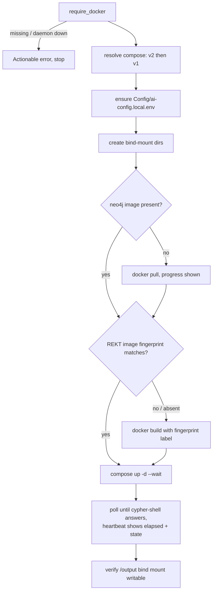

**Last updated**: 2026-09-08

# Container lifecycle

How `doctor.sh` starts, updates and repairs the Docker services behind the
Cobol-REKT analysis stack and the portal.

## Services

| Service | Container | Host ports | Purpose |
|---|---|---|---|
| `neo4j` | `cobol-migration-neo4j` | 7474, 7687 | Migration graph (programs, CALL edges) |
| `cobol-rekt-neo4j` | `cobol-rekt-neo4j` | 7475, 7688 | REKT graph (AST / CFG / data flow) |
| `cobol-rekt` | `cobol-rekt` | — | Java CLI sidecar that parses COBOL |
| `graph-populator` | `cobol-graph-populator` | — | Ingests REKT JSON into the REKT graph |
| `portal` | `cobol-migration-portal` | 5028 | Optional containerized portal (opt-in) |

The two Neo4j instances are deliberately separate and the portal talks to both:
the migration graph via `ApplicationSettings:Neo4j:Uri`, and the REKT graph via
`REKT_NEO4J_URI` (see `McpChatWeb/Services/RektNeo4j.cs`).

## Commands

```bash
./doctor.sh containers status    # container + image state, flags a stale REKT image
./doctor.sh containers up        # pull/build what's missing, then start (safe to re-run)
./doctor.sh containers rebuild   # force a REKT image rebuild after a framework update
./doctor.sh containers reset     # remove containers and graph volumes, then start clean
```

`rekt-parse`, `rekt-ingest` and `rekt-full` call the same startup path
automatically, so `containers up` is only needed to warm images ahead of time or
to recover from a bad state.

## Startup sequence



## Design notes

**Compose v1 vs v2.** Docker Desktop ships Compose as the `docker compose`
subcommand; the standalone `docker-compose` v1 binary is no longer installed.
The startup path resolves whichever exists rather than assuming v1.

**Image freshness.** `cobol-rekt` declares both `image:` and `build:`, and
Compose builds only when the image is *absent* — so a framework update that
changes `tools/cobol-rekt/Dockerfile` would otherwise leave existing users on a
stale image indefinitely. A fingerprint (hash of the Dockerfile plus
`patches/*`) is written as the image label `mma.rekt.fingerprint` at build time
and compared on every run; a mismatch triggers exactly one rebuild. Unchanged
repositories skip both the pull and the build.

**Progress.** Pulls (Neo4j is several hundred MB) and the Maven-based REKT build
stream their output. Health waits print elapsed time and the container's real
state, so a slow first run is visibly progressing.

**`Config/ai-config.local.env`.** This holds personal overrides and is
gitignored, so it does not exist on a fresh clone. Compose treats `env_file`
entries as mandatory, which previously made whole-project commands
(`docker compose up -d`, `config`, `ps`) fail before any container started. The
entry is now marked `required: false` (Compose v2.24+) *and* `doctor.sh` creates
an empty stub, so every Compose version works.

**The portal and port 5028.** `doctor.sh` runs the portal directly on the host on
port 5028. The `portal` service publishes the same port and is
`restart: unless-stopped`, so a bare `docker compose up -d` used to claim 5028
permanently and make the host portal fail with `AddressInUseException` after
every Docker restart. The service is therefore behind a profile:

```bash
docker compose --profile container-portal up -d portal
```

Port cleanup also stops any *container* publishing the port, because a published
port is held by Docker's proxy — killing that process does not release it.

**Bind mounts.** Host directories are created before containers start, otherwise
Docker creates them itself (root-owned on Linux). If a bind mount goes stale
(deleting the host directory replaces its inode), the container is *recreated*
rather than restarted — bind mounts are established at container creation, so a
restart cannot repair them.

## Troubleshooting

| Symptom | Action |
|---|---|
| `Docker daemon isn't responding` | Start Docker Desktop, wait for the whale icon to settle |
| REKT results missing new fixes | `./doctor.sh containers rebuild` |
| `/output` not writable | Startup recreates the container automatically; otherwise `containers reset` |
| Portal fails with port in use | Startup stops the container holding 5028; check `docker ps --filter publish=5028` |
| Graph looks empty after an update | `./doctor.sh containers reset` then `./doctor.sh rekt-full` |
