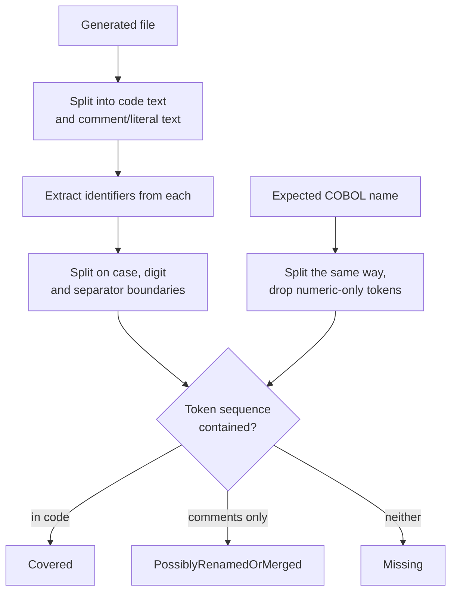

**Last updated**: 2026-09-09

# Conversion Parity Validation

Code generation reports success whenever the model returns *something*. Nothing checked that the generated Java or C# actually represented the COBOL it came from, so a conversion could drop paragraphs, data fields, `CALL` targets or SQL access entirely and still be recorded as a win.

This feature compares four axes of structural evidence against the identifiers actually present in each generated file, and reports what is missing. It makes no LLM calls; the result is reproducible from the same inputs.

It is a **preview feature**, like the REKT scan it reads from.

---

## What it measures

| Axis | Weight | Expected symbols from |
|---|---|---|
| `procedures` | 0.40 | `StructuralContext` sections, paragraphs and PERFORM targets |
| `dataFields` | 0.25 | `StructuralContext` data structure, flattened through group items |
| `callTargets` | 0.20 | `ProgramFacts.Callees`, falling back to REKT `CallTargets` |
| `sqlTables` | 0.15 | `ProgramFacts.Io.DbTables`, falling back to REKT SQL statements |

Weights are renormalised over the axes that have at least one expected symbol. A program with no SQL is scored out of the remaining 0.85, not penalised for the absence.

`ProgramFacts` carries no field or section *names* — `Summary.Sections` is a count, and `ControlFlow.EntryPoints` holds only the first section — so those two axes must come from `StructuralContext`. Facts are preferred for callees and SQL tables, because those carry the operation-name fix from the dependency-health work.

## How a symbol is matched

Substring matching is not usable here: `WS-A` reduces to `wsa`, which appears inside unrelated identifiers, and a callee named `IO` matches almost anything. Matching is therefore token-based.



`SEARCH-CUSTOMER` becomes `[search, customer]` and matches `searchCustomer`. `1000-INIT` drops its numeric segment and matches `init`. A leading scope prefix — `ws`, `ls`, `lk`, `fd`, `sd` — is stripped before length checks, so `WS-CUSTOMER-ID` is compared as `customerid`.

Ambiguity in the code/comment split always resolves toward the comment bucket. Under-counting code produces a visible gap; leaking comment text into the code bucket produces a silent false pass.

String literals are held in a third bucket rather than folded into either. For most axes they are weak evidence and count as comments, but on the `callTargets` and `sqlTables` axes the literal *is* the executable form — a table name reaches the database as a string inside a JDBC query or a `@Table` annotation, and a dynamically invoked program name reaches the dispatcher the same way. Treating those as comment text failed a correct JDBC conversion outright, which is the false positive most likely to get the check switched off.

Each expected symbol consumes at most one candidate in the generated file, matched exact-token-sequence first and compact-containment second. Without consumption a single surviving `wsLine01` satisfied all twelve of `WS-LINE-01`…`WS-LINE-12`, because purely numeric segments are dropped and the family collapses to one comparable form. The two passes stop a short name taking the candidate a longer one needs.

### Gap classification

| Symbol found in | Kind | Score credit |
|---|---|---|
| code | — not a gap | full |
| comments or string literals only | `PossiblyRenamedOrMerged` | **half** |
| neither | `Missing` | none |

A paragraph folded into another method, or renamed during conversion, characteristically survives as a comment naming the original. Scoring that as a total loss is a false positive, and false positives are what get a validator switched off. Scoring it as a full pass is the opposite error: a comment is evidence that the original name was *considered*, not that its behaviour was carried over. Half credit says exactly that, and the gap is still reported either way.

### Total axis loss

A score alone cannot express that an entire dimension was dropped. With the weights above, a conversion that loses every `CALL` target still scores 0.80 and passes a 0.75 threshold.

An axis with at least one expected symbol and **no code match at all** is therefore flagged as a total loss, and fails the threshold check regardless of the overall score. The axis names appear as `lostAxes` in the JSON and in the report table.

## What is deliberately not scored

- `FILLER`, level-88 condition names, level-66 renames and generated `TypedRecord*` types are excluded from `dataFields`. They are not storage a conversion is expected to reproduce.
- Data nodes attributed to the `PROCEDURE DIVISION` are excluded. The parser surfaces COBOL special registers such as `WHEN-COMPILED` as data items with `sourceSection: PROCEDURE_DIVISION`; they are injected by the compiler, not declared by the program, so no conversion can carry them. Real storage always carries `WORKING_STORAGE`, `LINKAGE` or `FILE`.
- Fields declared only by an auto-generated stub copybook are excluded — see *Evidence quality* below.
- A `PERFORM ... UNTIL` operand that is also a data field is dropped from `procedures`; it names a condition, not a paragraph.
- `CALL WS-PROGRAM-NAME` is not recorded as a callee. The variable holds a program name at runtime; treating the variable as a dependency would invent one.

## Evidence quality

`tools/preprocess-for-rekt.sh` synthesises a placeholder copybook whenever a `COPY` target cannot be resolved, containing invented `<NAME>-STUB` and `<NAME>-VAL` fields and a marker comment. Those fields exist only as preprocessing artefacts, while the real fields the program actually uses are absent entirely.

Expecting them in generated code produces gaps no conversion can close, so they are excluded. Detection is exact — the file must contain the marker string — rather than a guess at the `-STUB` suffix, which could drop real fields.

Because their exclusion means field parity was measured against *incomplete* evidence, each affected program carries an `evidenceNotes` entry naming the stub copybooks. The score is not silently adjusted to compensate; the weakened evidence is stated instead.

## When parity is not measured

An inferred value is never presented as a measured one.

| Situation | Outcome |
|---|---|
| No structural context, or provenance `None` | `NotEvaluated`, no score, reason names `./doctor.sh rekt-full` |
| All four axes have no comparable symbols | `NotEvaluated`, axes still reported |
| Generated file cannot be mapped back to a source program | `NotEvaluated`, never guessed |
| Source program produced **no** generated file | **Evaluated, score 0**, explicit `file` gap |
| File is a `ConversionOutputGuard` stub or a converter fallback | **Evaluated, score 0**, explicit `file` gap |

The two score-0 cases outrank the missing-context rule. A missing output and a stub marker are both direct evidence that conversion failed, so they are measured zeros even when nothing is known about the source. Parity therefore starts from the inventory of source programs, not from the list of files that happen to exist — a program that silently produced nothing is the most severe failure the check can find, and reading only the output directory would miss it entirely.

That case also drives the comment rule: the guard embeds the rejected model output inside a block comment. If comment matches earned full credit, a stub whose rejected output happened to be Java-shaped would score 1.0 — precisely the failure this feature exists to catch. Comment credit is therefore withheld entirely from any file containing no converted code.

The score is forced to zero rather than computed for these files. A converter fallback carries its own `run()` method, which otherwise scored full marks against a `RUN` paragraph; incidental token overlap with a file that converted nothing is not coverage.

## Where it runs

The post-pass runs after conversion has finished, in both `MigrationProcess` and `ChunkedMigrationProcess`. Both are needed: `SmartMigrationOrchestrator` routes the whole estate to the chunked path if any single file is large, so wiring one would leave parity dormant on any realistic estate.

Running post-write rather than per-file is what makes the guard stub visible at all — a pre-write validator cannot see output that does not exist yet.

Each run writes `conversion-parity.json` beside the generated code and appends a section to the migration report.

## Configuration

| Variable | Default | Effect |
|---|---|---|
| `MIN_PROGRAM_SCORE` | `0.75` | Score below which a program is counted as below threshold. Clamped to `[0,1]`; an unparseable value logs a warning and falls back to the default. |
| `ON_LOW_SCORE` | `warn` | `warn` reports only. `stop` additionally sets exit code `4`. |

Under `stop`, exit code `4` is also set when programs were found but none could be evaluated. Exiting `0` there would report "no parity failures" when the truth is that parity was never measured; under an explicit gate, absent evidence is not a pass.

Both are read from the environment, which takes precedence over `Config/ai-config.local.env`.

```bash
MIN_PROGRAM_SCORE=0.8 ON_LOW_SCORE=stop ./doctor.sh run
```

`stop` cannot abort a migration, because parity runs after conversion has completed. It sets a non-zero exit code once both artefacts are written, which is the behaviour CI actually wants; a partially aborted migration is not.

Exit code `4` is distinct from the existing conventions (`2` usage or not-found, `3` parse failure).

> Making that work required a fix in `Program.cs`. An `int`-returning `Main` overrides `Environment.ExitCode` entirely, so the gate — and every existing `Cli/` command that reports failure the same way — exited `0` regardless. `Main` now returns the environment code when its own is zero.

### Calibrating the threshold

`0.75` was calibrated against the sample estate, not guessed. On a real REKT scan, converted by hand from the COBOL alone rather than tuned to pass:

| Conversion | Score |
|---|---|
| Faithful, `CUSTOMER-INQUIRY.cbl` | 1.00 |
| Faithful, `CUSTOMER-DISPLAY.cbl` | 0.95 |
| One paragraph renamed, original named in a comment | 0.97 |
| One paragraph, five fields and the only `CALL` dropped | 0.27, `callTargets` lost |
| Source program that produced no output at all | 0.00 |
| `ConversionOutputGuard` stub | 0.00 |

The 0.95 is the copybook-scope limit described under *Known limits*, not a conversion defect: `CUST-STATUS` is read through a condition name and lives in a record class emitted alongside the other program.

The default sits between a conversion that is complete and one that has lost a fifth of its structure. Estates with many small paragraphs will want a different value, which is why it is configurable.

## Portal

`GET /api/modernization/conversion-parity` returns the persisted report for each target language found under `output/`, distinguishing targets that were never converted from reports that exist but could not be read. A corrupt report is never presented as an absent one.

The Modernization Intelligence **Runtime** subview renders it. The runtime-telemetry half of that subview has no data source yet and remains a labelled placeholder.

## Relationship to the output guard

`ConversionOutputGuard` is a syntactic check at write time: empty files, stub markers, a missing `class` keyword. Parity is semantic and runs afterwards. They are complements — the guard catches output that is not code, parity catches code that is not the program.

## Known limits

Parity is an **identifier-retention check**. It answers "are the names the COBOL declared still visible in the generated code", which is a proxy for structural representation and nothing more. The limits below follow from that and are not defects.

- Matching is name-based. A conversion that faithfully reproduces behaviour under entirely unrelated names scores low; one that keeps the names while discarding the logic scores high. Parity is evidence of structural representation, not of correctness.
- Matching is not one-to-one. `1000-INIT` and `2000-INIT` both normalise to `init`, so one generated `init` method satisfies both. The check is designed to catch wholesale loss, not near-duplicates.
- Scope is one source program against its own generated files. A field declared in a copybook and rendered into a shared record class belonging to a *different* program is reported missing, because the check never looks outside the program's own output. Where the section is known, the gap carries it — a `LINKAGE` field is annotated as supplied by the caller — so the reader can tell this case from a genuine drop.
- Recall depends on what the scan surfaced. A `CALL` nested inside a conditional is emitted by the parser as untyped statement text, and is recovered by scanning that text for quoted targets; a construct that survives in neither form cannot be expected, so its loss would go unreported. The axis reports `Expected = 0` rather than claiming coverage.
- Compact-form fallback matching can pair a short expected name with a longer identifier that contains it.
- Parity needs the repository layout to resolve source programs and copybooks. Running from a published image without it, the post-pass logs that it is skipping rather than reporting a false pass.

### Dimensions not validated

Presence of a name says nothing about these, and none of them is checked:

| Dimension | Not checked |
|---|---|
| SQL | which *operations* run against a table — only that the table is named |
| Data | `PIC` precision, `USAGE`, `OCCURS` bounds, `REDEFINES` overlays |
| Conditions | level-88 values, and whether the condition survives at all |
| Calls | parameter lists, `BY REFERENCE` / `BY CONTENT` semantics |
| Transactions | CICS and IMS verbs |
| Control flow | ordering, nesting, `GO TO` semantics |

A program can pass parity at 1.00 and still be a wrong conversion. The report says so.

## Not ported from the source branch

The upstream branch pairs the validator with an LLM repair pass, enabled by default, which rewrites the generated file to close gaps. It is not ported.

Its prompt template takes a `{{CobolContent}}` placeholder that the agent never supplies, and supplies `Gaps`, `StructuralContext`, `CobolSource`, `ConvertedCode` and `TargetLanguage`, none of which the template reads. Placeholders are not validated at load time, so the model would receive an analysis prompt containing a literal `{{CobolContent}}` and none of the code, and its reply would overwrite the conversion. Enabled by default, that corrupts conversions that were already correct.

The gap-classification ladder the upstream changelog describes — missing to added code, renamed and merged to comments, deferred to `TODO` — is a sound design that the shipped prompt never implemented. The deterministic half of it is implemented here as the `Missing` / `PossiblyRenamedOrMerged` distinction. A repair pass remains possible future work, but needs a prompt that matches its own inputs.
