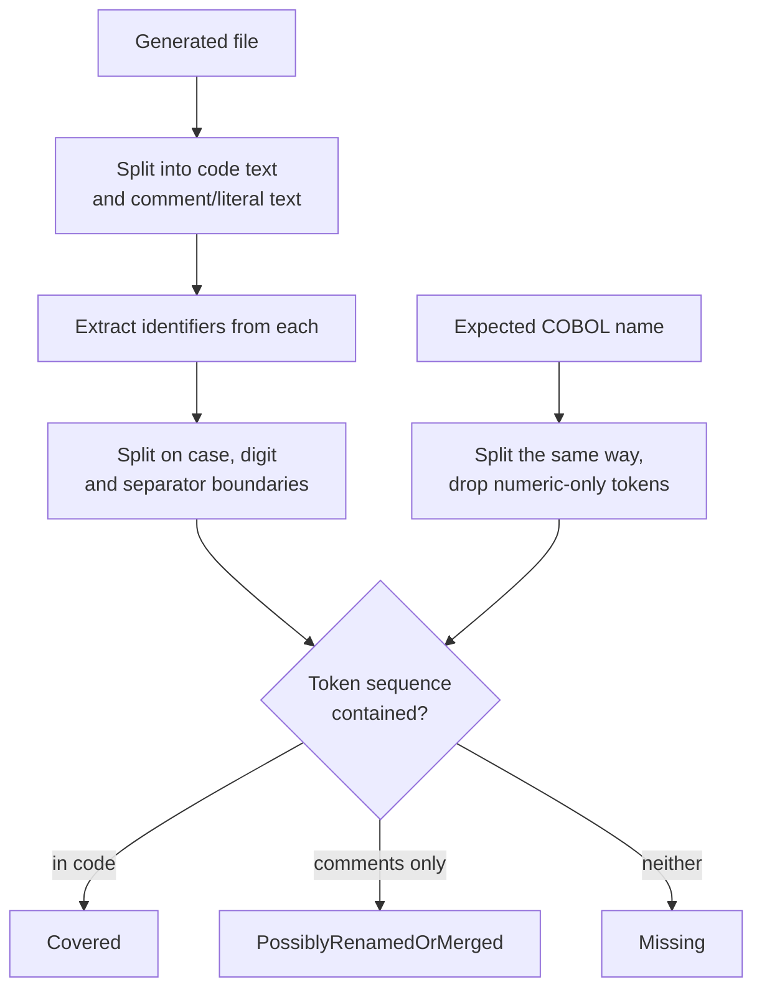

**Last updated**: 2026-09-08

# Conversion Parity Validation

Code generation reports success whenever the model returns *something*. Nothing checked that the generated Java or C# actually represented the COBOL it came from, so a conversion could drop paragraphs, data fields, `CALL` targets or SQL access entirely and still be recorded as a win.

This feature compares four axes of structural evidence against the identifiers actually present in each generated file, and reports what is missing. It makes no LLM calls; the result is reproducible from the same inputs.

It is a **preview feature**, like the REKT scan it reads from.

---

## What it measures

| Axis | Weight | Expected symbols from |
|---|---|---|
| `procedures` | 0.40 | `StructuralContext` sections, paragraphs and PERFORM targets |
| `dataFields` | 0.25 | `StructuralContext` data structure, flattened through group items |
| `callTargets` | 0.20 | `ProgramFacts.Callees`, falling back to REKT `CallTargets` |
| `sqlTables` | 0.15 | `ProgramFacts.Io.DbTables`, falling back to REKT SQL statements |

Weights are renormalised over the axes that have at least one expected symbol. A program with no SQL is scored out of the remaining 0.85, not penalised for the absence.

`ProgramFacts` carries no field or section *names* — `Summary.Sections` is a count, and `ControlFlow.EntryPoints` holds only the first section — so those two axes must come from `StructuralContext`. Facts are preferred for callees and SQL tables, because those carry the operation-name fix from the dependency-health work.

## How a symbol is matched

Substring matching is not usable here: `WS-A` reduces to `wsa`, which appears inside unrelated identifiers, and a callee named `IO` matches almost anything. Matching is therefore token-based.



`SEARCH-CUSTOMER` becomes `[search, customer]` and matches `searchCustomer`. `1000-INIT` drops its numeric segment and matches `init`. A leading scope prefix — `ws`, `ls`, `lk`, `fd`, `sd` — is stripped before length checks, so `WS-CUSTOMER-ID` is compared as `customerid`.

Ambiguity in the code/comment split always resolves toward the comment bucket. Under-counting code produces a visible gap; leaking comment text into the code bucket produces a silent false pass.

### Gap classification

| Symbol found in | Kind | Counts against score |
|---|---|---|
| code | — not a gap | no |
| comments or string literals only | `PossiblyRenamedOrMerged` | no |
| neither | `Missing` | yes |

A paragraph folded into another method, or renamed during conversion, characteristically survives as a comment naming the original. Scoring that as a loss is a false positive, and false positives are what get a validator switched off. It is still reported, so a real loss that happens to be mentioned in a comment stays visible rather than being hidden.

## What is deliberately not scored

- `FILLER`, level-88 condition names, level-66 renames and generated `TypedRecord*` types are excluded from `dataFields`. They are not storage a conversion is expected to reproduce.
- A `PERFORM ... UNTIL` operand that is also a data field is dropped from `procedures`; it names a condition, not a paragraph.
- `CALL WS-PROGRAM-NAME` is not recorded as a callee. The variable holds a program name at runtime; treating the variable as a dependency would invent one.

## When parity is not measured

An inferred value is never presented as a measured one.

| Situation | Outcome |
|---|---|
| No structural context, or provenance `None` | `NotEvaluated`, no score, reason names `./doctor.sh rekt-full` |
| All four axes have no comparable symbols | `NotEvaluated`, axes still reported |
| Generated file cannot be mapped back to a source program | `NotEvaluated`, never guessed |
| File is a `ConversionOutputGuard` diagnostic stub | **Evaluated, score 0**, explicit `file` gap |

The stub case outranks the missing-context rule. The stub marker is direct evidence that conversion failed, so it is a measured zero even when nothing is known about the source.

That case also drives the comment rule: the guard embeds the rejected model output inside a block comment. If comment matches earned credit, a stub whose rejected output happened to be Java-shaped would score 1.0 — precisely the failure this feature exists to catch. Comment credit is therefore withheld from any file containing no converted code.

## Where it runs

The post-pass runs after conversion has finished, in both `MigrationProcess` and `ChunkedMigrationProcess`. Both are needed: `SmartMigrationOrchestrator` routes the whole estate to the chunked path if any single file is large, so wiring one would leave parity dormant on any realistic estate.

Running post-write rather than per-file is what makes the guard stub visible at all — a pre-write validator cannot see output that does not exist yet.

Each run writes `conversion-parity.json` beside the generated code and appends a section to the migration report.

## Configuration

| Variable | Default | Effect |
|---|---|---|
| `MIN_PROGRAM_SCORE` | `0.75` | Score below which a program is counted as below threshold. Clamped to `[0,1]`; an unparseable value logs a warning and falls back to the default. |
| `ON_LOW_SCORE` | `warn` | `warn` reports only. `stop` additionally sets exit code `4`. |

Both are read from the environment, which takes precedence over `Config/ai-config.env`.

```bash
MIN_PROGRAM_SCORE=0.8 ON_LOW_SCORE=stop ./doctor.sh run
```

`stop` cannot abort a migration, because parity runs after conversion has completed. It sets a non-zero exit code once both artefacts are written, which is the behaviour CI actually wants; a partially aborted migration is not.

Exit code `4` is distinct from the existing conventions (`2` usage or not-found, `3` parse failure).

### Calibrating the threshold

`0.75` was calibrated against the sample estate, not guessed. On a real REKT scan of `CUSTOMER-INQUIRY.cbl`:

| Conversion | Score |
|---|---|
| Faithful | 1.00 |
| One of two paragraphs renamed, original named in a comment | 1.00 |
| One of two paragraphs and the only `CALL` dropped | 0.53 |
| `ConversionOutputGuard` stub | 0.00 |

The default sits between a conversion that is complete and one that has lost a fifth of its structure. Estates with many small paragraphs will want a different value, which is why it is configurable.

## Portal

`GET /api/modernization/conversion-parity` returns the persisted report for each target language found under `output/`, distinguishing targets that were never converted from reports that exist but could not be read. A corrupt report is never presented as an absent one.

The Modernization Intelligence **Runtime** subview renders it. The runtime-telemetry half of that subview has no data source yet and remains a labelled placeholder.

## Relationship to the output guard

`ConversionOutputGuard` is a syntactic check at write time: empty files, stub markers, a missing `class` keyword. Parity is semantic and runs afterwards. They are complements — the guard catches output that is not code, parity catches code that is not the program.

## Known limits

- Recall depends on what the scan surfaced. A `CALL` nested inside a conditional is emitted by the parser as untyped statement text, and is recovered by scanning that text for quoted targets; a construct that survives in neither form cannot be expected, so its loss would go unreported. The axis reports `Expected = 0` rather than claiming coverage.
- Matching is name-based. A conversion that faithfully reproduces behaviour under entirely unrelated names scores low, and one that keeps the names while discarding the logic scores high. Parity is evidence of structural representation, not of correctness.
- Compact-form fallback matching can pair a short expected name with a longer identifier that contains it.

## Not ported from the source branch

The upstream branch pairs the validator with an LLM repair pass, enabled by default, which rewrites the generated file to close gaps. It is not ported.

Its prompt template takes a `{{CobolContent}}` placeholder that the agent never supplies, and supplies `Gaps`, `StructuralContext`, `CobolSource`, `ConvertedCode` and `TargetLanguage`, none of which the template reads. Placeholders are not validated at load time, so the model would receive an analysis prompt containing a literal `{{CobolContent}}` and none of the code, and its reply would overwrite the conversion. Enabled by default, that corrupts conversions that were already correct.

The gap-classification ladder the upstream changelog describes — missing to added code, renamed and merged to comments, deferred to `TODO` — is a sound design that the shipped prompt never implemented. The deterministic half of it is implemented here as the `Missing` / `PossiblyRenamedOrMerged` distinction. A repair pass remains possible future work, but needs a prompt that matches its own inputs.
