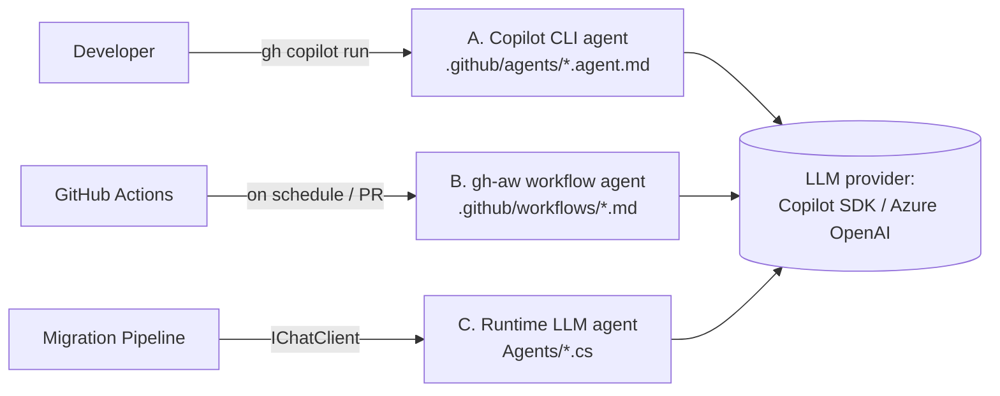
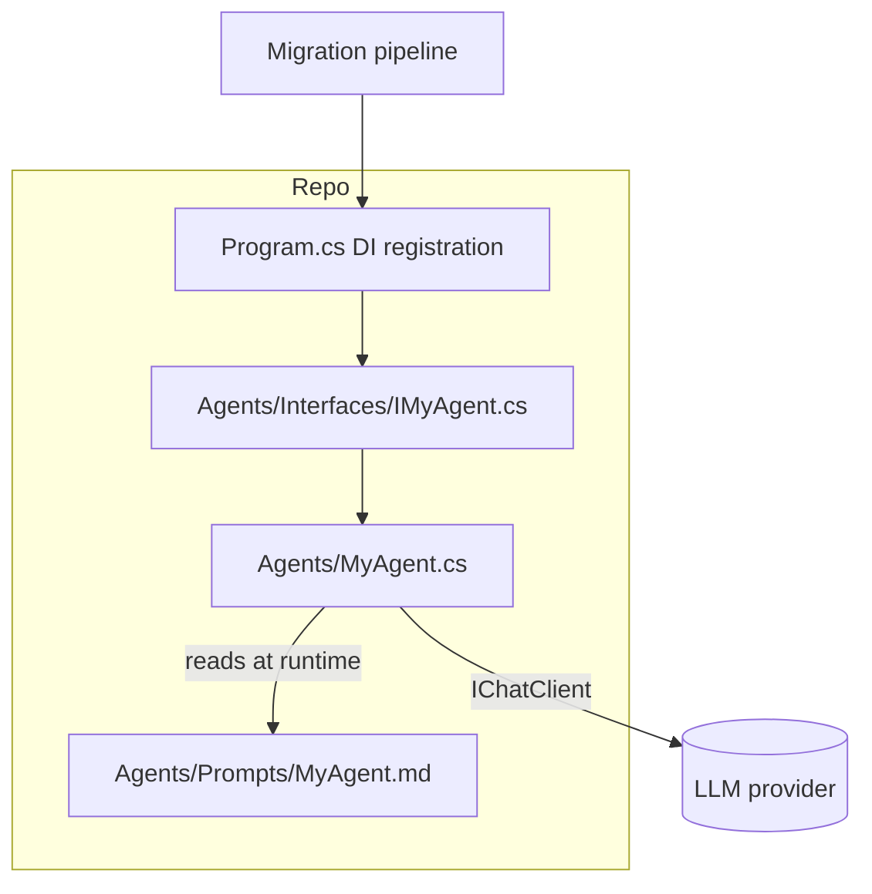

# Custom Agent Onboarding Guide

**Last updated**: 2026-05-05

This guide explains how to add a new custom agent to the Legacy-Modernization-Agents framework. The framework hosts three distinct agent surfaces — pick the one that matches your goal:

| Surface | File location | Runs in | Use when |
|---|---|---|---|
| **A. Copilot CLI agent** | `.github/agents/<name>.agent.md` | Local terminal via `gh copilot` / `copilot` CLI | You want a developer to invoke the agent on demand from their machine (e.g. *"review this branch"*). |
| **B. Agentic GitHub Actions workflow** (gh-aw) | `.github/workflows/<name>.md` (+ generated `.lock.yml`) | GitHub Actions runner, scheduled or on-demand | The agent should run server-side on a schedule, on PR events, or open issues / PRs as `safe-outputs`. |
| **C. Runtime LLM agent** | `Agents/<Name>Agent.cs` + `Agents/Interfaces/I<Name>Agent.cs` + `Agents/Prompts/<Name>.md` | The migration pipeline (`dotnet run` / Mission Control / MCP) | The agent participates in the COBOL → Java/C# migration pipeline (analysis, conversion, validation). |



The rest of this document walks through each surface end-to-end. Sections **A** and **B** are the most common interpretation of *"custom GitHub agent"* — start there. Section **C** is for deeper integration into the migration runtime.

---

## A. Copilot CLI agent (`.github/agents/`)

A Copilot CLI agent is a single Markdown file with YAML frontmatter that defines the agent's persona, allowed tools, and behaviour. The reference in this repo is `.github/agents/branch-reviewer.agent.md`.

### A.1 Anatomy

```markdown
---
description: "Use when <trigger context>. Trigger phrases: <comma-separated phrases>."
tools: ["execute", "read", "search"]
---

You are a <role>. Your job is to <goal>.

## Constraints
- DO / DO NOT rules

## Approach
1. Step-by-step reasoning the agent should follow.
2. ...

## Output Format
Describe the structured shape you expect the agent to return.
```

| Frontmatter key | Required | Notes |
|---|---|---|
| `description` | yes | Used by the CLI to surface the agent and decide when to invoke it. Lead with a behavioural trigger (*"Use when …"*) and end with explicit `Trigger phrases: …`. |
| `tools` | yes | Subset of `["execute", "read", "search"]`. Use the minimum needed — `execute` lets the agent run shell commands. |
| `model` | no | Optional override. Defaults to the user's active Copilot model. |

The body of the file is the **system prompt**. Keep it terse, list constraints first, then approach, then output format.

### A.2 Step-by-step

1. Create the file:
   ```bash
   touch .github/agents/<name>.agent.md
   ```
2. Fill in the frontmatter and body using the template above.
3. **Test locally** — from the repo root:
   ```bash
   gh copilot run                       # interactive picker, then choose your agent
   # or
   copilot run -a <name> "your prompt"  # direct invocation
   ```
4. Iterate on the prompt — Copilot CLI re-reads the file each invocation.
5. Commit and push. Other developers running `copilot` from this repo will see the agent automatically.

### A.3 Conventions used in this repo

- Filenames are **kebab-case** and end in `.agent.md` (e.g. `branch-reviewer.agent.md`).
- Read-only agents (analysis, review) explicitly state *"DO NOT modify files"* in the constraints block.
- Output Format always defines a stable structure so callers can parse / pipe results.
- Keep the system prompt under ~3 KB — longer prompts slow first-token latency.

### A.4 Listing the agent in the README

Once the agent is committed, add a row to the **Workflows** table at the bottom of `README.md` (Custom Agent → Trigger → Description). No deep-dive doc is required per repo convention.

---

## B. Agentic GitHub Actions workflow (gh-aw)

`gh-aw` agents are Markdown files in `.github/workflows/` that compile into a locked GitHub Actions YAML via `gh aw compile`. The compiled `*.lock.yml` is the file Actions actually runs — **never edit it by hand**. References: `documentation-updater.md`, `documentation-audit.md`, `test-enhancer.md`.

### B.1 Anatomy

```markdown
---
description: One-line summary that appears in the run name.
on:
  schedule: weekly        # or `cron: "0 6 * * 1"`
  workflow_dispatch:
  pull_request:
    types: [opened, synchronize]

permissions:
  contents: read
  issues: read
  pull-requests: read

tools:
  cache-memory: true
  github:
    toolsets: [default]

safe-outputs:
  create-pull-request:
    draft: true
    title-prefix: "[<name>] "
    labels: [automated]
  create-issue:
    title-prefix: "[<name>] "
    labels: [automated]
    close-older-issues: true
    max: 1
  missing-tool:
    create-issue: true

network:
  allowed:
    - defaults
    - dotnet
---

# <Agent Display Name>

You are an AI agent that <one-paragraph mission statement>.

## Phase 1: …
## Phase 2: …
## Phase 3: …

## Output / Acceptance Criteria
- …
```

| Block | Purpose |
|---|---|
| `on:` | Standard GitHub Actions triggers. `schedule:` accepts the friendly `weekly` shorthand or a raw `cron:`. |
| `permissions:` | Least-privilege scope. Default to read-only and rely on `safe-outputs:` for any writes. |
| `tools.github.toolsets` | Which GitHub toolsets the agent can call (`default` covers most). |
| `safe-outputs:` | The **only** way the agent should write to GitHub. PRs / issues created here are sandboxed and labelled. |
| `network.allowed` | Allow-list of network destinations the agent may reach during its run. Add specific package registries here as needed. |

### B.2 Step-by-step

1. **Author** the source file:
   ```bash
   touch .github/workflows/<name>.md
   ```
2. **Compile** to the locked YAML (run from repo root):
   ```bash
   gh aw compile           # regenerates every *.lock.yml from its sibling *.md
   ```
   The compiler stamps the lock file with `gh-aw-metadata` (schema version + frontmatter hash) so CI can detect drift.
3. **Commit both files** — the `.md` source AND the `.lock.yml` output. Lock files are required because Actions only runs `*.yml`, not `*.md`.
4. **Trigger** the workflow:
   - For `workflow_dispatch:` → GitHub UI → Actions tab → Run workflow
   - For schedules → wait for the cron to fire
   - For PR events → push a PR
5. **Iterate** by editing the `.md`, re-running `gh aw compile`, and committing both files together.

### B.3 Conventions

- Keep the source `.md` and the locked `.lock.yml` filenames in sync (`<name>.md` → `<name>.lock.yml`).
- Use `safe-outputs:` instead of granting `contents: write`. PRs must be `draft: true`.
- Always set `title-prefix: "[<name>] "` and a label for filtering.
- Document the agent in a one-row entry at the bottom of `README.md` under **Workflows**.

### B.4 Local dry-run

There is no full local emulator for gh-aw; the closest reproduction is:

```bash
act -W .github/workflows/<name>.lock.yml
```

This is best-effort — the `safe-outputs:` machinery only works on real GitHub runners. For prompt iteration, run the same prompt body against `copilot run` (Section A) before committing.

---

## C. Runtime LLM agent (`Agents/`)

Runtime agents participate in the migration pipeline (analysis, conversion, validation). They are C# classes that consume `IChatClient` (Microsoft.Extensions.AI) and have an editable Markdown prompt under `Agents/Prompts/`. References: `CobolAnalyzerAgent.cs`, `JavaConverterAgent.cs`, `DependencyMapperAgent.cs`.



### C.1 Required pieces

| File | Purpose |
|---|---|
| `Agents/Interfaces/I<Name>Agent.cs` | The contract. One method per agent capability returning `Task<TResult>`. |
| `Agents/<Name>Agent.cs` | The implementation. Loads the prompt, calls `IChatClient.GetResponseAsync(...)`, post-processes the result. |
| `Agents/Prompts/<Name>.md` | The system prompt. Editable at runtime (Prompt Studio in the portal also writes here). Versioned in `Agents/Prompts/.prompt-scores.json`. |
| Wiring in `Program.cs` (or the migration entrypoint) | `services.AddSingleton<I<Name>Agent, <Name>Agent>();` |

### C.2 Implementation skeleton

`Agents/Interfaces/IMyAgent.cs`:
```csharp
namespace CobolToQuarkusMigration.Agents.Interfaces;

public interface IMyAgent
{
    Task<MyAgentResult> RunAsync(MyAgentInput input, CancellationToken cancellationToken = default);
}
```

`Agents/MyAgent.cs`:
```csharp
using Microsoft.Extensions.AI;
using Microsoft.Extensions.Logging;
using CobolToQuarkusMigration.Agents.Interfaces;
using CobolToQuarkusMigration.Helpers;

namespace CobolToQuarkusMigration.Agents;

public sealed class MyAgent : IMyAgent
{
    private readonly IChatClient _chat;
    private readonly ILogger<MyAgent> _log;
    private readonly string _modelId;

    public MyAgent(IChatClient chat, ILogger<MyAgent> log, AppSettings settings)
    {
        _chat = chat;
        _log = log;
        _modelId = settings.ChatModelId ?? "gpt-5.4";
    }

    public async Task<MyAgentResult> RunAsync(MyAgentInput input, CancellationToken ct = default)
    {
        // 1. Load + render the prompt template (path: Agents/Prompts/MyAgent.md)
        var prompt = await PromptLoader.LoadAsync("MyAgent", input.AsTemplateBag(), ct);

        // 2. Call the LLM
        var resp = await _chat.GetResponseAsync(
            new[] {
                new ChatMessage(ChatRole.System, prompt.System),
                new ChatMessage(ChatRole.User, prompt.User),
            },
            cancellationToken: ct);

        // 3. Validate / parse / post-process
        return MyAgentResult.Parse(resp.Text);
    }
}
```

`Agents/Prompts/MyAgent.md`:
```markdown
## SECTION: System
You are a <role>. Constraints: <list>.

## SECTION: User
<{{template variables that get filled at runtime}}>
```

The `## SECTION:` headers are how `PromptLoader` splits the prompt into system/user parts. Other agents in this repo follow the same convention.

### C.3 Wiring

Register the agent in `Program.cs` (or wherever the pipeline configures DI):

```csharp
services.AddSingleton<IMyAgent, MyAgent>();
```

If the agent needs to be invoked from the portal's chat or Mission Control, also expose it via an MCP endpoint or a minimal API in `McpChatWeb/Program.cs`.

### C.4 Conventions

- Naming: `<Capability>Agent` (singular). E.g. `CobolAnalyzerAgent`, not `CobolAnalysisAgent`.
- Prompt files are **kebab-free** and match the class name (`CobolAnalyzer.md` for `CobolAnalyzerAgent`).
- Inject `IChatClient` — never construct an SDK client inline. The DI container provides the right backend (Copilot SDK or Azure OpenAI) per `AISETTINGS__SERVICETYPE`.
- Long-running agents must accept and honour `CancellationToken`.
- Add unit tests under `CobolToQuarkusMigration.Tests/Agents/<Name>AgentTests.cs` using Moq for `IChatClient` and FluentAssertions.
- Update the model registry / Prompt Studio so users can edit the prompt from the portal:
  ```bash
  ls Agents/Prompts/   # the new file appears in the Prompt Studio UI automatically
  ```

---

## Cross-cutting checklist

Regardless of which surface you choose:

- [ ] Pick the **least-privilege** scope (`tools` array for A, `permissions:` for B, only the interfaces you need for C).
- [ ] Add the agent to the **Workflows** table at the bottom of `README.md` (one row, no deep-dive doc).
- [ ] Verify the agent works against both the **GitHub Copilot SDK** and **Azure OpenAI** providers — the framework supports both via `AISETTINGS__SERVICETYPE`.
- [ ] Surface failures clearly. For B, prefer `safe-outputs.create-issue` over silent stderr. For C, log structured warnings via `ILogger`.
- [ ] If the agent emits structured data (JSON/YAML), define and document the schema in the prompt's *Output Format* section so callers can rely on it.

## Troubleshooting

| Symptom | Likely cause | Fix |
|---|---|---|
| `gh aw compile` reports schema-version mismatch | gh-aw upgraded since the lock file was generated | Re-run `gh aw compile` and commit the regenerated `.lock.yml`. |
| Copilot CLI doesn't show the agent | Filename doesn't end in `.agent.md` or frontmatter is invalid | Validate frontmatter is enclosed in `---` lines and the file is in `.github/agents/`. |
| Runtime agent throws `Copilot CLI not found` | The Copilot SDK build target failed to download the binary | The framework auto-resolves the system `copilot` binary via `Services/CopilotCliResolver.cs`. Ensure `copilot` is installed (`brew install gh && gh extension install github/gh-copilot`). |
| Workflow agent times out reaching a package registry | Registry not in `network.allowed` | Add the host to the allow-list and recompile. |

## Related documentation

- [`docs/legacy-modernization-flow.md`](legacy-modernization-flow.md) — How runtime agents fit into the end-to-end migration pipeline.
- [`docs/REVERSE_ENGINEERING_ARCHITECTURE.md`](REVERSE_ENGINEERING_ARCHITECTURE.md) — Architecture and data flow.
- [`docs/smart-chunking-architecture.md`](smart-chunking-architecture.md) — How large COBOL files are chunked before being sent to a runtime agent.
- [`.github/agents/branch-reviewer.agent.md`](../.github/agents/branch-reviewer.agent.md) — Reference Copilot CLI agent.
- [`.github/workflows/test-enhancer.md`](../.github/workflows/test-enhancer.md) — Reference gh-aw workflow agent.
- [`Agents/CobolAnalyzerAgent.cs`](../Agents/CobolAnalyzerAgent.cs) — Reference runtime LLM agent.
