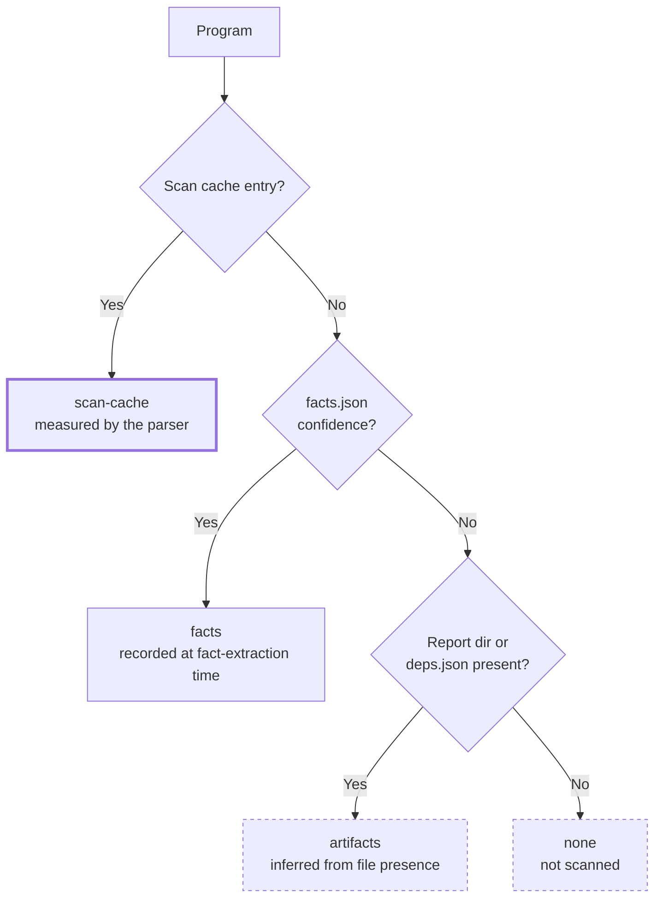
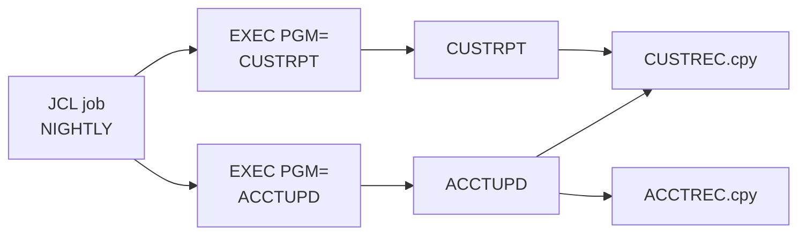
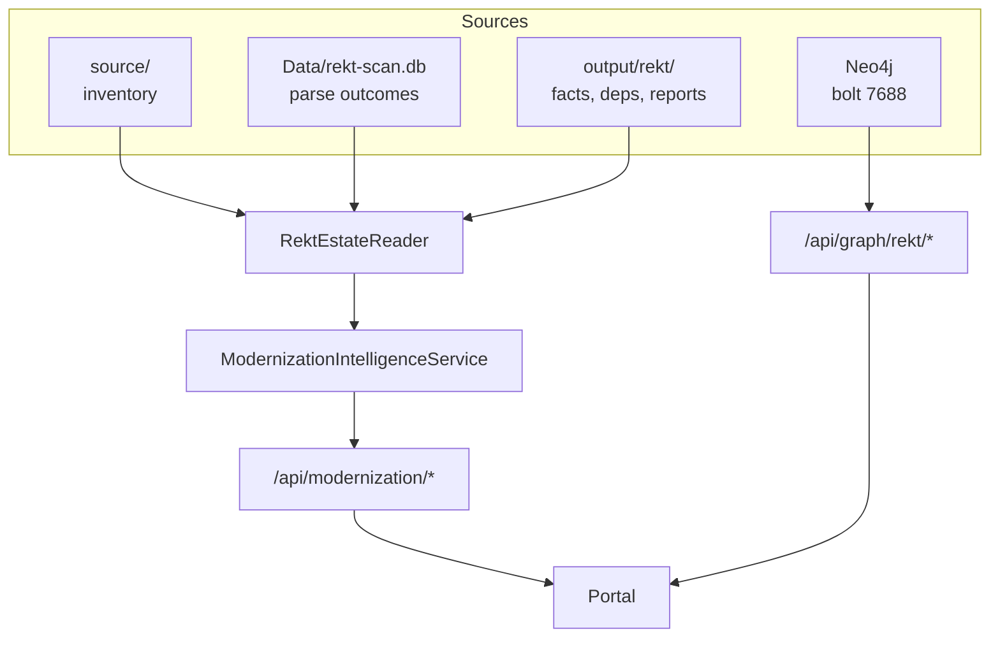

**Last updated**: 2026-09-08

# Dependency Health and Semantic Flow Explorer

This feature answers one question: **which programs can be converted safely right now?**

Every other portal surface is model-assisted and therefore probabilistic. This one is not. It reports only what the REKT parser actually observed — parse fidelity, resolved CALL/COPY edges, JCL job chains and paragraph-level flow — so that conversion order can be decided from evidence rather than from an LLM's summary of the estate.

It is a **preview feature**, like the REKT scan it reads from. Six subviews are labelled placeholders whose endpoints ship with later features; see [Placeholders](#placeholders).

---

## Why fidelity gates conversion

A program whose copybooks are missing does not parse into a usable AST. Converting it produces a stub that compiles but silently loses the record layouts, and the loss is not visible until runtime. The estate therefore splits into five states, and only the top two are safe to convert unattended.

| Fidelity | Meaning | Safe to convert |
|---|---|---|
| `full` | Complete AST, all copybooks resolved | Yes |
| `partial` | AST built, some data definitions unresolved | Review the gaps first |
| `deps-only` | Dependencies extracted, no usable AST | No — resolve copybooks, re-scan |
| `failed` | Parser could not process the file | No — dialect or format problem |
| `not-parsed` | Never included in a scan | No — unknown |

`ReadinessScore` weights these as `full × 1.0 + partial × 0.5 + deps-only × 0.25`, over non-copybook programs only. `CoveragePct` is the stricter `full ÷ total`. Copybooks are excluded from both because they are includes, not conversion units, and counting them inflates readiness with work that does not exist.

### Fidelity is reported with its source

The same fidelity value carries very different weight depending on where it came from. A value read from the scan cache was measured by the parser. A value inferred from the mere presence of a report directory was not.



Each row carries a `FidelitySource` of `scan-cache`, `facts`, `artifacts` or `none`, and the UI weakens the badge for the latter two. An inferred value is never displayed as a measured one.

The scan cache is preferred because it is the only source that records a *parse outcome* rather than a by-product of one. It is keyed by basename under the `v1-basename` identity scheme, while facts use `v2-source-relative`. That mismatch is deliberate and is handled explicitly: when a basename maps to more than one source file, the cache entry is ambiguous and is **discarded** rather than attributed to an arbitrary one of them.

---

## The four surfaces

### Dependency Health

The estate-wide roll-up: fidelity buckets, readiness and coverage, missing copybooks with the programs that reference them, and blocked programs.

Missing copybooks come from `output/rekt/missing-copybooks.txt`, written by `doctor.sh` before parsing so that reduced coverage is explicit rather than discovered later. The file is truncated to empty when nothing is missing, which is a valid state and not an error.

### Dependency Topology

The CALL/COPY graph. Node size is lines of code, colour is fidelity, and COPY edges are dashed to distinguish an include from a transfer of control.

Edges whose target cannot be resolved to a known program are **not dropped**. They are listed separately as unresolved, because an unresolved CALL is usually a missing program rather than a parser artefact, and silently omitting it would make the estate look more complete than it is.

### Service Chain

JCL job steps down to the programs they execute and the copybooks those programs include.



Programs no job executes are rendered standalone rather than hidden — an unscheduled program is a real finding, since it is either dead code or invoked by something outside the scanned estate.

Filters narrow by job or by program. Mermaid output is capped at 200 edges and flags the truncation; the JSON response always carries the complete graph.

### Semantic Flow Explorer

Per-program procedural detail: paragraphs, sections, PERFORM targets and SQL statements, from the AST the parser produced.

Where an artifact is absent this is reported plainly rather than rendered as an empty flow, because an empty diagram and a program with no artifacts look identical to a reader but mean very different things.

---

## How the data is read



`RektEstateReader` is the single read path. It walks the source inventory first so that programs which were never scanned still appear — a program missing from the output directory is precisely the one a readiness score must not ignore.

Artifacts are resolved per program in this order, the first hit winning:

| Artifact | Location |
|---|---|
| Facts | `{rektDir}/{source-relative-path}.facts.json` |
| Report | `{rel}.report`, then `{basename}.report`, `{stem}.cbl.report`, `{stem}.report`, `{stem}.CBL.report` |
| Dependencies | `deps.json` within the resolved report directory |

The fallback chain exists because report directory naming has changed across scanner versions and older output directories remain valid input.

Lines of code prefer `facts.summary.loc`. Failing that, line feed *bytes* are counted directly — the corpus contains files with unpaired CR and LF characters, which .NET's universal-newline handling splits on independently and double-counts.

Names are preserved exactly as the parser emitted them and compared case-insensitively. Normalising them for storage would make the UI disagree with the source.

---

## Endpoints

| Endpoint | Returns |
|---|---|
| `GET /api/modernization/dependency-health` | Fidelity buckets, readiness, coverage, missing copybooks, blocked programs |
| `GET /api/modernization/topology` | CALL/COPY nodes and edges, plus unresolved edges |
| `GET /api/modernization/service-chain` | JCL → program → copybook chains and Mermaid source. Optional `?job=` and `?program=` |
| `GET /api/modernization/flow/{**identity}` | Paragraphs, sections, PERFORM targets and SQL for one program |
| `GET /api/graph/rekt/runs` | Scan runs with file counts |
| `GET /api/graph/rekt/architect` | Program inventory with AST availability |
| `GET /api/graph/rekt/services` | Service-layer projection with call and SQL counts |

The `/api/graph/rekt/*` group reads Neo4j and degrades to an explanatory banner when the graph is unreachable. The `/api/modernization/*` group reads the filesystem and scan cache, and therefore works without Neo4j running.

---

## Using it

The views need REKT output. Generate it with:

```bash
./doctor.sh rekt-full
```

Then open the portal and select the **Dependency** or **Modernization Intelligence** tab.

The scan-run selector filters to a single run. Runs covering two files or fewer are omitted, as these are single-program re-scans that would empty every view without explaining why. When Neo4j is unreachable the selector disables itself with the reason rather than offering an empty dropdown.

---

## Placeholders

These subviews render a labelled empty state. Their endpoints are not part of this feature and ship later; no placeholder numbers are shown, since a plausible-looking figure on a decision surface is worse than an obvious gap.

- Modernization Dashboard
- Application Explorer
- Runtime Intelligence
- Service Inventory
- Wave Planning
- Capability Mapping
- Reachability, within the services view

---

## Implementation notes

Two constraints are worth knowing before changing this code.

**The scan cache schema is not hand-writable.** `SqliteRektScanCache.EnsureSchema()` compares `PRAGMA user_version` against `StorageSchemaVersion` and drops and recreates `scan_entry` on a mismatch. Always seed through `UpsertAsync`. Rows whose `semantic_invalidation_ver` does not match the current version are skipped silently.

**A vis-network canvas must have a non-growable height.** vis-network sizes itself to its container, so a container that grows to fit its content feeds back into itself. During development this drove the canvas past 50,000px within seconds. `.dashboard-panel` therefore pins `height`, `min-height` and `max-height` together, matching the existing `#dependency-graph` convention.
