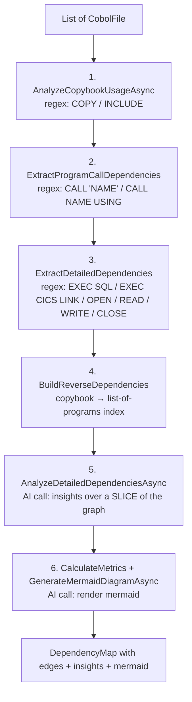

# DependencyMapperAgent — Depth & Reach Limitations

**Last updated**: 2026-05-07

This is an audit of how deep `Agents/DependencyMapperAgent.cs` (506 LOC) actually looks and where it stops. Short answer: **it is a single-pass, two-hop, regex-driven mapper that does not perform transitive resolution, does not recurse, and intentionally truncates the AI-assisted enrichment step.** If you need full transitive call graphs, copybook expansion through copybooks, or whole-codebase reasoning, this agent is not the layer that gives them to you — the **Cobol-REKT graph (Neo4j)** is.

---

## TL;DR

| Aspect | Limit | Set by | Effect |
|---|---|---|---|
| Graph traversal depth | **1 hop only** (no transitive closure) | `ExtractProgramCallDependencies` / `ExtractDetailedDependencies` | A program that CALLs B which CALLs C is recorded as A→B and B→C, never as A→C |
| Copybook-of-copybook expansion | **None** | `ExtractCopybookReferences` is non-recursive | Nested COPYs in copybooks are not followed |
| Programs sent to AI enrichment | **First 5** (`Take(5)`) | `AnalyzeDetailedDependenciesAsync` line 413 | The AI insights only see a slice of the codebase, not the whole graph |
| Copybook-usage rows sent to AI | **First 10** (`Take(10)`) | Same call site, line 419 | AI insights are biased toward the first few copybooks |
| Mermaid diagram fan-out | All edges, no cap | `GenerateMermaidDiagramAsync` | Diagrams of 200+ programs become unreadable; truncation must be done downstream |
| Comment handling | Column-7 `*` only | `ExtractDetailedDependencies` line 188 | Free-form comments and `*>` floating comments are not stripped |
| Source format | Fixed-form COBOL (col 7 indicator) assumed | Same | Free-form COBOL, Micro Focus extensions, COBOL/2002 may parse incorrectly |
| Continuation lines | Not joined | All extractors split on `\n` and process line-by-line | A `CALL` split across multiple continuation lines is missed |
| `CALL <variable>` (dynamic dispatch) | Not resolved | Regex requires literal `'NAME'` or `"NAME"` or `CALL NAME USING` | Dynamic CALLs (`CALL WS-PGM-NAME`) are silently dropped |
| `EXEC SQL` parsing | Single-statement, regex only | `AnalyzeSqlBlock` | Subqueries, CTEs, multi-table FROM clauses with aliases get partial coverage |
| `EXEC CICS` parsing | Only `LINK PROGRAM('…')` | `ExtractDetailedDependencies` line 215 | `XCTL`, `START`, `RETURN`, `SEND MAP`, `RECEIVE MAP` are not mapped |
| File I/O parsing | Anchored at start-of-line `^OPEN/READ/WRITE/CLOSE` | Lines 223–233 | Statements indented past column 12 with leading text are missed |
| AI-step token budget | Bounded by `AgentBase.CalculateTokenSettings` per provider | Inherited via `ExecuteChatCompletionAsync` | Final insights document is capped to `MaxOutputTokens` for the active model; truncation is detected and warned but not auto-retried at higher cap |
| Persistence depth | Edges only, no path metadata | `DependencyMap.Dependencies` shape | You can reconstruct paths in Neo4j after ingest, but the agent does not export them |

---

## 1. What the agent actually does (six-step pipeline)

`AnalyzeDependenciesAsync` (line 80) runs these steps **in this order**, once per migration run:



**No step recurses.** Each is a single linear pass over the input list. The output `DependencyMap.Dependencies` is a flat list of `(SourceFile, TargetFile, DependencyType, LineNumber, Context)` tuples — it has the *raw edges*, but no resolved paths, no closure, no levels.

---

## 2. Hard limits that bound depth and reach

### 2.1 No transitive closure

```csharp
// ExtractProgramCallDependencies (line 345)
var calledPrograms = ExtractProgramCallsWithLines(cobolFile.Content);
foreach (var (programName, lineNumber) in calledPrograms)
{
    var dependency = new DependencyRelationship { SourceFile = cobolFile.FileName, TargetFile = programName, ... };
    if (!dependencyMap.Dependencies.Contains(dependency))
        dependencyMap.Dependencies.Add(dependency);
}
```

The loop iterates `cobolFiles` once and records direct edges. There is no follow-up pass that says *"now find what each TargetFile depends on."* If `BNK1DCS` calls `INQCUST` which calls `UPDCUST`, the agent stores `BNK1DCS → INQCUST` and `INQCUST → UPDCUST`, but **never `BNK1DCS → UPDCUST`**.

If you need the transitive set, query the graph in Neo4j after ingest:

```cypher
MATCH (a:CobolFile {fileName: 'BNK1DCS.cbl'})-[:DEPENDS_ON*1..5]->(reachable)
RETURN DISTINCT reachable.fileName
```

The `*1..5` is the Cypher way of bounding depth — the agent itself never does this.

### 2.2 No copybook-of-copybook expansion

```csharp
// AnalyzeCopybookUsageAsync (line 121)
foreach (var cobolFile in cobolFiles.Where(f => f.FileName.EndsWith(".cbl")))
{
    var copybooks = ExtractCopybookReferences(cobolFile.Content);
    copybookUsage[cobolFile.FileName] = copybooks;
}
```

Note the filter: **`.cbl` only**. Copybooks (`.cpy`) are not scanned for their own COPY statements. So `PROG.cbl COPY ABC.cpy` where `ABC.cpy COPY XYZ.cpy` produces only the `PROG.cbl → ABC.cpy` edge — `ABC.cpy → XYZ.cpy` is never recorded by this agent.

(Cobol-REKT *does* capture this in its AST, which is why the AST Galaxy view shows nested COPY structures correctly.)

### 2.3 AI enrichment sees a tiny slice

```csharp
// AnalyzeDetailedDependenciesAsync (line 413)
var fileStructure = string.Join("\n", cobolFiles.Take(5).Select(f => …));
var userPrompt = … {
    ["FileStructure"] = fileStructure,
    ["CopybookUsagePatterns"] = string.Join("\n", dependencyMap.CopybookUsage.Take(10).Select(…))
};
```

The AI-driven *insights* step receives the structure of **at most 5 programs** and the copybook-usage rows for **at most 10 copybooks**. For a 100-program portfolio, 95% of programs are invisible to the LLM at this stage. The numbers are hard-coded and not configurable from `AppSettings` — they're literally `Take(5)` and `Take(10)` in the source.

If the model needs to "look across the whole codebase" you need to either raise these caps (and absorb the token cost) or feed the model the post-ingest Neo4j projections.

### 2.4 Regex extraction misses several real-world patterns

The dependency extractor is **regex-based**, not AST-aware:

| Pattern | Regex | What it misses |
|---|---|---|
| `CALL 'NAME'` / `CALL "NAME"` / `CALL NAME USING` | `Agents/DependencyMapperAgent.cs:312-315` | `CALL ws-program-name` (dynamic), CALL split across continuation lines, CALL inside `EVALUATE` branches with non-literal targets |
| `COPY NAME[.cpy]` / `INCLUDE NAME` / `COPY 'NAME'` | `:285-291` | `COPY name REPLACING ==tag== BY ==…==` works for the name, but the REPLACING semantics are not recorded; copybooks under non-default `SUPPRESS` are still recorded |
| `EXEC SQL … END-EXEC` | `:192–209` | A single multi-table `FROM A JOIN B JOIN C` extracts each table, but JOIN aliases (`A AS X`) end up recording `X` instead of `A` because the regex captures the next token after the keyword |
| `EXEC CICS LINK PROGRAM('NAME')` | `:215` | All other CICS verbs (`XCTL`, `START`, `READQ TS`, `WRITEQ TD`, `SEND MAP`, `RECEIVE MAP`, `READ FILE`, `WRITE FILE`) are not mapped as dependencies |
| File I/O `OPEN/READ/WRITE/CLOSE` | `:223-233`, anchored `^` | Anything not starting at the very beginning of a trimmed line (e.g. `IF flag READ FILE …`) is missed |

The `IsReservedWord` filter (line 259) only blocks 15 SQL keywords — narrow enough to miss many false positives in custom DSLs.

### 2.5 Comment handling is column-7-only

```csharp
if (line.Length > 6 && line[6] == '*') continue;   // line 188
```

This recognises the **fixed-form** COBOL comment indicator (a `*` in column 7). It does not handle:
- Free-form COBOL (no fixed columns, comments start with `*>`)
- Inline `*>` floating comments at the end of a code line
- `D` debug-mode lines

Programs written in modern free-form style will be parsed as if they were code — the agent will record dependencies that exist *inside comments*.

### 2.6 Continuation lines not joined

Each extractor splits on `\n` and processes one line at a time. A statement continued across two lines:

```cobol
       CALL 'INQCUST'
-          USING WS-CUSTOMER-COMMAREA.
```

is processed as two separate lines. The first matches `CALL 'INQCUST'` *(no `USING`)*, which only the literal-quoted regex catches; the third regex (`CALL NAME USING`) cannot fire because `USING` is on a different line. Net result: usually OK for the literal-quoted form, **silently broken** for the `CALL identifier USING` form.

### 2.7 AI step token budget

The mermaid-generation and insights calls go through `AgentBase.ExecuteChatCompletionAsync` → `CalculateTokenSettings` (line 153 of `AgentBase.cs`), which clamps `MaxOutputTokens` per active model profile. `AgentBase` does retry on a *reasoning-exhaustion* signal (line 237: `currentMaxTokens = (int)(currentMaxTokens * profile.ReasoningExhaustionRetryMultiplier)` capped at `profile.MaxOutputTokens`), but stops once both the token budget and reasoning effort are at maximum. The retried response *may* still be truncated — `DetectTruncation` (line 174) logs a warning but downstream code accepts the partial output.

For the dependency mapper this typically means: **on a portfolio of 50+ programs, the AI insights paragraph at the bottom of `DependencyMap.AnalysisInsights` may end mid-sentence**. The structural edges are not affected (those come from the regex pass), only the narrative.

---

## 3. What is *not* a limit

To avoid scope confusion:

- **The number of programs scanned is unlimited.** The agent walks every `CobolFile` in the input list. The "5" and "10" caps are for the AI-narrative step, not the structural pass.
- **The number of edges is unlimited.** `DependencyMap.Dependencies` is a `List<DependencyRelationship>` with no cap. Memory is the only ceiling.
- **The Mermaid diagram has no edge limit in code.** `GenerateMermaidDiagramAsync` joins all dependencies with `\n`. For very large graphs the diagram is unreadable but not truncated by us — it's the renderer (browser mermaid.js) that gives up.
- **The agent runs once per migration run, end-to-end, on the in-memory file list.** It is not streamed and does not see partial results.

---

## 4. Where transitive depth *is* available

If you actually need n-hop reach, the framework provides it elsewhere:

| Surface | Depth model | How to query |
|---|---|---|
| **Cobol-REKT Neo4j** (`bolt://localhost:7688`) | Full graph; you choose the depth in the Cypher query | `MATCH (n:CobolFile {fileName: 'X.cbl'})-[:DEPENDS_ON*1..N]->(m) RETURN m` |
| **`/api/graph/rekt/galaxy`** (portal endpoint) | Returns programs + edges; the dashboard does its own n-hop projection client-side | AST Galaxy "Service Catalog (Expanded)" mode walks edges in JS |
| **Migration Planner** | Uses `inbound × 2 + outbound` (1-hop only) for the criticality score by design | `migration-planner.js` `_buildAllRowsForBounds` |
| **`./doctor.sh rekt-full`** | Re-parses every program with smojol-cli and ingests AST/CFG/Data into Neo4j — this is where copybook-of-copybook and dynamic-call resolution actually happen | Runs the static-analysis pipeline |

The `DependencyMapperAgent` is best understood as a **fast, regex-only sketch** that runs inside the migration pipeline to produce the `DependencyMap` model needed by the converters. The deep, multi-hop reasoning lives in the REKT graph.

---

## 5. Recommendations if you need deeper reach

In rough order of effort:

1. **Use the REKT Neo4j graph** for any query that requires more than one hop. The agent's job is to feed the converters, not to be the source of truth for graph traversal. `./doctor.sh rekt-full` populates this graph from the same source files.
2. **Raise the AI-step caps** if you only need a richer narrative paragraph. Replace `Take(5)` and `Take(10)` in `AnalyzeDetailedDependenciesAsync` with values driven from `AppSettings.DependencyMapper.MaxInsightFiles` / `.MaxInsightCopybooks`. Be aware that this multiplies token cost.
3. **Add a transitive-closure pass** as a post-step on `DependencyMap`. ~30 LOC: BFS from each program over the existing edges, capped at a configurable depth (default 5). Store the result in a new `DependencyMap.TransitiveDependencies` field so it doesn't pollute the per-edge list the converters consume.
4. **Replace the regex extractors with the REKT AST** for the structural pass. The agent would shrink to a thin adapter that reads `output/rekt/<program>.cbl.report/ast/*.json` and projects edges. This eliminates every regex limitation listed in §2.4–§2.6 in one stroke. The cost is making the agent depend on the REKT pipeline having run first.
5. **Recurse copybooks** by removing the `.EndsWith(".cbl")` filter in `AnalyzeCopybookUsageAsync` so `.cpy` files are scanned too, then resolving nested `COPY` statements with a visited-set to break cycles. Adds ~15 LOC; closes the *"copybook-of-copybook"* gap without touching the rest of the agent.

If you only do (1) you keep the agent fast and the deep queries happen on demand against Neo4j. If you also do (3) and (5), the agent itself becomes a fully-resolved local dependency view. (4) is the biggest behaviour change and worth a separate design discussion before committing.

---

## Related code & docs

- Source: [`Agents/DependencyMapperAgent.cs`](../Agents/DependencyMapperAgent.cs) (506 LOC)
- Prompt: [`Agents/Prompts/DependencyMapper.md`](../Agents/Prompts/DependencyMapper.md)
- Interface: [`Agents/Interfaces/IDependencyMapperAgent.cs`](../Agents/Interfaces/IDependencyMapperAgent.cs)
- Token budget logic: [`Agents/Infrastructure/AgentBase.cs`](../Agents/Infrastructure/AgentBase.cs) `CalculateTokenSettings` / `DetectTruncation`
- Where deep traversal *does* happen: [`docs/rekt-demo.md`](rekt-demo.md), [`docs/customagent.md`](customagent.md) §C
- Migration-strategy implications: [`docs/githubcustomagents.md`](githubcustomagents.md) §5 (DependencyMapper is the recommended candidate to migrate to a gh-aw workflow precisely because it's a single-shot analytical agent — the depth limits make this safer, not riskier)
