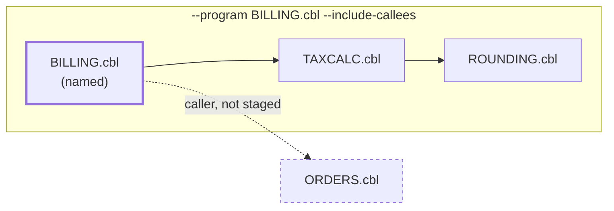
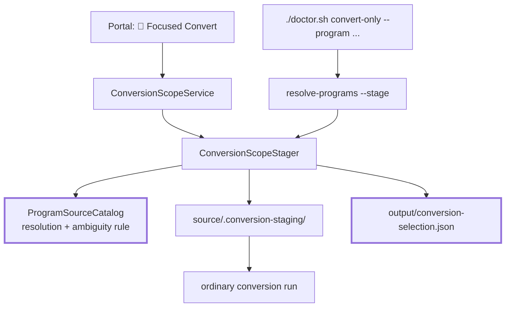

**Last updated**: 2026-09-10

# Focused Conversion Selectors

This feature answers one question: **can I convert part of the estate instead of all of it?**

A whole-estate conversion is all-or-nothing. It takes as long as the largest program, and a failure anywhere leaves an output tree that is hard to reason about. Focused conversion narrows a run to a named set of programs — optionally widened along recorded `CALL` edges — so migration can proceed program by program, wave by wave, with each step small enough to review.

It is a **preview feature**, like the REKT scan whose evidence it reads. Three selector kinds are labelled placeholders; see [Deferred selectors](#deferred-selectors).

---

## What a selector is

A selector names programs. It is accepted in three forms, in this order of preference:

| Form | Example | Notes |
|---|---|---|
| Source-relative path | `finance/LEDGER.cbl` | Always unambiguous. Preferred. |
| Basename | `LEDGER.cbl` | Rejected if two programs share it. |
| Stem | `LEDGER` | Rejected if two programs share it. |

Resolution is the same code on every path — `ProgramSourceCatalog.ResolveSelector` — so the CLI, the pipeline and the portal cannot disagree about what a selector means.

### Ambiguity is refused, never guessed

An estate may legitimately contain `finance/LEDGER.cbl` and `archive/LEDGER.cbl`. A resolver that picks one converts the wrong program and reports success, and nothing downstream can detect it: the output is a well-formed Java file with the right class name and the wrong logic.

So an ambiguous basename or stem is an error. The message names every candidate and asks for a source-relative path.

```
Program selector 'LEDGER.cbl' matched multiple staged programs by basename:
archive/LEDGER.cbl, finance/LEDGER.cbl. Use a source-relative path.
```

This is a deliberate departure from the earlier design carried on the `preview` branch, whose resolver emitted a duplicate-basename warning to stderr and continued with one of the candidates.

---

## Dependency closure

`--include-callees` widens the selection to everything the named programs call. `--include-callers` widens it to everything that calls them. Both may be combined, and both are transitive.



Closure is computed from **recorded** `CALL` edges in `*.facts.json`, not from re-parsing. That has two consequences worth stating plainly:

- **Closure needs a scan.** With no facts, closure is unavailable rather than empty. The CLI says so; the portal disables the checkboxes and shows the reason. An empty closure would look like "this program calls nothing", which is a measurement the tool has not made.
- **A dynamic `CALL` cannot be followed.** Where a program calls a target held in a variable, the target is not a name at parse time. These are collected as `unresolvedCallTargets` in the manifest rather than dropped, so the gap in the closure is visible.

---

## The two front doors

The CLI and the portal reach conversion by different routes, so the parts they share are factored out rather than reimplemented.



Both write the same manifest and stage into the same layout, because both call the same two classes.

### Staging

The resolved scope is copied into `source/.conversion-staging/`, and the run is pointed at that directory. The converter itself is unchanged — it still converts everything it is given; it is simply given less.

Four rules govern the copy, each load-bearing:

1. **Programs keep their source-relative folders.** Flattening would collide `finance/LEDGER.cbl` with `archive/LEDGER.cbl`.
2. **Copybooks stage flat at the root.** `COPY` resolves by basename, so a copybook under its original folder would not be found.
3. **Hidden directories are pruned when walking the source.** Staging lives inside `source/`, so without this the previous run's staged copies re-enter the catalog and make every basename ambiguous.
4. **The staging directory is cleared before resolving.** A refused selector must leave no scope behind, or the next run silently converts the previous selection.

`source/*` is gitignored, so the staged copy is never committed.

### `SELECTOR_MODE`

When a selector is active, `doctor.sh` exports `SELECTOR_MODE=true`. Copybooks in a focused scope are `COPY` context for the selected programs, not conversion units in their own right; without the flag they would be counted as work and reported as unconverted.

---

## The selection manifest

Every focused run writes `output/conversion-selection.json`, from both front doors:

```json
{
  "schemaVersion": 1,
  "generatedUtc": "2026-09-10T13:37:50.125162+00:00",
  "stagingDir": "/repo/source",
  "factsDir": "/repo/output/rekt",
  "selectors": {
    "programs": ["finance/BILLING.cbl"],
    "includeCallers": false,
    "includeCallees": true
  },
  "programs": ["finance/BILLING.cbl", "shared/TAXCALC.cbl"],
  "matches": [
    { "program": "finance/BILLING.cbl", "reason": "program selector 'finance/BILLING.cbl'" },
    { "program": "shared/TAXCALC.cbl", "reason": "called by finance/BILLING.cbl" }
  ],
  "unresolvedCallTargets": ["WS-TARGET-PGM"]
}
```

`stagingDir` is the directory the selection was resolved *against* — the source tree, not the staged copy. `matches` records *why* each program is in scope: `program selector '…'` for a named program, `called by …` / `calls …` for one pulled in by closure.

The manifest exists so that a narrow output tree can be told apart from a whole-estate run that lost programs, and so an unexpected entry can be traced to the selector or the edge that pulled it in.

---

## Usage

### CLI

```bash
# One program.
./doctor.sh convert-only --program LEDGER.cbl

# A program and everything it calls, transitively.
./doctor.sh run --program finance/BILLING.cbl --include-callees

# Several, comma-separated or repeated.
./doctor.sh convert-only --program BILLING.cbl,LEDGER.cbl
```

`--include-callers` and `--include-callees` require `--program` to seed the closure. Selectors are not supported on `resume`, which continues an existing run whose scope is already fixed.

### Resolver, standalone

`resolve-programs` prints the resolved scope, one source-relative path per line, and is the same resolution the pipeline uses. It makes no model call.

```bash
dotnet run -- resolve-programs ./source \
  --program finance/BILLING.cbl --include-callees \
  --manifest output/conversion-selection.json
```

Add `--stage <dir>` to also copy the scope. `--facts-dir` defaults to `output/rekt`.

### Portal

**🎯 Focused Convert** opens a modal listing every program in the source tree with its line count, parse fidelity, and call/caller counts. Counts render as `—` where no scan has recorded them; a `0` would read as a measured "no callers" on a screen used to choose a conversion scope.

---

## Deferred selectors

The feature description covers six selector kinds. Three ship here — program, callee closure, caller closure. The other three are labelled placeholders in the modal and are not accepted by the CLI:

| Selector | Why it is deferred |
|---|---|
| Transaction | `ProgramFacts.ExternalEffects` records only the flag `CICS`, with no TRANSID codes to select on. Needs a facts-schema change first. |
| Wave | No wave assignment exists in any artefact. Needs a source of truth before it can select anything. |
| Target component | No component mapping is recorded today. |

Each would need evidence that is not currently collected. Accepting the flag and matching nothing would be worse than rejecting it.

---

## Related

- [Dependency Health and Semantic Flow Explorer](dependency-health-and-flow-explorer.md) — the readiness view that informs *which* programs to select.
- [Conversion Parity Validation](conversion-parity-validation.md) — checks that what was selected actually converted.
