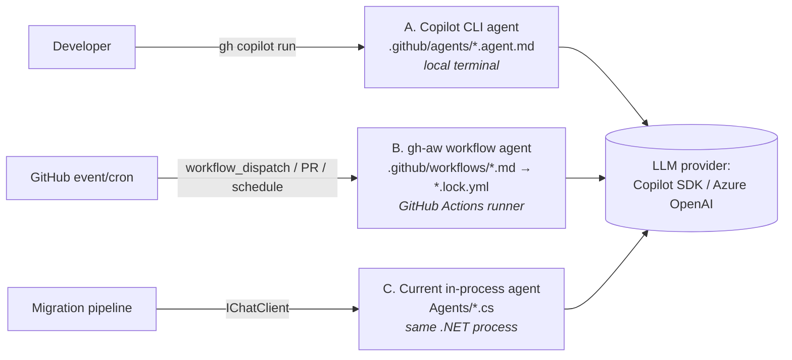

# Migrating the Runtime Agents to GitHub Custom Agents

**Last updated**: 2026-05-05

This document analyses what it would take to replace the in-process C# agents in this framework with **GitHub-hosted custom agents** — i.e. the same agent surface used by `.github/agents/branch-reviewer.agent.md` (Copilot CLI agents) or `.github/workflows/test-enhancer.md` (gh-aw workflow agents). It is a planning document; nothing is changed yet.

The recommendation, in one line: **don't replace, augment**. The current in-process agents are tightly coupled to the migration runtime (chunking, Neo4j writes, repository persistence, structured `CobolFile` / `CobolAnalysis` types) and cannot be lifted as-is into the GitHub agent execution model without losing those properties. A staged, hybrid approach delivers the user-visible benefits (managed compute, GitHub-native UX, scheduled re-runs) while keeping the parts that depend on the runtime.

---

## 1. What "GitHub Custom Agents" means here

Three concrete surfaces are commonly grouped under this label. They have very different execution models.



| Surface | Execution context | Stateful between calls? | Can call back into the migration runtime? | Typical use |
|---|---|---|---|---|
| **A. Copilot CLI agent** | Local terminal via `copilot` / `gh copilot` | No — the agent body is a system prompt, every invocation is fresh | Only via shell tools (`execute`, `read`, `search`) | Developer-driven analysis and review |
| **B. gh-aw workflow agent** | GitHub Actions runner, scheduled or triggered | No — outputs go through `safe-outputs` (PR / issue) | Only the GitHub APIs the toolset exposes | Automated drift detection, batch reviews, scheduled hygiene |
| **C. In-process agent (today)** | Same `dotnet` process as the orchestrator | Yes — shares `ChunkingOrchestrator`, `EnhancedLogger`, `RateLimiter`, repository handles, run IDs | Yes — directly | Production migration pipeline (analyse → extract → map → convert) |

Each surface is appropriate for different work. Treating them as interchangeable is the trap.

---

## 2. Inventory of the current in-process agents

What we'd actually be migrating from:

| Agent (file) | Implements | Main method | Talks to |
|---|---|---|---|
| `Agents/CobolAnalyzerAgent.cs` (773 LOC) | `ICobolAnalyzerAgent` | `AnalyzeAsync(CobolFile) → CobolAnalysis` | `IChatClient` or `ResponsesApiClient`, `ChatLogger`, `RateLimiter` |
| `Agents/BusinessLogicExtractorAgent.cs` | `IBusinessLogicExtractorAgent` | `ExtractAsync(...) → BusinessLogic` | `IChatClient` + `ChunkingOrchestrator` (large-file aware) |
| `Agents/DependencyMapperAgent.cs` (506 LOC) | `IDependencyMapperAgent` | `MapDependenciesAsync(List<CobolAnalysis>) → DependencyMap` | `IChatClient` |
| `Agents/JavaConverterAgent.cs` (473 LOC) | `IJavaConverterAgent` (`ICodeConverterAgent`) | `ConvertAsync(CobolFile, CobolAnalysis) → CodeFile` | `IChatClient` |
| `Agents/CSharpConverterAgent.cs` | `ICodeConverterAgent` | same | same |
| `Agents/ChunkAwareJavaConverter.cs` (536 LOC) | `IChunkAwareConverter` | `ConvertAsync(...)` chunked | `IChatClient` + `ChunkingOrchestrator` + `BusinessLogic` injection |
| `Agents/ChunkAwareCSharpConverter.cs` | same | same | same |

Shared infrastructure under `Agents/Infrastructure/` (~3K LOC): `AgentBase`, `CodeAgentBase`, `ChatClientFactory`, `CopilotChatClient`, `ResponsesApiClient`. These are the Microsoft.Extensions.AI plumbing — they survive any migration.

Each agent is paired with an editable Markdown prompt under `Agents/Prompts/` (`CobolAnalyzer.md`, `BusinessLogicExtractor.md`, `DependencyMapper.md`, `JavaConverter.md`, `CSharpConverter.md`, `ChunkAwareJavaConverter.md`, `ChunkAwareCSharpConverter.md`). Quality scores live in `Agents/Prompts/.prompt-scores.json`.

### Why these aren't drop-in replaceable

1. **Strongly-typed I/O.** They consume and produce `CobolFile`, `CobolAnalysis`, `DependencyMap`, `CodeFile`, `BusinessLogic`. GitHub agents only speak strings.
2. **Stateful collaborators.** They share a single `ChunkingOrchestrator` (decides how to split a 4 KLOC program into LLM-sized windows), a `RateLimiter` (per-model RPS budget), an `EnhancedLogger` / `ChatLogger` writing into the run's SQLite row, and a `runId` correlating every output back to the migration database.
3. **Persistence side-effects.** `HybridMigrationRepository` writes per-agent metadata + Neo4j edges as each agent finishes. GitHub agent surfaces (`safe-outputs.create-pull-request`) can't perform these writes.
4. **Long-running, parallel.** A single `convert` invocation typically fans out over dozens of programs, each potentially chunked. The portal streams progress in real time. Actions runners have a 6-hour wall-clock limit and no shared in-memory state across jobs.
5. **Custom token strategy.** Smart Chunking (see [`docs/smart-chunking-architecture.md`](smart-chunking-architecture.md)) is integrated with the converter prompts in-process. Re-implementing it as a hand-off between Action steps is doable but slow and brittle.

---

## 3. Three migration paths — pick by goal

### Option A — Move *everything* to GitHub gh-aw workflow agents

Map each runtime agent 1:1 to a `.github/workflows/<agent>.md`, triggered manually or on `push` to `source/`.

| Pros | Cons |
|---|---|
| Fully managed compute, no local install | Loses streaming portal UX (no progress callbacks) |
| Scheduled re-runs are trivial | 6-hour Actions wall-clock is tight for ~100 KLOC migrations |
| Outputs land as PRs / issues automatically | `safe-outputs` can't write to local SQLite + Neo4j; need a separate ingestor on the runner |
| Agent invocation auditable in run history | Strongly-typed I/O between agents has to be marshalled through workflow artifacts (JSON files) |
| | Smart Chunking has to be re-implemented as a multi-step workflow (chunker → converter → joiner), each step paying cold-start cost |

**Effort**: ~3–4 weeks of focused work. Not recommended for the converter agents. **Reasonable for the analytical agents** (`CobolAnalyzer`, `DependencyMapper`) where the output is a single JSON document and chunking is rare.

### Option B — Keep runtime agents, expose them *as* GitHub agents

Wrap each runtime agent behind an HTTP endpoint, then ship a thin `.github/agents/<name>.agent.md` (or gh-aw workflow) whose body is *"call `POST https://<portal>/api/agents/<name>` and return the response."*

| Pros | Cons |
|---|---|
| Zero behavioural change to the migration pipeline | Portal must be reachable from the developer's machine (CLI agent) or from GitHub's network (workflow agent) |
| Smart Chunking, persistence, runId all keep working | Two surfaces to maintain (HTTP + agent definition) |
| GitHub becomes a *front door* — invoke the same agents via `copilot run cobol-analyse <file>` | `safe-outputs` PR creation has to be done by the portal, not the agent |
| Existing prompts and quality scores untouched | Auth: needs an API key or GitHub OIDC handshake |

**Effort**: ~1 week. **Recommended for the converter agents** — they stay in-process, GitHub becomes the trigger surface.

### Option C — Hybrid: runtime keeps the heavy agents, GitHub takes the hygiene agents

This is what the framework is *already moving towards*:

- **Runtime (C#)** keeps the converter, business-logic-extractor, and chunk-aware agents — they need state, types, and chunking.
- **gh-aw workflows** take the analytical / hygiene agents — Documentation Updater, Documentation Audit, Test Enhancer (already shipped). New candidates: **AST Drift Detector**, **Prompt Quality Reviewer**, **Migration Plan Refresh**.
- **Copilot CLI agents** take the developer-facing tools — Branch Reviewer (already shipped). New candidate: **Migration Triage** (`copilot run triage <program>` — runs the Cobol-REKT pipeline locally, summarises complexity, suggests wave).

| Pros | Cons |
|---|---|
| Each surface used for what it's best at | Multiple surfaces means broader knowledge required to maintain |
| Minimal churn to working code | Documentation needs to track which agent runs where (`docs/customagent.md` already does this) |
| Easy to add new GitHub agents iteratively | Requires committing to a clear policy on which surface a new agent goes to |

**Effort**: ~2–3 days per new GitHub agent. **Recommended overall direction.**

---

## 4. End-to-end migration plan (for the Option B + C hybrid)

If you accept the recommendation, here is the concrete sequence.

### Phase 1 — Expose runtime agents over HTTP (1 week)

1. Add a `MapPost("/api/agents/{name}", …)` group in `McpChatWeb/Program.cs` (~150 LOC):
   - Routes: `analyze` · `extract-business-logic` · `map-dependencies` · `convert-java` · `convert-csharp`.
   - Body schema: `{ runId, fileName, content, options }` returning the agent's existing `Cobol*` / `CodeFile` DTO as JSON.
   - Auth: bearer token from `Config/ai-config.local.env` (`PORTAL_AGENT_TOKEN`); if absent, deny.
   - Reuses the DI container so `IChatClient`, `ChunkingOrchestrator`, `EnhancedLogger`, `HybridMigrationRepository` are unchanged.
2. Add an integration test per route under `CobolToQuarkusMigration.Tests/Agents/HttpEndpoints/`.
3. Document the contract in `docs/agent-http-api.md`.

### Phase 2 — Author the GitHub agent wrappers (3–4 days)

For each runtime agent we want to expose, create a Copilot CLI agent file in `.github/agents/`:

```markdown
---
description: "Use when the user asks to analyse a COBOL program through the migration runtime. Trigger phrases: analyse cobol, run analyzer, get cobol analysis."
tools: ["execute"]
---

You are a thin client over the migration runtime's CobolAnalyzer agent.

## Approach
1. Resolve the file the user mentioned (default to the staged file in `source/`).
2. POST the file content to `${PORTAL_URL:-http://localhost:5028}/api/agents/analyze`
   with header `Authorization: Bearer $PORTAL_AGENT_TOKEN`.
3. Pretty-print the returned analysis JSON.
4. If the portal is unreachable, suggest `./doctor.sh portal`.
```

Equivalent gh-aw workflow files for the scheduled / PR-event versions. See [`docs/customagent.md`](customagent.md) for the full file anatomy.

### Phase 3 — Promote one agent at a time to fully GitHub-hosted (Option A) — *only if needed* (1–2 weeks each)

Pick the easiest target — `DependencyMapperAgent` is the best candidate because it has no chunking, takes a list of analyses, and returns a single map.

1. Translate `Agents/Prompts/DependencyMapper.md` into `.github/workflows/dependency-mapper.md`.
2. Add steps to fetch the latest analyses (from the runner, e.g. `gh release download analyses-${{ github.event.inputs.runId }}`).
3. Write the resulting map to a workflow artifact + `safe-outputs.create-pull-request` to commit it under `output/dependency-maps/`.
4. Remove the corresponding portal trigger only after parity is verified for two consecutive runs.

Stop there — *do not* migrate the converter agents to gh-aw. They depend on chunking + per-token rate limiting that an Action step can't reproduce.

---

## 5. Per-agent recommendation matrix

| Current agent | Recommended target surface | Rationale |
|---|---|---|
| `CobolAnalyzerAgent` | **B (HTTP wrapper)** + thin Copilot CLI agent | Useful as a developer command; output is JSON-friendly |
| `BusinessLogicExtractorAgent` | **C (stay in-process)** | Heavy chunking; tightly coupled to repository writes |
| `DependencyMapperAgent` | **A (gh-aw)** *or* B | Single-shot analytical agent; benefits from scheduled refresh |
| `JavaConverterAgent` / `CSharpConverterAgent` | **C (stay in-process)** | Long-running fan-out; portal streams progress |
| `ChunkAwareJavaConverter` / `ChunkAwareCSharpConverter` | **C (stay in-process)** | Smart Chunking deeply integrated; not portable |
| (future) Test scaffolding | **A (gh-aw)** — pattern Test Enhancer already in repo | One-shot, PR-driven |
| (future) Migration plan refresh | **A (gh-aw)** — schedule weekly | Reads Neo4j, posts updated wave plan as PR |
| (future) Migration triage | **Copilot CLI agent** | Developer-driven |

---

## 6. Open questions to resolve before starting

1. **Network model.** Will GitHub-hosted agents reach the portal directly (requires public exposure or a tunnel) or via a long-running runner inside your VPC?
2. **Auth.** Bearer token in `Config/ai-config.local.env` is fine for dev; production needs OIDC + GitHub-issued tokens with a per-agent scope.
3. **State exchange.** Workflow artifacts (JSON files between steps) vs a managed object store (S3 / Azure Blob)? The latter scales better but adds infra.
4. **Telemetry.** The portal currently logs to SQLite + Neo4j; the gh-aw runs log to GitHub Actions. Do we ship a downloader that mirrors Action logs into the migration database for unified Run-history?
5. **Cost ceiling.** A converter run today is bounded by `RateLimiter`. On Actions, a misconfigured agent could happily spend all your token budget. Add a hard per-run cost cap upstream.
6. **Prompt Studio integration.** Today Prompt Studio writes to `Agents/Prompts/*.md` and re-reads on the next runtime call. For agents migrated to gh-aw, the `.md` lives under `.github/workflows/` and edits require `gh aw compile`. Do we let Prompt Studio shell out to the compiler, or do we keep the prompts in `Agents/Prompts/` and have the workflow `cat` them at runtime?

---

## 7. Effort estimate (no calendar dates — relative effort points)

| Phase | Scope | Relative effort |
|---|---|---|
| Phase 1 | HTTP wrappers + tests + docs | 5 |
| Phase 2 | 5 Copilot CLI agent files + 5 gh-aw workflows | 3 |
| Phase 3a | Migrate `DependencyMapperAgent` to gh-aw (proof-of-concept) | 5 |
| Phase 3b | Migrate `CobolAnalyzerAgent` to gh-aw | 8 |
| Phase 3c | (NOT recommended) Migrate converter agents | 21+ |

If you only do Phase 1 + 2 (the recommended hybrid baseline), the framework gains every GitHub-native UX benefit at ~8 effort points without touching the production migration pipeline.

---

## 8. What this changes in the existing docs / codebase

If we proceed with the hybrid (Phase 1 + 2):

- **New**: `docs/agent-http-api.md` — HTTP contracts for the runtime agents.
- **New**: `.github/agents/cobol-analyzer.agent.md`, `.github/agents/dependency-mapper.agent.md`, `.github/agents/migration-triage.agent.md` (and matching gh-aw equivalents under `.github/workflows/`).
- **Updated**: [`docs/customagent.md`](customagent.md) gains a new section *"Wrapping a runtime agent over HTTP"*.
- **Updated**: `README.md` — the *AI Provider Setup, Prompt Studio & Chat* chapter gets a sentence noting that runtime agents can also be invoked from `gh copilot run`.
- **No change**: `Agents/*.cs`, `Agents/Prompts/*.md`, the migration database schema, the Neo4j ingestion, or any portal dashboard.

---

## 9. Decision

**Recommended**: Phase 1 + Phase 2 (hybrid). Defer Phase 3 until there's a concrete operational driver (e.g., needing to run the dependency mapper from CI on every PR to `source/`).

**Not recommended**: A blanket rewrite of every agent into gh-aw. The converter agents in particular would lose the chunking, rate-limiting, and persistence properties that make the current pipeline work on real-world COBOL portfolios.

## Related documentation

- [`docs/customagent.md`](customagent.md) — How to add a new custom agent (any surface)
- [`docs/legacy-modernization-flow.md`](legacy-modernization-flow.md) — End-to-end migration pipeline
- [`docs/smart-chunking-architecture.md`](smart-chunking-architecture.md) — Why converter agents need to stay in-process
- [`.github/agents/branch-reviewer.agent.md`](../.github/agents/branch-reviewer.agent.md) — Reference Copilot CLI agent
- [`.github/workflows/test-enhancer.md`](../.github/workflows/test-enhancer.md) — Reference gh-aw workflow agent
