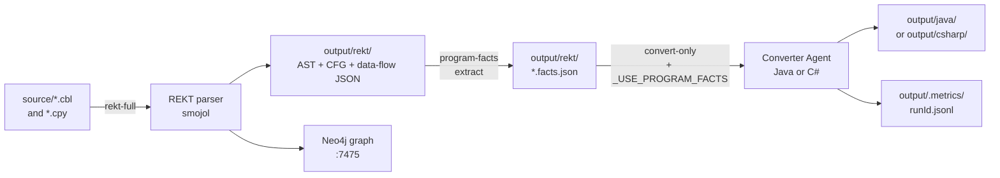

# Quick Guide — 5 minutes from zero to converted Java

**Last updated**: 2026-05-28

This guide gets you from a fresh clone to your first converted COBOL program in five minutes of wall-clock time (plus the LLM call itself).

For the full reference, see [`docs/quick-start.md`](quick-start.md).

---

## TL;DR — three commands

```bash
# 1. Configure provider (interactive: Azure OpenAI / GitHub Copilot)
./doctor.sh setup

# 2. Static analysis: parse every .cbl into AST/CFG/data graphs
./doctor.sh rekt-full

# 3. Convert a program (REKT facts auto-injected into the LLM prompt)
./doctor.sh convert-only --program ACCTMGR --target java --no-portal
```

Converted Java lands in `output/java/com/example/*/`. Conversion logs in `output/.metrics/<runId>.jsonl`.

---

## What just happened



- `rekt-full` runs once per source change. It parses every program, ingests into Neo4j, and writes per-program AST.
- Each subsequent `convert-only` reuses those facts. A converter agent receives the **program-facts projection** (a 60-90 % smaller prompt than raw AST), routes through the appropriate single-shot or chunked path, and emits Java/C# plus structured telemetry.
- The portal (`./doctor.sh portal`) reads the same graph + metrics for a rich UI.

---

## Common follow-ups

| Goal | Command |
|---|---|
| Open the portal UI | `./doctor.sh portal` then http://localhost:5028 |
| Convert to C# instead | `./doctor.sh convert-only --program ACCTMGR --target csharp` |
| Convert several programs | `./doctor.sh convert-only --program A --program B --program C` |
| Convert everything called by a program | `./doctor.sh convert-only --program ACCTMGR --include-callees` |
| Convert a migration wave | `./doctor.sh convert-only --wave 1 --target java` |
| Diagnose setup or connectivity | `./doctor.sh doctor` |
| Check what changed in REKT scan | `./doctor.sh rekt-status` |
| Re-run quality gates over output | `tools/run-quality-gates.sh` |
| Inspect telemetry | `python3 tools/ingest-metrics.py --rebuild --report` |

---

## Required environment

| Tool | Why | Install |
|---|---|---|
| .NET 10 SDK | Runs the converters | `brew install dotnet` |
| Docker | Hosts Neo4j for REKT | `brew install --cask docker` |
| Java 17+ | Runs the smojol REKT parser | `brew install openjdk` |
| `gh` CLI **or** Azure OpenAI key | Auth for the LLM provider | `brew install gh` or use Azure portal |

Run `./doctor.sh doctor` after setup — it verifies all of the above plus model deployments and connectivity.

---

## What you get back

Per converted program:
- `output/java/com/example/<program>/<Program>Service.java` — a Quarkus-style service with `@ApplicationScoped`, `@Inject`-ed dependencies, and faithful translation of working storage + procedure division
- `output/.metrics/<runId>.jsonl` — JSONL stream with `projection_metrics`, `llm_call`, `quality_metrics`, `cache_event`, `reassembly_metrics` (used by the analytics ingester)
- `output/java/migration-report.md` — human-readable summary
- `Data/migration.db` — run history (queryable with `sqlite3`)
- A Neo4j subgraph at http://localhost:7475 — explore the AST/CFG visually

For deeper detail, jump to the [`README`](../README.md) architecture section or one of the [`docs/`](.) deep-dives.
