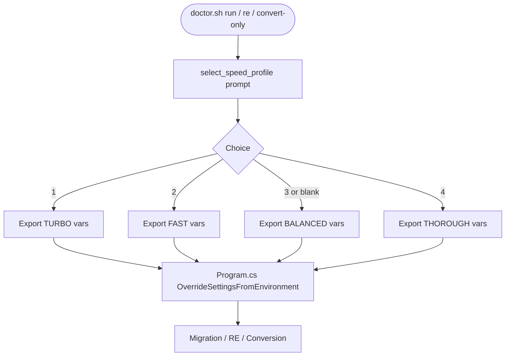

**Last updated**: 2026-04-28

# Speed Profile System

The Speed Profile system controls how much reasoning effort the AI model expends per file during migration and reverse engineering. It was introduced in v2.4.0 as a way to trade off quality against speed without modifying source code.

---

## Profiles

The `select_speed_profile()` function in `doctor.sh` presents four profiles interactively before any migration, reverse engineering, or conversion-only run.

| Profile | Reasoning tiers | Max tokens | Parallel workers | Stagger delay | Use case |
|---------|----------------|-----------|-----------------|--------------|----------|
| **TURBO** | All files: `low` | 65 536 | 4 | 200 ms | Smoke tests, quick validation |
| **FAST** | Most: `low`; complex: `medium` | 32 768 | 3 | 500 ms | Proof-of-concept, quick iterations |
| **BALANCED** *(default)* | Three-tier content-aware | 100 000 | 2 | 1 000 ms | Production migrations |
| **THOROUGH** | All files: `high` | 100 000 | 2 | 1 500 ms | Critical codebases |

---

## Three-Tier Complexity Scoring (BALANCED)

BALANCED uses content-aware reasoning. Each COBOL file is scored at startup; the score determines which reasoning tier applies.

| Tier | Reasoning effort | Score range | Typical files |
|------|-----------------|-------------|---------------|
| Low | `low` | < 1 000 | Small copybooks, utility programs |
| Medium | `medium` | 1 000 – 2 499 | Mid-size programs with business logic |
| High | `high` | ≥ 2 500 | Large programs with SQL, CICS, complex control flow |

Scoring factors: lines of code, number of paragraphs, embedded SQL, CICS commands, COPY dependencies.

---

## Environment Variable Overrides

All profile settings are exported as environment variables by `doctor.sh` and read at application startup by `Program.cs → OverrideSettingsFromEnvironment()`. You can override them individually without changing any code:

| Variable | Description | Default (BALANCED) |
|----------|-------------|-------------------|
| `CODEX_LOW_REASONING_EFFORT` | Effort for low-complexity files | `low` |
| `CODEX_MEDIUM_REASONING_EFFORT` | Effort for medium-complexity files | `medium` |
| `CODEX_HIGH_REASONING_EFFORT` | Effort for high-complexity files | `high` |
| `CODEX_MAX_OUTPUT_TOKENS` | Maximum tokens per response | `100000` |
| `CODEX_MIN_OUTPUT_TOKENS` | Minimum token reservation | `16384` |
| `CODEX_LOW_MULTIPLIER` | Token multiplier for low tier | `1.5` |
| `CODEX_MEDIUM_MULTIPLIER` | Token multiplier for medium tier | `2.5` |
| `CODEX_HIGH_MULTIPLIER` | Token multiplier for high tier | `3.5` |
| `CODEX_STAGGER_DELAY_MS` | Delay between parallel file starts (ms) | `1000` |
| `CODEX_MAX_PARALLEL_CONVERSION` | Concurrent file conversion workers | `2` |
| `CODEX_RATE_LIMIT_SAFETY_FACTOR` | Fraction of rate limit budget to use | `0.70` |

Example — run BALANCED but with 3 parallel workers:

```bash
export CODEX_MAX_PARALLEL_CONVERSION=3
./doctor.sh run
```

---

## TURBO / FAST Profile Detail

```
TURBO
  CODEX_LOW_REASONING_EFFORT=low
  CODEX_MEDIUM_REASONING_EFFORT=low
  CODEX_HIGH_REASONING_EFFORT=low
  CODEX_MAX_OUTPUT_TOKENS=65536
  CODEX_MIN_OUTPUT_TOKENS=8192
  CODEX_LOW_MULTIPLIER=1.0
  CODEX_MEDIUM_MULTIPLIER=1.0
  CODEX_HIGH_MULTIPLIER=1.5
  CODEX_STAGGER_DELAY_MS=200
  CODEX_MAX_PARALLEL_CONVERSION=4
  CODEX_RATE_LIMIT_SAFETY_FACTOR=0.85

FAST
  CODEX_LOW_REASONING_EFFORT=low
  CODEX_MEDIUM_REASONING_EFFORT=low
  CODEX_HIGH_REASONING_EFFORT=medium
  CODEX_MAX_OUTPUT_TOKENS=32768
  CODEX_MIN_OUTPUT_TOKENS=16384
  CODEX_LOW_MULTIPLIER=1.0
  CODEX_MEDIUM_MULTIPLIER=1.5
  CODEX_HIGH_MULTIPLIER=2.0
  CODEX_STAGGER_DELAY_MS=500
  CODEX_MAX_PARALLEL_CONVERSION=3

THOROUGH
  CODEX_LOW_REASONING_EFFORT=medium
  CODEX_MEDIUM_REASONING_EFFORT=high
  CODEX_HIGH_REASONING_EFFORT=high
  CODEX_MAX_OUTPUT_TOKENS=100000
  CODEX_MIN_OUTPUT_TOKENS=32768
  CODEX_LOW_MULTIPLIER=2.0
  CODEX_MEDIUM_MULTIPLIER=3.0
  CODEX_HIGH_MULTIPLIER=3.5
  CODEX_STAGGER_DELAY_MS=1500
  CODEX_MAX_PARALLEL_CONVERSION=2
```

---

## How `select_speed_profile()` Works



The exported variables override `appsettings.json` values at startup. The C# code never needs to change to use different profiles.

---

## Related

- `doctor.sh` — `select_speed_profile()` function (called from `run_migration`, `run_reverse_engineering`, `run_conversion_only`)
- `Program.cs` — `OverrideSettingsFromEnvironment()` reads `CODEX_*` variables
- `Config/appsettings.json` — default `ChunkingSettings` values used when env vars are absent
- [Smart Chunking Architecture](smart-chunking-architecture.md) — token budget and complexity scoring details
