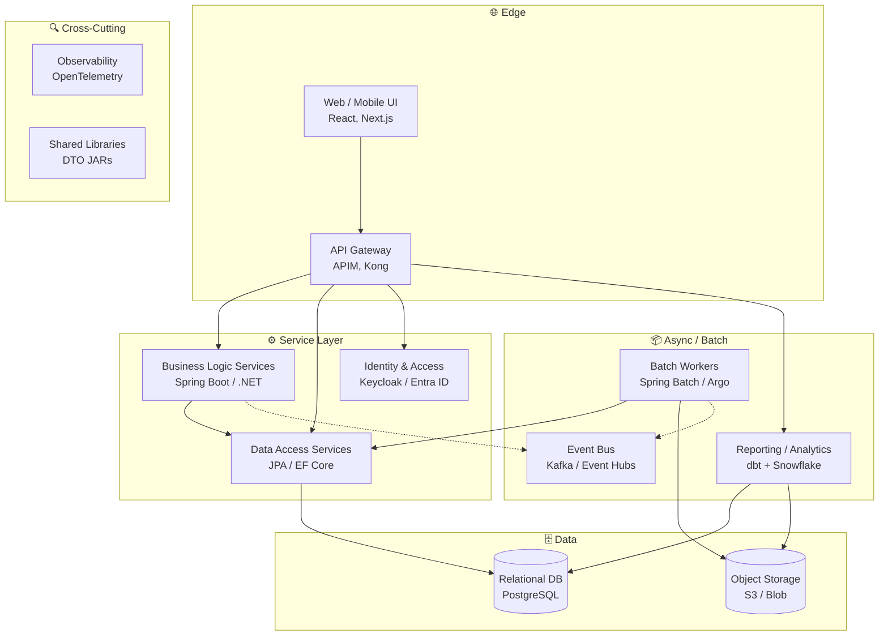

# Target Architecture Recommendation

**Last updated**: 2026-05-18

This document describes the recommended target architecture produced by the **Target Architecture** dashboard tab, the heuristics that map COBOL programs to target components and modernization strategies, and the on-disk JSON contract that downstream conversion agents (AI or otherwise) consume.

## Purpose

The Target Architecture view turns a static scan of a COBOL portfolio into an opinionated, industry-neutral modernization plan. For every program the analyzer recommends:

1. A **target component** in a cloud-native microservices architecture (e.g. *Data Access Service*, *Batch Worker*).
2. A **modernization strategy** drawn from the standard 7 Rs (*Retire / Rehost / Replatform / Rearchitect / Replace*).
3. A **wave** (1 = foundation / quick win, 2 = core, 3 = high-risk / late).
4. A short **rationale** plus concrete **migration notes** for the conversion agent.

The plan is fully deterministic from the scan: rerunning it produces the same JSON for the same inputs.

## Why an industry-neutral architecture

The BIAN landscape elsewhere in the portal is a **banking** taxonomy. For non-banking codebases (manufacturing, logistics, automotive, government, …) banking domains do not apply. The target architecture is therefore expressed in **technical capabilities**, not business domains.

## Architecture template



Each component has an explicit `tech` recommendation (defaults that work; you can override for any specific port). A complete list with responsibilities, patterns, and replaced legacy concepts is encoded in the `architecture.layers` portion of the saved JSON.

## Mapping heuristic

The mapping from a COBOL program to a target component is driven by the **technical signature** of the program (SQL count, CALL count, branch count, naming hints). It is intentionally simple and explainable.

| Signal                                                            | Maps to            |
| ----------------------------------------------------------------- | ------------------ |
| `isCopybook`                                                      | `shared-lib`       |
| Name contains `CICS`, `SCREEN`, `TERM`, `MAP`, `MENU`             | `web-ui`           |
| Name contains `SGN`, `SIGN`, `AUTH`, `LOGIN`, `ABND`              | `svc-identity`    |
| Name contains `RPT`, `REPORT`, `EXP`, `DUMP`, `EXTR`, `LIST`      | `svc-reporting`    |
| Name starts with `CB`, `BAT`, `DG`, `DO`, `BATDG`, `BATDO`      | `batch-worker`     |
| `sqlCount ≥ max(10, callCount × 2)`                               | `svc-data`         |
| `callCount ≥ 3` or `performCount ≥ 8`                             | `svc-business`     |
| anything else                                                     | `svc-business`     |

## Strategy heuristic

| Condition                                                                  | Strategy        |
| -------------------------------------------------------------------------- | --------------- |
| Copybook                                                                   | `rearchitect`   |
| Tiny program (`<50 LOC`, no SQL, no CALL)                                  | `retire`        |
| Target = `svc-reporting` and low complexity                                | `replace`       |
| Target = `svc-identity`                                                    | `replace`       |
| `complexity ≥ 0.6`, or `branchCount > 30`, or `sqlCount > 25`, `callCount > 6` | `rearchitect`   |
| `complexity ≥ 0.3`                                                         | `replatform`    |
| `complexity < 0.15`                                                        | `rehost`        |
| otherwise                                                                  | `replatform`    |

`complexity` is the average of five normalized factors: branches/30, SQL/20, CALLs/10, paragraphs/40, AST node count/500.

## Wave heuristic

| Condition                                                  | Wave |
| ---------------------------------------------------------- | ---- |
| Strategy = `retire` or target = `shared-lib`               | 1    |
| Target = `svc-data` and strategy ≠ `rearchitect`           | 1    |
| Target = `svc-identity` or strategy = `replace`            | 1    |
| Complexity ≥ 0.6 or strategy = `rearchitect`               | 3    |
| Otherwise                                                  | 2    |

Wave 1 is intentionally biased toward **foundation work** (shared libraries, data access, commodity replacements). Wave 3 contains the most expensive rewrites. The aim is to unblock services early.

## On-disk JSON contract

When the user clicks **💾 Save for AI agent** the plan is written to:

```
output/rekt/target-architecture.json
```

It is also reachable via `GET /api/graph/rekt/target-architecture`.

The schema is stable for v1.0 and is documented inline below. Agents should branch on `schemaVersion` for forward compatibility.

```jsonc
{
  "schemaVersion": "1.0",
  "generatedAt": "2026-05-18T08:42:01.123Z",
  "scanRunId": "202605180955",

  "architecture": {
    "style": "Cloud-Native Microservices",
    "description": "API-gateway-fronted microservices …",
    "layers": [
      {
        "name": "Service Layer",
        "icon": "⚙️",
        "components": [
          {
            "id": "svc-data",
            "name": "Data Access Services",
            "type": "service",
            "tech": "Java Spring Boot + JPA / .NET EF Core",
            "replaces": "SQL-heavy programs (EXEC SQL chains)",
            "responsibilities": ["Persistence", "Query optimization", "Referential integrity"],
            "patterns": ["Repository", "DTO at boundary", "Read replicas for queries"],
            "consumes": ["db-relational"]
          }
        ]
      }
    ]
  },

  "strategies": {
    "rearchitect": {
      "label": "Rearchitect",
      "color": "#f59e0b",
      "icon": "🏗️",
      "description": "Rewrite as a microservice …"
    }
  },

  "programMappings": [
    {
      "program": "ORDERPROC.cbl",
      "displayName": "ORDERPROC",
      "isCopybook": false,
      "metrics": {
        "lineCount": 1240, "sqlCount": 18, "callCount": 12,
        "sectionCount": 8, "paraCount": 47, "performCount": 22,
        "branchCount": 14, "nodeCount": 612
      },
      "recommendation": {
        "targetComponent": "svc-business",
        "targetComponentName": "Business Logic Services",
        "targetLayer": "Service Layer",
        "targetTech": "Java Spring Boot / .NET 8",
        "strategy": "rearchitect",
        "wave": 3,
        "complexity": 0.484,
        "rationale": "CALL-heavy orchestrator (12 calls)…",
        "patterns": ["Domain-Driven Design", "Hexagonal architecture"],
        "migrationNotes": [
          "Convert 18 EXEC SQL statements to repository methods (JPA / EF Core).",
          "Replace 12 CALL statements with synchronous service-to-service calls…",
          "The 22 PERFORM blocks suggest internal procedural decomposition…"
        ]
      }
    }
  ],

  "summary": {
    "totalPrograms": 22,
    "totalCopybooks": 21,
    "byStrategy":  { "rearchitect": 8, "replatform": 9, "rehost": 2, "retire": 1, "replace": 2 },
    "byComponent": { "svc-business": 7, "svc-data": 5, "batch-worker": 4, "…": "…" },
    "byWave":      { "1": 12, "2": 7, "3": 3 }
  }
}
```

### What an AI conversion agent should do with this file

1. **Read the architecture template once** — `architecture.layers[*].components[*]` describes the target shape and tech.
2. **For each program**, look up its entry in `programMappings`.
3. **Branch on `recommendation.strategy`**:
   - `retire` — skip generation, emit a removal note.
   - `replace` — emit a stub or integration glue against the recommended COTS.
   - `rehost` — wrap the COBOL on the recommended managed runtime, no code rewrite.
   - `replatform` — translate program structure-preserving to `recommendation.targetTech`.
   - `rearchitect` — generate a full microservice in `recommendation.targetTech` following `recommendation.patterns`.
4. **Use `recommendation.migrationNotes`** verbatim as additional context in the prompt; they describe concrete COBOL → target mappings (EXEC SQL → repository methods, CALL → REST, etc.).
5. **Respect `recommendation.wave`** when scheduling conversions — wave 1 first.

### Forward compatibility

`schemaVersion` will be bumped for breaking changes only. Additive fields (extra keys on existing objects) will keep `1.0`.

## Related views

- **Migration Planner** — wave plan, schedule, Gantt and BIAN overlay.
- **AST Galaxy → C4 Model** — structural view of the same portfolio.
- **Service Catalog** — service-level rollup with risk scoring.

The Target Architecture view is the conversion-agent-facing companion to those views: it commits to a concrete recommendation per program rather than presenting raw structure.
