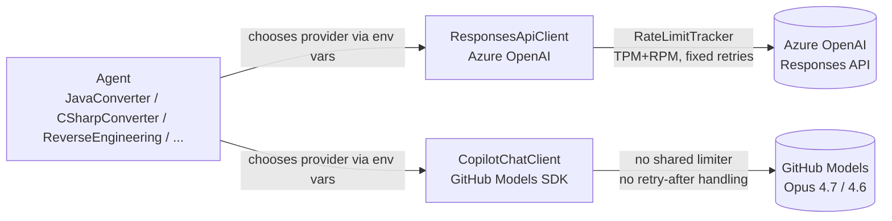
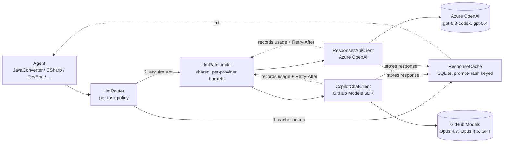
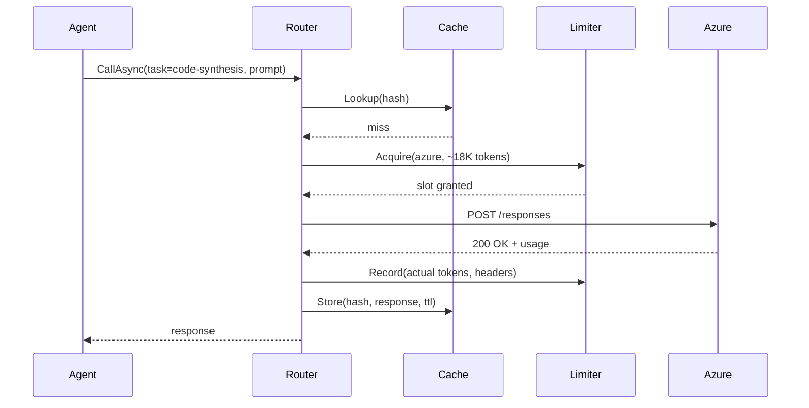
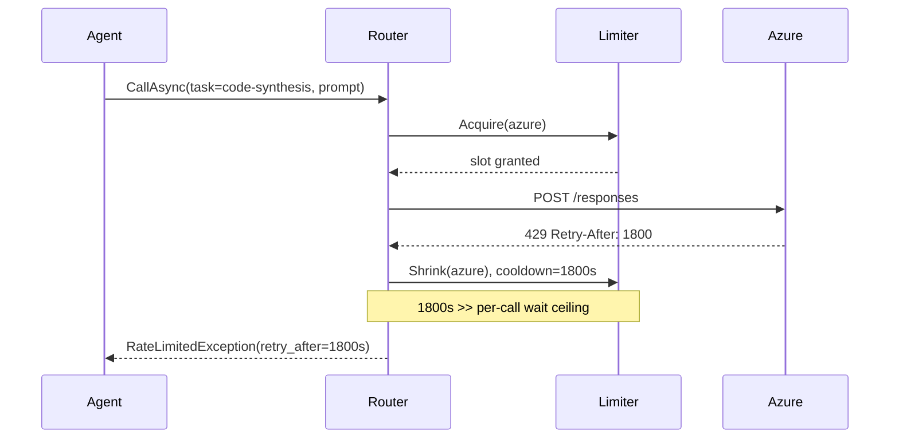
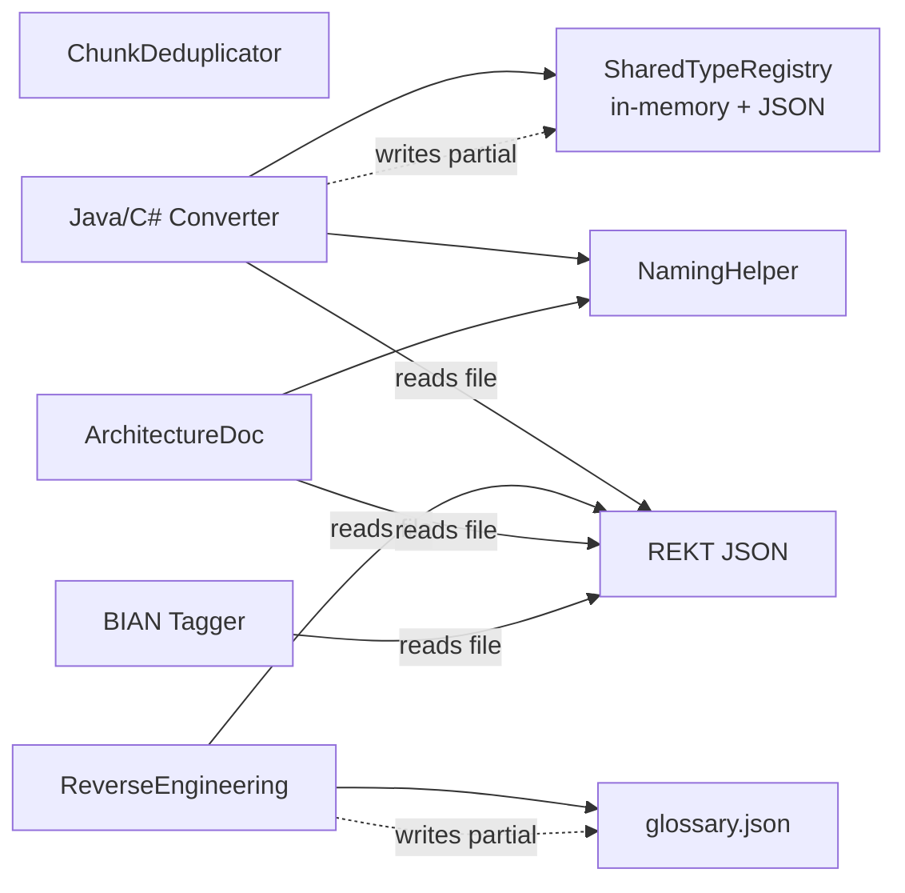
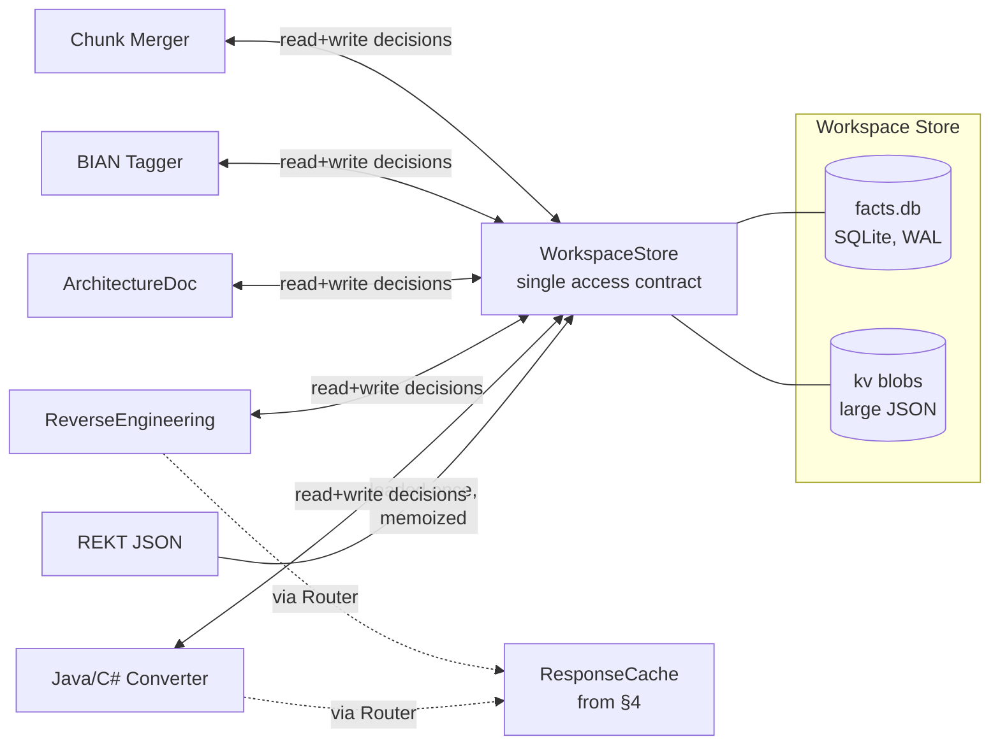
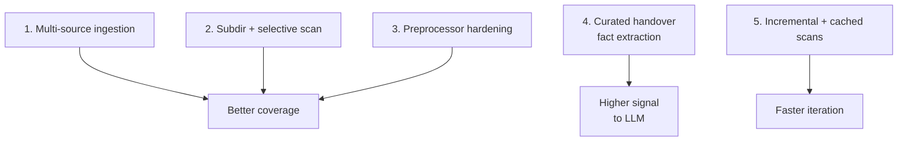
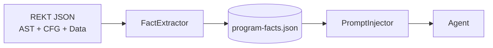

# Throttling and Caching — Design

**Last updated**: 2026-05-27
**Status**: Draft for review (not implemented)
**Scope**: `Agents/Infrastructure/*` and call sites. `doctor.sh` setup changes intentionally deferred.

---

## 1. Goals

- Eliminate hard rate-limit lockouts (the "wait 30 minutes" failure mode).
- Keep premium model choice intact: Opus 4.7/4.6 via GitHub SDK for code, gpt-5.3-codex via Azure OpenAI for code, GPT family for reverse engineering reports. Quality is not the lever — throughput and recovery are.
- Make the same throttling, retry, and cache behavior apply to **both** providers behind a single contract.
- Cut wall-clock cost on iteration loops where the same program is converted repeatedly during prompt tuning.

## 2. Non-goals

- Changing default models or model-routing policy (out of scope here; user wants premium models for code).
- `doctor.sh` configuration UX changes (deferred per user direction).
- Semantic / embedding-based caching (deferred; risky for code synthesis).

---

## 3. Before — current architecture



**What exists today**

- `ResponsesApiClient` has an internal `RateLimitTracker` (TPM + RPM with safety margin). Good, but Azure-only.
- `CopilotChatClient` (GitHub SDK path) has no equivalent throttling layer.
- Retries are fixed exponential — `Retry-After` header is not honored.
- No client-side response cache. Re-running the same conversion always pays full cost and time.
- Hang-timeout is per-call (480s); on throttle storms the call sequence still has to fully fail before backing off.

**Failure mode the user hit**

When Azure TPM or GitHub RPM is exceeded:
1. Provider returns 429 with `Retry-After: 1800` (or similar).
2. Client retries on its own schedule, burns more quota.
3. Provider escalates the cooldown.
4. Pipeline blocks for 20–40 minutes before any work resumes.

---

## 4. After — proposed architecture



### 4.1 Components

**`LlmRouter`** — thin policy layer (replaces the env-var-only model selection).
- Reads a small policy table mapping *task* → *(provider+model, cache policy)*.
- Defaults preserve current premium choices:

| Task | Provider + model | Cache |
|------|------------------|-------|
| code synthesis (Java/C# converter) | azure:gpt-5.3-codex *or* github:claude-opus-4.7 | response |
| reverse-engineering report | azure:gpt-5.4 *or* github:claude-opus-4.7 | response |
| architecture diagrams | github:claude-opus-4.7 | response |
| classification / BIAN tagging | github:claude-opus-4.6 | response |

Provider per task is selected by user configuration (today's env-var behavior). The router does not move work between providers automatically.

**`LlmRateLimiter`** — single shared limiter, one bucket per provider.
- Token bucket on TPM + leaky bucket on RPM, per provider.
- Pre-call: `await limiter.AcquireAsync(provider, estimatedInputTokens)`.
- Post-call: limiter is informed of *actual* token usage and any `Retry-After`/`x-ratelimit-reset` headers, and adapts the bucket capacity (shrink on 429, grow back gradually).
- Pre-emptive admission control: if the bucket cannot grant a slot before the configured per-call wait ceiling (default 120s), the call returns a typed `RateLimitedException` immediately so the caller can decide (skip, queue for later, surface to user) rather than block.

**`ResponseCache`** — SQLite-backed, deterministic-only.
- Key: SHA-256 of `(provider, model, system_prompt, user_prompt, reasoning_effort, response_format)`.
- Stored at `Data/llm-cache.db` (already alongside `migration.db`).
- Cache only when `temperature == 0` or omitted (i.e. deterministic calls — which is virtually everything in this pipeline).
- TTL configurable per task (default: 7 days for code synthesis, 30 days for classification).
- Bypass flag per call (`--no-cache` from `doctor.sh` later; not wired now).

**`RetryPolicy`** — replaces fixed exponential.
- On 429 with `Retry-After`: wait exactly that long, once, then retry. If the header value exceeds the per-call wait ceiling, surface `RateLimitedException` immediately.
- On 429 without header: 15s, 45s, then surface `RateLimitedException`.
- On 5xx: existing exponential with jitter.
- On timeout: existing logic, unchanged.

### 4.2 Sequence — happy path with cache miss



### 4.3 Sequence — throttle storm (fast-fail, no failover)



User-visible behavior: instead of a silent 30-minute stall, the agent receives a typed exception with the wait time. The agent (or the pipeline driver) decides what to do — defer the program, surface to the user, or queue for a scheduled retry. The limiter still records the cooldown so subsequent calls do not pile on.

---

## 5. Caching — what hits and what doesn't

| Call type | Cacheable? | Why |
|---|---|---|
| Code synthesis (deterministic prompt) | ✅ | Same prompt + REKT context ⇒ same output. Huge win on iteration. |
| Reverse-engineering report | ✅ | Idempotent on REKT JSON. |
| BIAN / C4 tagging | ✅ | Pure classification. |
| Chunk-merge step | ⚠️ | Cache only if inputs are byte-identical (often are after re-run). |
| Interactive MCP chat | ❌ | Conversational state; do not cache. |
| Anything with `temperature > 0` | ❌ | Non-deterministic by design. |

Azure server-side prompt caching is **additive**: by ordering prompts stable-prefix-first we also get Azure's automatic ≥1024-token prefix discount on cache-miss-on-our-side calls. This is free.

---

## 6. Configuration surface

Added to `ai-config.env` later (deferred — listed here for reference only):

```
_LLM_CACHE_ENABLED=true
_LLM_CACHE_DB=Data/llm-cache.db
_LLM_CALL_WAIT_CEILING_SEC=120   # fast-fail above this
_AZURE_TPM_SOFT_CAP=             # optional override; defaults read from deployment
_AZURE_RPM_SOFT_CAP=
_GITHUB_RPM_SOFT_CAP=
```

No changes to `_CODE_MODEL`, `_MAIN_MODEL`, endpoints, or auth. Existing config remains the source of truth for model identity.

---

## 7. Migration plan

1. **Phase 1** — extract `IRateLimiter` interface; pull `RateLimitTracker` out of `ResponsesApiClient`; wrap `CopilotChatClient` with the same limiter. No behavior change for Azure path.
2. **Phase 2** — implement `RetryPolicy` honoring `Retry-After`. Replace fixed exponential in both clients.
3. **Phase 3** — add `ResponseCache` (SQLite). Wire as a decorator around both clients. Default on for deterministic calls.
4. **Phase 4** — add `LlmRouter` + policy table. Default policy preserves today's per-task provider selection.
5. **Phase 5 (deferred)** — `doctor.sh` flags (`--no-cache`, `--clear-cache`).

Each phase is independently shippable and reversible.

---

## 8. Risks and mitigations

| Risk | Mitigation |
|---|---|
| Cache returns stale code after a prompt template change | Hash includes the full system prompt; any prompt edit invalidates automatically. |
| Fast-fail surfaces transient blips to users unnecessarily | Per-call wait ceiling is configurable; small 429 bursts still absorbed by the limiter. |
| SQLite cache grows unbounded | TTL eviction on read + size cap (e.g. 2 GB) with LRU prune. |
| GitHub SDK doesn't expose `Retry-After` consistently | If absent, treat as 60s cooldown for limiter bookkeeping; caller still sees `RateLimitedException`. |

---

## 9. Open questions for review

1. What is the right default for `_LLM_CALL_WAIT_CEILING_SEC`? 120s balances "absorb small bursts" against "don't hide long throttles", but workloads vary.
2. Cache TTL defaults — 7 days for code, 30 days for classification — reasonable?
3. Should the cache be per-repo (in `Data/`) or global (in `~/.cobol-rekt/`)? Per-repo is simpler; global helps when the same COBOL set is analyzed from multiple checkouts.
4. Do we want a "warm cache" command that pre-runs a known set of programs overnight?

---

## 10. Out of scope (called out so they aren't forgotten)

- Semantic cache via embeddings.
- Model auto-selection by prompt size.
- Cross-process distributed limiter (single-process is enough today).
- `doctor.sh` UX redesign.

---

## 11. Memory and cross-agent consistency

The throttling/cache design solves *cost and recovery*. It does not solve the second class of failure the user has hit: **agents losing context between calls** and **agents producing inconsistent decisions for the same artifact**. This section addresses both.

### 11.1 What "memory" means here

Three distinct kinds of state get conflated in agent pipelines:

| Layer | Example | Lives where today | Problem |
|---|---|---|---|
| **Ground truth** | REKT AST/CFG/Data JSON | `output/rekt/*.json` | Re-read per agent; expensive; sometimes stale. |
| **Derived decisions** | Java class name for `KOLA-CUST`, BIAN domain for program X, chunk boundary plan | Inlined in agent prompts; partly in `SharedTypeRegistry` | Each agent re-derives ⇒ drift. |
| **Conversation state** | Prior chunk's output that the next chunk depends on | Re-injected as text; lost on retry | Token-expensive and fragile. |

The current pipeline already has `RektContext`, `SharedTypeRegistry`, `ChunkDeduplicator`, `NamingHelper`, and `StructuralContextProvider` — strong foundations. They are not, however, accessed through a single contract, and there is no transactional write path that prevents partial loss when an agent crashes mid-run.

### 11.2 Before — current state



**Concrete gaps**

- Each agent reloads and re-parses the REKT JSON. On a 22-program run that's ~22× the I/O and tokenization cost.
- `SharedTypeRegistry` is updated by the converter but not consulted by the reverse-engineering agent ⇒ class names in the report drift from generated code.
- On adaptive re-chunking (`AgentBase.TryAdaptiveRechunkAsync`), chunk N's output is held in memory only. If the process dies between chunks, the partial work is lost.
- No idempotency key on intermediate writes; re-running re-creates files but a half-written JSON is indistinguishable from a complete one.
- BIAN / C4 tags decided by one agent are not visible to the others ⇒ AST Explorer vs. Migration Planner disagree (the exact issue the user reported earlier in the project).

### 11.3 After — proposed architecture



A single `WorkspaceStore` becomes the only place agents read derived state from and write derived state to. It owns the SQLite file and the blob area, exposes a typed API, and provides transactional writes.

### 11.4 The store, concretely

**Schema (SQLite, WAL mode)**

```sql
-- one row per program-level fact (BIAN tag, target class, chunking plan, etc.)
CREATE TABLE program_fact (
  program_id   TEXT NOT NULL,
  fact_type    TEXT NOT NULL,   -- 'bian.domain', 'target.class.name', 'chunk.plan', ...
  value_json   TEXT NOT NULL,
  produced_by  TEXT NOT NULL,   -- agent name
  produced_at  TEXT NOT NULL,
  source_hash  TEXT NOT NULL,   -- hash of REKT input that produced it
  PRIMARY KEY (program_id, fact_type)
);

-- shared type/name registry, keyed so any agent can resolve consistently
CREATE TABLE type_binding (
  cobol_name   TEXT PRIMARY KEY,
  target_lang  TEXT NOT NULL,
  target_name  TEXT NOT NULL,
  kind         TEXT NOT NULL,   -- 'class', 'field', 'method', 'package'
  decided_by   TEXT NOT NULL,
  decided_at   TEXT NOT NULL
);

-- per-chunk results so a crash between chunks doesn't lose finished work
CREATE TABLE chunk_result (
  program_id    TEXT NOT NULL,
  chunk_index   INTEGER NOT NULL,
  chunk_hash    TEXT NOT NULL,   -- idempotency key
  status        TEXT NOT NULL,   -- 'pending' | 'done' | 'failed'
  output_ref    TEXT,            -- pointer into blob area
  attempts      INTEGER DEFAULT 0,
  last_error    TEXT,
  PRIMARY KEY (program_id, chunk_index)
);

-- run journal for resumability
CREATE TABLE run_step (
  run_id        TEXT NOT NULL,
  step_id       TEXT NOT NULL,
  status        TEXT NOT NULL,   -- 'started' | 'committed' | 'failed'
  started_at    TEXT NOT NULL,
  committed_at  TEXT,
  PRIMARY KEY (run_id, step_id)
);
```

Lives at `Data/workspace.db`. Migrations versioned alongside `migration.db`.

**API contract (sketch)**

```csharp
public interface IWorkspaceStore
{
    // Ground truth: load once, share across agents in-process.
    Task<RektContext> GetRektAsync(string programId);

    // Derived facts: atomic upsert keyed on (program, fact_type).
    Task<T?> GetFactAsync<T>(string programId, string factType);
    Task SetFactAsync<T>(string programId, string factType, T value,
                        string producedBy, string sourceHash);

    // Type/name bindings — single source of truth across agents.
    Task<TypeBinding?> ResolveTypeAsync(string cobolName, string targetLang);
    Task BindTypeAsync(TypeBinding b);

    // Chunked work: idempotent commit per chunk.
    Task<ChunkResult?> GetChunkAsync(string programId, int chunkIndex);
    Task CommitChunkAsync(ChunkResult r);   // atomic; safe to retry

    // Run journal for resume.
    Task<RunStep> BeginStepAsync(string runId, string stepId);
    Task CommitStepAsync(string runId, string stepId);
}
```

All writes use SQLite transactions; SQLite in WAL mode gives multi-reader single-writer without external locking, which matches our concurrency profile.

### 11.5 Cross-agent consistency rules

1. **Single writer per fact type.** The Java converter owns `target.class.name`; reverse engineering, architecture, and BIAN agents *read* it and never overwrite. Enforced by an `allowed_writers` map in the store, not by convention.
2. **Source-hash gating.** Each fact stores the hash of the REKT input that produced it. A reader that has a newer hash treats the fact as stale and asks the producer to re-derive — instead of silently using the old value.
3. **Decide once, broadcast.** BIAN domain and C4 placement are decided by a single tagger agent and stored as facts. Every downstream view (AST Explorer, Migration Planner, portal dashboards) reads from the store. This is the structural fix for the "two views disagree" bug the user previously reported.
4. **Cache key includes fact dependencies.** The response cache hash (§4.1) is extended to include any `WorkspaceStore` facts referenced by the prompt. Changing a class name automatically invalidates dependent cached responses.

### 11.6 No-data-loss guarantees

| Scenario | Mechanism |
|---|---|
| Process crash mid-chunk | `chunk_result` row stays `pending`; next run picks up only missing chunks. |
| LLM call succeeds but writing the response fails | Response is also persisted to `ResponseCache` (§4.1) before the agent processes it; agent re-reads from cache on retry. |
| Two agents race on the same fact | SQLite transaction + `allowed_writers` rejects the second writer. |
| REKT JSON changes underneath us mid-run | `source_hash` mismatch ⇒ explicit "stale fact" error rather than silent corruption. |
| Adaptive re-chunking discards in-flight context | Pre-rechunk snapshot of chunk plan + partial outputs committed to store before splitting. |

### 11.7 Memory pressure — how the store helps

- **REKT JSON loaded once per process** via a memoizing reader. Today every agent re-parses; ~22 programs × ~4 agents = ~88 parses per run. Drops to ~22.
- **Prompt assembly pulls from store**, not from a large in-memory blob passed agent-to-agent. Each agent fetches only the facts it needs.
- **Chunk outputs offloaded** to the blob area after commit so the per-program in-process working set stays bounded (important for 750-program runs).

### 11.8 Migration plan (extends §7)

7. **Phase 7** — introduce `IWorkspaceStore` and SQLite schema. Wrap existing `RektContext`/`SharedTypeRegistry`/`NamingHelper` as thin adapters that read-through and write-through the store. No agent code changes yet.
8. **Phase 8** — migrate one agent at a time to the typed `GetFactAsync` / `BindTypeAsync` API. Start with the BIAN tagger (smallest, highest consistency payoff).
9. **Phase 9** — add `run_step` journaling and resume-from-failure entrypoint in `doctor.sh` (deferred to the broader `doctor.sh` UX work).
10. **Phase 10** — extend `ResponseCache` key with fact dependencies; remove now-redundant in-prompt context blocks.

### 11.9 Risks specific to this section

| Risk | Mitigation |
|---|---|
| SQLite write contention under high agent parallelism | WAL + short transactions; benchmark at Phase 7 with the existing 22-program corpus. |
| Store becomes a hidden coupling that's hard to refactor | Typed API + per-fact-type ownership map keeps coupling explicit and auditable. |
| Facts persist across incompatible prompt versions | Each fact carries `produced_by` and a `producer_version` (added later); readers may require minimum version. |
| Resume logic re-runs steps it shouldn't | `run_step` only marks `committed` after the transactional write succeeds; resume re-runs only `started`-without-`committed` steps. |

### 11.10 Open questions (in addition to §9)

5. Should the store be per-run (snapshot per pipeline invocation) or persistent across runs (accumulating knowledge)? Recommendation: persistent, with `run_id` tagging on writes so we can diff.
6. Do we expose the store via the existing MCP server so the portal and ad-hoc tools can query it without duplicating the schema?
7. How aggressive should `source_hash` invalidation be? Strict (any REKT change invalidates) is safest but expensive on iterative tuning.

---

## 12. REKT — effectiveness, multi-source support, and agent handover

The cache, limiter, and store sections above all assume that the static analysis upstream of the LLMs is solid. In practice REKT is currently the weakest link for two reasons:

1. **Coverage gaps** — only `.cbl` and `.cpy` are scanned; a handful of constructs (figurative constants, certain MOVE forms) still fall back to "deps only" AST output; nested source directories are not walked when `--program` is used.
2. **Handover quality** — what REKT produces is rich, but what reaches the LLM is a flattened JSON blob that mixes high-signal facts (CALL graph, copybook resolution) with low-signal noise (every AST node), inflating tokens without improving output.

This section proposes a focused REKT optimization track. It is independent of §1–11 and can ship first.

### 12.1 Before — current REKT pipeline

```mermaid
flowchart LR
  S[source/\n.cbl + .cpy only,\nflat layout assumed]
  P[preprocess-for-rekt.sh\nfixes sequence cols,\nMOVE 0(1), some ALL forms]
  ST[source/.rekt-staging/]
  R[cobol-rekt CLI\nsmojol parser]
  O[output/rekt/*.json\nAST + CFG + Data + parse.log]
  N[(Neo4j\ngraph-populator)]
  CTX[RektContextLoader\nreads JSON per program]
  INJ[RektPromptInjector\nflattens to prompt text]
  LLM[LLM agents]

  S --> P --> ST --> R --> O
  O --> N
  O --> CTX --> INJ --> LLM
```

**Current effectiveness, measured against the 22-program test corpus**

| Metric | Today | Comment |
|---|---|---|
| Programs parsed cleanly | ~85% | 3/22 fall to "deps only" (`T66017J1`, `T6604700`, `T660A411`). |
| Copybook resolution | high when files are in `source/` flat | drops to 0 in nested layouts (`source/FUENTES/cpy/`). |
| Non-COBOL sources scanned | `.cbl`, `.cpy` only | `.bms`, `.rus`, `.jcl`, `.prc`, `.dcl`, `.mps` ignored even though some have parsers. |
| Tokens of REKT context per LLM call | ~12–18K | Mostly raw AST nodes; high noise-to-signal. |
| Time to re-run REKT on a single program | full corpus only | No incremental mode; one-program iteration still triggers full scan. |
| Failures surfaced to the user | logged in `parse.log` | Not summarized; user sees only ✅/⚠️ per file. |

The remaining 15% of value loss in LLM output traces back to these gaps, not to the LLM itself.

### 12.2 Five optimization tracks



#### Track 1 — multi-source ingestion

Today the discovery code (`FileHelper.cs`, `resolve-programs.py`, `preprocess-for-rekt.sh`, `doctor.sh` staging) hardcodes `.cbl` + `.cpy`. We already have parsers for more:

| Extension | Type | Parser | Status |
|---|---|---|---|
| `.cbl`, `.cob` | COBOL program | smojol | supported |
| `.cpy` | copybook | smojol | supported |
| `.bms` | CICS map | `Helpers/BmsReader.cs` | parser exists, **discovery missing** |
| `.dpl`, `.psb`, `.dbd` | IMS/DLI | `Helpers/ImsReaders.cs` | parser exists, **discovery missing** |
| `.rus` | Unisys routine | none | needs a thin reader (COBOL-like, often parseable as copybook) |
| `.jcl`, `.prc`, `.ctc` | JCL / procs | none yet | extract step→program edges only (no AST needed) |
| `.mps`, `.sr3`, `.mpc`, `.dcl` | site-specific | none | catalog as opaque artifacts with metadata |

Proposed: introduce a `SourceTypeRegistry` with one entry per extension declaring `{parser, contributes_to: ast|graph|metadata}`. Discovery walks the tree once and dispatches per extension. Unsupported extensions land in a `metadata.json` so the LLM at least knows the file exists and what programs reference it.

#### Track 2 — subdirectory + selective scan

The community-reported `--program X` bug has the same root cause as multi-source: scattered hardcoded paths assuming a flat `source/` layout.

- `resolve-programs.py` → switch `source_dir.iterdir()` to `source_dir.rglob('*')`.
- `doctor.sh` staging (line ~3118) → resolve the file's real path via the discovery index instead of `cp source/$f`.
- Preserve original directory structure in `source/.rekt-staging/` so copybook resolution by relative path still works.
- `--program X` reads the discovery index built in Track 1; no separate code path.

Net result: `source/FUENTES/src/X.cbl` works the same as `source/X.cbl`, and `--program X --include-callees` works without a prior full-corpus REKT run if the dependency closure is small (see Track 5).

#### Track 3 — preprocessor hardening

The "deps only — AST writer bug" path is the single biggest coverage loss. Categorize the known failures:

| Failure pattern | Today | Proposed |
|---|---|---|
| `Unsupported figurative constant: ALL '%'` | parse fails | preprocessor rewrites to `ALL "%"` or equivalent literal |
| `MOVE 0(1) TO …` | parse fails | normalize to `MOVE ZERO TO …` |
| sequence-column tails on free-form input | mostly handled | extend pattern set; add a per-file `--strict-cols` opt-out |
| EXEC SQL / EXEC CICS in unexpected positions | partial | parameterize EXEC handling; emit stub blocks the parser accepts |
| Continuation-line edge cases | brittle | replace ad-hoc sed with a small tokenizer |

Each preprocessor pass writes a `.preprocess.json` per file recording exactly which transforms were applied. That goes into the handover (§12.4) so the LLM knows the source it sees is not byte-identical to the original.

#### Track 4 — curated handover to agents

This is the highest-leverage track. Today `RektPromptInjector` flattens AST + CFG + Data into a single text blob. Replace with a **typed fact extraction** step that runs once per program after REKT and produces:



**`program-facts.json` shape (per program)**

```json
{
  "program_id": "BDSDA2F",
  "summary": { "loc": 791, "paragraphs": 42, "called_programs": ["BDCOMMIC"], "calls_in": ["BDSDA01"] },
  "io": {
    "files": [ { "name": "CUSTFILE", "access": "I-O", "record_layout": "BDCSEQII" } ],
    "screens": [],
    "db_tables": [ { "name": "ACCOUNTS", "ops": ["SELECT","UPDATE"] } ],
    "queues": []
  },
  "data": {
    "groups": [ { "name": "WS-CUSTOMER", "fields": 12, "redefines": false } ],
    "copybooks_used": ["BDCOMMIC","BDCSEQII"]
  },
  "control_flow": {
    "entry_points": ["MAIN-PARA"],
    "perform_chains": [ ["MAIN-PARA","READ-CUST","UPDATE-CUST","WRITE-LOG"] ],
    "exits": ["GOBACK"]
  },
  "external_effects": ["FILE_IO","DB_UPDATE"],
  "preprocess_notes": [ { "transform": "MOVE 0(1) → MOVE ZERO", "line": 482 } ],
  "warnings": [ "copybook BDCSEQOI not found on path" ],
  "confidence": { "ast": "full", "cfg": "full", "data": "full" }
}
```

This is what agents consume — not the raw AST. Benefits:

- Token cost per call drops sharply (~12–18K → ~2–4K for most programs).
- Same fact shape regardless of which non-COBOL sources contributed (Track 1).
- `warnings` and `preprocess_notes` make missing copybooks and applied rewrites first-class — the LLM can flag them in output instead of hallucinating around them.
- `confidence` lets agents downgrade aggressiveness when REKT was partial (e.g., "deps only" programs get a "structural conversion only, no behavior" path).
- Stored in `WorkspaceStore` (§11) as `fact_type='rekt.program_facts'` ⇒ cache keys (§4.1) automatically invalidate when REKT output changes.

**Per-call selection** — different agents need different subsets:

| Agent | Needs |
|---|---|
| Java/C# converter | full facts + raw source |
| Reverse-engineering report | summary, io, external_effects, control_flow |
| Architecture diagrams | summary, io.db_tables, calls_in/called_programs |
| BIAN tagger | summary, io, external_effects |
| Chunk merger | summary + per-chunk overlap metadata |

`PromptInjector` becomes a small projection layer that picks fields per agent — instead of dumping everything.

#### Track 5 — incremental + cached scans

Today every iteration re-runs REKT on the full corpus. For a 750-program codebase this is the dominant wall-clock cost.

- **Content-hash per file**: `sha256(preprocessed_bytes)`. Skip parse if hash matches previous run's entry in `Data/rekt-scan.db`.
- **Dependency-aware re-scan**: when a copybook hash changes, re-scan every program that includes it (resolved from REKT's existing copybook graph).
- **`--program X` first-time path**: parse X and the transitive closure of its copybooks + CALLed programs only. Use the discovery index from Track 2; no need for a prior full-corpus scan.
- **Persistent Neo4j**: keep the graph populator's database across runs and apply per-file diffs instead of dropping and reloading.

Expected effect on the 22-program corpus: re-scan after editing one copybook drops from ~3 min to ~10 s.

### 12.3 After — proposed REKT pipeline

```mermaid
flowchart LR
  subgraph discover[Discovery]
    SR[SourceTypeRegistry]
    D[walker\n.cbl .cpy .bms .rus .jcl ...]
    IDX[(discovery.db\npath + ext + hash)]
  end

  subgraph prep[Preprocess]
    P[hardened preprocessor\nrewrites + .preprocess.json]
    ST[source/.rekt-staging/\npreserves layout]
  end

  subgraph scan[Scan]
    SC[cobol-rekt + readers\n(BMS/IMS/JCL)]
    SCDB[(rekt-scan.db\nfile hash + last result)]
    O[output/rekt/*.json]
    N[(Neo4j\nincremental)]
  end

  subgraph handover[Handover]
    FE[FactExtractor]
    PF[(program-facts.json\nstored in WorkspaceStore)]
    PI[PromptInjector\nper-agent projection]
  end

  D --> SR --> IDX
  IDX --> P --> ST --> SC --> O --> FE --> PF
  SC --- SCDB
  O --> N
  PF --> PI --> A[LLM agents]
```

### 12.4 Handover contract — what an agent sees

Before:

```
{ "ast": { ...20K tokens of nodes... }, "cfg": {...}, "data": {...} }
+ raw source
+ ad-hoc glossary
```

After:

```
{
  "facts":     <projected subset of program-facts.json>,
  "source":    <raw, optionally chunked>,
  "warnings":  [...]            // copybooks missing, preprocess rewrites
  "confidence": { ... }         // ast/cfg/data completeness
  "related":   {                // pulled from Neo4j on demand
    "callers": [...],
    "callees": [...]
  }
}
```

Concrete consequences:

- The LLM is *told* when something is missing instead of having to infer it.
- Cross-program calls bring in callee summaries by default (closes the "--include-callees needs a prior full scan" gap once Track 5 lands).
- Same contract regardless of source language (COBOL program, BMS map, JCL step), which makes adding a new source type a Track-1 change only — agents don't change.

### 12.5 Phasing (extends §7 and §11.8)

11. **Phase 11** — `SourceTypeRegistry` + recursive discovery + `discovery.db`. Fixes the subdirectory bug. No agent changes.
12. **Phase 12** — preprocessor hardening for the three known "deps only" failure patterns; per-file `.preprocess.json`.
13. **Phase 13** — `FactExtractor` and `program-facts.json`; route through `WorkspaceStore`. Keep raw-AST injection as an opt-in fallback.
14. **Phase 14** — per-agent projection layer in `PromptInjector`; remove raw AST from the default path.
15. **Phase 15** — content-hash scan cache (`rekt-scan.db`) and dependency-aware incremental re-scan.
16. **Phase 16** — extra source readers (`.bms` discovery, `.rus` reader, JCL step→program edges).

Each phase is independently shippable. Phases 11–13 unblock the user reports we already have (subdirectory layouts, missing-copybook visibility, "deps only" outputs).

### 12.6 Risks specific to REKT

| Risk | Mitigation |
|---|---|
| Preprocessor rewrites change semantics | Every rewrite logged in `.preprocess.json` and surfaced to LLM as a warning; converter agent is instructed to preserve original semantics, not the rewrite. |
| FactExtractor drops information an agent actually needs | Per-agent projection is opt-in additive; raw-AST fallback remains for one release. |
| Incremental scan misses a transitive copybook change | Re-scan triggers also on any copybook *ancestor* hash change, not only direct includes. |
| Persistent Neo4j drifts from filesystem reality | Discovery walker emits a delta plan; full rebuild always available via `doctor.sh rekt-full --force`. |
| Non-COBOL readers produce inconsistent fact shapes | `program-facts.json` is schema-validated on write; readers must produce conforming output or are rejected. |

### 12.7 Open questions

8. Should `FactExtractor` run inside the existing `cobol-rekt` JVM (same process, no extra JSON round-trip) or as a separate Python/C# step (easier to iterate, slower)?
9. For non-COBOL sources without a real parser (`.mps`, `.sr3`), is metadata-only ingestion enough, or do we want a regex-based "shallow facts" reader?
10. Do we expose `program-facts.json` through the MCP server as a first-class resource so external tools (and the portal) can consume the same handover?


