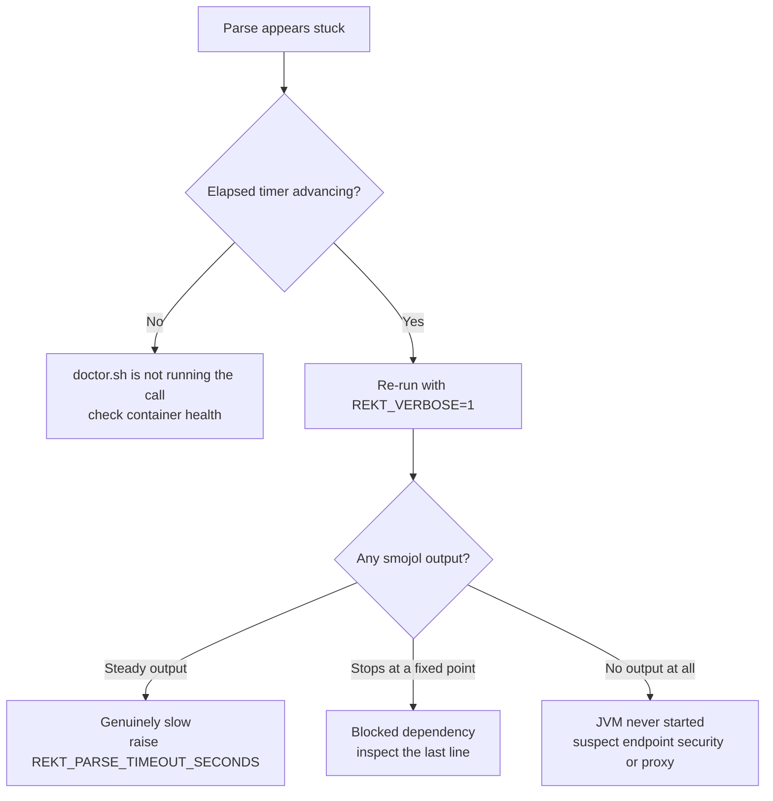

# Troubleshooting setup (`./doctor.sh setup`)

**Last updated**: 2026-09-09

`./doctor.sh setup` is the primary setup path. For Copilot, it writes a complete
`Config/ai-config.local.env` only after sign-in and model validation succeed.
For Azure OpenAI, it starts from the local template when present, otherwise the
tracked `Config/ai-config.env.example`. The wizard performs provider selection,
sign-in, model discovery or manual entry, validation, and persistence. Separate
pre-login commands and manual config editing are not required.

## GitHub Copilot routing and model setup

### GitHub Enterprise Cloud with Data Residency is not GHES

GitHub Enterprise Cloud with Data Residency uses a tenant hostname such as
`company.ghe.com`. It is a GitHub.com cloud deployment, not GitHub Enterprise
Server (GHES). Do not add `/api/v3` or another path to the host value.

The project accepts either a bare hostname or an HTTPS root URL:

```bash
export COPILOT_GH_HOST="company.ghe.com"
# Equivalent input during setup: https://company.ghe.com/
```

Values containing credentials, a non-root path, query, fragment, HTTP scheme,
or custom port are rejected.

### Host-variable precedence

Copilot routing is resolved in this order:

1. Explicit host supplied to a diagnostic or portal request.
2. `COPILOT_GH_HOST` — authoritative Copilot CLI routing variable.
3. `GITHUB_HOST` — legacy project compatibility.
4. `GH_HOST` — final compatibility fallback.
5. `github.com`.

The resolved hostname is exported to the Copilot CLI subprocess as
`COPILOT_GH_HOST`. The project does not set `GH_HOST`, because `GH_HOST` may
identify a separate GHES repository host used by the `gh` CLI.

`GitHub.Copilot.SDK` 1.0.0 launches Copilot CLI over stdio. It does not expose a
GitHub API base-URL option. Leaving `CopilotClientOptions.Environment` unset
inherits the parent process environment; this project supplies a complete copy
of that environment with only `COPILOT_GH_HOST` overlaid, preserving `PATH`,
`HOME`, proxy settings, and credential-store variables.

### Authentication

The setup wizard invokes the host-specific sign-in flow itself:

```bash
copilot login --host "https://${COPILOT_GH_HOST}"
```

No separate pre-login command is required.

For token-based automation, current Copilot CLI supports fine-grained personal
access tokens with the **Copilot Requests** permission. Classic PATs are not
supported. The wizard exports the supplied token as `COPILOT_GITHUB_TOKEN` for
discovery and validation. It does not print token fragments. To preserve the
existing compatibility mechanism, the generated local configuration stores the
token once as `GITHUB_COPILOT_TOKEN` and maps `COPILOT_GITHUB_TOKEN` to that
value. Keep `Config/ai-config.local.env` private.

Runtime token precedence is `COPILOT_GITHUB_TOKEN`, `GH_TOKEN`, `GITHUB_TOKEN`,
then legacy `GITHUB_COPILOT_TOKEN`.

### Model discovery and manual selection

The current Copilot CLI has no documented non-interactive catalog command;
`/model` is interactive. Automatic discovery therefore uses the SDK's
`ListModelsAsync` path:

```bash
dotnet run --project CobolToQuarkusMigration.csproj -- \
  list-models --format json --timeout-seconds 45
```

Discovery is bounded. If it fails or returns no models, `doctor.sh setup` reuses
the last catalog that was discovered successfully for the **same host**, and
otherwise allows immediate manual entry. The cache lives in
`Data/model-cache/<host>.txt` (untracked) and is keyed by host so a `github.com`
catalog is never offered to a GHE tenant, or the reverse. This keeps setup
usable when Copilot CLI changes break discovery for reasons unrelated to the
user's account.

Each distinct selected model is validated with a minimal tool-free request
before configuration is saved:

```bash
dotnet run --project CobolToQuarkusMigration.csproj -- \
  validate-model --model MODEL_ID --format json --timeout-seconds 60
```

The code model defaults to the chat model when omitted. When both are provided,
they remain separate through persisted configuration, portal active-chat
selection, managed conversion runs, Prompt Studio, and MCP subprocesses.

### Copilot CLI and SDK version alignment

The SDK binds the CLI's JSON-RPC responses to fixed DTOs, so a CLI whose payload
shape differs from the SDK's expectations fails during the startup handshake —
before any model is listed. A CLI that returns the readiness ping's `timestamp`
as a number rather than a string, for example, fails with:

```
The JSON value could not be converted to System.DateTimeOffset. Path: $.timestamp
```

This is not an authentication problem. `doctor.sh` builds with
`CopilotSkipCliDownload=true` so the build never depends on reaching
`registry.npmjs.org`, which means the CLI on `PATH` is used and its version can
drift from the one the SDK package pins.

Every failing diagnostic therefore reports `cliPath`, `cliVersion`, and
`expectedCliVersion`, and payload-shape failures name the remedy directly.
Resolution happens in-process, so bash, Git Bash, and PowerShell all report the
same values. To align the versions, either install the expected CLI:

```bash
npm i -g @github/copilot@<expectedCliVersion>
```

or let the build supply a matching CLI by dropping `CopilotSkipCliDownload=true`.
On restricted networks, set `CopilotNpmRegistryUrl` to an internal mirror or
`CopilotCliBinaryPath` to a pre-downloaded binary instead.

### Diagnostic categories

JSON diagnostics classify failures as `authentication`, `routing`,
`unavailable_or_policy`, `network`, `timeout`, `runtime_or_protocol`, or
`unexpected`.

Classification inspects the exception type first and then only the exception
message chain — never the stack trace. Stack frames name types such as
`JsonTokenType`, and matching those as evidence previously reported CLI payload
mismatches as `authentication`, sending users to re-authenticate against a
working account. Short, ambiguous terms (`token`, `login`, `401`, `403`, `404`)
are matched on word boundaries for the same reason.

The portal keeps non-AI views available when Copilot readiness fails. Re-open
**Setup** to correct the host, authentication, or model ID.

### Validation status

Local tests cover hostname normalization and precedence, environment
propagation, bounded timeout behavior, provider aliases, and separate chat/code
model handling. Real authentication, model discovery, and inference against a
GitHub Enterprise Cloud Data Residency tenant remain pending validation by a
contributor with access to that tenant.

## REKT parsing (`./doctor.sh rekt-full`)

### A parse appears to stall with no output

Each program is parsed by the smojol CLI inside the `cobol-rekt` container. The
parse is capped per file (default 300 s) and prints elapsed seconds while it
runs, so a long parse is visibly progressing rather than silent.

If a file exceeds the cap it is aborted and reported, and the remaining fallback
attempts for that file are skipped — those fallbacks exist for parse *errors*,
not for hangs, so retrying them would multiply the wait.

```bash
# Stream live smojol output instead of the elapsed-time indicator
REKT_VERBOSE=1 ./doctor.sh rekt-full

# Raise the per-file cap for very large programs
REKT_PARSE_TIMEOUT_SECONDS=900 ./doctor.sh rekt-full
```

Full output for every file — stdout and stderr, for successful and failed
parses alike — is written to `output/rekt/<program>.parse.log`. The log is
truncated at the start of each parse, so it always reflects the current run.

### Distinguishing a slow parse from a blocked one



Endpoint-protection software that inspects or blocks `java` or `docker`
typically produces **no** smojol output at all, whereas a genuinely slow parse
emits steady progress. Verbose mode is what makes the two distinguishable.

To reproduce a single file outside the pipeline:

```bash
docker exec cobol-rekt java -jar /app/smojol-cli.jar run PROGRAM.cbl \
  --commands="BUILD_BASE_ANALYSIS WRITE_FLOW_AST WRITE_CFG WRITE_DATA_STRUCTURES" \
  --srcDir=/source/.rekt-staging --copyBooksDir=/source/.rekt-staging \
  --dialectJarPath=/app/dialect-idms.jar --reportDir=/output --generation=PROGRAM
```

Under Git Bash on Windows, prefix the command with `MSYS_NO_PATHCONV=1` so the
container-absolute paths are not rewritten to Windows paths.

### Reduced fidelity: "Unsupported figurative constant"

```
Parsing PROGRAM.cbl... ⚠️ (deps only — AST writer bug)
  ↳ smojol: Exception: Unsupported figurative constant: zero
```

smojol maps only the upper-case spellings of the twelve COBOL figurative
constants (`ZERO`, `ZEROS`, `ZEROES`, `SPACE`, `SPACES`, `HIGH-VALUE`,
`HIGH-VALUES`, `LOW-VALUE`, `LOW-VALUES`, `QUOTE`, `QUOTES`, `NULL`). COBOL is
case-insensitive for these words, so valid source such as `MOVE zero TO WS-NUM`
made all three high-fidelity attempts fail and dropped the program to the
deps-only fallback — losing its AST, CFG and data structures.

These words are now upper-cased in the staged copy, for programs and copybooks
alike. Comment lines and quoted literals are skipped, and hyphen counts as a
word character, so `WS-ZERO-COUNT` and `'zero'` are left as-is. Files under
`source/` are never modified; only the staged copy is rewritten.

The normalisation runs at staging time, immediately before smojol reads the
files. That matters: the preprocessor writes to `source/.preprocessed/` only
when it actually changes a file, and staging falls back to the raw source when
it did not. A fix applied only in the preprocessor was therefore skipped for any
program it did not otherwise touch - such a run reports `No files needed
preprocessing` and still parses at reduced fidelity. Staging is the last step
before the parser, so normalising there covers every path.

When files are rewritten the run reports:

```
✅ Upper-cased figurative constants in N staged file(s) (smojol requires upper case)
```

If a program still reports deps-only, the cause is a different one — check the
`smojol:` hint and the full `output/rekt/<program>.parse.log`. Missing copybooks
are the other common cause.

### Stale `source/.preprocessed/` after a framework update

`source/.preprocessed/` holds derived copies of the source: preprocessed
programs and copybooks, bundled system copybooks such as `SQLCA`, and generated
stubs for unresolved `COPY` targets. Staging prefers `.preprocessed/<file>` over
the real source file when one exists.

The directory is rebuilt from scratch on every run. It previously persisted,
which produced results that did not match the current source, because a file is
written there only when preprocessing actually *changes* it:

- after a framework update, or a source edit that left a file needing no
  transformation, the previous version's output remained and was parsed instead
  of the current source
- deleted or renamed programs left orphaned copies behind indefinitely
- bundled system copybooks were skipped when already present, so updated
  definitions shipped with the framework never reached an existing checkout

Nothing in the directory is user-authored, so it is safe to delete at any time:

```bash
rm -rf source/.preprocessed
```

If the preprocessor fails part-way through, the run reports it rather than
continuing silently, because a partial rebuild changes what actually gets
parsed:

```
⚠️  Preprocessor exited with an error — source/.preprocessed/ may be incomplete.
```

If the preprocessor is missing or not executable, the stale directory is
discarded and parsing falls back to `source/`.

### `syntax error near unexpected token '||'` on Windows (Git Bash)

```
./doctor.sh: command substitution: line 3646: syntax error near unexpected token `||'
./doctor.sh: command substitution: line 3646: ` || echo 0)'
```

The scripts have to run unchanged on macOS `/bin/bash` **3.2** and on Git Bash /
MSYS2 bash **5.x**. A here-document inside a command substitution followed by
`||` or `&&` is accepted by bash 3.2 but rejected by bash 5.x, which re-parses
the substitution body:

```bash
# Breaks on bash 5.x — guard and fallback are inside the substitution
x=$([[ -n "$CMD" ]] && "$CMD" - <<'PYEOF' 2>"$err" || echo 0
...
PYEOF
)

# Portable — the substitution contains only the command
x=0
if [[ -n "$CMD" ]]; then
    x=$("$CMD" - 2>"$err" <<'PYEOF'
...
PYEOF
    ) || x=0
fi
```

The failure is non-fatal, which is what makes it dangerous: the assignment is
left empty and the run continues with that step silently skipped.

Neither `bash -n` nor shellcheck reports this — the error appears only when the
substitution is executed. Run the portability lint instead:

```bash
tools/check-bash-compat.sh              # all tracked *.sh
tools/check-bash-compat.sh doctor.sh    # specific files
```

It also flags bash 4+ only syntax (associative arrays, case-conversion
expansions, `mapfile`), which breaks macOS, and CRLF line endings, which break
here-document terminators and shebangs.

### A program parses as deps-only after `LENGTH OF`

smojol's grammar treats `LENGTH OF` as a CICS dialect token, so the preprocessor
replaces `LENGTH OF <identifier>` with `0`. The operand may be *qualified*, and
the qualifiers belong to it:

```cobol
MOVE LENGTH OF SENEST-OPDAT IN REQUEST IN BDSIXXX-PARM
```

Replacing only `LENGTH OF SENEST-OPDAT` leaves `MOVE 0 IN REQUEST IN
BDSIXXX-PARM`, which qualifies a literal and is not valid COBOL. smojol parses
it as a `MOVE` whose source operand cannot be resolved and throws:

```
java.util.NoSuchElementException
    at org.smojol.toolkit.ast.MoveFlowNode.resolve(MoveFlowNode.java:66)
```

The program then falls back to a deps-only result, losing its AST, CFG and data
structures. The qualifiers are now consumed together with the operand.

To confirm this is the cause, check the parse log for a syntax error on `IN`
paired with `MoveFlowNode.resolve`:

```bash
grep -E 'Syntax error on|NoSuchElementException' output/rekt/<PROGRAM>.parse.log
```
