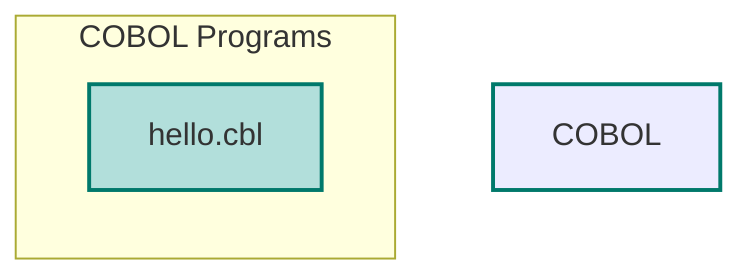

# COBOL Dependency Diagram

```mermaid
graph TB
  %% Subgraph for COBOL Programs
  subgraph COBOL Programs
    style COBOL Programs fill:#e0f7fa,stroke:#00796b,stroke-width:2px
    P_hello["hello.cbl"]
    style P_hello fill:#b2dfdb,stroke:#00796b,stroke-width:2px
  end
```